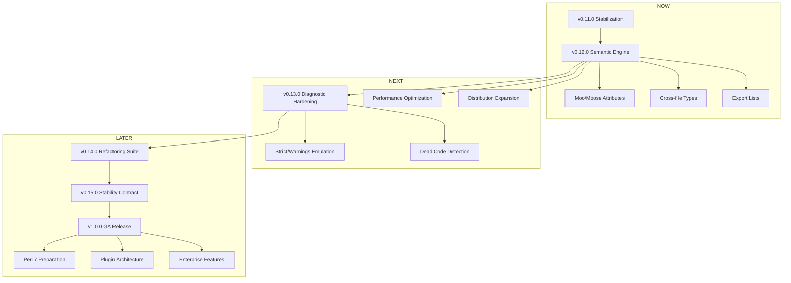

# NOW / NEXT / LATER

> **Last Updated**: 2026-03-13
> **Current Version**: v0.11.0 (Release Orchestration)
> **Status**: Active Development

---

## Legend

| Status | Meaning |
|--------|---------|
| 🟢 Active | Currently in progress |
| 🟡 Planned | Ready to start, waiting for capacity |
| 🔵 Future | Strategic item for future consideration |
| ⬜ Blocked | Dependencies not yet resolved |
| ✅ Done | Completed |

---

## NOW — Current Quarter (Q1/Q2 2026)

*Immediate priorities actively being worked on*

### Release Stabilization

| Item | Status | Owner | Success Criteria | Dependencies |
|------|--------|-------|------------------|--------------|
| v0.11.0 post-release monitoring | 🟢 Active | Release Team | Zero P0 regressions for 2 weeks | None |
| crates.io publishing validation | 🟢 Active | Release Team | All 80+ crates published successfully | None |
| Extension marketplace stability | 🟢 Active | DX Team | VS Code extension installs without errors | None |

### v0.12.0 — Advanced Semantic Engine

| Item | Status | Owner | Success Criteria | Dependencies |
|------|--------|-------|------------------|--------------|
| Moo attribute resolution | 🟢 Active | Parser Team | 100% of test corpus passes | None |
| Moose meta-protocol support | 🟡 Planned | Parser Team | Core attributes resolved | Moo completion |
| Cross-file type inference | 🟡 Planned | Semantic Team | `use parent`/`use base` resolution | None |
| Export list parsing | 🟡 Planned | Semantic Team | Exporter + Sub::Exporter support | None |

### Community & Documentation

| Item | Status | Owner | Success Criteria | Dependencies |
|------|--------|-------|------------------|--------------|
| GitHub issue triage workflow | 🟢 Active | Community | 24h response time on new issues | None |
| API documentation completion | 🟡 Planned | Docs Team | 100% public API documented | None |
| Getting Started guide improvements | 🟡 Planned | Docs Team | New user onboarding <15 min | None |
| Community feedback integration | 🟢 Active | All Teams | Feedback incorporated into backlog | None |

### Quality & Security

| Item | Status | Owner | Success Criteria | Dependencies |
|------|--------|-------|------------------|--------------|
| Security audit follow-ups | 🟢 Active | Security | All findings addressed | None |
| Mutation score improvement | 🟡 Planned | QA Team | 87% → 90% mutation score | None |
| CI pipeline optimization | 🟢 Active | DevOps | Build time <15 min | None |

---

## NEXT — Next Quarter (Q2/Q3 2026)

*Things that will be tackled after NOW items are complete*

### v0.13.0 — Diagnostic Hardening

| Item | Status | Owner | Success Criteria | Dependencies |
|------|--------|-------|------------------|--------------|
| `use strict` emulation | 🔵 Future | Semantic Team | Variable declaration checking | v0.12.0 complete |
| `use warnings` emulation | 🔵 Future | Semantic Team | Common warning categories | v0.12.0 complete |
| Dead code detection | 🔵 Future | Semantic Team | Unreachable code, unused variables | v0.12.0 complete |
| Deprecation warnings | 🔵 Future | Parser Team | smartmatch, indirect objects, bareword filehandles | v0.12.0 complete |

### Performance Optimization

| Item | Status | Owner | Success Criteria | Dependencies |
|------|--------|-------|------------------|--------------|
| Incremental parse optimization | 🔵 Future | Parser Team | <1ms for single-line changes | None |
| Workspace indexing speedup | 🔵 Future | Workspace Team | <300µs workspace index | None |
| Memory efficiency audit | 🔵 Future | All Teams | Reduced per-document footprint | None |
| Completion response time | 🔵 Future | LSP Team | <30ms p95 response | None |

### Distribution Expansion

| Item | Status | Owner | Success Criteria | Dependencies |
|------|--------|-------|------------------|--------------|
| Homebrew formula | 🔵 Future | Release Team | `brew install perl-lsp` works | v0.12.0 stable |
| Scoop manifest (Windows) | 🔵 Future | Release Team | `scoop install perl-lsp` works | v0.12.0 stable |
| Chocolatey package | 🔵 Future | Release Team | `choco install perl-lsp` works | v0.12.0 stable |
| Linux packages (deb, rpm, AUR) | 🔵 Future | Release Team | Native package managers supported | v0.13.0 stable |

### Enhanced Refactoring

| Item | Status | Owner | Success Criteria | Dependencies |
|------|--------|-------|------------------|--------------|
| Safe rename across workspace | 🔵 Future | LSP Team | No cross-package collisions | v0.12.0 complete |
| Extract Method refactoring | 🔵 Future | LSP Team | Semantics preserved | v0.12.0 complete |
| Extract Variable refactoring | 🔵 Future | LSP Team | Single-expression extraction | v0.12.0 complete |

---

## LATER — Future Quarters (Q4 2026+)

*Strategic initiatives for future consideration*

### v0.14.0 — Complete Refactoring Suite

| Item | Status | Owner | Success Criteria | Dependencies |
|------|--------|-------|------------------|--------------|
| Inline Method refactoring | 🔵 Future | LSP Team | Single-use targets only | v0.13.0 complete |
| Inline Variable refactoring | 🔵 Future | LSP Team | Safe inline with validation | v0.13.0 complete |
| Modern Perl syntax conversion | 🔵 Future | Parser Team | Signature syntax conversion | v0.13.0 complete |
| Native DAP implementation | 🔵 Future | DAP Team | Bridge replacement complete | v0.13.0 complete |

### v0.15.0 — The Stability Contract

| Item | Status | Owner | Success Criteria | Dependencies |
|------|--------|-------|------------------|--------------|
| Semantic versioning enforcement | 🔵 Future | Release Team | No breaking changes without deprecation | v0.14.0 complete |
| Protocol capability locking | 🔵 Future | LSP Team | LSP capabilities contract-locked | v0.14.0 complete |
| Platform certification | 🔵 Future | DevOps | CI on all tier-1 platforms | v0.14.0 complete |
| Formal deprecation policy | 🔵 Future | Governance | N-2 release support minimum | v0.14.0 complete |

### v1.0.0 — General Availability

| Item | Status | Owner | Success Criteria | Dependencies |
|------|--------|-------|------------------|--------------|
| Zero P0/P1 issues | 🔵 Future | All Teams | Production-ready stability | v0.15.0 complete |
| LSP 3.18 full compliance | 🔵 Future | LSP Team | 100% specification coverage | v0.15.0 complete |
| CPAN metadata integration | 🔵 Future | Ecosystem Team | Dependency resolution from META.json | v0.15.0 complete |
| Enterprise documentation | 🔵 Future | Docs Team | Complete API reference with stability markers | v0.15.0 complete |

### Perl 7 Preparation

| Item | Status | Owner | Success Criteria | Dependencies |
|------|--------|-------|------------------|--------------|
| Perl 7 syntax preview mode | 🔵 Future | Parser Team | Experimental flag for new syntax | v1.0.0 complete |
| Feature flag infrastructure | 🔵 Future | Parser Team | Runtime syntax mode selection | v1.0.0 complete |
| Backward compatibility testing | 🔵 Future | QA Team | Perl 5 code works in Perl 7 mode | Perl 7 spec stable |

### Advanced Type Inference

| Item | Status | Owner | Success Criteria | Dependencies |
|------|--------|-------|------------------|--------------|
| Type signature parsing | 🔵 Future | Parser Team | Support for Zydeco, Types::Standard | v1.0.0 complete |
| Cross-file type propagation | 🔵 Future | Semantic Team | Types flow across module boundaries | Type signature parsing |
| Type-aware completion | 🔵 Future | LSP Team | Completion filtered by expected type | Cross-file type propagation |

### Plugin Architecture

| Item | Status | Owner | Success Criteria | Dependencies |
|------|--------|-------|------------------|--------------|
| Plugin API design | 🔵 Future | Architecture | Stable extension points defined | v1.0.0 complete |
| Dynamic loader | 🔵 Future | Core Team | Runtime plugin loading | Plugin API design |
| Third-party integration | 🔵 Future | Community | 3+ community plugins available | Dynamic loader |

### Enterprise Features

| Item | Status | Owner | Success Criteria | Dependencies |
|------|--------|-------|------------------|--------------|
| Multi-root workspace support | 🔵 Future | Workspace Team | Monorepo support | v1.0.0 complete |
| Language server clustering | 🔵 Future | Performance Team | Horizontal scaling for large repos | Multi-root workspace |
| Integrated performance profiling | 🔵 Future | DevTools Team | Built-in profiling dashboard | v1.0.0 complete |
| AI-assisted code generation | 🔵 Future | AI Team | LSP integration for AI tools | v1.0.0 complete |

### Community Ecosystem

| Item | Status | Owner | Success Criteria | Dependencies |
|------|--------|-------|------------------|--------------|
| JetBrains IDE plugin | 🔵 Future | Community | IntelliJ/PyCharm support | v1.0.0 complete |
| Raku syntax exploration | 🔵 Future | Parser Team | Compatibility layer prototype | v1.1.0+ planning |
| CPAN index integration | 🔵 Future | Ecosystem Team | Offline CPAN index for module info | v1.0.0 complete |
| Dist::Zilla integration | 🔵 Future | Ecosystem Team | Build system awareness | CPAN index integration |

---

## Dependency Graph

---

## Metrics Dashboard

### Current State (v0.11.0)

| Metric | Value | Target | Status |
|--------|-------|--------|--------|
| LSP User-Visible Coverage | 100% (53/53) | 100% | ✅ |
| Protocol Compliance | 100% (97/97) | 100% | ✅ |
| Perl 5 Syntax Coverage | ~100% | 100% | ✅ |
| Mutation Score | 87% | 87%+ | ✅ |
| Incremental Parsing | <1ms | <5ms | ✅ |
| Reference Coverage | 98% | 95%+ | ✅ |
| Workspace Crates | 115+ | Scalable | ✅ |

### Target State (v1.0.0)

| Metric | Current | v0.12.0 | v0.15.0 | v1.0.0 |
|--------|---------|---------|---------|--------|
| Mutation Score | 87% | 90% | 95% | 95%+ |
| Full Parse Time | ~200µs | <200µs | <150µs | <100µs |
| Completion Response | <50ms | <50ms | <30ms | <30ms |
| Workspace Index | ~370µs | <350µs | <300µs | <250µs |

---

## How to Use This Document

1. **NOW items** are actively being worked on. Check related issues and PRs for current status.
2. **NEXT items** are prioritized for the upcoming quarter. Begin planning and design.
3. **LATER items** are strategic. Research and prototype as capacity allows.
4. **Update frequency**: This document should be updated at the start of each quarter and when major milestones are reached.

---

## Related Documents

### Strategic Planning

- [ROADMAP.md](ROADMAP.md) — Full project roadmap with detailed milestones
- [TECHNICAL_VISION.md](TECHNICAL_VISION.md) — Long-term technical direction and principles behind priorities
- [STRATEGIC_DOCUMENTATION.md](docs/STRATEGIC_DOCUMENTATION.md) — Index of all strategic documents

### Project Status

- [CURRENT_STATUS.md](docs/project/CURRENT_STATUS.md) — Current metrics and project health
- [features.toml](features.toml) — Canonical capability definitions

### Contributing

- [CHANGELOG.md](CHANGELOG.md) — Version history and release notes
- [AGENTS.md](AGENTS.md) — Development guidelines and architecture
- [CONTRIBUTING.md](CONTRIBUTING.md) — How to contribute to the project
