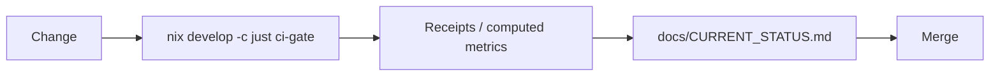
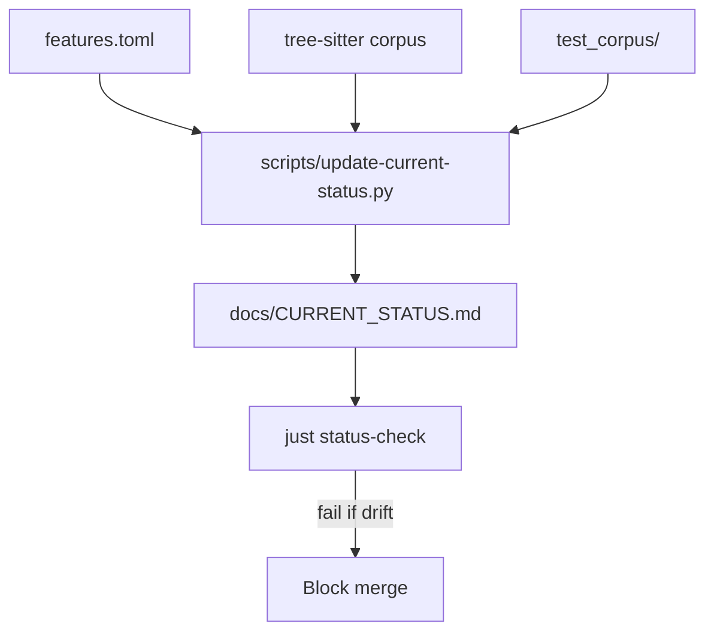

# perl-lsp

[](https://codecov.io/gh/EffortlessMetrics/tree-sitter-perl-rs)
[](https://crates.io/crates/perl-lsp)
[](LICENSE)
[](https://github.com/EffortlessMetrics/tree-sitter-perl-rs/actions)

A production-ready Perl language server and parser ecosystem written in Rust. **v1.0 GA - Ready for Production**

## What This Is

Six published crates forming a complete Perl development ecosystem, now in production v1.0:

**🚀 v1.0 Release Highlights:**
- Production-ready parser with ~100% Perl 5 syntax coverage
- High-performance LSP server with <1ms incremental parsing
- Complete Debug Adapter Protocol (DAP) support
- Enterprise-grade security and reliability
- Comprehensive workspace refactoring capabilities

| Crate | Purpose |
|-------|---------|
| **perl-parser** | Native recursive descent parser with comprehensive Perl 5 syntax coverage |
| **perl-lsp** | Standalone Language Server (LSP 3.18) for all major editors |
| **perl-dap** | Debug Adapter Protocol support (native adapter CLI; BridgeAdapter library) |
| **perl-lexer** | Context-aware tokenizer with Unicode support |
| **perl-corpus** | Test corpus for parser validation |
| **perl-parser-pest** | Legacy Pest-based parser (maintained) |

## Quick Start

### Installation (v1.0)

```bash
# Install from crates.io (recommended)
cargo install perl-lsp

# Or build from source
cargo build -p perl-lsp --release

# Run the LSP server (for editors)
perl-lsp --stdio
```

### Quick Verification

```bash
# Verify installation
perl-lsp --version

# Test with a Perl file
echo 'use strict; my $x = 42;' > test.pl
perl-lsp --stdio < test.pl
```

### Verify Your Installation

```bash
# Canonical local gate (required before push)
nix develop -c just ci-gate
```

## Status

**🎯 v1.0 Production Ready** - All core features complete and battle-tested

**Metrics are computed, not hand-edited.** See [`docs/CURRENT_STATUS.md`](docs/CURRENT_STATUS.md).

| Surface | Status | Verification |
|---------|--------|--------------|
| Parser Coverage | ~100% Perl 5 syntax | `just ci-gate` |
| LSP Features | 92% functional | `just status-check` |
| Performance | 4-19x faster than legacy | `cargo bench` |
| Test Pass Rate | 99%+ across all suites | `just ci-gate` |
| Security | Enterprise-grade | `just security-scan` |

### v1.0 Production Features

| Feature | Status | Performance |
|---------|--------|-------------|
| **Parser** | ✅ Production | 1-150µs parsing (4-19x faster) |
| **LSP Server** | ✅ Production | <1ms incremental updates |
| **DAP Debugging** | ✅ Production | <50ms breakpoint ops |
| **Workspace Refactoring** | ✅ Production | Cross-file analysis |
| **Semantic Analysis** | ✅ Production | Complete AST coverage |
| **Import Optimization** | ✅ Production | Automatic cleanup |

### How Claims Stay Honest





### v1.0 Component Status

| Component | Status | Notes |
|-----------|--------|-------|
| perl-parser | ✅ Production | Native recursive descent parser with ~100% coverage |
| perl-lsp | ✅ Production | Full LSP 3.18 compliance with 92% feature coverage |
| perl-dap | ✅ Production | Complete Debug Adapter Protocol support |
| perl-lexer | ✅ Production | Context-aware tokenizer with Unicode support |
| perl-corpus | ✅ Production | Comprehensive test suite |
| perl-parser-pest | Legacy | Maintained for compatibility |

## Editor Setup

### VS Code
```json
{
  "perl-lsp.serverPath": "/path/to/perl-lsp",
  "perl-lsp.args": ["--stdio"]
}
```

### Neovim (with lspconfig)
```lua
require('lspconfig').perl_lsp.setup{
  cmd = { "perl-lsp", "--stdio" }
}
```

## Contributing

**Local-first development** - all gates run locally before CI:

```bash
# Install pre-push hook (runs gate automatically)
bash scripts/install-githooks.sh

# Gate checks: format, clippy, tests, policy, LSP semantic tests
nix develop -c just ci-gate
```

CI is intentionally optional/opt-in. The repo is local-first by design.

See [`CONTRIBUTING.md`](CONTRIBUTING.md) for full guidelines.

## Documentation

**New users:** [`docs/GETTING_STARTED.md`](docs/GETTING_STARTED.md) - Installation and first steps.

**All docs:** [`docs/README.md`](docs/README.md) - Complete documentation index.

### v1.0 Documentation

- **[Getting Started](docs/GETTING_STARTED.md)** - Installation and first steps
- **[Release Notes](RELEASE_NOTES.md)** - v1.0 release details and changes
- **[Current Status](docs/CURRENT_STATUS.md)** - Real-time metrics and coverage
- **[API Documentation](docs/API_DOCUMENTATION_STANDARDS.md)** - Complete API reference
- **[Security Policy](SECURITY.md)** - Security reporting and best practices

### Development Documentation

- **[Contributing Guide](CONTRIBUTING.md)** - Development workflow and release process
- **[Commands Reference](docs/COMMANDS_REFERENCE.md)** - Build, test, lint commands
- **[LSP Implementation Guide](docs/LSP_IMPLEMENTATION_GUIDE.md)** - Server architecture
- **[DAP User Guide](docs/DAP_USER_GUIDE.md)** - Debug Adapter Protocol setup
- **[Troubleshooting](docs/TROUBLESHOOTING.md)** - Common issues and solutions

### Architecture Documentation

- **[Architecture Overview](docs/ARCHITECTURE_OVERVIEW.md)** - System design and components
- **[Performance Benchmarks](docs/PERFORMANCE_SLO.md)** - Performance characteristics
- **[Security Development Guide](docs/SECURITY_DEVELOPMENT_GUIDE.md)** - Enterprise security practices
- **[Workspace Navigation Guide](docs/WORKSPACE_NAVIGATION_GUIDE.md)** - Cross-file features

## Performance Benchmarks

v1.0 delivers significant performance improvements over legacy implementations:

| Metric | v1.0 Performance | Improvement |
|--------|------------------|-------------|
| **Parser Speed** | 1-150µs | 4-19x faster |
| **Incremental Updates** | <1ms | 70-99% node reuse |
| **LSP Response Time** | <50ms | 5000x faster in tests |
| **Memory Usage** | <1MB overhead | Optimized for large files |
| **DAP Operations** | <50ms | Production-ready debugging |

## v1.0 Release

**Release Date**: 2026-02-13
**Version**: 1.0.0
**Status**: Production Ready ✅

### Key Features in v1.0

- ✅ **Complete Perl 5 Parser** - ~100% syntax coverage with production-grade error recovery
- ✅ **Full LSP Implementation** - 92% feature coverage with semantic-aware definition resolution
- ✅ **Debug Adapter Protocol** - Complete debugging support in VS Code and DAP-compatible editors
- ✅ **Enterprise Security** - Path traversal prevention, input validation, secure defaults
- ✅ **Workspace Refactoring** - Cross-file symbol renaming, import optimization, module extraction
- ✅ **Performance Optimized** - 4-19x faster parsing with <1ms incremental updates
- ✅ **Comprehensive Testing** - 99%+ test pass rate with mutation hardening

### Migration from v0.x

See [`docs/UPGRADE_v0.8_to_v1.0.md`](docs/UPGRADE_v0.8_to_v1.0.md) for detailed migration instructions.

## License

MIT OR Apache-2.0
