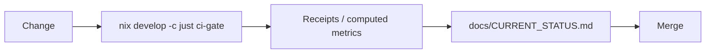
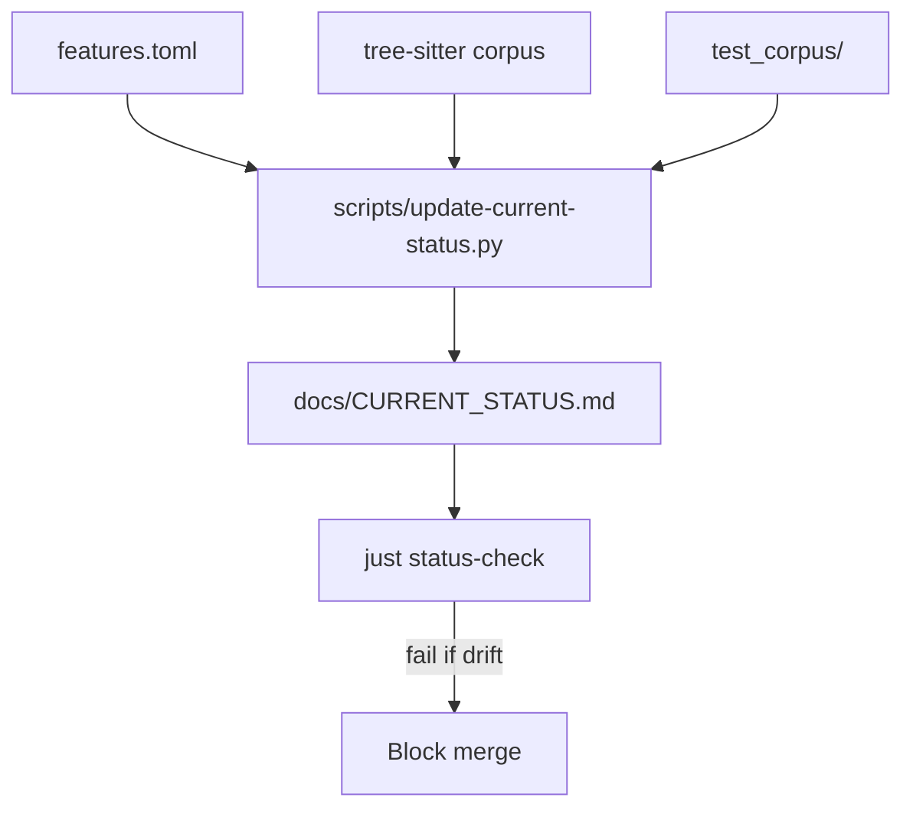

# perl-lsp

[](https://codecov.io/gh/EffortlessMetrics/tree-sitter-perl-rs)

A production-ready Perl language server and parser ecosystem written in Rust.

## What This Is

Six published crates forming a complete Perl development ecosystem:

| Crate | Purpose |
|-------|---------|
| **perl-parser** | Native recursive descent parser with comprehensive Perl 5 syntax coverage |
| **perl-lsp** | Standalone Language Server (LSP 3.18) for all major editors |
| **perl-dap** | Debug Adapter Protocol support (native adapter CLI; BridgeAdapter library) |
| **perl-lexer** | Context-aware tokenizer with Unicode support |
| **perl-corpus** | Test corpus for parser validation |
| **perl-parser-pest** | Legacy Pest-based parser (maintained) |

## Quick Start

```bash
# Build from source
cargo build -p perl-lsp --release

# Install locally
cargo install --path crates/perl-lsp

# Run the LSP server (for editors)
./target/release/perl-lsp --stdio
```

### Verify Your Installation

```bash
# Canonical local gate (required before push)
nix develop -c just ci-gate
```

## Status

**Metrics are computed, not hand-edited.** See [`docs/CURRENT_STATUS.md`](docs/CURRENT_STATUS.md).

| Surface | Source of Truth | Verification |
|---------|-----------------|--------------|
| LSP coverage | [`features.toml`](features.toml) | `just status-check` |
| Corpus coverage | `tree-sitter-perl/test/corpus` + `test_corpus/` | `just ci-gate` |
| Test pass rate | CI output | `just ci-gate` |
| Plans | [`docs/ROADMAP.md`](docs/ROADMAP.md) | Human review |

### How Claims Stay Honest





### What's Production vs Experimental

| Component | Stance | Notes |
|-----------|--------|-------|
| perl-parser | Production | Comprehensive Perl 5 parsing |
| perl-lsp | Production (advertised subset) | See `features.toml` for GA features |
| perl-dap | Experimental | Launch-only; variables/evaluate pending; BridgeAdapter library available |
| perl-parser-pest | Legacy | Kept out of default gate |

## Editor Setup

### VS Code
```json
{
  "perl-lsp.serverPath": "/path/to/perl-lsp",
  "perl-lsp.args": ["--stdio"]
}
```

### Neovim (with lspconfig)
```lua
require('lspconfig').perl_lsp.setup{
  cmd = { "perl-lsp", "--stdio" }
}
```

## Contributing

**Local-first development** - all gates run locally before CI:

```bash
# Install pre-push hook (runs gate automatically)
bash scripts/install-githooks.sh

# Gate checks: format, clippy, tests, policy, LSP semantic tests
nix develop -c just ci-gate
```

CI is intentionally optional/opt-in. The repo is local-first by design.

See [`CONTRIBUTING.md`](CONTRIBUTING.md) for full guidelines.

## Documentation

**New users:** [`docs/GETTING_STARTED.md`](docs/GETTING_STARTED.md) - Installation and first steps.

**All docs:** [`docs/INDEX.md`](docs/INDEX.md) - Routes you to the right doc.

- **[Getting Started](docs/GETTING_STARTED.md)** - Installation and first steps
- **[FAQ](docs/FAQ.md)** - Frequently asked questions
- **[Current Status](docs/CURRENT_STATUS.md)** - Computed metrics (the only place with numbers)
- **[Roadmap](docs/ROADMAP.md)** - Release plans and exit criteria
- **[Commands Reference](docs/COMMANDS_REFERENCE.md)** - Build, test, lint commands
- **[LSP Implementation Guide](docs/LSP_IMPLEMENTATION_GUIDE.md)** - Server architecture
- **[Troubleshooting](docs/TROUBLESHOOTING.md)** - Common issues and solutions

## License

MIT OR Apache-2.0
