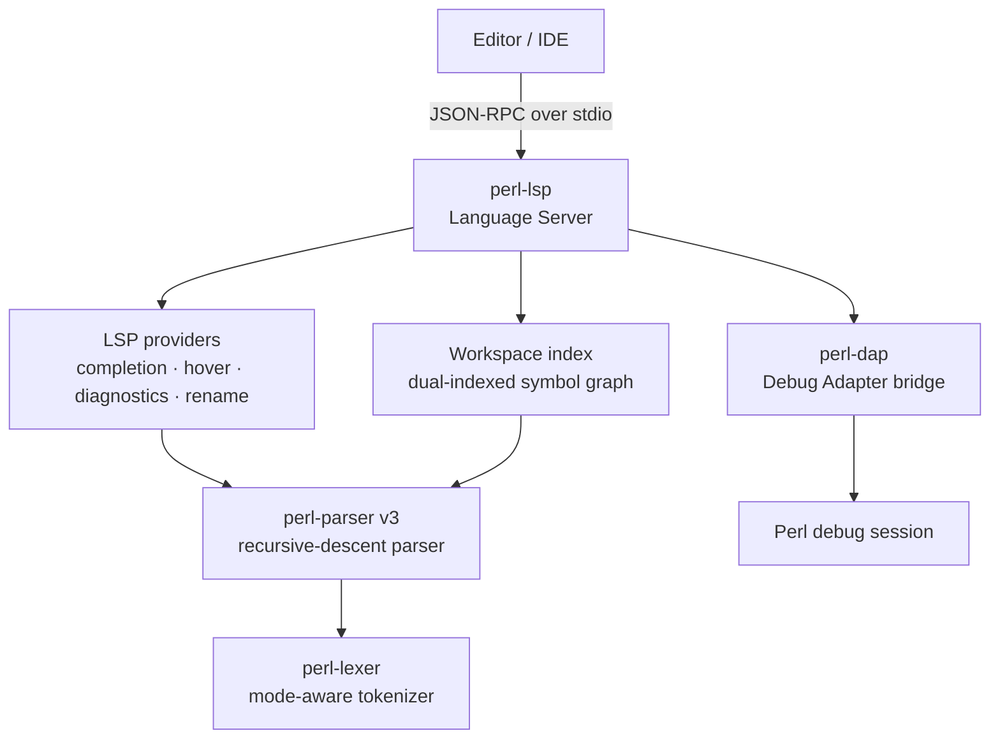

<p align="center">
  
</p>

<h1 align="center">perl-lsp</h1>

<p align="center">
  A fast, native <strong>Perl language server</strong> written in Rust — bringing modern IDE features to Perl 5.
</p>

<p align="center">
  <a href="https://github.com/EffortlessMetrics/perl-lsp/actions/workflows/ci.yml"></a>
  <a href="https://crates.io/crates/perl-lsp"></a>
  <a href="https://docs.rs/perl-lsp"></a>
  <a href="https://codecov.io/gh/EffortlessMetrics/perl-lsp"></a>
  <a href="LICENSE-MIT"></a>
  <a href="https://www.rust-lang.org/"></a>
  <a href="https://crates.io/crates/perl-lsp"></a>
</p>

---

> **Public Alpha (v0.12.0)** -- perl-lsp is usable for daily development but still evolving.
> [Report issues](https://github.com/EffortlessMetrics/perl-lsp/issues) and help shape the project.

## Why perl-lsp?

- **No Perl runtime required** -- a single native binary; no dependency on a working Perl installation for IDE features.
- **Fast** -- sub-millisecond incremental parsing, under 50ms LSP response times.
- **Comprehensive** -- completion, diagnostics, hover, go-to-definition, references, rename, formatting, semantic highlighting, code actions, debugging, and more.
- **Broad syntax coverage** -- parses Perl 5.8 through 5.40 including heredocs, regex, quoting constructs, formats, and OO frameworks.

| | perl-lsp | Perl::LanguageServer | PLS |
|---|----------|---------------------|-----|
| **Language** | Rust (native binary) | Perl | Perl |
| **Requires Perl runtime** | No | Yes | Yes |
| **Incremental parsing** | Yes (sub-ms) | N/A | N/A |
| **Debug adapter** | Built-in (DAP) | Built-in | No |

## Quick Start

```bash
# Install
cargo install perl-lsp

# Verify
perl-lsp --health
```

### VS Code

Install the extension and open a Perl file -- completions, diagnostics, hover, and navigation work immediately:

```bash
code --install-extension effortlessmetrics.perl-lsp-rs
```

The extension auto-downloads the server binary for your platform. You can also set `perl-lsp.serverPath` to use a specific binary or disable `perl-lsp.autoDownload` for airgapped environments.

### Neovim

```lua
require('lspconfig').perl_ls.setup {
  cmd = { "perl-lsp", "--stdio" },
}
```

### Emacs (eglot)

```elisp
(add-to-list 'eglot-server-programs '(perl-mode "perl-lsp" "--stdio"))
```

### Other editors

Any editor with LSP support works. Point it at `perl-lsp --stdio` as the language server command.

For a full walkthrough with troubleshooting tips, see the **[Getting Started guide](docs/tutorials/GETTING_STARTED.md)**.

## Features

| Editing | Intelligence | Navigation |
|---------|-------------|------------|
| Code completion (symbols, keywords, modules, builtins) | Real-time diagnostics | Go to definition / declaration |
| Rename across files | Hover docs and signatures | Find all references |
| Code actions and quick fixes | Semantic highlighting | Document and workspace symbols |
| Formatting (Perl::Tidy) | Inlay hints | Call and type hierarchy |
| Import management | Code lens | Selection range |

**Also included:** Debug Adapter Protocol (breakpoints, stepping, variables, watch expressions), folding, linked editing, color decorators, and [more](features.toml).

### How it works


```mermaid
flowchart TD
    editor["Editor / IDE"] -->|JSON-RPC over stdio| lsp["perl-lsp\nLanguage Server"]
    lsp --> providers["LSP providers\ncompletion · hover · diagnostics · rename"]
    lsp --> index["Workspace index\ndual-indexed symbol graph"]
    lsp --> dap["perl-dap\nDebug Adapter bridge"]
    providers --> parser["perl-parser v3\nrecursive-descent parser"]
    index --> parser
    dap --> runtime["Perl debug session"]
    parser --> lexer["perl-lexer\nmode-aware tokenizer"]
```

The full feature catalog lives in [`features.toml`](features.toml). For live project metrics, see [CURRENT_STATUS.md](docs/project/CURRENT_STATUS.md).

## Install

### From crates.io

```bash
cargo install perl-lsp
perl-lsp --health
```

### From source

```bash
git clone https://github.com/EffortlessMetrics/perl-lsp.git
cd perl-lsp
cargo install --path crates/perl-lsp
perl-lsp --health
```

### Pre-built binaries

Download from [GitHub Releases](https://github.com/EffortlessMetrics/perl-lsp/releases).

### VS Code Extension

Install from the VS Code Marketplace or:

```bash
code --install-extension effortlessmetrics.perl-lsp-rs
```

## Parser

The v3 parser is a native recursive-descent implementation covering broad Perl 5 syntax
(5.8 through 5.40), including heredocs, regex, quoting constructs, and formats. It is
tested continuously against real-world Perl code:

- **Corpus test suite** -- 600+ test sections plus 70+ standalone `.pl` fixtures.
- **CPAN corpus** -- benchmarked against the top 1000 CPAN distributions with a ratchet-only-forward CI gate.
- **Common-files gate** -- a curated set of core modules that must parse with zero errors on every PR.

Current parse rates and the edge-case roadmap are tracked in [CURRENT_STATUS.md](docs/project/CURRENT_STATUS.md) and [PARSER_EDGE_CASE_ROADMAP.md](docs/project/PARSER_EDGE_CASE_ROADMAP.md).

## Architecture

The workspace is organized as 120+ focused Rust crates, each with a single responsibility. The main entry points:

| Crate | Purpose |
|-------|---------|
| [`perl-lsp`](crates/perl-lsp/) | LSP server binary |
| [`perl-dap`](crates/perl-dap/) | Debug Adapter Protocol server |
| [`perl-parser`](crates/perl-parser/) | Native recursive-descent Perl parser |
| [`perl-lexer`](crates/perl-lexer/) | Context-aware tokenizer |
| [`perl-semantic-analyzer`](crates/perl-semantic-analyzer/) | Semantic analysis and resolution |

Published crates are available on [crates.io](https://crates.io/crates/perl-lsp): `perl-lsp`, `perl-dap`, `perl-parser`, `perl-lexer`, and `perl-corpus`.

For design details, see the [LSP Implementation Guide](docs/reference/LSP_IMPLEMENTATION_GUIDE.md), [Crate Architecture Guide](docs/reference/CRATE_ARCHITECTURE_GUIDE.md), and [Architecture Decision Records](docs/adr/README.md).

## Contributing

```bash
cargo build --workspace            # Build everything
cargo test --workspace --lib       # Run all tests
cargo clippy --workspace --lib     # Lint
cargo fmt --all                    # Format
nix develop -c just ci-gate        # Full local gate (required before push)
```

Quick iteration: `just pr-fast`. Environment check: `just devex` or `just doctor`.

See [CONTRIBUTING.md](CONTRIBUTING.md) for guidelines,
[CODE_OF_CONDUCT.md](CODE_OF_CONDUCT.md) for community standards,
and [SUPPORT.md](SUPPORT.md) for how to get help.

## Security

Release artifacts include SBOM generation (SPDX and CycloneDX) and SLSA Level 2
provenance attestations. Production code enforces zero `unsafe`, zero `unwrap`/`expect`,
and zero `panic!`-family macros via CI ratchets.

See [Supply Chain Security](docs/reference/SUPPLY_CHAIN_SECURITY.md) for details.

## Documentation

| Resource | Description |
|----------|-------------|
| **[Getting Started](docs/tutorials/GETTING_STARTED.md)** | Installation, editor setup, and first-run walkthrough |
| [Current Status](docs/project/CURRENT_STATUS.md) | Live project metrics |
| [Roadmap](docs/project/ROADMAP.md) | Version milestones and planning |
| [features.toml](features.toml) | Canonical LSP feature catalog |
| [Stability Policy](docs/reference/STABILITY.md) | API versioning and compatibility |
| [DAP User Guide](docs/tutorials/DAP_USER_GUIDE.md) | Debugger setup and usage |
| [docs/](docs/README.md) | Full documentation index |

## History

This project began as a fork of [tree-sitter-perl](https://github.com/tree-sitter-perl/tree-sitter-perl) in July 2025. It has since been rewritten as a native Rust recursive-descent parser and grown into a full-featured LSP/DAP toolkit.

## License

Dual licensed under MIT or Apache-2.0:

- [LICENSE-MIT](LICENSE-MIT)
- [LICENSE-APACHE](LICENSE-APACHE)
