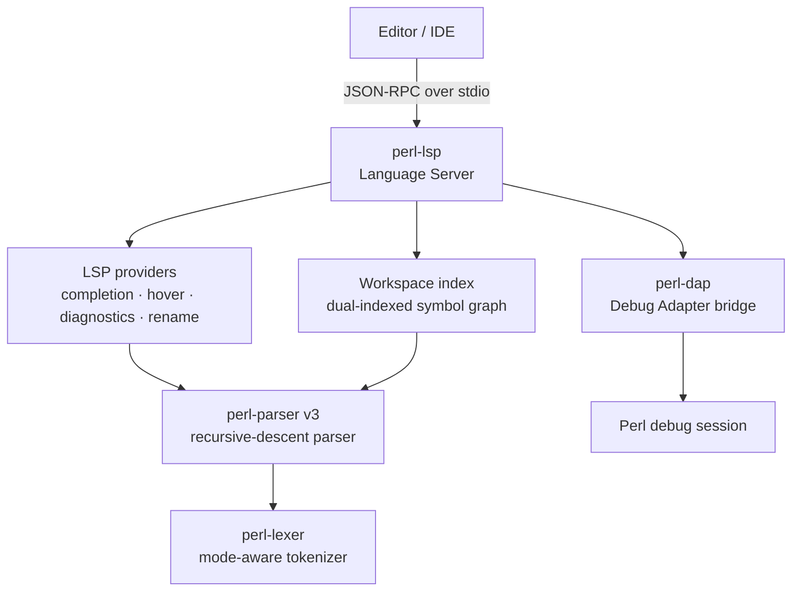

<p align="center">
  
</p>

<h1 align="center">perl-lsp</h1>

<p align="center">
  A fast, native <strong>Perl language server</strong> written in Rust — bringing modern IDE features to Perl 5.
</p>

<p align="center">
  <a href="https://github.com/EffortlessMetrics/perl-lsp/actions/workflows/ci.yml"></a>
  <a href="https://crates.io/crates/perl-lsp"></a>
  <a href="https://docs.rs/perl-lsp"></a>
  <a href="https://codecov.io/gh/EffortlessMetrics/perl-lsp"></a>
  <a href="LICENSE-MIT"></a>
  <a href="https://www.rust-lang.org/"></a>
  <a href="https://crates.io/crates/perl-lsp"></a>
</p>

---

> **Note**: perl-lsp is in public alpha. Core features work well, but expect some rough edges. [Report issues](https://github.com/EffortlessMetrics/perl-lsp/issues).

## Quick Start

```bash
# 1. Install
cargo install perl-lsp

# 2. Verify the install
perl-lsp --health  # should print: ok X.Y.Z

# 3. Configure your editor (VS Code)
code --install-extension effortlessmetrics.perl-lsp-rs

# 4. Open a Perl file — completions, diagnostics, hover, and navigation work immediately.
```

New to language servers? See the **[Getting Started guide](docs/tutorials/GETTING_STARTED.md)** for a full walkthrough with editor-specific setup, a visual feature tour, and troubleshooting tips.

Contributing locally? Run `just devex` (or `just doctor`) for a quick environment check before diving into `just pr-fast` or the full CI gate.

<details>
<summary><strong>Neovim / Emacs setup</strong></summary>

**Neovim** (nvim-lspconfig):

```lua
require('lspconfig').perl_ls.setup {
  cmd = { "perl-lsp", "--stdio" },
}
```

**Emacs** (eglot):

```elisp
(add-to-list 'eglot-server-programs '(perl-mode "perl-lsp" "--stdio"))
```

</details>

## Features

### Capability Snapshot

| Editing | Intelligence | Platform |
|---------|--------------|----------|
| **Completion** — symbols, keywords, modules, variables, snippets, and builtin signatures | **Navigation** — definition, references, document symbols, and workspace symbols | **Native Rust binary** — fast startup and no embedded Perl runtime |
| **Refactoring** — rename, code actions, formatting, and import management | **Hover + diagnostics** — docs, signatures, and real-time error reporting | **Unicode-safe** — symmetric UTF-8/UTF-16 position handling |
| **Debug Adapter** — breakpoints, stepping, stacks, and variables via DAP bridge | **Cross-file indexing** — dual-indexed symbol lookup across the workspace | **Incremental parsing** — sub-millisecond updates on common edit paths |

### How the pieces fit together


```mermaid
flowchart TD
    editor["Editor / IDE"] -->|JSON-RPC over stdio| lsp["perl-lsp\nLanguage Server"]
    lsp --> providers["LSP providers\ncompletion · hover · diagnostics · rename"]
    lsp --> index["Workspace index\ndual-indexed symbol graph"]
    lsp --> dap["perl-dap\nDebug Adapter bridge"]
    providers --> parser["perl-parser v3\nrecursive-descent parser"]
    index --> parser
    dap --> runtime["Perl debug session"]
    parser --> lexer["perl-lexer\nmode-aware tokenizer"]
```

### At a glance

- **53/53 advertised LSP capabilities** implemented in the canonical feature catalog ([`features.toml`](features.toml)).
- **Broad Perl 5 syntax coverage** through the native v3 parser, including heredocs, regex, quoting forms, and formats.
- **Operational visibility** via continuously updated project metrics in [CURRENT_STATUS.md](docs/project/CURRENT_STATUS.md).

## Why perl-lsp?

| | perl-lsp | Perl::LanguageServer | PLS |
|---|----------|---------------------|-----|
| **Language** | Rust (native binary) | Perl | Perl |
| **Requires Perl runtime** | No | Yes | Yes |
| **LSP feature coverage** | 53/53 advertised | Partial | Partial |
| **Incremental parsing** | Yes (sub-ms updates) | N/A | N/A |
| **Debug adapter** | Built-in (DAP bridge) | Built-in | No |
| **Supply chain security** | SBOM + SLSA Level 2 | N/A | N/A |

## Parser Coverage

The v3 parser is a native recursive-descent implementation covering broad Perl 5 syntax
(5.8 through 5.40), including heredocs, regex, quoting constructs, formats, and more.
It is tested continuously against real-world Perl code to drive coverage improvements:

- **Corpus test suite** -- 600+ test sections in `tree-sitter-perl/test/corpus/` plus 70+ standalone `.pl` fixtures.
- **System Perl corpus sweep** -- benchmarked against all `.pm` and `.pl` files found in the system Perl installation. Current parse rates are tracked in [CURRENT_STATUS.md](docs/project/CURRENT_STATUS.md) and the baseline file (`.ci/parser-corpus-baseline.json`).
- **Common-files gate** -- a curated set of core modules that must parse with zero errors on every PR (`.ci/common-corpus-manifest.txt`).
- **Ratcheting CI gate** -- the overall parse rate can only go up, never down. Regressions fail the build.
- **CPAN top 1000 goal** -- the long-term target is for 90%+ of the most-downloaded CPAN distributions to parse cleanly, driving parser improvements toward real-world Perl idioms.

For detailed parse rates and the edge-case roadmap, see [PARSER_EDGE_CASE_ROADMAP.md](docs/project/PARSER_EDGE_CASE_ROADMAP.md).

### Corpus Commands

```bash
just corpus-sweep          # Sweep system Perl corpus and print results
just corpus-sweep-check    # Check against baseline (fails on regression)
just corpus-sweep-update   # Update baseline with current results
just common-corpus-check   # Check pinned modules parse cleanly (PR gate)
just cpan-corpus-fetch     # Fetch CPAN top-1000 distribution list
just cpan-corpus-install   # Install CPAN corpus locally; auto-fetches the list, bootstraps cpanm, and reuses a local cache
just cpan-corpus-baseline-update  # Seed/update CPAN ratchet baseline
just cpan-corpus-check     # Check CPAN baseline + known-clean manifest
```

See [CURRENT_STATUS.md](docs/project/CURRENT_STATUS.md) for the latest computed metrics.

## Install

### From crates.io

```bash
cargo install perl-lsp
perl-lsp --health  # should print: ok X.Y.Z
```

### From source

```bash
git clone https://github.com/EffortlessMetrics/perl-lsp.git
cd perl-lsp
cargo install --path crates/perl-lsp
perl-lsp --health  # should print: ok X.Y.Z
```

### Pre-built binaries

Download from [GitHub Releases](https://github.com/EffortlessMetrics/perl-lsp/releases).

## Architecture

The workspace is organized as a family of focused Rust crates (115+), each with a
single responsibility. The visualization above shows the runtime path most users care
about: editor requests flow into `perl-lsp`, which fans out into providers, indexing,
and debugging services before delegating parsing work to `perl-parser` and `perl-lexer`.

That separation keeps compile times fast, sharpens ownership boundaries, and makes it
easier to evolve parsing, LSP features, and DAP support independently.

For the full tier system, architecture decision records, and design rationale, see:

- [LSP Implementation Guide](docs/reference/LSP_IMPLEMENTATION_GUIDE.md)
- [Architecture Decision Records](docs/adr/README.md) (microcrate architecture, dual indexing, incremental parsing, supply chain security)
- [CLAUDE.md](CLAUDE.md) for the complete developer command reference

## Published Crates

| Crate | Purpose |
|-------|---------|
| [`perl-lsp`](https://crates.io/crates/perl-lsp) | Language Server Protocol binary |
| [`perl-dap`](https://crates.io/crates/perl-dap) | Debug Adapter Protocol binary |
| [`perl-parser`](https://crates.io/crates/perl-parser) | Recursive-descent Perl parser library |
| [`perl-lexer`](https://crates.io/crates/perl-lexer) | Context-aware Perl tokenizer |
| [`perl-corpus`](https://crates.io/crates/perl-corpus) | Parser and LSP test corpus |

## Development

```bash
cargo build --workspace            # Build everything
cargo test --workspace             # Run all tests
cargo clippy --workspace --lib     # Lint
cargo fmt --all                    # Format
nix develop -c just ci-gate        # Full local gate (required before push)
```

See [CONTRIBUTING.md](CONTRIBUTING.md) for guidelines,
[CODE_OF_CONDUCT.md](CODE_OF_CONDUCT.md) for community standards,
and [SUPPORT.md](SUPPORT.md) for how to get help.

## Security

Release artifacts include SBOM generation (SPDX and CycloneDX) and SLSA Level 2
provenance attestations. Production code enforces zero `unsafe`, zero `unwrap`/`expect`,
and zero `panic!`-family macros via CI ratchets. Path traversal and command injection
vectors are hardened.

See [Supply Chain Security](docs/reference/SUPPLY_CHAIN_SECURITY.md) for details.

## Documentation

| Resource | Description |
|----------|-------------|
| **[Getting Started](docs/tutorials/GETTING_STARTED.md)** | **Installation, editor setup, and first-run walkthrough** |
| [Book](book/) | Comprehensive user and developer guide |
| [docs/](docs/README.md) | Documentation index |
| [features.toml](features.toml) | Canonical LSP feature catalog |
| [CURRENT_STATUS.md](docs/project/CURRENT_STATUS.md) | Live project metrics |
| [ROADMAP.md](ROADMAP.md) | Version milestones and planning |
| [Getting Started](docs/tutorials/GETTING_STARTED.md) | Installation and first steps |
| [Stability Policy](docs/reference/STABILITY.md) | API versioning and compatibility |
| [DAP User Guide](docs/tutorials/DAP_USER_GUIDE.md) | Debugger setup and usage |

## History

This project began as a fork of [tree-sitter-perl](https://github.com/tree-sitter-perl/tree-sitter-perl) in July 2025. It has since been rewritten as a native Rust recursive-descent parser and grown into a full-featured LSP/DAP toolkit with over 115 crates.

## License

Dual licensed under MIT or Apache-2.0:

- [LICENSE-MIT](LICENSE-MIT)
- [LICENSE-APACHE](LICENSE-APACHE)
