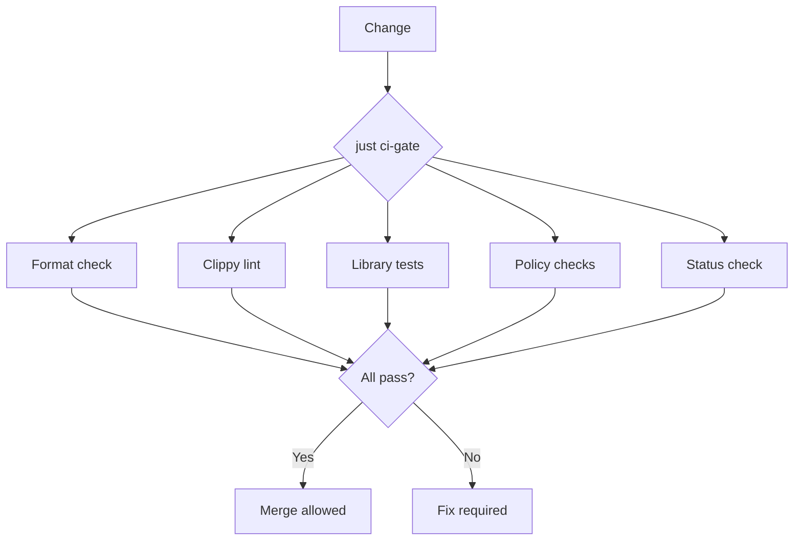

# Agentic Development

This document explains the development model used in this repository.

## AI-Native vs AI-Assisted

| Aspect | AI-Assisted | AI-Native |
| ------ | ----------- | --------- |
| Human role | Writes code, AI suggests | Reviews + accepts/rejects |
| Throughput | Human-limited | Machine-limited |
| Quality gate | Human review catches errors | Mechanical checks catch errors |
| Claims | Trust-based | Receipt-based |
| Wrongness | Hidden or blamed | Logged and prevented |

This repo is AI-native: high-throughput changes are verified by mechanical gates, not manual inspection.

## Budget Model

### DevLT (Developer Latency Time)

Human attention minutes spent on a change. Includes:

- Reading and understanding
- Decision-making
- Reviewing output
- Fixing problems
- Waiting for feedback loops

DevLT is the scarce resource. Minimize it.

**Bands:**

| Band | Minutes | Typical work |
| ---- | ------- | ------------ |
| Quick | <30 | Typo fix, small edit |
| Standard | 30-120 | Feature, bug fix |
| Complex | 120+ | Multi-session, architecture |

### Compute Cost

Tokens and CI minutes spent. Includes:

- LLM API calls
- CI pipeline runs
- Local test execution
- Build time

Compute is a lever, not a rival to DevLT. Spend compute to save DevLT.

**Bands:**

| Band | Tokens | CI minutes | Notes |
| ---- | ------ | ---------- | ----- |
| Cheap | <10K | <5 | Quick changes |
| Moderate | 10-100K | 5-30 | Standard features |
| Expensive | >100K | >30 | Complex exploration |

### Efficiency

Quality achieved per combined budget, with DevLT weighted higher than compute.

A change that costs 10 DevLT minutes + 100K tokens is more efficient than one that costs 60 DevLT minutes + 5K tokens (if quality is equal).

## What Makes This Repo AI-Native

### 1. Claims are bound to catalogs

- LSP capabilities live in `features.toml`, not prose
- Computed metrics come from `scripts/update-current-status.py`
- `just status-check` fails if docs drift from computed values

### 2. Verification is mechanical

- `nix develop -c just ci-gate` is the canonical gate
- Gate runs locally before push (not CI-dependent)
- Receipts (test output, gate output) prove claims

### 3. Wrongness is recorded

- `docs/LESSONS.md` logs what went wrong
- Each entry: wrong → evidence → fix → prevention
- Guardrails are added to prevent recurrence

### 4. Reviews are audits

- PRs include scope maps and evidence pointers
- Claims are checked against receipts
- Drift is caught by gates, not humans

## Wrongness Workflow

When something is discovered to be wrong:

```
1. Identify the wrongness (claim drift, test gap, etc.)
2. Log it in LESSONS.md with evidence
3. Fix the immediate problem
4. Add a guardrail to prevent recurrence
5. Update the gate if needed
```

The goal is not to avoid mistakes. The goal is to catch them mechanically and prevent recurrence.

## Gate Structure



### Gate Components

| Gate | What it catches | How to fix |
| ---- | --------------- | ---------- |
| Format | Inconsistent style | `cargo fmt` |
| Clippy | Lint violations | Fix warnings |
| Tests | Broken functionality | Fix code or tests |
| Policy | Rule violations | See policy docs |
| Status | Doc drift | `just status-update` |

## Optimizing for DevLT

### Do

- Run gates locally before asking for review
- Include receipts (test output, gate output) in PRs
- Keep scope tight to stated intent
- Log wrongness immediately when found

### Avoid

- Manual verification of machine-checkable claims
- Large PRs that require extensive human review
- Claims without receipts
- Hiding problems (log them instead)

## See Also

- [`INDEX.md`](INDEX.md) - Documentation front door
- [`LESSONS.md`](LESSONS.md) - Wrongness log
- [`FORENSICS_SCHEMA.md`](FORENSICS_SCHEMA.md) - PR analysis template
