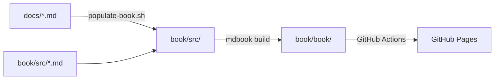

# Documentation Site

perl-lsp uses [mdBook](https://rust-lang.github.io/mdBook/) to generate a browsable documentation website.

## Overview

The documentation site provides:

- **Searchable Documentation**: Full-text search across all documentation
- **Organized Navigation**: Structured by user role and task
- **GitHub Integration**: Direct links to edit pages
- **Responsive Design**: Works on desktop and mobile
- **Print Support**: PDF-friendly output
- **Auto-deployment**: Publishes to GitHub Pages on push

## Quick Access

- **Live Site**: https://effortlessmetrics.github.io/tree-sitter-perl/ (after deployment)
- **Local Preview**: `just docs-serve`
- **Build**: `just docs-build`

## Architecture

### Directory Structure

```
book/
├── book.toml                # mdBook configuration
├── src/
│   ├── SUMMARY.md           # Navigation structure
│   ├── introduction.md      # Landing page
│   ├── quick-start.md       # 5-minute guide
│   └── [generated]/         # Auto-copied from docs/
└── book/                    # Build output (gitignored)
```

### Content Sources

Documentation content comes from two sources:

1. **Hand-written book pages**: `book/src/*.md` (introduction, quick-start)
2. **Auto-copied docs**: `docs/*.md` → `book/src/[section]/` via `scripts/populate-book.sh`

This approach maintains a single source of truth (the `docs/` directory) while providing a structured reading experience.

### Build Process



## Usage

### Local Development

```bash
# Serve with live reload (port 3000)
just docs-serve

# Build without serving
just docs-build

# Clean generated files
just docs-clean
```

### CI/CD

The documentation site deploys automatically via `.github/workflows/docs-deploy.yml`:

- **Trigger**: Push to `master` affecting `docs/**`, `book/**`, or scripts
- **Build**: Runs `scripts/populate-book.sh` and `mdbook build`
- **Deploy**: Publishes to GitHub Pages via `deploy-pages@v4`

### Manual Deployment

If needed, trigger deployment manually:

```bash
# Via GitHub UI: Actions → Deploy Documentation → Run workflow
# Or via CLI:
gh workflow run docs-deploy.yml
```

## Configuration

### book.toml

Key settings in `book/book.toml`:

```toml
[book]
title = "Perl LSP Documentation"
authors = ["perl-lsp contributors"]

[output.html]
git-repository-url = "https://github.com/..."
edit-url-template = "https://github.com/.../edit/master/docs/{path}"

[output.html.search]
enable = true
limit-results = 30
```

See [book.toml](../book/book.toml) for full configuration.

### Navigation Structure

The navigation is defined in `book/src/SUMMARY.md` following the Diataxis framework:

- **Getting Started**: Installation, setup, first steps (Tutorial)
- **User Guides**: Task-oriented guides (How-to)
- **Architecture**: Design and concepts (Explanation)
- **Developer Guides**: Contributing, testing (How-to)
- **LSP Development**: Implementation details (Explanation + How-to)
- **Advanced Topics**: Performance, threading, security (Explanation)
- **Reference**: Status, roadmap, API contracts (Reference)
- **DAP**: Debug adapter documentation
- **CI & Quality**: Build system, testing
- **Process**: Development methodology

## Adding Documentation

### Adding a New Page

1. **Create or update** the markdown file in `docs/`:

```bash
vim docs/MY_NEW_FEATURE.md
```

2. **Update SUMMARY.md** to include it:

```markdown
# book/src/SUMMARY.md
- [My New Feature](./section/my-new-feature.md)
```

3. **Update populate-book.sh** to copy it:

```bash
# scripts/populate-book.sh
copy_doc "$DOCS_DIR/MY_NEW_FEATURE.md" "$BOOK_SRC/section/my-new-feature.md"
```

4. **Test locally**:

```bash
just docs-serve
```

5. **Commit and push**:

```bash
git add docs/MY_NEW_FEATURE.md book/src/SUMMARY.md scripts/populate-book.sh
git commit -m "docs: add my new feature documentation"
git push
```

The site will automatically deploy on push to `master`.

### Adding a Book-Specific Page

For pages that only exist in the book (not general project docs):

1. Create in `book/src/` directly
2. Add to `SUMMARY.md`
3. Test with `just docs-serve`
4. Commit and push

## Features

### Search

Full-text search is enabled with optimized settings:

- Boolean AND search
- 30 results limit
- Title and hierarchy boosting
- Heading-level splitting

### Code Highlighting

Syntax highlighting for:
- Rust
- Perl
- Bash/Shell
- TOML/YAML
- JSON

### Cross-References

Use relative links between pages:

```markdown
See [Architecture](../architecture/overview.md) for details.
```

mdBook automatically resolves these during build.

### GitHub Integration

Each page includes:
- "Suggest an edit" link (via `edit-url-template`)
- GitHub repository link in header

## Troubleshooting

### Build Fails: "file not found"

Ensure `populate-book.sh` has copied all required files:

```bash
bash scripts/populate-book.sh
```

Check that source files exist in `docs/`.

### Search Not Working

Rebuild the search index:

```bash
just docs-clean
just docs-build
```

### Links Broken

Use relative links, not absolute:

```markdown
✓ [Guide](../user-guides/guide.md)
✗ [Guide](/user-guides/guide.md)
```

### Port Already in Use

Change the port:

```bash
mdbook serve book --port 3001
```

## Deployment Details

### GitHub Pages Setup

1. **Enable GitHub Pages**: Settings → Pages → Source: GitHub Actions
2. **Permissions**: The workflow has `pages: write` and `id-token: write`
3. **Branch**: Deploys from `master` only

### Build Time

- **Populate**: ~1-2 seconds
- **mdBook build**: ~2-3 seconds
- **Total**: ~5 seconds

### Deployment Time

- **Upload**: ~5 seconds
- **Deploy**: ~10 seconds
- **Total**: ~15 seconds

## Maintenance

### Regenerate Documentation

Regenerate all pages from docs/:

```bash
just docs-clean
just docs-build
```

### Update Dependencies

Update mdBook:

```bash
cargo install mdbook --force
```

### Verify Deployment

After pushing to `master`, verify deployment:

1. Check Actions tab for workflow run
2. Visit deployed site URL
3. Test search functionality
4. Check all navigation links

## Resources

- [mdBook User Guide](https://rust-lang.github.io/mdBook/)
- [Diataxis Framework](https://diataxis.fr/)
- [GitHub Pages Documentation](https://docs.github.com/en/pages)
- [Markdown Guide](https://www.markdownguide.org/)

## Integration with Existing Docs

The mdBook site complements existing documentation:

- **rustdoc**: API documentation (`cargo doc`)
- **GitHub README**: Quick start and badges
- **docs/ directory**: Markdown source files
- **mdBook site**: Browsable, searchable documentation

All three are maintained and serve different purposes:

1. **rustdoc**: For API consumers
2. **README**: For first-time visitors
3. **mdBook**: For comprehensive documentation browsing

## Future Enhancements

Potential improvements:

- [ ] Custom theme with perl-lsp branding
- [ ] Interactive code examples (playground)
- [ ] Mermaid diagram support
- [ ] PDF export
- [ ] Multi-version support (v0.9, v0.9.x (Production-Ready), etc.)
- [ ] Localization (i18n)

See [GitHub Issues](https://github.com/EffortlessMetrics/perl-lsp/issues) for tracking.
