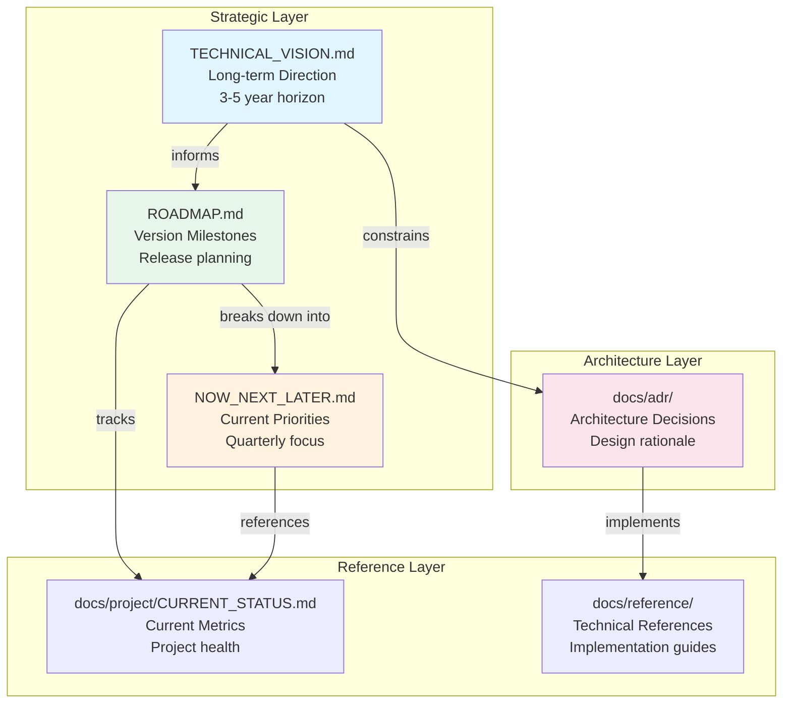

# Strategic Documentation Index

> **Last Updated**: 2026-03-13
> **Purpose**: Navigation hub for all strategic planning documents

---

## Overview

This index provides a centralized navigation point for all strategic documentation in the Perl LSP project. These documents define the project's direction, priorities, and architectural decisions.

---

## Strategic Documents

### Core Planning Documents

| Document | Location | Purpose | Audience |
|----------|----------|---------|----------|
| **TECHNICAL_VISION.md** | [Root](../TECHNICAL_VISION.md) | Long-term technical direction (3-5 years) | Architects, Maintainers |
| **ROADMAP.md** | [Root](../ROADMAP.md) | Version milestones and deliverables | All stakeholders |
| **NOW_NEXT_LATER.md** | [Root](../NOW_NEXT_LATER.md) | Current quarter priorities | Contributors, Team leads |

### Architecture Decision Records

Located in [`docs/adr/`](adr/), these documents capture significant architectural decisions.

| ADR | Title | Description |
|-----|-------|-------------|
| [0008](adr/0008-microcrate-architecture.md) | Microcrate Architecture | 80+ small crates following SRP |
| [0009](adr/0009-dual-indexing-strategy.md) | Dual Indexing Strategy | Qualified and bare name indexing |
| [0010](adr/0010-incremental-parsing-architecture.md) | Incremental Parsing | <1ms update target |
| [0011](adr/0011-dap-bridge-mode-architecture.md) | DAP Bridge Mode | Debug Adapter Protocol bridge |
| [0012](adr/0012-error-handling-strategy.md) | Error Handling Strategy | No-panic reliability |

See [docs/adr/README.md](adr/README.md) for the complete ADR index.

---

## Document Relationships

### How Documents Relate

1. **TECHNICAL_VISION.md** → **ROADMAP.md**: The vision defines the "why" and "where"; the roadmap defines the "when" and "what"
2. **ROADMAP.md** → **NOW_NEXT_LATER.md**: The roadmap spans all versions; NOW/NEXT/LATER focuses on immediate priorities
3. **TECHNICAL_VISION.md** → **ADRs**: Vision principles are codified in architectural decisions
4. **ROADMAP.md** ↔ **CURRENT_STATUS.md**: Roadmap targets are validated against current metrics
5. **ADRs** → **Reference Docs**: Decisions are implemented as documented patterns

---

## Navigation by Audience

### For Contributors

Start here to understand current priorities and how to contribute effectively:

1. **[NOW_NEXT_LATER.md](../NOW_NEXT_LATER.md)** — What's being worked on right now
2. **[ROADMAP.md](../ROADMAP.md)** — Where the project is heading
3. **[CONTRIBUTING.md](../CONTRIBUTING.md)** — How to contribute

### For Users

Understand the project's direction and stability:

1. **[ROADMAP.md](../ROADMAP.md)** — Upcoming features and releases
2. **[docs/reference/STABILITY.md](reference/STABILITY.md)** — API stability guarantees
3. **[docs/project/CURRENT_STATUS.md](project/CURRENT_STATUS.md)** — Current capabilities

### For Maintainers

Strategic planning and architectural oversight:

1. **[TECHNICAL_VISION.md](../TECHNICAL_VISION.md)** — Long-term technical direction
2. **[docs/adr/](adr/)** — Architecture decision records
3. **[ROADMAP.md](../ROADMAP.md)** — Release planning
4. **[docs/project/CURRENT_STATUS.md](project/CURRENT_STATUS.md)** — Project health metrics

### For Architects

Deep technical understanding and design patterns:

1. **[TECHNICAL_VISION.md](../TECHNICAL_VISION.md)** — Technical principles and vision
2. **[docs/adr/](adr/)** — All architecture decisions
3. **[docs/reference/CRATE_ARCHITECTURE_GUIDE.md](reference/CRATE_ARCHITECTURE_GUIDE.md)** — System architecture
4. **[docs/reference/LSP_IMPLEMENTATION_GUIDE.md](reference/LSP_IMPLEMENTATION_GUIDE.md)** — LSP implementation details

---

## Quick Reference

| Question | Document |
|----------|----------|
| What are we working on now? | [NOW_NEXT_LATER.md](../NOW_NEXT_LATER.md) |
| When will feature X be released? | [ROADMAP.md](../ROADMAP.md) |
| Why was decision Y made? | [docs/adr/](adr/) |
| Where is the project heading? | [TECHNICAL_VISION.md](../TECHNICAL_VISION.md) |
| What's the current project health? | [CURRENT_STATUS.md](project/CURRENT_STATUS.md) |
| How do I contribute? | [CONTRIBUTING.md](../CONTRIBUTING.md) |

---

## Document Maintenance

### Update Cadence

| Document | Update Frequency | Owner |
|----------|------------------|-------|
| NOW_NEXT_LATER.md | Quarterly | Project Lead |
| ROADMAP.md | Per release | Release Team |
| TECHNICAL_VISION.md | Annually | Architecture Team |
| ADRs | As needed | Decision Owner |
| CURRENT_STATUS.md | Per release | Automation |

### Related Documentation

- [docs/README.md](README.md) — Complete documentation index
- [CONTRIBUTING.md](../CONTRIBUTING.md) — Contribution guidelines
- [AGENTS.md](../AGENTS.md) — AI assistant development guide

---

*This index is maintained alongside the strategic documents it references. Last updated: 2026-03-13*
