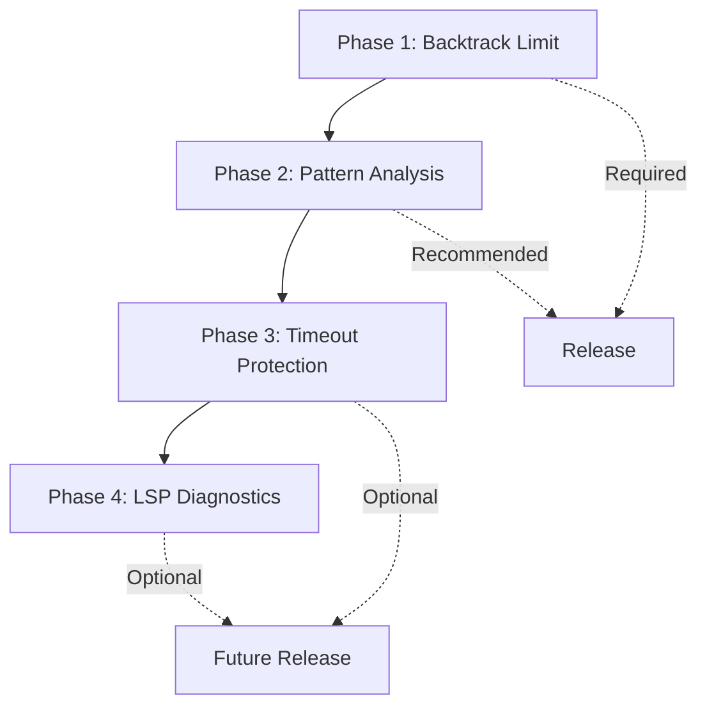

# Resolution Plan: P0 Catastrophic Regex Backtracking

## Issue Summary

Complex regex patterns pose a **P0 critical risk** for catastrophic backtracking, a class of algorithmic complexity attacks where certain regex patterns exhibit exponential time complexity on specific inputs. This can cause:

1. **Parser hangs**: Regex parsing may never complete
2. **Denial of service**: LSP server becomes unresponsive
3. **Excessive resource usage**: CPU and memory exhaustion

### Attack Classification

- **CWE-1333**: Inefficient Regular Expression Complexity
- **OWASP Category**: Denial of Service (ReDoS)

## Current State

### Implemented Protections

| Protection | Value | Location |
|------------|-------|----------|
| `MAX_REGEX_BYTES` | 64KB | [`crates/perl-lexer/src/lib.rs:172`](../../../../crates/perl-lexer/src/lib.rs) |
| `MAX_DELIM_NEST` | 128 | [`crates/perl-lexer/src/lib.rs:174`](../../../../crates/perl-lexer/src/lib.rs) |
| `MAX_HEREDOC_DEPTH` | 100 | [`crates/perl-lexer/src/lib.rs:175`](../../../../crates/perl-lexer/src/lib.rs) |
| `MAX_HEREDOC_BYTES` | 256KB | [`crates/perl-lexer/src/lib.rs:173`](../../../../crates/perl-lexer/src/lib.rs) |

### Current Implementation

```rust
// From crates/perl-lexer/src/lib.rs:171-175
const MAX_REGEX_BYTES: usize = 64 * 1024;  // 64KB max for regex patterns
const MAX_HEREDOC_BYTES: usize = 256 * 1024; // 256KB max for heredoc bodies
const MAX_DELIM_NEST: usize = 128;         // Max nesting depth for delimiters
const MAX_HEREDOC_DEPTH: usize = 100;      // Max nesting depth for heredocs
```

### Budget Guard Behavior

- Patterns exceeding 64KB are truncated or rejected
- Delimiter nesting beyond 128 levels fails
- Emits `UnknownRest` token for graceful degradation

## Gap Analysis

### Identified Gaps

| Gap | Severity | Description |
|-----|----------|-------------|
| No backtracking limit | **High** | No limit on backtracking steps during parsing |
| No pattern analysis | **High** | Cannot detect pathological patterns like `(a+)+` |
| No timeout protection | Medium | No time-based limit for regex parsing |
| No user warnings | Medium | No LSP diagnostics for risky patterns |

### Test Coverage Status

- [x] Byte limit enforcement (64KB)
- [x] Delimiter nesting limit (128)
- [x] Heredoc depth limit (100)
- [ ] **Pattern analysis for nested quantifiers**
- [ ] **Timeout on pathological patterns**
- [ ] **Performance: rejection within 100ms**
- [ ] **Memory bounded during parsing**

### Pathological Patterns to Detect

| Pattern | Risk Level | Time Complexity |
|---------|------------|-----------------|
| `(a+)+` | Critical | O(2^n) |
| `(a*)*` | Critical | O(2^n) |
| `(a|aa)+` | High | O(2^n) |
| `(a?){n}` | High | O(2^n) |
| `(.*)\1` | Medium | O(n^2) |

## Proposed Solution

### Phase 1: Backtracking Step Limit (Required)

**Objective**: Implement a step-based limit for regex parsing operations

**Rationale**: The current byte-size limit (64KB) doesn't prevent exponential backtracking on small but pathological patterns. A step counter provides deterministic protection.

**Tasks**:

1. Add `MAX_BACKTRACK_STEPS` constant
2. Implement step counter in regex parsing loop
3. Return error when limit exceeded
4. Add test coverage

**Implementation**:

```rust
// Add to crates/perl-lexer/src/lib.rs
const MAX_BACKTRACK_STEPS: usize = 100_000; // 100K steps max

struct RegexParser {
    steps: Cell<usize>,
}

impl RegexParser {
    fn step(&self) -> ParseResult<()> {
        let steps = self.steps.get() + 1;
        if steps > MAX_BACKTRACK_STEPS {
            return Err(ParseError::RegexBacktrackLimit {
                steps,
                max_steps: MAX_BACKTRACK_STEPS,
            });
        }
        self.steps.set(steps);
        Ok(())
    }
}
```

**Files to Modify**:

| File | Changes |
|------|---------|
| [`crates/perl-lexer/src/lib.rs`](../../../../crates/perl-lexer/src/lib.rs) | Add constant and step counter |
| [`crates/perl-error/src/lib.rs`](../../../../crates/perl-error/src/lib.rs) | Add `RegexBacktrackLimit` error type |

### Phase 2: Pattern Analysis (Recommended)

**Objective**: Detect and warn about pathological regex patterns

**Rationale**: Static analysis can catch many dangerous patterns before parsing begins, providing early warning without runtime overhead.

**Tasks**:

1. Create regex pattern analyzer module
2. Implement nested quantifier detection
3. Implement overlapping alternative detection
4. Add LSP diagnostic emission for warnings

**Implementation**:

```rust
// New file: crates/perl-lexer/src/regex_analysis.rs

#[derive(Debug, Clone, Copy, PartialEq, Eq)]
pub enum RegexRisk {
    Low,      // Safe pattern
    Medium,   // Some risk, warn user
    High,     // Dangerous, may reject
}

pub struct RegexAnalyzer;

impl RegexAnalyzer {
    /// Detect nested quantifiers like (a+)+ or (a*)*
    pub fn detect_nested_quantifiers(pattern: &str) -> bool {
        // Pattern to detect nested quantifiers
        let nested_quantifier_regex = Regex::new(r"\([^)]*[+*][^)]*\)[+*]").unwrap();
        nested_quantifier_regex.is_match(pattern)
    }
    
    /// Detect overlapping alternatives like (a|aa|aaa)+
    pub fn detect_overlapping_alternatives(pattern: &str) -> bool {
        // Check for alternatives that can match same content
        // Implementation would parse alternatives and check overlaps
        false // Placeholder
    }
    
    pub fn analyze_risk(pattern: &str) -> RegexRisk {
        if Self::detect_nested_quantifiers(pattern) {
            return RegexRisk::High;
        }
        if Self::detect_overlapping_alternatives(pattern) {
            return RegexRisk::Medium;
        }
        RegexRisk::Low
    }
}
```

**Files to Create/Modify**:

| File | Action |
|------|--------|
| [`crates/perl-lexer/src/regex_analysis.rs`](../../../../crates/perl-lexer/src/regex_analysis.rs) | Create new module |
| [`crates/perl-lexer/src/lib.rs`](../../../../crates/perl-lexer/src/lib.rs) | Import and use analyzer |

### Phase 3: Timeout Protection (Optional)

**Objective**: Add time-based timeout as defense-in-depth

**Rationale**: A timeout provides a safety net for any hang scenarios not caught by other protections.

**Tasks**:

1. Add `REGEX_PARSE_TIMEOUT_MS` constant
2. Track elapsed time during parsing
3. Return timeout error if exceeded
4. Add test coverage

**Implementation**:

```rust
const REGEX_PARSE_TIMEOUT_MS: u64 = 1000; // 1 second

fn parse_regex_with_timeout(&mut self) -> ParseResult<Token> {
    let start = Instant::now();
    
    // ... parsing logic with periodic checks ...
    
    if start.elapsed().as_millis() as u64 > REGEX_PARSE_TIMEOUT_MS {
        return Err(ParseError::Timeout {
            operation: "regex parsing".to_string(),
            elapsed_ms: start.elapsed().as_millis() as u64,
        });
    }
    
    Ok(token)
}
```

### Phase 4: LSP Diagnostics (Optional)

**Objective**: Warn users about risky regex patterns via LSP

**Rationale**: Proactive warnings help users write safer code and understand potential issues.

**Tasks**:

1. Create diagnostic provider for regex patterns
2. Integrate with LSP diagnostic pipeline
3. Add configuration option to disable warnings

**Implementation**:

```rust
fn check_regex_pattern(&self, pattern: &str) -> Vec<Diagnostic> {
    let mut diagnostics = Vec::new();
    
    if RegexAnalyzer::detect_nested_quantifiers(pattern) {
        diagnostics.push(Diagnostic {
            message: "Regex pattern may cause catastrophic backtracking".to_string(),
            severity: DiagnosticSeverity::Warning,
            code: Some("nested-quantifier".to_string()),
            source: Some("perl-lsp".to_string()),
            ..Default::default()
        });
    }
    
    diagnostics
}
```

## Test Plan

### Existing Tests

| Test File | Purpose |
|-----------|---------|
| [`lexer_catastrophic_regex_test.rs`](../../../../crates/perl-lexer/tests/lexer_catastrophic_regex_test.rs) | Catastrophic backtracking tests |
| [`hang_risk_regex_literal_tests.rs`](../../../../crates/perl-lexer/tests/hang_risk_regex_literal_tests.rs) | Regex literal hang risks |

### New Tests Required

| Test | Purpose | Priority |
|------|---------|----------|
| `backtrack_limit_enforced` | Verify step limit works | High |
| `nested_quantifier_detected` | Verify pattern analysis | High |
| `timeout_protection_works` | Verify timeout limit | Medium |
| `performance_rejection_100ms` | Verify fast rejection | High |

### Test Patterns to Cover

```perl
# These patterns should be detected/handled
^(a+)+$        # Nested quantifiers
^(a*)*$        # Nested quantifiers
^(a|aa|aaa)+$  # Overlapping alternatives
^(.)\1+$       # Back-reference with quantifier
^(.?){25}$     # Exponential paths
```

### Performance Benchmarks

| Pattern | Input Size | Expected Time |
|---------|------------|---------------|
| Simple `/abc/` | Any | <1ms |
| Complex `/[a-z]+/` | 1KB | <10ms |
| Nested `/(a+)+/` | 100 chars | <100ms (limit hit) |
| Deep nesting `/(a{1}){128}/` | Any | <100ms (limit hit) |

### Validation Commands

```bash
# Run existing tests
cargo test -p perl-lexer --test lexer_catastrophic_regex_test

# Run hang risk tests
cargo test -p perl-lexer --test hang_risk_regex_literal_tests

# Run with timing assertions
cargo test -p perl-lexer -- --test-threads=1 regex
```

## Dependencies

| Dependency | Status | Notes |
|------------|--------|-------|
| `regex` crate | ✅ Available | For pattern analysis |
| `Instant` | ✅ Available | For timeout protection |
| `ParseError` enum | ✅ Exists | May need new variants |

## Risk Assessment

| Risk | Likelihood | Impact | Mitigation |
|------|------------|--------|------------|
| False positives in pattern analysis | Medium | Low | Make warnings configurable |
| Timeout on valid patterns | Low | Medium | Generous timeout value |
| Missing pathological patterns | Medium | High | Multiple detection methods |
| Performance overhead | Low | Low | Lazy analysis |

## Action Items

### Immediate (Required)

1. [ ] Add `MAX_BACKTRACK_STEPS` constant to [`lib.rs`](../../../../crates/perl-lexer/src/lib.rs)
2. [ ] Implement step counter in regex parsing loop
3. [ ] Add `RegexBacktrackLimit` error type to [`perl-error`](../../../../crates/perl-error/src/lib.rs)
4. [ ] Create test for backtracking limit enforcement

### Short-term (Recommended)

5. [ ] Create [`regex_analysis.rs`](../../../../crates/perl-lexer/src/regex_analysis.rs) module
6. [ ] Implement nested quantifier detection
7. [ ] Add LSP diagnostic for high-risk patterns
8. [ ] Add performance test for100ms rejection

### Long-term (Optional)

9. [ ] Implement timeout protection
10. [ ] Add overlapping alternative detection
11. [ ] Create configuration options for limits
12. [ ] Add documentation for regex best practices

## Implementation Priority



## Conclusion

**Status: PARTIAL IMPLEMENTATION** - Byte and nesting limits are in place, but backtracking step limit and pattern analysis are missing. The most critical gap is the lack of a backtracking step limit, which should be implemented first.

## References

- [Issue Documentation](../corpus/gaps/timeout-hang-risks/catastrophic-regex-backtracking.md)
- [Lexer Implementation](../../../../crates/perl-lexer/src/lib.rs)
- [CWE-1333: Inefficient Regular Expression Complexity](https://cwe.mitre.org/data/definitions/1333.html)
- [OWASP ReDoS](https://owasp.org/www-community/attacks/Regular_expression_Denial_of_Service_-_ReDoS)
- [Runaway Regular Expressions](https://www.regular-expressions.info/catastrophic.html)
