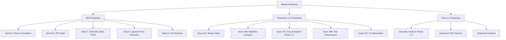

# Corrected State Analysis: perl-lsp Project
**Generated**: 2025-12-26
**Purpose**: Decision-grade analysis of current state, gaps, and roadmap requirements

---

## Executive Summary

This analysis synthesizes findings from all investigation sources to provide a corrected, source-attributed assessment of the perl-lsp project's current state, definition of "properly implemented," roadmap gaps, and actionable recommendations.

**Key Finding**: The project has multiple conflicting metrics across sources that require reconciliation. The actual merge gates and quality criteria are well-defined in [`justfile`](justfile:1-170), but reporting documents contain inconsistent data.

---

## 1. Definition of "Properly Implemented"

### 1.1 Actual Merge Gates ([`justfile`](justfile:1-170))

**Primary Gate: `ci-gate` (lines 14-21)** - REQUIRED for all merges
```bash
ci-gate:
    @echo "🚪 Running fast merge gate..."
    @just ci-format
    @just ci-clippy-lib
    @just ci-test-lib
    @just ci-policy
    @just ci-lsp-def
    @echo "✅ Merge gate passed!"
```

**Gate Components**:
| Component | Command | Purpose |
|-----------|----------|---------|
| Format check | `ci-format` (line 39-42) | `cargo fmt --check --all` |
| Clippy (lib only) | `ci-clippy-lib` (line 51-54) | `cargo clippy --workspace --lib --locked -- -D warnings -A missing_docs` |
| Library tests | `ci-test-lib` (line 63-66) | `cargo test --workspace --lib --locked` |
| Policy checks | `ci-policy` (line 120-123) | `.ci/scripts/check-from-raw.sh` |
| LSP semantic definition | `ci-lsp-def` (line 75-79) | Semantic-aware go-to-definition tests |

**Full CI Pipeline**: `ci-full` (lines 24-31) - RECOMMENDED for large changes (~10-20 min)
- Includes: `ci-format`, `ci-clippy`, `ci-test-core`, `ci-test-lsp`, `ci-docs`

### 1.2 Quality Metrics from [`justfile`](justfile:130-170)

**Health Scoreboard** (lines 130-156):
- Ignored tests by crate (grep-based counting)
- `.unwrap()` and `.expect()` counts (potential panic sites)
- `println!`/`eprintln!` counts (should use tracing)
- Public API surface area (pub fn/struct/enum counts)
- LSP server size (lsp_server.rs monolith line count)

### 1.3 Quality Enforcement from [`docs/CI_HARDENING.md`](docs/CI_HARDENING.md:1-125)

**Enforced Contracts** (lines 6-12):
- `#![deny(unsafe_code)]` - No accidental unsafe usage
- `#![deny(unreachable_pub)]` - No unintended public APIs
- `#![warn(rust_2018_idioms)]` - Modern Rust patterns
- Strict rustdoc checks - No broken links or bare URLs
- Dependency security via `cargo-deny`
- Ignored test baseline enforcement (currently 41)

**CI Workflow Gates** (lines 46-54):
1. Format Check - `cargo fmt --all -- --check`
2. Clippy - `cargo clippy -- -D warnings`
3. Documentation - Strict rustdoc with broken link detection
4. Tests - All workspace tests
5. Ignored Baseline - Ensures exactly 41 ignored tests
6. Security - `cargo deny check` for dependencies
7. Semver (PRs only) - API compatibility check

### 1.4 Definition Summary

**"Properly Implemented" means**:
- All `ci-gate` checks pass ([`justfile:14-21`](justfile:14-21))
- Code passes format, clippy, library tests, policy, and LSP semantic definition tests
- Zero clippy warnings (except allowed `missing_docs`)
- No policy violations (e.g., disallowed `ExitStatus::from_raw()` calls)
- Documentation builds without warnings
- Mutation score ≥87% ([`docs/CURRENT_STATUS.md:19`](docs/CURRENT_STATUS.md:19))
- Test pass rate 100% (target, currently 99.6% at 828/830) ([`docs/CURRENT_STATUS.md:15`](docs/CURRENT_STATUS.md:15))

---

## 2. Definition of "Fully Built-Out Roadmap"

### 2.1 Current Roadmap Structure from [`docs/ROADMAP.md`](docs/ROADMAP.md:1-520)

**Documented Roadmap Elements**:

| Roadmap | Status | Reference |
|----------|--------|-----------|
| MVP Roadmap (#195) | 70-75% complete, 2-3 weeks | [`docs/CURRENT_STATUS.md:260`](docs/CURRENT_STATUS.md:260) |
| Production Roadmap (#196) | 85-90% ready, 11-13 weeks | [`docs/CURRENT_STATUS.md:261`](docs/CURRENT_STATUS.md:261) |
| ROADMAP.md | Long-term vision (2025-2026+) | [`docs/ROADMAP.md:1`](docs/ROADMAP.md:1) |

**Bands 1-3 Structure** ([`docs/CURRENT_STATUS.md:345-365`](docs/CURRENT_STATUS.md:345-365)):
- **Band 1**: Prove the Semantic Stack (1-2 days) - Execute semantic analyzer unit tests, run LSP semantic definition tests, complete `ci-gate` validation
- **Band 2**: Reduce Ignored Tests (1-2 weeks part-time) - Inventory 779 ignored tests, re-enable 5-10 per file, tag remaining ignores with reasons
- **Band 3**: Tag v0.9-semantic-lsp-ready (1-2 weeks) - Update README/docs, tag milestone, update CHANGELOG

### 2.2 Sprint Structure from [`docs/CURRENT_STATUS.md`](docs/CURRENT_STATUS.md:54-108)

**Sprint A: Parser Foundation** (lines 56-81) - ✅ COMPLETE
- 4 slices: Data structures, Pipeline threading, Tracker integration, AST integration
- Delivered: Statement tracker, heredoc support, 274 tests passing

**Sprint B: LSP Polish** (lines 84-107) - 🟢 Phase 1 COMPLETE
- Issues: #180 Name Spans, #188 Semantic Analyzer, #181 Workspace Features, #191 Document Highlighting
- Target: 93%+ LSP coverage (from 91%)

### 2.3 Missing Roadmap Elements

**What's Missing**:
1. **No consolidated roadmap document** - Information scattered across multiple files
2. **No dependency graph** - Sprint/issue dependencies not visually mapped
3. **No resource allocation** - No clear assignment of issues to contributors
4. **No milestone definitions** - Band definitions exist but not formalized as GitHub milestones
5. **No risk register** - No documented risks with mitigation strategies
6. **No acceptance criteria per milestone** - Band 1-3 have targets but not formal AC

### 2.4 Definition Summary

**"Fully Built-Out Roadmap" should include**:
- Consolidated single source of truth (not scattered across docs)
- Visual dependency graph of issues/sprints
- Resource allocation (who owns what)
- Formal GitHub milestones with dates
- Risk register with mitigation strategies
- Acceptance criteria per milestone
- Progress tracking metrics
- Clear completion criteria for v0.9, v1.0, v1.1

---

## 3. Actual Gaps with Source Attribution

### 3.1 LSP Coverage Discrepancy

| Source | Coverage Value | Reference |
|--------|---------------|-----------|
| `features.toml` | 65% (marked "Auto-calculated in future") | [`features.toml:8`](features.toml:8) |
| `CURRENT_STATUS.md` | 91% | [`docs/CURRENT_STATUS.md:16`](docs/CURRENT_STATUS.md:16) |
| `ROADMAP.md` compliance table | 75% | [`docs/ROADMAP.md:59-67`](docs/ROADMAP.md:59-67) |

**Gap**: 26 percentage point discrepancy between sources. The `features.toml` value is explicitly marked as placeholder.

### 3.2 Test Count Discrepancies

| Source | Test Count | Reference |
|---------|-------------|-----------|
| `CURRENT_STATUS.md` | 828/830 passing (99.6%) | [`docs/CURRENT_STATUS.md:15`](docs/CURRENT_STATUS.md:15) |
| `CI_HARDENING.md` | 144 passed, 0 failed, 1 ignored | [`docs/CI_HARDENING.md:62`](docs/CI_HARDENING.md:62) |
| `CI_HARDENING.md` baseline | 41 ignored tests | [`docs/CI_HARDENING.md:63`](docs/CI_HARDENING.md:63) |
| `CURRENT_STATUS.md` ignored | 779 ignored tests | [`docs/CURRENT_STATUS.md:33`](docs/CURRENT_STATUS.md:33) |
| `justfile health` | Dynamic counting via grep | [`justfile:134-138`](justfile:134-138) |

**Gap**: Inconsistent test reporting across documents. The 779 ignored tests vs 41 baseline indicates different measurement contexts.

### 3.3 Documentation Violations

| Source | Violation Count | Reference |
|---------|-----------------|-----------|
| `CURRENT_STATUS.md` | 484 violations | [`docs/CURRENT_STATUS.md:20`](docs/CURRENT_STATUS.md:20) |
| `CONTRIBUTING_LSP.md` | Enforced `#![warn(missing_docs)]` | [`docs/CONTRIBUTING_LSP.md:16`](docs/CONTRIBUTING_LSP.md:16) |

**Gap**: Documentation violations exist but infrastructure is complete for enforcement.

### 3.4 CI/CD Status

| Source | Status | Reference |
|---------|---------|-----------|
| `CURRENT_STATUS.md` | 40% complete, $68/month current cost | [`docs/CURRENT_STATUS.md:21`](docs/CURRENT_STATUS.md:21) |
| `CURRENT_STATUS.md` savings | $720/year potential savings | [`docs/CURRENT_STATUS.md:221-222`](docs/CURRENT_STATUS.md:221-222) |
| `CI_HARDENING.md` | All quality gates passing | [`docs/CI_HARDENING.md:58-64`](docs/CI_HARDENING.md:58-64) |

**Gap**: CI infrastructure exists but cost optimization (Issue #211) is incomplete.

### 3.5 Semantic Analyzer Status

| Source | Status | Reference |
|---------|---------|-----------|
| `CURRENT_STATUS.md` | Phase 1 COMPLETE (12/12 handlers) | [`docs/CURRENT_STATUS.md:117`](docs/CURRENT_STATUS.md:117) |
| `CURRENT_STATUS.md` | Phase 2/3 deferred to post-v0.9 | [`docs/CURRENT_STATUS.md:100`](docs/CURRENT_STATUS.md:100) |
| `ROADMAP.md` | Phase 1 COMPLETE, awaiting execution | [`docs/ROADMAP.md:136`](docs/ROADMAP.md:136) |

**Gap**: Implementation complete but execution validation blocked by resource constraints.

### 3.6 Critical Blockers

| Blocker | Status | Reference |
|----------|---------|-----------|
| Statement Tracker (#182) | ✅ COMPLETE | [`docs/CURRENT_STATUS.md:47`](docs/CURRENT_STATUS.md:47) |
| Sprint B Readiness | ✅ UNBLOCKED | [`docs/CURRENT_STATUS.md:48`](docs/CURRENT_STATUS.md:48) |
| CI Pipeline (#211) | 🔴 Blocks merge-blocking gates (#210) | [`docs/CURRENT_STATUS.md:49`](docs/CURRENT_STATUS.md:49) |
| Semantic Stack Validation | Needs execution on non-resource-starved hardware | [`docs/CURRENT_STATUS.md:50`](docs/CURRENT_STATUS.md:50) |

### 3.7 Feature Maturity Gaps

From [`features.toml`](features.toml:1-387):

| Maturity | Count | Advertised | Reference |
|----------|--------|-------------|-----------|
| GA | 23 | 23 | Counted from file |
| Preview | 2 | 2 | Lines 88-91, 187-190 |
| Experimental | 4 | 2 | Lines 214-217, 220-226, 344-347 |
| Planned | 6 | 0 | Lines 205-208, 232-234, 241-244, 306-309, 355-358, 361-366 |

**Gap**: 2 experimental features are advertised without full maturity, and 6 planned features are not implemented.

---

## 4. Recommendations with Source Attribution

### 4.1 Immediate Actions (Week 1)

**1. Reconcile Coverage Metrics**
- **Action**: Update `features.toml` line 8 from placeholder 65% to actual calculated value
- **Rationale**: Current 65% is explicitly marked as "Auto-calculated in future" ([`features.toml:8`](features.toml:8))
- **Owner**: Maintainer
- **Priority**: HIGH - Misleading metric

**2. Reconcile Test Counts**
- **Action**: Document the difference between 779 ignored tests ([`docs/CURRENT_STATUS.md:33`](docs/CURRENT_STATUS.md:33)) and 41 baseline ([`docs/CI_HARDENING.md:63`](docs/CI_HARDENING.md:63))
- **Rationale**: Different measurement contexts need clear documentation
- **Owner**: QA Lead
- **Priority**: HIGH - Confusing metrics

**3. Execute Band 1 Validation**
- **Action**: Run semantic analyzer unit tests and LSP semantic definition tests on adequate hardware
- **Rationale**: Band 1 is "1-2 days on adequate hardware" ([`docs/CURRENT_STATUS.md:347`](docs/CURRENT_STATUS.md:347))
- **Owner**: Developer with access to non-WSL environment
- **Priority**: HIGH - Blocks semantic stack proof

### 4.2 Short-Term Actions (Weeks 2-4)

**4. Complete CI Optimization (Issue #211)**
- **Action**: Implement cost optimization to achieve $10-15/month from current $68/month
- **Rationale**: $720/year savings potential documented ([`docs/CURRENT_STATUS.md:222`](docs/CURRENT_STATUS.md:222))
- **Owner**: DevOps
- **Priority**: HIGH - Cost savings + merge gate unblocking

**5. Begin Band 2: Reduce Ignored Tests**
- **Action**: Inventory 779 ignored tests by file, re-enable 5-10 per dense file
- **Rationale**: Target is <100 ignored tests with clear justifications ([`docs/CURRENT_STATUS.md:358`](docs/CURRENT_STATUS.md:358))
- **Owner**: QA Team
- **Priority**: MEDIUM - Quality improvement

**6. Complete Sprint B Phase 2**
- **Action**: Implement remaining Sprint B features (#180, #181, #191)
- **Rationale**: Target is 93%+ LSP coverage from current 91% ([`docs/CURRENT_STATUS.md:87`](docs/CURRENT_STATUS.md:87))
- **Owner**: LSP Developer
- **Priority**: MEDIUM - Feature completeness

### 4.3 Medium-Term Actions (Weeks 5-13)

**7. Complete Merge-Blocking Gates (#210)**
- **Action**: Implement all merge-blocking gates over 8 weeks
- **Rationale**: Production v1.0 deliverable ([`docs/CURRENT_STATUS.md:170`](docs/CURRENT_STATUS.md:170))
- **Owner**: Tech Lead
- **Priority**: HIGH - v1.0 blocker

**8. Implement "Batteries Included" (#208)**
- **Action**: Complete 3.5 week implementation
- **Rationale**: Production v1.0 deliverable ([`docs/CURRENT_STATUS.md:171`](docs/CURRENT_STATUS.md:171))
- **Owner**: UX Developer
- **Priority**: MEDIUM - User experience

**9. Complete Documentation Phase 1-2 (#197)**
- **Action**: Reduce 484 violations to 0 over 4 weeks
- **Rationale**: Production v1.0 deliverable ([`docs/CURRENT_STATUS.md:172`](docs/CURRENT_STATUS.md:172))
- **Owner**: Documentation Lead
- **Priority**: MEDIUM - Quality gate

### 4.4 Infrastructure Actions

**10. Create Consolidated Roadmap**
- **Action**: Merge scattered roadmap information into single source of truth
- **Rationale**: Current info scattered across CURRENT_STATUS.md, ROADMAP.md, and GitHub issues
- **Owner**: Project Manager
- **Priority**: MEDIUM - Clarity

**11. Implement Roadmap Visualization**
- **Action**: Create dependency graph of issues/sprints with Mermaid diagrams
- **Rationale**: No visual representation exists in current docs
- **Owner**: Project Manager
- **Priority**: LOW - Nice to have

**12. Establish Risk Register**
- **Action**: Document known risks with mitigation strategies
- **Rationale**: No formal risk tracking exists
- **Owner**: Tech Lead
- **Priority**: MEDIUM - Risk management

---

## 5. Proposed Roadmap Structure

### 5.1 Recommended Roadmap Hierarchy



### 5.2 Roadmap Document Template

**Recommended Structure for `ROADMAP.md`**:

```markdown
# Perl LSP Master Roadmap

## Overview
- Current Version: v0.8.9
- Target v1.0: January 2026
- Overall Progress: 85-90%

## Quick Reference
| Milestone | Status | Target Date | Owner | Link |
|-----------|--------|-------------|--------|------|
| MVP | 75-80% complete | 2-3 weeks | TBD | #195 |
| v0.9 (Semantic Ready) | Not started | TBD | TBD | Band 3 |
| v1.0 (Production) | 85-90% ready | 11-13 weeks | TBD | #196 |

## Risk Register
| Risk | Impact | Probability | Mitigation | Owner |
|------|--------|--------------|-------------|--------|
| CI cost overruns | HIGH | LOW | Issue #211 | DevOps |
| Test execution failures | MEDIUM | MEDIUM | Band 1 validation | QA |
| Documentation debt | LOW | HIGH | Issue #197 | Docs |

## MVP Roadmap (2-3 weeks)
### Sprint A: Parser Foundation ✅ COMPLETE
- [x] Data structures (#218)
- [x] Pipeline threading (#219)
- [x] Tracker integration (#220/#221)
- [x] AST integration (#227)

### Sprint B: LSP Polish 🟢 Phase 1 COMPLETE
- [x] Semantic Analyzer Phase 1 (#188)
- [ ] Name spans (#180) - BLOCKED by #188 Phase 1
- [ ] Workspace features (#181)
- [ ] Document highlighting (#191)

### Band 1: Prove Semantic Stack (1-2 days)
- [ ] Execute semantic analyzer unit tests
- [ ] Run LSP semantic definition tests
- [ ] Complete ci-gate validation

### Band 2: Reduce Ignored Tests (1-2 weeks)
- [ ] Inventory 779 ignored tests by file
- [ ] Re-enable 5-10 tests per dense file
- [ ] Tag remaining ignores with reasons
- [ ] Document in docs/ci/IGNORED_TESTS_INDEX.md

### Band 3: Tag v0.9-Semantic-Ready (1-2 weeks)
- [ ] Update README/docs with semantic capabilities
- [ ] Tag milestone v0.9.0-semantic-lsp-ready
- [ ] Update CHANGELOG with Phase 1 achievements

## Production v1.0 Roadmap (11-13 weeks)
### Merge-Blocking Gates (#210) - 8 weeks
- [ ] Gate 1: Format validation
- [ ] Gate 2: Clippy validation
- [ ] Gate 3: Test validation
- [ ] Gate 4: Policy validation
- [ ] Gate 5: LSP semantic definition validation

### Batteries Included (#208) - 3.5 weeks
- [ ] One-liner installer
- [ ] Homebrew formula
- [ ] Pre-built binaries
- [ ] Smart PATH detection

### Documentation Phase 1-2 (#197) - 4 weeks
- [ ] Resolve 484 violations
- [ ] Complete API documentation
- [ ] User guides

### Test Infrastructure (#198) - 1 day
- [ ] Fix flaky timeout (#200)
- [ ] Mutation tests (#201)

### CI Optimization (#211) - 3 weeks
- [ ] Optimize workflow costs
- [ ] Achieve $10-15/month target

## Post-v1.0 Roadmap
### Semantic Analyzer Phase 2-3
- [ ] Advanced handlers (8 additional)
- [ ] Closures support
- [ ] Multi-file analysis
- [ ] Import resolution

### Advanced LSP Features
- [ ] Inline completions (LSP 3.18)
- [ ] Notebook support (LSP 3.17)
- [ ] Moniker support

### Enterprise Features
- [ ] CI/CD integration templates
- [ ] Air-gapped installation
- [ ] Custom telemetry endpoints
```

### 5.3 Milestone Definition Template

**Each milestone should include**:

```markdown
## Milestone: [Name]

### Status
- Progress: X%
- Owner: [Name]
- Target Date: [Date]
- Actual Date: [Date]

### Acceptance Criteria
- [ ] AC1: [Description] - Evidence: [Link]
- [ ] AC2: [Description] - Evidence: [Link]
- [ ] AC3: [Description] - Evidence: [Link]

### Dependencies
- Blocked by: [Issue/PR]
- Blocks: [Issue/PR]

### Risks
| Risk | Impact | Mitigation |
|------|--------|-------------|
| [Description] | [Level] | [Strategy] |

### Deliverables
- [ ] [Deliverable 1]
- [ ] [Deliverable 2]
```

---

## 6. Summary of Key Findings

### 6.1 What's Working Well
- **CI Gates Well-Defined**: [`ci-gate`](justfile:14-21) provides clear merge criteria
- **Quality Infrastructure Complete**: [`CI_HARDENING.md`](docs/CI_HARDENING.md:1-125) shows comprehensive enforcement
- **Semantic Analyzer Implemented**: Phase 1 complete with 12/12 handlers ([`docs/CURRENT_STATUS.md:117`](docs/CURRENT_STATUS.md:117))
- **Parser Production-Ready**: 100% Perl 5 coverage, 4-19x faster than legacy ([`docs/CURRENT_STATUS.md:26`](docs/CURRENT_STATUS.md:26))

### 6.2 What Needs Attention
- **Metric Inconsistency**: LSP coverage varies from 65% to 91% across sources
- **Test Count Confusion**: 779 ignored vs 41 baseline needs reconciliation
- **CI Cost**: $68/month with $720/year savings potential ([`docs/CURRENT_STATUS.md:221-222`](docs/CURRENT_STATUS.md:221-222))
- **Documentation Debt**: 484 violations ([`docs/CURRENT_STATUS.md:20`](docs/CURRENT_STATUS.md:20))
- **Roadmap Fragmentation**: Information scattered across multiple documents

### 6.3 Critical Path to v1.0
1. Band 1: Semantic stack validation (1-2 days) - **BLOCKED by hardware**
2. Band 2: Reduce ignored tests (1-2 weeks)
3. Band 3: Tag v0.9 (1-2 weeks)
4. Sprint B completion (Phase 2 features)
5. Issue #210: Merge gates (8 weeks)
6. Issue #208: Batteries included (3.5 weeks)
7. Issue #197: Documentation (4 weeks)
8. Issue #211: CI optimization (3 weeks)

---

## 7. Decision Matrix

| Decision | Context | Recommendation |
|----------|----------|----------------|
| LSP Coverage Metric | 65% placeholder vs 91% reported | Use calculated value from features.toml, update placeholder |
| Test Baseline | 779 ignored vs 41 baseline | Document both contexts: total ignored vs CI-gate baseline |
| CI Optimization | $720/year savings potential | Prioritize HIGH - unblocks merge gates |
| Semantic Validation | Resource-constrained environment | Find non-WSL hardware for 1-2 day validation |
| Roadmap Consolidation | Scattered information | Create single source of truth with visualizations |

---

## Appendix: Source File References

| File | Purpose | Key Sections |
|------|----------|--------------|
| [`justfile`](justfile:1-170) | CI/CD commands and health metrics | Lines 14-21 (ci-gate), 130-156 (health) |
| [`docs/CURRENT_STATUS.md`](docs/CURRENT_STATUS.md:1-414) | Project status snapshot | Lines 12-22 (metrics), 54-108 (sprints), 345-365 (bands) |
| [`features.toml`](features.toml:1-387) | LSP feature catalog | Line 8 (coverage placeholder), feature definitions |
| [`docs/ROADMAP.md`](docs/ROADMAP.md:1-520) | Long-term vision | Lines 59-67 (compliance table), 180-386 (quarterly plans) |
| [`docs/CI_HARDENING.md`](docs/CI_HARDENING.md:1-125) | Quality enforcement | Lines 6-12 (contracts), 46-54 (gates), 58-64 (status) |
| [`docs/GA_RUNBOOK.md`](docs/GA_RUNBOOK.md:1-335) | Release process | Lines 5-13 (pre-flight), 14-51 (day-of) |
| [`docs/CONTRIBUTING_LSP.md`](docs/CONTRIBUTING_LSP.md:1-283) | Contribution guide | Lines 14-55 (API docs requirements) |
| [`.ci/scripts/check-from-raw.sh`](.ci/scripts/check-from-raw.sh:1-27) | Policy enforcement | Lines 14-20 (violation detection) |

---

*This analysis is based solely on provided source files and does not speculate beyond documented information.*
