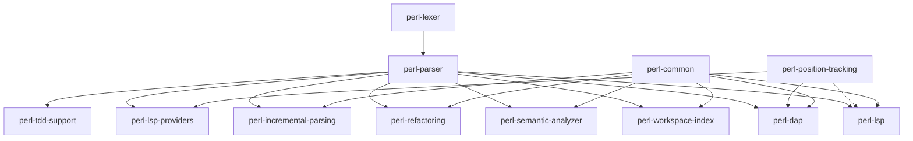
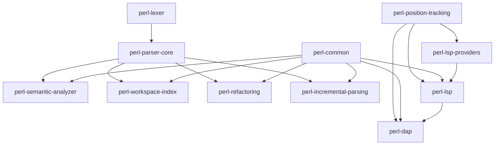

# Perl LSP Crate Separation Analysis

**Date**: 2026-01-15  
**Purpose**: Analyze the crate mix for the Perl LSP project and identify components that should be broken out into separate crates.

---

## Executive Summary

The Perl LSP project currently has **six published crates** with a monolithic `perl-parser` crate that contains multiple distinct subsystems. This analysis identifies **8 high-priority** and **6 medium-priority** extractable components that could benefit from being separate crates.

**Key Findings**:
- `perl-parser` is a monolithic crate containing parser, LSP providers, semantic analysis, workspace indexing, refactoring, incremental parsing, and TDD support
- Significant code duplication exists between `perl-parser` and `perl-lsp` (LSP providers)
- Shared utilities (position tracking, URI handling, diagnostics) could be extracted into reusable crates
- The project has good separation of concerns at the binary level (LSP, DAP, Lexer) but not at the library level

---

## Current Crate Overview

### Published Crates

| Crate | Purpose | Size | Dependencies |
|--------|---------|------|-------------|
| [`perl-parser`](crates/perl-parser/) | Main parser + LSP providers + semantic analysis + workspace + refactoring | **Very Large** | perl-lexer, lsp-types, serde, regex, ropey, url, rustc-hash, md5, phf, parking_lot, walkdir, nix, thiserror, tracing |
| [`perl-lsp`](crates/perl-lsp/) | LSP binary | Medium | perl-parser, perl-lexer, lsp-types, serde, serde_json, url, rustc-hash, regex, lazy_static, md5, phf, nix, parking_lot, walkdir, anyhow, thiserror |
| [`perl-dap`](crates/perl-dap/) | DAP binary | Small | perl-parser, lsp-types, serde, serde_json, anyhow, thiserror, tokio, tracing, ropey, nix, winapi |
| [`perl-lexer`](crates/perl-lexer/) | Tokenizer | Small | unicode-ident, memchr, thiserror |
| [`perl-corpus`](crates/perl-corpus/) | Test corpus | Small | - |
| [`perl-parser-pest`](crates/perl-parser-pest/) | Legacy parser | Small | - |

### Excluded Crates
- `tree-sitter-perl` - Grammar (not a Rust crate)
- `tree-sitter-perl-c` - C parser (excluded from workspace)
- `tree-sitter-perl-rs` - Rust wrapper (excluded from workspace)
- `xtask` - Development tools (excluded from workspace)

---

## Extractable Components Analysis

### HIGH PRIORITY COMPONENTS

#### 1. **perl-semantic-analyzer** (NEW CRATE)

**Current Location**: [`crates/perl-parser/src/analysis/`](crates/perl-parser/src/analysis/)

**Modules**:
- [`semantic.rs`](crates/perl-parser/src/analysis/semantic.rs) - SemanticAnalyzer with 12 critical node handlers (Phase 1 complete)
- [`scope_analyzer.rs`](crates/perl-parser/src/analysis/scope_analyzer.rs) - Lexical scoping with nested scope handling
- [`type_inference.rs`](crates/perl-parser/src/analysis/type_inference.rs) - Type inference system
- [`symbol.rs`](crates/perl-parser/src/analysis/symbol.rs) - Symbol representation and management
- [`declaration.rs`](crates/perl-parser/src/analysis/declaration.rs) - Declaration tracking
- [`index.rs`](crates/perl-parser/src/analysis/index.rs) - Symbol indexing infrastructure
- [`dead_code_detector.rs`](crates/perl-parser/src/analysis/dead_code_detector.rs) - Dead code analysis

**Rationale for Extraction**:
- **Clear Domain Boundary**: Semantic analysis is a distinct concern from parsing
- **Reusable**: Could be used by other language tools (e.g., formatters, linters)
- **Stable API**: SemanticAnalyzer has a well-defined interface
- **Independent Development**: Semantic analysis can evolve independently of parser changes
- **Test Coverage**: Has dedicated semantic tests ([`semantic_smoke_tests.rs`](crates/perl-parser/tests/semantic_smoke_tests.rs), LSP semantic definition tests in perl-lsp)

**Dependencies**:
- Depends on: AST types from perl-parser
- Minimal external dependencies: regex, rustc-hash, thiserror

**Priority**: **HIGH**

**Benefits**:
- Enables semantic analysis as a standalone library
- Reduces perl-parser compilation time
- Allows other tools to use Perl semantic analysis without LSP
- Clearer API boundaries for semantic features

**Challenges**:
- AST type definitions need to be shared
- Requires careful API design to avoid tight coupling

---

#### 2. **perl-workspace-index** (NEW CRATE)

**Current Location**: [`crates/perl-parser/src/workspace/`](crates/perl-parser/src/workspace/)

**Modules**:
- [`workspace_index.rs`](crates/perl-parser/src/workspace/workspace_index.rs) - Dual indexing strategy (98% reference coverage)
- [`document_store.rs`](crates/perl-parser/src/workspace/document_store.rs) - Document caching and retrieval
- [`workspace_refactor.rs`](crates/perl-parser/src/workspace/workspace_refactor.rs) - Cross-file refactoring operations
- [`workspace_rename.rs`](crates/perl-parser/src/workspace/workspace_rename.rs) - Symbol renaming with cross-file impact

**Rationale for Extraction**:
- **Clear Domain Boundary**: Workspace indexing is independent of parsing
- **Reusable**: Could be used by other language tools needing cross-file analysis
- **Dual Indexing Strategy**: The 98% coverage dual indexing pattern is a valuable, reusable pattern
- **Cross-File Operations**: Workspace refactoring and rename are distinct concerns

**Dependencies**:
- Depends on: AST types, position tracking, URI handling
- Minimal external dependencies: walkdir, rustc-hash, url, regex

**Priority**: **HIGH**

**Benefits**:
- Enables workspace analysis as a standalone library
- Dual indexing strategy is language-agnostic and could be reused
- Reduces perl-parser compilation time
- Clear API for cross-file operations

**Challenges**:
- Requires position tracking utilities to be extracted or shared
- Needs to maintain dual indexing pattern consistency

---

#### 3. **perl-refactoring** (NEW CRATE)

**Current Location**: [`crates/perl-parser/src/refactor/`](crates/perl-parser/src/refactor/)

**Modules**:
- [`import_optimizer.rs`](crates/perl-parser/src/refactor/import_optimizer.rs) - Import analysis and optimization
- [`modernize.rs`](crates/perl-parser/src/refactor/modernize.rs) - Code modernization transformations
- [`refactoring.rs`](crates/perl-parser/src/refactor/refactoring.rs) - AST-aware refactoring operations
- [`import_optimizer.rst`](crates/perl-parser/src/refactor/import_optimizer.rst) - Documentation

**Rationale for Extraction**:
- **Clear Domain Boundary**: Refactoring is a distinct concern from parsing
- **Reusable**: Could be used by other language tools needing refactoring capabilities
- **Well-Defined Operations**: Extract variable/subroutine, modernize patterns, optimize imports
- **Test Coverage**: Has dedicated tests ([`import_optimizer_tests.rs`](crates/perl-parser/tests/import_optimizer_tests.rs))

**Dependencies**:
- Depends on: AST types, semantic analysis, workspace indexing
- Minimal external dependencies: regex, thiserror

**Priority**: **HIGH**

**Benefits**:
- Enables refactoring as a standalone library
- Import optimization is valuable for other Perl tools
- Reduces perl-parser compilation time
- Clear API for refactoring operations

**Challenges**:
- Requires semantic analysis for scope-aware refactoring
- Needs workspace indexing for cross-file refactoring

---

#### 4. **perl-lsp-providers** (NEW CRATE)

**Current Location**: [`crates/perl-parser/src/ide/lsp_compat/`](crates/perl-parser/src/ide/lsp_compat/) and [`crates/perl-lsp/src/features/`](crates/perl-lsp/src/features/)

**Modules** (from perl-parser):
- [`completion.rs`](crates/perl-parser/src/ide/lsp_compat/completion.rs) - Code completion
- [`diagnostics.rs`](crates/perl-parser/src/ide/lsp_compat/diagnostics.rs) - Diagnostic publishing
- [`references.rs`](crates/perl-parser/src/ide/lsp_compat/references.rs) - Find references
- [`rename.rs`](crates/perl-parser/src/ide/lsp_compat/rename.rs) - Symbol renaming
- [`semantic_tokens_provider.rs`](crates/perl-parser/src/ide/lsp_compat/semantic_tokens_provider.rs) - Semantic highlighting
- [`code_actions.rs`](crates/perl-parser/src/ide/lsp_compat/code_actions.rs) - Code actions and refactorings
- [`code_lens_provider.rs`](crates/perl-parser/src/ide/lsp_compat/code_lens_provider.rs) - Code lens with reference counts
- [`signature_help.rs`](crates/perl-parser/src/ide/lsp_compat/signature_help.rs) - Signature help
- [`type_hierarchy.rs`](crates/perl-parser/src/ide/lsp_compat/type_hierarchy.rs) - Type hierarchy
- [`document_highlight.rs`](crates/perl-parser/src/ide/lsp_compat/document_highlight.rs) - Document highlighting
- [`folding.rs`](crates/perl-parser/src/ide/lsp_compat/folding.rs) - Code folding
- [`formatting.rs`](crates/perl-parser/src/ide/lsp_compat/formatting.rs) - Code formatting
- [`inlay_hints.rs`](crates/perl-parser/src/ide/lsp_compat/inlay_hints.rs) - Inlay hints
- [`implementation_provider.rs`](crates/perl-parser/src/ide/lsp_compat/implementation_provider.rs) - Go to implementation
- [`type_definition.rs`](crates/perl-parser/src/ide/lsp_compat/type_definition.rs) - Go to type definition
- [`workspace_symbols.rs`](crates/perl-parser/src/ide/lsp_compat/workspace_symbols.rs) - Workspace symbols
- [`call_hierarchy_provider.rs`](crates/perl-parser/src/ide/lsp_compat/call_hierarchy_provider.rs) - Call hierarchy
- [`selection_range.rs`](crates/perl-parser/src/ide/lsp_compat/selection_range.rs) - Selection ranges
- [`linked_editing.rs`](crates/perl-parser/src/ide/lsp_compat/linked_editing.rs) - Linked editing
- [`on_type_formatting.rs`](crates/perl-parser/src/ide/lsp_compat/on_type_formatting.rs) - On-type formatting
- [`lsp_document_link.rs`](crates/perl-parser/src/ide/lsp_compat/lsp_document_link.rs) - Document links
- [`inline_completions.rs`](crates/perl-parser/src/ide/lsp_compat/inline_completions.rs) - Inline completions

**Modules** (from perl-lsp - duplicate/overlapping):
- [`code_actions_enhanced.rs`](crates/perl-lsp/src/features/code_actions_enhanced.rs)
- [`code_actions_pragmas.rs`](crates/perl-lsp/src/features/code_actions_pragmas.rs)
- [`code_actions_provider.rs`](crates/perl-lsp/src/features/code_actions_provider.rs)
- [`map.rs`](crates/perl-lsp/src/features/map.rs)
- [`lsp_selection_range.rs`](crates/perl-lsp/src/features/lsp_selection_range.rs)
- [`lsp_on_type_formatting.rs`](crates/perl-lsp/src/features/lsp_on_type_formatting.rs)

**Rationale for Extraction**:
- **Code Duplication**: Significant duplication exists between perl-parser and perl-lsp
- **Clear Domain Boundary**: LSP providers are distinct from parsing and semantic analysis
- **Reusable**: Could be used by other language servers or IDE tools
- **LSP Protocol Independence**: LSP providers should be independent of specific language implementation
- **Test Coverage**: Both crates have extensive LSP tests

**Dependencies**:
- Depends on: AST types, semantic analysis, workspace indexing, position tracking
- External: lsp-types, serde, serde_json

**Priority**: **HIGH**

**Benefits**:
- Eliminates code duplication between perl-parser and perl-lsp
- Enables LSP providers as a standalone library
- Reduces compilation time for both perl-parser and perl-lsp
- Clear separation of concerns: parsing vs. IDE integration

**Challenges**:
- Requires careful API design to avoid tight coupling to parser internals
- Need to decide which crate owns the LSP provider implementations
- May require feature flags for optional LSP features

---

#### 5. **perl-incremental-parsing** (NEW CRATE)

**Current Location**: [`crates/perl-parser/src/incremental/`](crates/perl-parser/src/incremental/)

**Modules**:
- [`incremental_v2.rs`](crates/perl-parser/src/incremental/incremental_v2.rs) - Core incremental parsing logic
- [`incremental_handler_v2.rs`](crates/perl-parser/src/incremental/incremental_handler_v2.rs) - Incremental edit handling
- [`incremental_document.rs`](crates/perl-parser/src/incremental/incremental_document.rs) - Document state management
- [`incremental_edit.rs`](crates/perl-parser/src/incremental/incremental_edit.rs) - Edit operations
- [`incremental_advanced_reuse.rs`](crates/perl-parser/src/incremental/incremental_advanced_reuse.rs) - Advanced node reuse strategies
- [`incremental_simple.rs`](crates/perl-parser/src/incremental/incremental_simple.rs) - Simple incremental parsing
- [`incremental_integration.rs`](crates/perl-parser/src/incremental/incremental_integration.rs) - Integration with LSP

**Rationale for Extraction**:
- **Clear Domain Boundary**: Incremental parsing is a distinct concern from parsing
- **Performance Critical**: <1ms updates with 70-99% node reuse efficiency
- **Reusable**: Could be used by other language servers needing incremental updates
- **Test Coverage**: Has dedicated tests ([`incremental_*_test.rs`](crates/perl-parser/tests/))

**Dependencies**:
- Depends on: AST types, position tracking
- Minimal external dependencies: thiserror (optional)

**Priority**: **HIGH**

**Benefits**:
- Enables incremental parsing as a standalone library
- Performance-critical component can be optimized independently
- Reduces perl-parser compilation time
- Clear API for incremental parsing operations

**Challenges**:
- Requires careful API design for edit operations
- Needs to maintain compatibility with LSP text synchronization

---

### MEDIUM PRIORITY COMPONENTS

#### 6. **perl-position-tracking** (NEW CRATE)

**Current Location**: [`crates/perl-parser/src/engine/position/`](crates/perl-parser/src/engine/position/)

**Modules**:
- [`position_mapper.rs`](crates/perl-parser/src/engine/position/position_mapper.rs) - UTF-8/UTF-16 position mapping (symmetric conversion)
- [`line_index.rs`](crates/perl-parser/src/engine/position/line_index.rs) - Line-to-byte offset mapping
- [`positions.rs`](crates/perl-parser/src/engine/position/positions.rs) - Position data structures

**Rationale for Extraction**:
- **Cross-Crate Utility**: Position tracking is used by perl-parser, perl-lsp, and perl-dap
- **Reusable**: UTF-8/UTF-16 position mapping is language-agnostic
- **Security Critical**: Symmetric position conversion fixes UTF-16 boundary vulnerabilities (PR #153)
- **Well-Tested**: Comprehensive position tracking tests ([`position_*_test.rs`](crates/perl-parser/tests/))

**Dependencies**:
- Minimal external dependencies: ropey (already a dependency)
- No Perl-specific dependencies

**Priority**: **MEDIUM**

**Benefits**:
- Eliminates code duplication across crates
- Provides language-agnostic position tracking library
- Security fixes (UTF-16 boundary) benefit all consumers
- Reduces compilation time for all dependent crates

**Challenges**:
- Minimal - position tracking is already well-encapsulated
- Need to decide on ownership of ropey dependency

---

#### 7. **perl-common** (NEW CRATE)

**Current Location**: Shared utilities across perl-parser, perl-lsp, perl-dap

**Proposed Modules**:
- **URI Handling**: From [`crates/perl-lsp/src/util/uri.rs`](crates/perl-lsp/src/util/uri.rs)
- **Diagnostics Catalog**: From [`crates/perl-lsp/src/diagnostics_catalog.rs`](crates/perl-lsp/src/diagnostics_catalog.rs) and [`crates/perl-parser/src/ide/diagnostics_catalog.rs`](crates/perl-parser/src/ide/diagnostics_catalog.rs)
- **Cancellation Infrastructure**: From [`crates/perl-lsp/src/cancellation.rs`](crates/perl-lsp/src/cancellation.rs) and [`crates/perl-parser/src/ide/cancellation.rs`](crates/perl-parser/src/ide/cancellation.rs)
- **Path Normalization**: From [`crates/perl-dap/src/platform.rs`](crates/perl-dap/src/platform.rs) (cross-platform path handling)
- **Configuration Management**: From [`crates/perl-lsp/src/state/config.rs`](crates/perl-lsp/src/state/config.rs) and [`crates/perl-dap/src/configuration.rs`](crates/perl-dap/src/configuration.rs)

**Rationale for Extraction**:
- **Eliminates Duplication**: Multiple utilities are duplicated across crates
- **Cross-Crate Reusability**: Common utilities should be shared
- **Clear Domain Boundary**: Common utilities are distinct from language-specific logic
- **Well-Tested**: Shared components have comprehensive test coverage

**Dependencies**:
- Minimal external dependencies: url, serde, thiserror, regex

**Priority**: **MEDIUM**

**Benefits**:
- Eliminates code duplication across 3 crates
- Provides consistent utilities for all crates
- Reduces compilation time
- Easier maintenance of shared functionality

**Challenges**:
- Need to identify minimal set of truly shared utilities
- May require versioning to avoid breaking changes

---

#### 8. **perl-tdd-support** (NEW CRATE)

**Current Location**: [`crates/perl-parser/src/tdd/`](crates/perl-parser/src/tdd/)

**Modules**:
- [`test_generator.rs`](crates/perl-parser/src/tdd/test_generator.rs) - Auto-detecting TestGenerator with AST-based expectation inference
- [`tdd_workflow.rs`](crates/perl-parser/src/tdd/tdd_workflow.rs) - TDD workflow orchestration
- [`tdd_basic.rs`](crates/perl-parser/src/tdd/tdd_basic.rs) - Basic TDD utilities
- [`test_runner.rs`](crates/perl-parser/src/tdd/test_runner.rs) - Test runner infrastructure

**Rationale for Extraction**:
- **Clear Domain Boundary**: TDD support is distinct from parsing
- **Reusable**: Could be used by other language tools needing TDD support
- **Well-Tested**: Has dedicated test infrastructure
- **Independent Development**: TDD support can evolve independently

**Dependencies**:
- Depends on: AST types
- Minimal external dependencies: regex, thiserror

**Priority**: **MEDIUM**

**Benefits**:
- Enables TDD support as a standalone library
- Reduces perl-parser compilation time
- Clear API for test generation and workflow

**Challenges**:
- Requires careful API design for test generation
- Needs to maintain compatibility with various test frameworks

---

## Dependency Analysis

### Current Dependency Graph

### Shared Dependencies

| Dependency | Used By | Notes |
|------------|----------|-------|
| `lsp-types` | perl-parser, perl-lsp, perl-dap | LSP protocol types |
| `ropey` | perl-parser, perl-lsp, perl-dap | Document management |
| `serde` | perl-parser, perl-lsp, perl-dap | Serialization |
| `serde_json` | perl-parser, perl-lsp, perl-dap | JSON serialization |
| `regex` | perl-parser, perl-lsp | Pattern matching |
| `url` | perl-parser, perl-lsp, perl-dap | URI handling |
| `rustc-hash` | perl-parser, perl-lsp, perl-dap | Fast hashing |
| `thiserror` | All crates | Error handling |
| `tracing` | perl-parser, perl-lsp, perl-dap | Logging |
| `parking_lot` | perl-parser, perl-lsp | Locking |
| `walkdir` | perl-parser, perl-lsp | Filesystem traversal |

---

## Recommendations Summary

### Immediate Actions (High Priority)

1. **Extract `perl-semantic-analyzer`** - Create standalone crate for semantic analysis
2. **Extract `perl-workspace-index`** - Create standalone crate for workspace operations
3. **Extract `perl-refactoring`** - Create standalone crate for refactoring operations
4. **Extract `perl-lsp-providers`** - Create standalone crate for LSP providers (eliminate duplication)
5. **Extract `perl-incremental-parsing`** - Create standalone crate for incremental parsing

### Medium-Term Actions

6. **Extract `perl-position-tracking`** - Create shared crate for position tracking
7. **Extract `perl-common`** - Create shared crate for common utilities

### Long-Term Considerations

- **Deprecate `perl-parser-pest`** - Mark as legacy and plan removal
- **Consolidate `tree-sitter-perl-rs`** - Consider merging with perl-parser or deprecating
- **Feature Flag Strategy** - Use feature flags to enable/disable optional components

---

## Proposed New Workspace Structure

### New Crate Definitions

| Crate Name | Purpose | Dependencies |
|-------------|---------|-------------|
| `perl-lexer` | Tokenization (existing) | unicode-ident, memchr |
| `perl-parser-core` | Core parser engine (refactored from perl-parser) | perl-lexer, thiserror, regex, ropey, tracing |
| `perl-semantic-analyzer` | Semantic analysis | perl-parser-core, regex, rustc-hash, thiserror |
| `perl-workspace-index` | Workspace operations | perl-parser-core, perl-position-tracking, walkdir, url, rustc-hash |
| `perl-refactoring` | Refactoring operations | perl-parser-core, perl-semantic-analyzer, regex, thiserror |
| `perl-incremental-parsing` | Incremental parsing | perl-parser-core, thiserror (optional) |
| `perl-position-tracking` | Position tracking | ropey, thiserror |
| `perl-common` | Shared utilities | url, serde, regex, thiserror |
| `perl-lsp-providers` | LSP providers | lsp-types, serde, serde_json, perl-parser-core, perl-semantic-analyzer, perl-workspace-index, perl-position-tracking, perl-common |
| `perl-lsp` | LSP binary | perl-lsp-providers, perl-parser-core, perl-common, tokio, tracing, thiserror |
| `perl-dap` | DAP binary | perl-parser-core, lsp-types, serde, serde_json, tokio, tracing, thiserror, perl-common, perl-position-tracking |
| `perl-corpus` | Test corpus (existing) | - |
| `xtask` | Development tools (existing, excluded) | - |

---

## Migration Strategy

### Phase 1: Foundation (High Priority)

1. Create `perl-semantic-analyzer` crate
   - Extract [`analysis/`](crates/perl-parser/src/analysis/) module
   - Define clear public API
   - Migrate tests

2. Create `perl-workspace-index` crate
   - Extract [`workspace/`](crates/perl-parser/src/workspace/) module
   - Define clear public API
   - Migrate tests

3. Create `perl-refactoring` crate
   - Extract [`refactor/`](crates/perl-parser/src/refactor/) module
   - Define clear public API
   - Migrate tests

4. Create `perl-incremental-parsing` crate
   - Extract [`incremental/`](crates/perl-parser/src/incremental/) module
   - Define clear public API
   - Migrate tests

### Phase 2: Consolidation (High Priority)

5. Create `perl-position-tracking` crate
   - Extract [`engine/position/`](crates/perl-parser/src/engine/position/) module
   - Define clear public API
   - Migrate tests

6. Create `perl-common` crate
   - Extract shared utilities from perl-lsp and perl-dap
   - Define clear public API
   - Ensure minimal dependencies

7. Refactor `perl-parser` to `perl-parser-core`
   - Remove extracted modules
   - Update dependencies to use new crates
   - Maintain backward compatibility through re-exports

### Phase 3: LSP Provider Unification (High Priority)

8. Create `perl-lsp-providers` crate
   - Consolidate LSP providers from perl-parser and perl-lsp
   - Eliminate code duplication
   - Define clear public API
   - Update perl-lsp to use perl-lsp-providers

9. Update `perl-lsp` binary
   - Use perl-lsp-providers for LSP functionality
   - Remove duplicated LSP provider code
   - Update tests

### Phase 4: Cleanup (Low Priority)

10. Deprecate `perl-parser-pest`
    - Mark as legacy in documentation
    - Plan removal timeline

11. Consider `tree-sitter-perl-rs` consolidation
    - Evaluate merging with perl-parser-core
    - Or deprecate if no longer needed

---

## Benefits of Proposed Structure

### For the Project

1. **Reduced Compilation Time**: Smaller crates compile faster
2. **Clearer Boundaries**: Each crate has a single, well-defined responsibility
3. **Better Testing**: Smaller crates are easier to test in isolation
4. **Reusability**: Components can be used by other projects
5. **Easier Maintenance**: Changes to one component don't require recompiling the entire parser
6. **Better Documentation**: Smaller crates have more focused documentation
7. **Flexibility**: Users can depend on only the components they need

### For External Users

1. **Semantic Analysis**: Other tools can use Perl semantic analysis without LSP
2. **Workspace Operations**: Cross-file analysis available as a library
3. **Refactoring**: Perl refactoring capabilities available as a library
4. **Position Tracking**: Language-agnostic UTF-8/UTF-16 position mapping
5. **LSP Providers**: Other language servers can use Perl LSP providers

---

## Challenges and Considerations

### Technical Challenges

1. **API Design**: Need to design stable, versioned APIs for new crates
2. **Backward Compatibility**: Maintain compatibility with existing perl-parser API
3. **Testing Coverage**: Ensure all existing tests continue to pass
4. **Documentation**: Update documentation to reflect new crate structure
5. **Feature Flags**: May need feature flags for optional components

### Organizational Challenges

1. **Release Coordination**: Multiple crates need coordinated releases
2. **Breaking Changes**: May need to coordinate breaking changes across crates
3. **Documentation Maintenance**: More crates means more documentation to maintain
4. **CI/CD Updates**: Update CI/CD pipelines for new structure

### Risk Mitigation

1. **Re-exports**: Use re-exports in perl-parser to maintain backward compatibility
2. **Feature Flags**: Use feature flags to enable/disable components
3. **Deprecation Warnings**: Add deprecation warnings for old APIs
4. **Migration Guide**: Provide clear migration guide for users
5. **Semantic Versioning**: Use semantic versioning for breaking changes

---

## Conclusion

The Perl LSP project has a solid foundation with good separation at the binary level (LSP, DAP, Lexer). However, the [`perl-parser`](crates/perl-parser/) crate is monolithic and contains multiple distinct subsystems that could benefit from being separate crates.

**Key Recommendations**:

1. **Extract 8 components** into separate crates (5 high priority, 3 medium priority)
2. **Prioritize semantic analysis, workspace indexing, and refactoring** - These are the most valuable reusable components
3. **Eliminate LSP provider duplication** - Significant code duplication exists between perl-parser and perl-lsp
4. **Create shared utilities crate** - Eliminates duplication across perl-lsp and perl-dap
5. **Use phased migration** - Gradual migration reduces risk and allows testing

The proposed structure would result in **11 total crates** (6 existing + 5 new), with clear boundaries and responsibilities for each crate.
