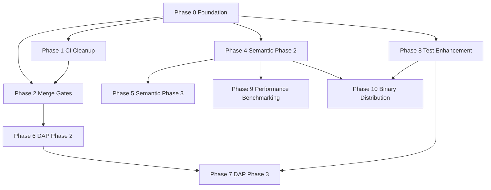

# Perl LSP Project - Gap Analysis & Implementation Plan

> **Analysis Date**: 2026-01-17
> **Current Version**: v0.9.0 RC (2026-01-11)
> **Current Completion (default lib test suite only; receipts pending)**: ~90-95% (updated 2026-01-17)

---

## Executive Summary

The Perl LSP project is near production readiness for core parser + LSP infrastructure (default suite only; receipts pending, updated 2026-01-17). The remaining work is concentrated in six key areas:

1. **CI/CD Infrastructure** - Critical blocker for merge gates and cost optimization
2. **Documentation Verification** - perl-parser scope reported complete; workspace receipts pending
3. **Semantic Analyzer** - Phase 1 complete, Phases 2/3 needed
4. **DAP (Debug Adapter Protocol)** - Phase 1 bridge complete, native implementation pending
5. **Test Infrastructure** - Default suite stabilized; ignored/feature-gated tests tracked separately
6. **LSP Features** - 53/53 cataloged; GA coverage pending capability-gated receipts

**Critical Path**: CI Pipeline cleanup → Merge-blocking gates → Production hardening

**Status Confidence**: Metrics below are scoped to last reported runs; full test surface and workspace-wide doc hygiene require receipts (Phase 0).

---

## Part 1: Definition of "Fully Implemented"

For the Perl LSP project, "fully implemented" means:

### Core Components (Production-Ready)
- **Parser**: ~100% Perl 5 syntax coverage, 4-19x faster than legacy, <1ms incremental parsing
- **Lexer**: Context-aware, Unicode-safe, performance-optimized
- **LSP Server**: User-visible feature coverage tracked in features.toml (53/53 cataloged); GA coverage pending capability-gated receipts
- **Workspace Indexing**: Dual indexing strategy with 98% reference coverage
- **Incremental Parsing**: <1ms updates with 70-99% node reuse efficiency
- **Security**: Enterprise-grade with path validation, UTF-16 boundary fixes

### LSP Capabilities (GA-Level)
- All user-visible features with `advertised=true` and `counts_in_coverage=true` reach GA maturity with capability gating
- 99% overall LSP protocol compliance (85/88 including plumbing)
- Semantic-aware definition resolution integrated
- Enhanced cross-file navigation with dual pattern matching
- Comprehensive code actions and refactoring
- Thread-safe semantic tokens
- Enhanced cancellation system

### Debug Adapter Protocol (Production-Ready)
- Phase 1: Bridge mode to Perl::LanguageServer complete
- 71/71 tests passing with mutation hardening
- Cross-platform support (Windows, macOS, Linux, WSL)
- Enterprise security with path validation and process isolation

### Quality Metrics (Reported / Scoped)
- 87% mutation score (perl-parser)
- 530/530 lib tests reported passing (`cargo test --workspace --lib`; integration/ignored/feature-gated not included; receipts pending)
- Zero clippy warnings (last reported run; receipts pending)
- Consistent formatting
- Successful release build (59.29s)

**Note**: Integration tests, examples, benches, and ignored/feature-gated suites require separate receipts (Phase 0).

### Documentation (Enterprise-Grade)
- API documentation infrastructure complete with `#![warn(missing_docs)]` enforcement in perl-parser
- 12 acceptance criteria validation framework operational
- Comprehensive guides for LSP, DAP, architecture, security
- **0 missing_docs warnings reported in perl-parser** (`cargo doc --no-deps -p perl-parser`, 2026-01-17; receipt pending); workspace-wide status pending receipts

### Engine/Adapter Boundary (Guardrails)
- Core engine types remain protocol-agnostic; LSP conversions live in perl-lsp
- B-pressure gates must pass for perl-parser (native + wasm targets)
- Core serialization should stay at the adapter boundary; if `Position` retains serde mapping, document indexing rules and safe defaults

### Test Policy & Gate Tiers
- **GA suite**: default `cargo test`; merge-blocking; no `#[ignore]`
- **Extras suite**: feature-gated; non-blocking; tracked debt
- **Stress suite**: timeboxed and non-blocking
- Ignored tests represent open gaps until re-homed or fixed

---

## Part 2: Gap Analysis

### Gap 1: CI/CD Infrastructure (P0-CRITICAL)

**Current State**: CI exists but needs cleanup and optimization

**Issues**:
- Issue #211: CI Pipeline Cleanup ($720/year savings potential)
- Issue #210: Merge-Blocking Gates (blocked by #211)

**Gaps Identified**:
1. **Workflow Redundancy**: 21 workflows with 3,079 lines → needs consolidation to ~1,500 lines
2. **Cost Inefficiency**: $68/month current → $10-15/month target (88% reduction)
3. **No Merge-Blocking Enforcement**: PRs can merge without passing comprehensive gates
4. **Missing Quality Gates**: No automated validation for critical changes
5. **No Performance Baselines**: CI runtime not systematically measured

**Impact**: Blocks production hardening and increases operational costs

---

### Gap 2: API Documentation (P1-HIGH)

**Current State**: Enforcement active in perl-parser; workspace-wide status pending receipts.

**Issues**:
- Issue #197: Add Missing Documentation (perl-parser reported 0 missing_docs; workspace enforcement pending)

**Gaps Identified**:
1. **Scope Clarity**: perl-parser reports 0 missing_docs warnings; other crates not yet enforced
2. **Receipts Needed**: capture doc receipts and acceptance criteria outputs for publication
3. **Workspace Coverage Decision**: decide whether to extend enforcement beyond perl-parser and schedule remaining work
4. **Gate Alignment**: remove temporary `-A missing_docs` allowances once scope is verified

**Impact**: perl-parser documentation gap is reported resolved; remaining impact is reduced confidence until workspace scope is verified and receipts are published

---

### Gap 3: Semantic Analyzer (P1-HIGH)

**Current State**: Phase 1 complete (12/12 critical node handlers)

**Issues**:
- Issue #188: Handle All AST Node Types (Phase 1 complete, Phase 2/3 pending)

**Gaps Identified**:
1. **Phase 2: Advanced Node Types** - 43 additional NodeKind handlers needed (27% → 100% coverage)
   - Expression wrappers (8 handlers)
   - Variable declarations (6 handlers)
   - Methods/classes (5 handlers)
   - Control flow (8 handlers)
   - Literals/operators (8 handlers)
   - Module system (8 handlers)
2. **Phase 3: Multi-File Resolution** - Cross-file symbol tracking
3. **Phase 3: Import Analysis** - Module import tracking and optimization
4. **LSP Integration** - textDocument/typeDefinition, textDocument/implementation
5. **Test Coverage** - LSP semantic tests need proper hardware to run

**Impact**: Limits advanced semantic features like type inference, advanced refactoring

---

### Gap 4: DAP Native Implementation (P2-MEDIUM)

**Current State**: Phase 1 bridge complete, Phase 2/3 pending

**Issues**:
- Issue #207: DAP Support (Phase 1 complete)

**Gaps Identified**:
1. **Phase 2: Native Infrastructure** - 5-6 weeks effort
   - perl-dap crate scaffolding (no existing code to build on)
   - Devel::TSPerlDAP CPAN module (2-3 weeks)
   - Breakpoint management with AST integration
   - Stack/scopes/variables with lazy expansion
   - Stepping and control flow
   - Evaluate and REPL with security
   - VS Code native integration
   - Cross-platform validation (Windows/macOS/Linux/WSL)
2. **Phase 3: Production Hardening** - 1 week effort
   - Comprehensive integration tests (>95% coverage)
   - Performance benchmarks
   - Complete documentation suite
   - Security validation (enterprise standards)
   - LSP non-regression validation
   - Dependency management documentation
   - Binary packaging for 6 platforms

**Impact**: Limits debugging capabilities to bridge mode (external dependency)

---

### Gap 5: Test Infrastructure (P2-MEDIUM)

**Current State**: Default suite stabilized; ignored tests and feature-gated suites remain.

**Issues**:
- Issue #198: Test Infrastructure Stabilization (default suite stabilized; ignored tests tracked debt)

**Gaps Identified**:
1. **Ignore Policy Needed**: move feature gaps into feature-gated tiers; keep GA suite free of ignores
2. **3 Ignored Tests Remain**:
   - 2 feature-gated tests (bareword detection)
   - 1 manual utility test (regenerate_snapshots)
3. **LSP Test Resource Constraints**: Category C tests (high resource) need better hardware or CI
4. **Test Infrastructure Monitoring**: No automated tracking of test health trends

**Impact**: Reduces confidence in test coverage and increases risk of regressions

---

### Gap 6: LSP Feature Completeness (P2-MEDIUM)

**Current State**: 53/53 user-visible features cataloged; GA coverage pending capability-gated receipts

**Gaps Identified** (from features.toml analysis):
1. **Notebook Support** - 2 features at preview maturity
   - notebook_document_sync
   - notebook_cell_execution
2. **Debug Features** - 1 feature at planned maturity
   - dap_inline_values
3. **Advertised vs Implemented Gaps**: Some features may be advertised but not fully tested
4. **Advanced LSP 3.18 Features** - textDocumentContent needs validation
5. **Performance Baselines**: No published benchmark results

**Impact**: Minor gaps in advanced features, core functionality solid

---

### Gap 7: Parser Edge Cases (P2-MEDIUM)

**Current State**: ~100% Perl 5 syntax coverage

**Gaps Identified**:
1. **Deep Nesting Boundedness** - Need validation for extremely nested constructs
2. **Slash Ambiguity** - Division vs regex edge cases in certain contexts
3. **Regex Literal Handling** - Complex regex patterns in edge cases
4. **Heredoc Edge Cases** - Some special contexts may need additional handling
5. **Source Filters** - Edge cases in source filtering constructs

**Impact**: Rare edge cases may cause parsing errors or incorrect AST generation

---

### Gap 8: Performance Benchmarking (P3-LOW)

**Current State**: Framework exists, results not published

**Gaps Identified**:
1. **No Canonical Benchmark Results**: No committed benchmark data under benchmarks/results/
2. **No Performance Regression Tracking**: No automated comparison over time
3. **Missing Platform-Specific Benchmarks**: No data for different hardware configurations

**Impact**: Cannot validate performance claims or detect regressions

---

### Gap 9: Binary Distribution & Packaging (P3-LOW)

**Current State**: No formal distribution strategy

**Gaps Identified**:
1. **No Multi-Platform Binaries**: Only source distribution via cargo install
2. **No Package Manager Support**: No Homebrew, apt, chocolate packages
3. **No VS Code Extension Packaging**: No formal release process for extension
4. **No Auto-Update Mechanism**: No update notification system

**Impact**: Limits user accessibility and adoption

---

### Gap 10: Legacy Code Cleanup (P3-LOW)

**Current State**: perl-parser-pest marked as legacy

**Gaps Identified**:
1. **Legacy Crate Maintenance**: perl-parser-pest still in workspace
2. **Deprecation Timeline**: No schedule for removal
3. **Migration Documentation**: Users may not know to use perl-parser instead

**Impact**: Maintenance overhead, potential user confusion

---

## Part 3: Prioritized Implementation Plan

### Phase 0: Foundation (Can Start Immediately)

**Goal**: Unblock critical paths and reduce technical debt

**Tasks**:
- [ ] Run `just ci-gate` + `scripts/generate-receipts.sh`; publish artifacts under `review/receipts/YYYY-MM-DD/`
- [ ] Docs verification (scope + receipts); decide workspace enforcement scope
- [ ] Define GA/extras/stress test tiers and migrate ignored tests into feature-gated suites
- [ ] Decide `Position` serialization boundary (engine vs adapter) and document policy
- [ ] Re-home LSP examples/benches to `crates/perl-lsp/`; keep engine examples in `crates/perl-parser/`
- [ ] Complete Issue #198: Fix remaining ignored tests or move to feature-gated tiers (1 hour)
- [ ] Close completed issues: #182, #203, #202, #194
- [ ] Update CURRENT_STATUS.md with receipt-backed metrics

**Dependencies**: None
**Risk**: LOW - Low-risk cleanup tasks

**Success Criteria**:
- Receipts captured for core test/doc runs with scope notes
- GA test tier defined; ignored tests re-homed or fixed
- All completed issues closed
- Status documentation updated with receipt-backed metrics

---

### Phase 1: CI Pipeline Cleanup (P0-CRITICAL)

**Goal**: Establish trusted CI baseline with $720/year cost savings

**Tasks**:
- [ ] Create `.ci/scripts/measure-ci-time.sh` for timing infrastructure
- [ ] Run baseline measurement on clean master branch
- [ ] Consolidate 21 workflows → ~1,500 lines (remove 50% redundancy)
- [ ] Optimize workflow parallelization
- [ ] Implement cost-reduction strategies (caching, artifact reuse)
- [ ] Validate optimized workflows with 10 test PRs
- [ ] Enable optimized workflows on master branch
- [ ] Update CI documentation with new architecture

**Dependencies**: None (unblocks Phase 2)

**Risk**: MEDIUM - CI changes affect all developers, requires careful validation

**Success Criteria**:
- CI runtime reduced by 50%+
- Workflow count reduced from 21 to ≤10
- All workflows passing with <5 minute average
- $720/year cost savings realized

---

### Phase 2: Merge-Blocking Gates (P0-CRITICAL)

**Goal**: Formalize enforcement infrastructure for production quality

**Dependencies**: Must complete Phase 1 first

**Tasks**:
- [ ] Create `.ci/gate-policy.yaml` configuration schema
- [ ] Implement LSP scenario harness (`xtask lsp-gates`)
- [ ] Wire existing receipt artifacts (`scripts/generate-receipts.sh`, `artifacts/state.json`) into gate outputs
- [ ] Integrate GitHub Check Runs API
- [ ] Create golden snapshot comparison infrastructure
- [ ] Implement informational gate (soft enforcement)
- [ ] Implement soft gate with warnings
- [ ] Implement hard gate (blocking enforcement)
- [ ] Update branch protection rules
- [ ] Document gate policy and usage

**Risk**: MEDIUM - Affects developer workflow, requires careful rollout

**Success Criteria**:
- All PRs must pass informational gate before merge
- Soft gate violations generate warnings but don't block
- Hard gate violations block merge completely
- Gate results published as GitHub checks
- Zero regressions in developer productivity

---

### Phase 4: Semantic Analyzer Phase 2 (P1-HIGH)

**Goal**: Implement 43 additional NodeKind handlers for 100% coverage

**Dependencies**: None (can proceed in parallel with Phase 1-2)

**Tasks**:
- [ ] Implement expression wrapper handlers (8 NodeKinds)
- [ ] Implement variable declaration handlers (6 NodeKinds)
- [ ] Implement method/class handlers (5 NodeKinds)
- [ ] Implement control flow handlers (8 NodeKinds)
- [ ] Implement literal/operator handlers (8 NodeKinds)
- [ ] Implement module system handlers (8 NodeKinds)
- [ ] Add comprehensive tests for all new handlers
- [ ] Update semantic model to use new handlers
- [ ] Document all new semantic features

**Risk**: MEDIUM - Complex semantic analysis, requires careful testing

**Success Criteria**:
- 43 additional NodeKind handlers implemented and tested
- Semantic analyzer covers 100% of AST node types
- All new handlers have unit tests
- Semantic model successfully processes complex Perl code

---

### Phase 5: Semantic Analyzer Phase 3 (P1-HIGH)

**Goal**: Implement multi-file resolution and import analysis

**Dependencies**: Must complete Phase 4 first

**Tasks**:
- [ ] Implement cross-file symbol tracking
- [ ] Implement module import analysis
- [ ] Add import optimization suggestions
- [ ] Integrate with workspace index
- [ ] Add LSP textDocument/typeDefinition support
- [ ] Add LSP textDocument/implementation support
- [ ] Create comprehensive test suite

**Risk**: MEDIUM-HIGH - Complex cross-file analysis, performance implications

**Success Criteria**:
- Multi-file semantic analysis working
- Import analysis and optimization functional
- Type definition and implementation LSP methods working
- Comprehensive test coverage for multi-file features

---

### Phase 6: DAP Phase 2 - Native Infrastructure (P2-MEDIUM)

**Goal**: Build production-grade DAP adapter owned by perl-lsp

**Dependencies**: None (can proceed in parallel with Phase 1-5)

**Tasks**:
- [ ] Create perl-dap crate scaffolding
- [ ] Implement DAP protocol handling (JSON-RPC)
- [ ] Implement session state management
- [ ] Implement breakpoint manager with AST integration
- [ ] Implement stack/variables/scopes provider
- [ ] Implement stepping and control flow
- [ ] Implement evaluate and REPL with security
- [ ] Create Devel::TSPerlDAP CPAN module
- [ ] Implement Perl shim communication
- [ ] Add comprehensive integration tests
- [ ] Add performance benchmarks
- [ ] Document DAP architecture

**Risk**: HIGH - Complex Perl debugger integration, unknown edge cases

**Success Criteria**:
- Native perl-dap binary working with <100ms p95 latency
- Devel::TSPerlDAP published to CPAN with >80% coverage
- All DAP features working (breakpoints, stepping, variables)
- Cross-platform support validated
- Security validation complete

---

### Phase 7: DAP Phase 3 - Production Hardening (P2-MEDIUM)

**Goal**: Enterprise-ready debugging with comprehensive testing

**Dependencies**: Must complete Phase 6 first

**Tasks**:
- [ ] Comprehensive integration tests (>95% coverage)
- [ ] Performance benchmarks with regression detection
- [ ] Complete documentation suite (tutorial, reference, architecture, troubleshooting)
- [ ] Security validation (enterprise standards alignment)
- [ ] LSP non-regression tests (100% pass rate with DAP active)
- [ ] Dependency management documentation
- [ ] Binary packaging for 6 platforms (x86_64/aarch64 Linux/macOS/Windows)
- [ ] Auto-download strategy implementation
- [ ] VS Code extension update for native adapter

**Risk**: MEDIUM - Production hardening requires thorough testing

**Success Criteria**:
- >95% integration test coverage
- All performance benchmarks meeting targets
- Complete documentation suite published
- Security validation passing
- LSP tests passing with DAP loaded
- Platform binaries available for download
- VS Code extension updated

---

### Phase 8: Test Infrastructure Enhancement (P2-MEDIUM)

**Goal**: Achieve 99%+ test stabilization with automated monitoring

**Dependencies**: None (can proceed in parallel with other phases)

**Tasks**:
- [ ] Formalize GA/extras/stress tiers in test docs and CI gates
- [ ] Migrate remaining ignored tests into feature-gated suites or fix
- [ ] Complete Issue #198: Fix bareword diagnostic emission (1 hour)
- [ ] Enable Category C LSP tests on proper hardware or CI
- [ ] Add automated test health trend tracking
- [ ] Implement quarterly test audit process
- [ ] Add test infrastructure documentation

**Risk**: LOW - Well-understood issues with clear solutions

**Success Criteria**:
- GA suite has zero ignored tests; extras/stress gated by features
- Category C LSP tests enabled and passing
- Test health dashboard operational
- Quarterly audit process established

---

### Phase 9: Performance Benchmarking (P3-LOW)

**Goal**: Establish canonical performance baselines

**Dependencies**: None (can proceed in parallel)

**Tasks**:
- [ ] Run comprehensive benchmark suite on representative hardware
- [ ] Commit benchmark results to benchmarks/results/
- [ ] Update BENCHMARK_FRAMEWORK.md with machine specs
- [ ] Create performance regression detection script
- [ ] Establish baseline for all critical operations
- [ ] Document benchmarking methodology

**Risk**: LOW - Non-critical work, can be deferred

**Success Criteria**:
- Canonical benchmark results committed
- Performance regression detection operational
- All critical operations have documented baselines
- Benchmarking methodology documented

---

### Phase 10: Binary Distribution Strategy (P3-LOW)

**Goal**: Enable multi-platform binary distribution

**Dependencies**: None (can proceed in parallel)

**Tasks**:
- [ ] Define distribution strategy (GitHub Releases vs package managers)
- [ ] Set up GitHub Actions for multi-platform builds
- [ ] Create packaging scripts for 6 platforms
- [ ] Implement auto-download mechanism for VS Code extension
- [ ] Add package manager support (Homebrew, apt, chocolate)
- [ ] Create installation documentation
- [ ] Establish update notification system

**Risk**: MEDIUM - Affects user experience, requires coordination

**Success Criteria**:
- Multi-platform binaries available via GitHub Releases
- VS Code extension auto-downloads correct binary
- At least one package manager (Homebrew) available
- Installation documentation complete
- Update mechanism operational

---

### Phase 11: Legacy Code Removal (P3-LOW)

**Goal**: Remove deprecated perl-parser-pest crate

**Dependencies**: None (can proceed in parallel)

**Tasks**:
- [ ] Create deprecation timeline and communication plan
- [ ] Add deprecation warnings to perl-parser-pest
- [ ] Document migration path to perl-parser
- [ ] Update all references to use perl-parser
- [ ] Remove perl-parser-pest from default workspace features
- [ ] Archive perl-parser-pest with historical note

**Risk**: LOW - Non-critical, affects limited user base

**Success Criteria**:
- Deprecation clearly communicated
- Migration documentation complete
- perl-parser-pest excluded from default builds
- Archived with appropriate historical note

---

## Part 4: Dependencies and Sequencing

### Dependency Diagram

### Parallel Execution Opportunities

**Can Execute in Parallel** (No Dependencies):
- Phase 4 (Semantic Phase 2) + Phase 8 (Test Enhancement)
- Phase 8 (Test Enhancement) + Phase 9 (Performance Benchmarking)
- Phase 10 (Binary Distribution) + Phase 11 (Legacy Removal)

**Must Execute Sequentially**:
- Phase 1 → Phase 2 (CI cleanup enables merge gates)
- Phase 4 → Phase 5 (Semantic phases build on each other)
- Phase 6 → Phase 7 (DAP phases build sequentially)

### Critical Path Analysis

**Critical Path for Production Readiness**:
1. Phase 0 (Foundation) - 1 day
2. Phase 1 (CI Cleanup) - 3 weeks
3. Phase 2 (Merge Gates) - 8 weeks (starts after Phase 1)
4. Phase 4 (Semantic Phase 2) - 2 weeks (parallel with Phase 2)
5. Phase 5 (Semantic Phase 3) - 2 weeks (after Phase 4)
6. Phase 6 (DAP Phase 2) - 5 weeks (after Phase 2)
7. Phase 7 (DAP Phase 3) - 1 week (after Phase 6)

**Minimum Time to Production**: ~21-22 weeks (sequential critical path)

**Parallel Execution Potential**: With parallel execution, could reduce to ~16-18 weeks

---

## Part 5: Risk Assessment

### Phase 0: Foundation
- **Risk Level**: LOW
- **Factors**: Well-understood tasks, clear solutions
- **Mitigation**: None needed

### Phase 1: CI Pipeline Cleanup
- **Risk Level**: MEDIUM
- **Factors**: CI changes affect all developers, potential for workflow disruption
- **Mitigation**: 
  - Run baseline measurement first
  - Validate with test PRs before enabling
  - Gradual rollout (informational → soft → hard)
  - Rollback plan if issues arise

### Phase 2: Merge-Blocking Gates
- **Risk Level**: MEDIUM
- **Factors**: Affects developer workflow, potential for merge bottlenecks
- **Mitigation**:
  - Start with informational gate only
  - Gather feedback before hard enforcement
  - Provide clear documentation and support
  - Allow exceptions process for edge cases

### Phase 4: Semantic Analyzer Phase 2
- **Risk Level**: MEDIUM
- **Factors**: Complex semantic analysis, potential for performance impact
- **Mitigation**:
  - Incremental implementation with testing at each step
  - Performance benchmarks for new handlers
  - Code review for semantic correctness

### Phase 5: Semantic Analyzer Phase 3
- **Risk Level**: MEDIUM-HIGH
- **Factors**: Complex cross-file analysis, significant performance implications
- **Mitigation**:
  - Thorough performance testing
  - Incremental rollout with feature flags
  - Careful workspace index integration
  - Comprehensive test coverage

### Phase 6: DAP Phase 2
- **Risk Level**: HIGH
- **Factors**: Complex Perl debugger integration, undocumented edge cases, CPAN maintenance burden
- **Mitigation**:
  - Keep bridge mode as fallback during development
  - Extensive testing across platforms
  - Security validation at each step
  - Clear documentation for shim maintenance

### Phase 7: DAP Phase 3
- **Risk Level**: MEDIUM
- **Factors**: Production hardening requires thorough testing
- **Mitigation**:
  - Comprehensive integration test suite
  - Security audit before release
  - Gradual rollout with monitoring
  - Keep bridge available as fallback

### Phase 8: Test Infrastructure Enhancement
- **Risk Level**: LOW
- **Factors**: Well-understood issues, clear solutions
- **Mitigation**: None needed

### Phase 9: Performance Benchmarking
- **Risk Level**: LOW
- **Factors**: Non-critical work, can be deferred
- **Mitigation**: None needed

### Phase 10: Binary Distribution
- **Risk Level**: MEDIUM
- **Factors**: Affects user experience, requires coordination
- **Mitigation**:
  - Start with single platform (Linux x64)
  - Gather user feedback before expanding
  - Document installation process clearly
  - Test thoroughly before release

### Phase 11: Legacy Removal
- **Risk Level**: LOW
- **Factors**: Non-critical, affects limited user base
- **Mitigation**: Clear communication and migration path

---

## Part 6: Estimated Timeline to Completion

### Optimistic Scenario (Parallel Execution)
- Phase 0: 1 day
- Phase 1: 3 weeks
- Phase 2: 8 weeks (parallel with Phase 4)
- Phase 4: 2 weeks (parallel with Phase 2)
- Phase 5: 2 weeks (after Phase 4)
- Phase 6: 5 weeks (after Phase 2)
- Phase 7: 1 week (after Phase 6)
- Phase 8: 1 week (parallel with Phase 9)
- Phase 9: 1 week (parallel with Phase 8)
- Phase 10: 1 week (parallel with Phase 11)
- Phase 11: 1 week (parallel with Phase 10)

**Total: ~21-23 weeks**

### Conservative Scenario (Sequential Execution)
- Phase 0: 1 day
- Phase 1: 3 weeks
- Phase 2: 8 weeks (after Phase 1)
- Phase 4: 2 weeks (after Phase 2)
- Phase 5: 2 weeks (after Phase 4)
- Phase 6: 5 weeks (after Phase 5)
- Phase 7: 1 week (after Phase 6)
- Phase 8: 1 week (after Phase 7)
- Phase 9: 1 week (after Phase 8)
- Phase 10: 1 week (after Phase 9)
- Phase 11: 1 week (after Phase 10)

**Total: ~25 weeks**

### Critical Path to Production Readiness
- **Minimum**: ~21-22 weeks (Phases 0-7 sequential)
- **Recommended**: ~16-18 weeks (with parallel execution where possible)

---

## Part 7: Recommendations

### Immediate Actions (Next 1-2 weeks)
1. **Complete Phase 0** (Foundation) - Run receipts, enforce tiers, document boundary policy
2. **Start Phase 1** (CI Cleanup) - Establish trusted baseline, enable cost savings
3. **Publish receipt-backed status update** - Add scope notes to CURRENT_STATUS.md
4. **Complete Issue #198** - Fix bareword diagnostic emission

### Short-Term Priorities (Next 1-3 months)
1. **Complete Phase 2** (Merge Gates) - Enable production quality enforcement
2. **Complete Phase 4** (Semantic Phase 2) - Advanced semantic features
3. **Complete Phase 8** (Test Enhancement) - Achieve 99%+ stabilization

### Medium-Term Goals (Next 3-6 months)
1. **Complete Phase 5** (Semantic Phase 3) - Multi-file semantic analysis
2. **Complete Phase 6** (DAP Phase 2) - Native DAP infrastructure
3. **Complete Phase 7** (DAP Phase 3) - Production-ready debugging
4. **Complete Phase 9** (Performance Benchmarking) - Canonical baselines established
5. **Complete Phase 10** (Binary Distribution) - Multi-platform distribution

### Long-Term Vision (Next 6-12 months)
1. **Complete Phase 11** (Legacy Removal) - Clean up deprecated code
2. **Advanced LSP Features** - Notebook support, advanced LSP 3.18 features
3. **Parser Edge Cases** - Comprehensive edge case coverage
4. **Continuous Improvement** - Established processes for ongoing optimization

### Risk Management Strategies
1. **Incremental Rollout** - Each phase builds on previous work
2. **Feature Flags** - Use feature flags for experimental features
3. **Comprehensive Testing** - Test thoroughly before enabling
4. **Monitoring** - Establish metrics and alerting for production systems
5. **Documentation** - Maintain clear documentation for all changes
6. **Rollback Planning** - Have clear rollback plans for significant changes

---

## Conclusion

The Perl LSP project is near production readiness for core parser + LSP infrastructure (default suite only; receipts pending, updated 2026-01-17). The remaining work is well-organized into prioritized phases with clear dependencies, risks, and success criteria. Documentation status is reported complete for perl-parser but still requires receipts and a workspace scope decision.

**Key Strengths**:
- Solid foundation with production-ready parser and LSP server
- Comprehensive test infrastructure with high pass rates
- Enterprise-grade security and performance standards
- Well-documented architecture and implementation patterns

**Primary Focus Areas**:
1. CI/CD infrastructure (critical blocker)
2. Semantic analyzer (advanced features)
3. DAP native implementation (debugging)
4. Test infrastructure stabilization
5. Performance benchmarking and validation

With disciplined execution of this plan, the project can reach production readiness in **~21-25 weeks** depending on parallel execution and DAP scope.
