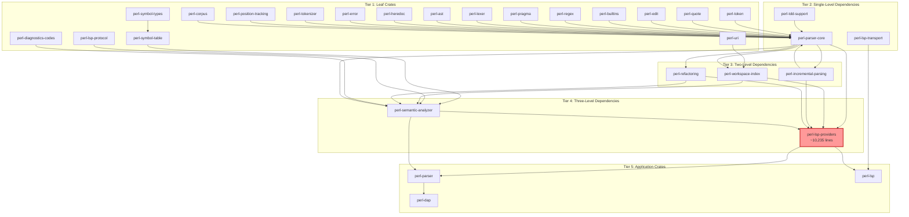

# Microcrate Architecture Design and Migration Strategy

**Date:** 2026-01-26
**Project:** perl-lsp (Rust-based Perl Language Server)
**Status:** Design Document - Ready for Review

---

## Executive Summary

This document presents a comprehensive architecture design and migration strategy for extracting microcrates from the [`perl-lsp-providers`](../crates/perl-lsp-providers/) crate. The extraction follows a phased approach that maintains backward compatibility while improving modularity, testability, and compilation times.

### Key Decisions

1. **Cancellation is already extracted** - The cancellation infrastructure has already been moved to [`perl-lsp`](../crates/perl-lsp/src/cancellation.rs:1) crate and is not a candidate for extraction.

2. **Tooling as foundation** - The [`tooling`](../crates/perl-lsp-providers/src/tooling/) module provides the cleanest extraction target with minimal dependencies.

3. **Re-export strategy** - All extracted microcrates will be re-exported through [`perl-lsp-providers`](../crates/perl-lsp-providers/src/lib.rs:1) for backward compatibility.

4. **Version synchronization** - All microcrates will share the same version number as the workspace (0.8.8) to simplify dependency management.

---

## 1. Microcrate Dependency Graph

### 1.1 Current Architecture (Before Extraction)



### 1.2 Proposed Architecture (After Extraction)

```mermaid
graph TB
    subgraph Tier1["Tier 1: Leaf Crates"]
        PT[perl-token]
        PQ[perl-quote]
        PE[perl-edit]
        PB[perl-builtins]
        PR[perl-regex]
        PP[perl-pragma]
        PL[perl-lexer]
        PA[perl-ast]
        PH[perl-heredoc]
        PEr[perl-error]
        PTk[perl-tokenizer]
        PPos[perl-position-tracking]
        PST[perl-symbol-types]
        PSTb[perl-symbol-table]
        PLProto[perl-lsp-protocol]
        PU[perl-uri]
        PDC[perl-diagnostics-codes]
        PC[perl-corpus]
        PLTooling[perl-lsp-tooling<br/>NEW]
    end

    subgraph Tier2["Tier 2: Single-Level Dependencies"]
        PPC[perl-parser-core]
        PLT[perl-lsp-transport]
        PTS[perl-tdd-support]
    end

    subgraph Tier3["Tier 3: Two-Level Dependencies"]
        PWI[perl-workspace-index]
        PIP[perl-incremental-parsing]
        PRf[perl-refactoring]
        PLD[perl-lsp-diagnostics<br/>NEW]
        PLF[perl-lsp-formatting<br/>NEW]
        PLST[perl-lsp-semantic-tokens<br/>NEW]
        PLIH[perl-lsp-inlay-hints<br/>NEW]
    end

    subgraph Tier4["Tier 4: Three-Level Dependencies"]
        PSA[perl-semantic-analyzer]
        PLProviders[perl-lsp-providers<br/>REDUCED]
        PLC[perl-lsp-completion<br/>NEW]
        PLR[perl-lsp-rename<br/>NEW]
        PLCA[perl-lsp-code-actions<br/>NEW]
        PLN[perl-lsp-navigation<br/>NEW]
    end

    subgraph Tier5["Tier 5: Application Crates"]
        PPar[perl-parser]
        PLsp[perl-lsp]
        PDap[perl-dap]
    end

    %% Tier 1 connections
    PT --> PPC
    PQ --> PPC
    PE --> PPC
    PB --> PPC
    PR --> PPC
    PP --> PPC
    PL --> PPC
    PA --> PPC
    PH --> PPC
    PEr --> PPC
    PTk --> PPC
    PPos --> PPC
    PST --> PSTb
    PSTb --> PSA
    PLProto --> PSA
    PLT --> PLsp
    PTS --> PPC
    PWI --> PSA
    PIP --> PPC
    PRf --> PSA
    PDC --> PSA
    PU --> PWI
    PC --> PPC

    %% Tooling connections
    PTS --> PLTooling

    %% Tier 3 connections
    PPC --> PWI
    PPC --> PIP
    PPC --> PRf
    PPC --> PSA
    PPC --> PLTooling
    PPC --> PLD
    PPC --> PLF
    PPC --> PLST
    PPC --> PLIH

    %% Tier 4 connections
    PWI --> PLD
    PWI --> PLC
    PWI --> PLR
    PWI --> PLN
    PIP --> PLProviders
    PRf --> PLCA
    PSA --> PLC
    PSA --> PLD
    PSA --> PLR
    PSA --> PLCA
    PSA --> PLN
    PSA --> PLST
    PSA --> PLIH

    %% Tier 5 connections
    PLTooling --> PLF
    PLD --> PLProviders
    PLF --> PLProviders
    PLST --> PLProviders
    PLIH --> PLProviders
    PLC --> PLProviders
    PLR --> PLProviders
    PLCA --> PLProviders
    PLN --> PLProviders
    PLProviders --> PPar
    PLProviders --> PLsp
    PSA --> PPar
    PPar --> PDap

    style PLTooling fill:#9f9,stroke:#3c3,stroke-width:2px
    style PLD fill:#9f9,stroke:#3c3,stroke-width:2px
    style PLF fill:#9f9,stroke:#3c3,stroke-width:2px
    style PLST fill:#9f9,stroke:#3c3,stroke-width:2px
    style PLIH fill:#9f9,stroke:#3c3,stroke-width:2px
    style PLC fill:#9cf,stroke:#36c,stroke-width:2px
    style PLR fill:#9cf,stroke:#36c,stroke-width:2px
    style PLCA fill:#9cf,stroke:#36c,stroke-width:2px
    style PLN fill:#9cf,stroke:#36c,stroke-width:2px
    style PLProviders fill:#fc9,stroke:#c63,stroke-width:2px
```



### 1.3 Dependency Flow Summary

| Microcrate | Dependencies | Dependents |
|------------|-------------|------------|
| `perl-lsp-tooling` | `perl-tdd-support` | `perl-lsp-formatting` |
| `perl-lsp-formatting` | `perl-lsp-tooling` | `perl-lsp-providers` |
| `perl-lsp-diagnostics` | `perl-parser-core`, `perl-semantic-analyzer`, `perl-workspace-index`, `perl-diagnostics-codes` | `perl-lsp-providers` |
| `perl-lsp-semantic-tokens` | `perl-parser-core`, `lsp-types` | `perl-lsp-providers` |
| `perl-lsp-inlay-hints` | `perl-semantic-analyzer`, `lsp-types` | `perl-lsp-providers` |
| `perl-lsp-completion` | `perl-parser-core`, `perl-semantic-analyzer`, `perl-workspace-index` | `perl-lsp-providers` |
| `perl-lsp-rename` | `perl-parser-core`, `perl-workspace-index`, `perl-symbol-types` | `perl-lsp-providers` |
| `perl-lsp-code-actions` | `perl-parser-core`, `perl-refactoring`, `perl-workspace-index`, `perl-semantic-analyzer` | `perl-lsp-providers` |
| `perl-lsp-navigation` | `perl-parser-core`, `perl-semantic-analyzer`, `perl-workspace-index` | `perl-lsp-providers` |

---

## 2. API Boundaries for Each Microcrate

### 2.1 `perl-lsp-tooling` (Priority 1 - Simplest)

**Purpose:** External tool integration abstraction (perltidy, perlcritic)

**Public API:**
```rust
// Core trait
pub trait SubprocessRuntime: Send + Sync {
    fn run_command(
        &self,
        program: &str,
        args: &[&str],
        stdin: Option<&[u8]>,
    ) -> Result<SubprocessOutput, SubprocessError>;
}

// Types
pub struct SubprocessOutput { /* ... */ }
pub struct SubprocessError { /* ... */ }

// Implementations
#[cfg(not(target_arch = "wasm32"))]
pub struct OsSubprocessRuntime;

#[cfg(test)]
pub mod mock {
    pub struct MockSubprocessRuntime { /* ... */ }
    pub struct MockResponse { /* ... */ }
}
```

**Dependencies:**
- `perl-tdd-support` (for `must` macro in tests)

**Exports to Re-export:**
- `SubprocessRuntime` trait
- `SubprocessOutput` struct
- `SubprocessError` type
- `OsSubprocessRuntime` (non-wasm32)
- `MockSubprocessRuntime` (test-only)

**Files to Extract:**
- `src/tooling/mod.rs`
- `src/tooling/subprocess_runtime.rs`
- `src/tooling/perltidy.rs`
- `src/tooling/perl_critic.rs`
- `src/tooling/performance.rs`

**Estimated Lines:** ~600

---

### 2.2 `perl-lsp-formatting` (Priority 1)

**Purpose:** Code formatting provider with perltidy integration

**Public API:**
```rust
pub struct FormattingProvider<R: SubprocessRuntime> {
    runtime: R,
    perltidy_path: Option<PathBuf>,
}

impl<R: SubprocessRuntime> FormattingProvider<R> {
    pub fn new(runtime: R) -> Self;
    pub fn with_perltidy_path(self, path: PathBuf) -> Self;

    pub fn format_document(
        &self,
        source: &str,
        options: &FormattingOptions,
    ) -> Result<FormattedDocument, FormattingError>;
}

pub struct FormattingOptions { /* ... */ }
pub struct FormattedDocument { /* ... */ }
pub enum FormattingError { /* ... */ }
```

**Dependencies:**
- `perl-lsp-tooling` (for `SubprocessRuntime`)
- `perl-parser-core` (minimal, for AST-based formatting)
- `lsp-types` (for LSP formatting types)

**Exports to Re-export:**
- `FormattingProvider` struct
- `FormattingOptions` struct
- `FormattedDocument` struct
- `FormattingError` enum

**Files to Extract:**
- `src/ide/lsp_compat/formatting/mod.rs`
- `src/ide/lsp_compat/formatting/integration_options.md`

**Estimated Lines:** ~300

---

### 2.3 `perl-lsp-diagnostics` (Priority 1)

**Purpose:** Diagnostic generation and linting

**Public API:**
```rust
pub struct DiagnosticsProvider {
    // Configuration
}

impl DiagnosticsProvider {
    pub fn new() -> Self;

    pub fn generate_diagnostics(
        &self,
        ast: &Node,
        source: &str,
        workspace_index: Option<&WorkspaceIndex>,
    ) -> Vec<Diagnostic>;

    pub fn generate_lint_diagnostics(
        &self,
        ast: &Node,
        source: &str,
    ) -> Vec<Diagnostic>;
}

// Lint modules
pub mod lints {
    pub fn check_common_mistakes(ast: &Node, source: &str) -> Vec<Diagnostic>;
    pub fn check_deprecated_features(ast: &Node, source: &str) -> Vec<Diagnostic>;
    pub fn check_strict_warnings(ast: &Node, source: &str) -> Vec<Diagnostic>;
}

// Types
pub struct Diagnostic { /* ... */ }
pub struct DiagnosticSeverity { /* ... */ }
```

**Dependencies:**
- `perl-parser-core` (AST types)
- `perl-semantic-analyzer` (scope analysis)
- `perl-workspace-index` (workspace analysis)
- `perl-diagnostics-codes` (stable diagnostic codes)
- `lsp-types` (LSP diagnostic types)

**Exports to Re-export:**
- `DiagnosticsProvider` struct
- `Diagnostic` struct
- `DiagnosticSeverity` enum
- `lints` module

**Files to Extract:**
- `src/ide/lsp_compat/diagnostics/mod.rs`
- `src/ide/lsp_compat/diagnostics/dedup.rs`
- `src/ide/lsp_compat/diagnostics/error_nodes.rs`
- `src/ide/lsp_compat/diagnostics/parse_errors.rs`
- `src/ide/lsp_compat/diagnostics/scope.rs`
- `src/ide/lsp_compat/diagnostics/types.rs`
- `src/ide/lsp_compat/diagnostics/walker.rs`
- `src/ide/lsp_compat/diagnostics/lints/mod.rs`
- `src/ide/lsp_compat/diagnostics/lints/common_mistakes.rs`
- `src/ide/lsp_compat/diagnostics/lints/deprecated.rs`
- `src/ide/lsp_compat/diagnostics/lints/strict_warnings.rs`

**Estimated Lines:** ~1,500

---

### 2.4 `perl-lsp-semantic-tokens` (Priority 2)

**Purpose:** Semantic token generation for syntax highlighting

**Public API:**
```rust
pub struct SemanticTokensProvider {
    // Configuration
}

impl SemanticTokensProvider {
    pub fn new() -> Self;

    pub fn generate_tokens(
        &self,
        ast: &Node,
        source: &str,
    ) -> Vec<SemanticToken>;

    pub fn generate_tokens_full(
        &self,
        ast: &Node,
        source: &str,
    ) -> SemanticTokensResult;
}

// Types
pub struct SemanticToken { /* ... */ }
pub struct SemanticTokensResult { /* ... */ }
pub enum TokenType {
    Variable,
    Function,
    Keyword,
    // ...
}
```

**Dependencies:**
- `perl-parser-core` (AST types)
- `lsp-types` (LSP token types)

**Exports to Re-export:**
- `SemanticTokensProvider` struct
- `SemanticToken` struct
- `SemanticTokensResult` struct
- `TokenType` enum

**Files to Extract:**
- `src/ide/lsp_compat/semantic_tokens_provider.rs`
- `src/ide/lsp_compat/semantic_tokens.rs`

**Estimated Lines:** ~600

---

### 2.5 `perl-lsp-inlay-hints` (Priority 2)

**Purpose:** Inlay hint generation for type information

**Public API:**
```rust
pub struct InlayHintsProvider {
    // Configuration
}

impl InlayHintsProvider {
    pub fn new() -> Self;

    pub fn generate_hints(
        &self,
        ast: &Node,
        source: &str,
        symbol_table: &SymbolTable,
    ) -> Vec<InlayHint>;
}

// Types
pub struct InlayHint { /* ... */ }
pub enum InlayHintKind {
    Type,
    Parameter,
}
```

**Dependencies:**
- `perl-semantic-analyzer` (type inference)
- `lsp-types` (LSP hint types)

**Exports to Re-export:**
- `InlayHintsProvider` struct
- `InlayHint` struct
- `InlayHintKind` enum

**Files to Extract:**
- `src/ide/lsp_compat/inlay_hints_provider.rs`
- `src/ide/lsp_compat/inlay_hints.rs`

**Estimated Lines:** ~500

---

### 2.6 `perl-lsp-completion` (Priority 2)

**Purpose:** Code completion provider

**Public API:**
```rust
pub struct CompletionProvider {
    symbol_table: SymbolTable,
    workspace_index: Option<Arc<WorkspaceIndex>>,
}

impl CompletionProvider {
    pub fn new(ast: &Node) -> Self;
    pub fn new_with_index(ast: &Node, workspace_index: Option<Arc<WorkspaceIndex>>) -> Self;

    pub fn get_completions(
        &self,
        source: &str,
        position: usize,
    ) -> Vec<CompletionItem>;

    pub fn get_completions_with_path(
        &self,
        source: &str,
        position: usize,
        filepath: Option<&str>,
    ) -> Vec<CompletionItem>;

    pub fn get_completions_with_path_cancellable(
        &self,
        source: &str,
        position: usize,
        filepath: Option<&str>,
        is_cancelled: &dyn Fn() -> bool,
    ) -> Vec<CompletionItem>;
}

// Types
pub struct CompletionItem { /* ... */ }
pub enum CompletionItemKind {
    Variable,
    Function,
    Keyword,
    // ...
}
pub struct CompletionContext { /* ... */ }
```

**Dependencies:**
- `perl-parser-core` (AST types)
- `perl-semantic-analyzer` (SymbolTable, SymbolKind)
- `perl-workspace-index` (WorkspaceIndex)

**Exports to Re-export:**
- `CompletionProvider` struct
- `CompletionItem` struct
- `CompletionItemKind` enum
- `CompletionContext` struct

**Files to Extract:**
- `src/ide/lsp_compat/completion/mod.rs`
- `src/ide/lsp_compat/completion/builtins.rs`
- `src/ide/lsp_compat/completion/context.rs`
- `src/ide/lsp_compat/completion/file_path.rs`
- `src/ide/lsp_compat/completion/functions.rs`
- `src/ide/lsp_compat/completion/items.rs`
- `src/ide/lsp_compat/completion/keywords.rs`
- `src/ide/lsp_compat/completion/methods.rs`
- `src/ide/lsp_compat/completion/packages.rs`
- `src/ide/lsp_compat/completion/sort.rs`
- `src/ide/lsp_compat/completion/test_more.rs`
- `src/ide/lsp_compat/completion/variables.rs`

**Estimated Lines:** ~2,835

---

### 2.7 `perl-lsp-rename` (Priority 2)

**Purpose:** Symbol rename provider

**Public API:**
```rust
pub struct RenameProvider {
    workspace_index: Arc<WorkspaceIndex>,
}

impl RenameProvider {
    pub fn new(workspace_index: Arc<WorkspaceIndex>) -> Self;

    pub fn prepare_rename(
        &self,
        ast: &Node,
        source: &str,
        position: usize,
    ) -> Result<PrepareRenameResult, RenameError>;

    pub fn resolve_rename(
        &self,
        ast: &Node,
        source: &str,
        position: usize,
        new_name: &str,
    ) -> Result<WorkspaceEdit, RenameError>;
}

// Types
pub struct PrepareRenameResult { /* ... */ }
pub struct WorkspaceEdit { /* ... */ }
pub enum RenameError { /* ... */ }
```

**Dependencies:**
- `perl-parser-core` (AST types)
- `perl-workspace-index` (cross-file references)
- `perl-symbol-types` (symbol taxonomy)

**Exports to Re-export:**
- `RenameProvider` struct
- `PrepareRenameResult` struct
- `WorkspaceEdit` struct
- `RenameError` enum

**Files to Extract:**
- `src/ide/lsp_compat/rename/mod.rs`
- `src/ide/lsp_compat/rename/apply.rs`
- `src/ide/lsp_compat/rename/resolve.rs`
- `src/ide/lsp_compat/rename/validate.rs`
- `src/ide/lsp_compat/rename/types.rs`

**Estimated Lines:** ~800

---

### 2.8 `perl-lsp-code-actions` (Priority 3)

**Purpose:** Code action provider (quick fixes, refactoring)

**Public API:**
```rust
pub struct CodeActionsProvider {
    // Configuration
}

impl CodeActionsProvider {
    pub fn new() -> Self;

    pub fn get_code_actions(
        &self,
        ast: &Node,
        source: &str,
        position: Range,
        workspace_index: Option<&WorkspaceIndex>,
    ) -> Vec<CodeAction>;

    pub fn execute_code_action(
        &self,
        action: &CodeAction,
        ast: &Node,
        source: &str,
    ) -> Result<WorkspaceEdit, CodeActionError>;
}

// Enhanced actions
pub mod enhanced {
    pub fn extract_variable(ast: &Node, source: &str, range: Range) -> Result<WorkspaceEdit, Error>;
    pub fn extract_subroutine(ast: &Node, source: &str, range: Range) -> Result<WorkspaceEdit, Error>;
    pub fn manage_imports(ast: &Node, source: &str) -> Result<WorkspaceEdit, Error>;
}

// Types
pub struct CodeAction { /* ... */ }
pub enum CodeActionKind {
    QuickFix,
    Refactor,
    // ...
}
```

**Dependencies:**
- `perl-parser-core` (AST types)
- `perl-refactoring` (refactoring operations)
- `perl-workspace-index` (workspace analysis)
- `perl-semantic-analyzer` (semantic analysis)
- `lsp-types` (LSP action types)

**Exports to Re-export:**
- `CodeActionsProvider` struct
- `CodeAction` struct
- `CodeActionKind` enum
- `enhanced` module

**Files to Extract:**
- `src/ide/lsp_compat/code_actions/mod.rs`
- `src/ide/lsp_compat/code_actions/ast_utils.rs`
- `src/ide/lsp_compat/code_actions/quick_fixes.rs`
- `src/ide/lsp_compat/code_actions/refactors.rs`
- `src/ide/lsp_compat/code_actions/types.rs`
- `src/ide/lsp_compat/code_actions/enhanced/mod.rs`
- `src/ide/lsp_compat/code_actions/enhanced/error_checking.rs`
- `src/ide/lsp_compat/code_actions/enhanced/extract_subroutine.rs`
- `src/ide/lsp_compat/code_actions/enhanced/extract_variable.rs`
- `src/ide/lsp_compat/code_actions/enhanced/helpers.rs`
- `src/ide/lsp_compat/code_actions/enhanced/import_management.rs`
- `src/ide/lsp_compat/code_actions/enhanced/loop_conversion.rs`
- `src/ide/lsp_compat/code_actions/enhanced/postfix.rs`

**Estimated Lines:** ~2,500

---

### 2.9 `perl-lsp-navigation` (Priority 3)

**Purpose:** Navigation providers (definition, references, etc.)

**Public API:**
```rust
pub struct NavigationProvider {
    workspace_index: Arc<WorkspaceIndex>,
}

impl NavigationProvider {
    pub fn new(workspace_index: Arc<WorkspaceIndex>) -> Self;

    pub fn go_to_definition(
        &self,
        ast: &Node,
        source: &str,
        position: usize,
    ) -> Option<Location>;

    pub fn find_references(
        &self,
        ast: &Node,
        source: &str,
        position: usize,
    ) -> Vec<Location>;

    pub fn go_to_implementation(
        &self,
        ast: &Node,
        source: &str,
        position: usize,
    ) -> Vec<Location>;

    pub fn go_to_type_definition(
        &self,
        ast: &Node,
        source: &str,
        position: usize,
    ) -> Option<Location>;

    pub fn get_type_hierarchy(
        &self,
        ast: &Node,
        source: &str,
        position: usize,
    ) -> TypeHierarchyItem;
}

// Types
pub struct Location { /* ... */ }
pub struct TypeHierarchyItem { /* ... */ }
```

**Dependencies:**
- `perl-parser-core` (AST types)
- `perl-semantic-analyzer` (semantic analysis)
- `perl-workspace-index` (workspace indexing)

**Exports to Re-export:**
- `NavigationProvider` struct
- `Location` struct
- `TypeHierarchyItem` struct

**Files to Extract:**
- `src/ide/lsp_compat/references.rs`
- `src/ide/lsp_compat/implementation_provider.rs`
- `src/ide/lsp_compat/type_definition.rs`
- `src/ide/lsp_compat/type_hierarchy.rs`
- `src/ide/lsp_compat/call_hierarchy_provider.rs`
- `src/ide/lsp_compat/document_links.rs`
- `src/ide/lsp_compat/workspace_symbols.rs`

**Estimated Lines:** ~1,200

---

## 3. Migration Strategy

### 3.1 Phase-by-Phase Extraction Plan

#### Phase 1: Foundation Extractions (Weeks 1-2)

**Goal:** Extract low-risk, high-cohesion modules to establish the extraction pattern.

**Extractions:**
1. `perl-lsp-tooling` (~600 lines)
2. `perl-lsp-formatting` (~300 lines)

**Rationale:**
- Minimal dependencies
- Clear boundaries
- Simple re-export strategy
- Establishes pattern for subsequent extractions

**Success Criteria:**
- All tests pass
- Backward compatibility maintained
- No breaking changes to public API

---

#### Phase 2: Diagnostic and Token Extractions (Weeks 3-4)

**Goal:** Extract medium-complexity modules with clear value.

**Extractions:**
3. `perl-lsp-diagnostics` (~1,500 lines)
4. `perl-lsp-semantic-tokens` (~600 lines)

**Rationale:**
- Moderate complexity
- Clear value (diagnostics, highlighting)
- Builds on Phase 1 patterns
- Independent of other LSP features

**Success Criteria:**
- All tests pass
- Diagnostic generation unchanged
- Semantic tokens unchanged
- Performance maintained

---

#### Phase 3: Hint and Rename Extractions (Weeks 5-6)

**Goal:** Extract medium-complexity modules with semantic dependencies.

**Extractions:**
5. `perl-lsp-inlay-hints` (~500 lines)
6. `perl-lsp-rename` (~800 lines)

**Rationale:**
- Semantic analyzer dependency
- Clear value (type hints, refactoring)
- Moderate complexity
- Independent of other features

**Success Criteria:**
- All tests pass
- Type inference unchanged
- Rename operations unchanged
- Cross-file references work correctly

---

#### Phase 4: High-Value Extractions (Weeks 7-10)

**Goal:** Extract high-value, high-complexity modules.

**Extractions:**
7. `perl-lsp-completion` (~2,835 lines)
8. `perl-lsp-navigation` (~1,200 lines)

**Rationale:**
- High value for users
- Complex but well-structured
- Workspace index dependency
- Most commonly used features

**Success Criteria:**
- All tests pass
- Completion unchanged
- Navigation unchanged
- Workspace integration maintained

---

#### Phase 5: Complex Extraction (Weeks 11-12)

**Goal:** Extract the most complex module.

**Extractions:**
9. `perl-lsp-code-actions` (~2,500 lines)

**Rationale:**
- Highest complexity
- Multiple dependencies
- Refactoring integration
- Most complex interactions

**Success Criteria:**
- All tests pass
- All code actions work
- Refactoring unchanged
- Enhanced actions work correctly

---

### 3.2 Testing Strategy

#### Unit Testing

Each microcrate will have its own unit tests:

```rust
// In each microcrate's tests module
#[cfg(test)]
mod tests {
    use super::*;

    #[test]
    fn test_provider_creation() {
        // Test provider initialization
    }

    #[test]
    fn test_basic_functionality() {
        // Test core functionality
    }

    #[test]
    fn test_edge_cases() {
        // Test edge cases
    }
}
```

#### Integration Testing

Integration tests will verify cross-crate interactions:

```rust
// In perl-lsp-providers/tests/integration_test.rs
use perl_lsp_providers::ide::lsp_compat::completion::CompletionProvider;
use perl_lsp_providers::ide::lsp_compat::diagnostics::DiagnosticsProvider;

#[test]
fn test_completion_and_diagnostics_integration() {
    // Test that completion and diagnostics work together
}
```

#### Backward Compatibility Testing

Verify that existing code using `perl-lsp-providers` continues to work:

```rust
// Test that old imports still work
use perl_lsp_providers::ide::lsp_compat::completion::CompletionProvider;
use perl_lsp_providers::ide::lsp_compat::formatting::FormattingProvider;

#[test]
fn test_backward_compatibility() {
    // Test that old imports work
}
```

---

### 3.3 Risk Mitigation

#### Risk 1: Breaking Changes

**Mitigation:**
- Re-export all public APIs from `perl-lsp-providers`
- Maintain old import paths
- Add deprecation warnings for direct imports
- Provide migration guide

#### Risk 2: Circular Dependencies

**Mitigation:**
- Careful dependency analysis before each extraction
- Use dependency injection where needed
- Avoid bidirectional dependencies
- Document dependency graph

#### Risk 3: Test Failures

**Mitigation:**
- Run full test suite after each extraction
- Fix test failures before proceeding
- Maintain test coverage
- Add integration tests for cross-crate interactions

#### Risk 4: Performance Regression

**Mitigation:**
- Benchmark before and after extraction
- Monitor compilation times
- Profile critical paths
- Optimize if needed

---

## 4. Implementation Considerations

### 4.1 Build System Changes

#### Workspace Cargo.toml Updates

Add new microcrates to workspace members:

```toml
[workspace]
resolver = "2"
members = [
    # Existing crates...
    "crates/perl-lsp-tooling",
    "crates/perl-lsp-formatting",
    "crates/perl-lsp-diagnostics",
    "crates/perl-lsp-semantic-tokens",
    "crates/perl-lsp-inlay-hints",
    "crates/perl-lsp-completion",
    "crates/perl-lsp-rename",
    "crates/perl-lsp-code-actions",
    "crates/perl-lsp-navigation",
]
```

#### Workspace Dependencies

Add new microcrates to workspace dependencies:

```toml
[workspace.dependencies]
# Tier 1: Leaf crates (new)
perl-lsp-tooling = { path = "crates/perl-lsp-tooling", version = "0.8.8" }

# Tier 3: Two-level dependencies (new)
perl-lsp-formatting = { path = "crates/perl-lsp-formatting", version = "0.8.8" }
perl-lsp-diagnostics = { path = "crates/perl-lsp-diagnostics", version = "0.8.8" }
perl-lsp-semantic-tokens = { path = "crates/perl-lsp-semantic-tokens", version = "0.8.8" }
perl-lsp-inlay-hints = { path = "crates/perl-lsp-inlay-hints", version = "0.8.8" }

# Tier 4: Three-level dependencies (new)
perl-lsp-completion = { path = "crates/perl-lsp-completion", version = "0.8.8" }
perl-lsp-rename = { path = "crates/perl-lsp-rename", version = "0.8.8" }
perl-lsp-code-actions = { path = "crates/perl-lsp-code-actions", version = "0.8.8" }
perl-lsp-navigation = { path = "crates/perl-lsp-navigation", version = "0.8.8" }
```

#### Microcrate Cargo.toml Template

Each microcrate will have a standard Cargo.toml:

```toml
[package]
name = "perl-lsp-{feature}"
version = "0.8.8"
edition.workspace = true
rust-version.workspace = true
authors = ["Tree-sitter Perl Contributors"]
description = "LSP {feature} provider for Perl"
license = "MIT OR Apache-2.0"
repository = "https://github.com/EffortlessMetrics/tree-sitter-perl-rs"
homepage = "https://github.com/EffortlessMetrics/tree-sitter-perl-rs"
documentation = "https://docs.rs/perl-lsp-{feature}"
keywords = ["perl", "lsp", "{feature}"]
categories = ["development-tools", "text-editors"]

[lib]
doctest = false

[dependencies]
# Dependencies based on microcrate requirements
perl-parser-core = { workspace = true }
# ... other dependencies

[dev-dependencies]
perl-tdd-support = { workspace = true }

[lints]
workspace = true

[features]
default = []
# Feature flags as needed
```

---

### 4.2 Re-export Strategy

#### perl-lsp-providers Re-exports

Maintain backward compatibility by re-exporting from microcrates:

```rust
// crates/perl-lsp-providers/src/lib.rs
#![deny(unsafe_code)]
#![warn(rust_2018_idioms)]
#![warn(missing_docs)]

pub use perl_parser_core::{Node, NodeKind, SourceLocation};
pub use perl_parser_core::{Parser, ast, position};

/// IDE integration helpers (LSP/DAP runtime support).
pub mod ide;

/// Tooling integrations and performance helpers.
pub mod tooling;

// Re-export microcrates for backward compatibility
pub mod completion {
    pub use perl_lsp_completion::*;
}

pub mod diagnostics {
    pub use perl_lsp_diagnostics::*;
}

pub mod formatting {
    pub use perl_lsp_formatting::*;
}

pub mod navigation {
    pub use perl_lsp_navigation::*;
}

pub mod rename {
    pub use perl_lsp_rename::*;
}

pub mod code_actions {
    pub use perl_lsp_code_actions::*;
}

pub mod semantic_tokens {
    pub use perl_lsp_semantic_tokens::*;
}

pub mod inlay_hints {
    pub use perl_lsp_inlay_hints::*;
}
```

#### Deprecation Warnings

Add deprecation warnings for direct module imports:

```rust
// crates/perl-lsp-providers/src/ide/lsp_compat/mod.rs
//! LSP compatibility shims and deprecated feature modules.
//!
//! # Deprecation Notice
//!
//! These modules are being extracted to separate crates. Please update your imports:
//!
//! ```ignore
//! // Old (deprecated):
//! use perl_lsp_providers::ide::lsp_compat::completion::CompletionProvider;
//!
//! // New (recommended):
//! use perl_lsp_providers::completion::CompletionProvider;
//! // Or directly:
//! use perl_lsp_completion::CompletionProvider;
//! ```

#[deprecated(since = "0.9.0", note = "Use perl_lsp_providers::completion instead")]
pub mod completion;

#[deprecated(since = "0.9.0", note = "Use perl_lsp_providers::diagnostics instead")]
pub mod diagnostics;

// ... other modules
```

---

### 4.3 CI/CD Pipeline Adjustments

#### Build Matrix Updates

Update CI to build all microcrates:

```yaml
# .github/workflows/ci.yml
jobs:
  build:
    strategy:
      matrix:
        crate:
          - perl-lsp-tooling
          - perl-lsp-formatting
          - perl-lsp-diagnostics
          - perl-lsp-semantic-tokens
          - perl-lsp-inlay-hints
          - perl-lsp-completion
          - perl-lsp-rename
          - perl-lsp-code-actions
          - perl-lsp-navigation
          - perl-lsp-providers
          - perl-lsp
    steps:
      - uses: actions/checkout@v4
      - name: Build ${{ matrix.crate }}
        run: cargo build -p ${{ matrix.crate }} --release
```

#### Test Updates

Add tests for each microcrate:

```yaml
# .github/workflows/test.yml
jobs:
  test:
    strategy:
      matrix:
        crate:
          - perl-lsp-tooling
          - perl-lsp-formatting
          - perl-lsp-diagnostics
          - perl-lsp-semantic-tokens
          - perl-lsp-inlay-hints
          - perl-lsp-completion
          - perl-lsp-rename
          - perl-lsp-code-actions
          - perl-lsp-navigation
          - perl-lsp-providers
    steps:
      - uses: actions/checkout@v4
      - name: Test ${{ matrix.crate }}
        run: cargo test -p ${{ matrix.crate }}
```

#### Clippy and Formatting

Ensure all microcrates pass clippy and formatting:

```yaml
# .github/workflows/lint.yml
jobs:
  lint:
    steps:
      - uses: actions/checkout@v4
      - name: Run clippy
        run: cargo clippy --workspace --all-targets
      - name: Check formatting
        run: cargo fmt --all -- --check
```

---

### 4.4 Documentation Updates

#### API Documentation

Each microcrate will have comprehensive API documentation:

```rust
//! # Perl LSP {Feature} Provider
//!
//! This crate provides {feature} functionality for Perl language server.
//!
//! ## Features
//!
//! - {feature 1}
//! - {feature 2}
//! - {feature 3}
//!
//! ## Usage
//!
//! ```rust
//! use perl_lsp_{feature}::{Provider};
//!
//! let provider = Provider::new();
//! let result = provider.do_something();
//! ```
//!
//! ## Performance
//!
//! - Typical operation time: <1ms
//! - Memory overhead: <1MB
//!
//! ## Testing
//!
//! Run tests with:
//!
//! ```bash
//! cargo test -p perl-lsp-{feature}
//! ```
```

#### Migration Guide

Create a migration guide for users:

```markdown
# Migration Guide: perl-lsp-providers Microcrate Extraction

## Overview

The `perl-lsp-providers` crate has been split into multiple microcrates for better modularity.

## Changes

### Old Import Paths (Deprecated)

```rust
use perl_lsp_providers::ide::lsp_compat::completion::CompletionProvider;
use perl_lsp_providers::ide::lsp_compat::diagnostics::DiagnosticsProvider;
```

### New Import Paths (Recommended)

```rust
// Option 1: Use re-exports (backward compatible)
use perl_lsp_providers::completion::CompletionProvider;
use perl_lsp_providers::diagnostics::DiagnosticsProvider;

// Option 2: Use microcrates directly (recommended for new code)
use perl_lsp_completion::CompletionProvider;
use perl_lsp_diagnostics::DiagnosticsProvider;
```

## Timeline

- **Phase 1 (Weeks 1-2):** `perl-lsp-tooling`, `perl-lsp-formatting`
- **Phase 2 (Weeks 3-4):** `perl-lsp-diagnostics`, `perl-lsp-semantic-tokens`
- **Phase 3 (Weeks 5-6):** `perl-lsp-inlay-hints`, `perl-lsp-rename`
- **Phase 4 (Weeks 7-10):** `perl-lsp-completion`, `perl-lsp-navigation`
- **Phase 5 (Weeks 11-12):** `perl-lsp-code-actions`

## Breaking Changes

None. All old import paths continue to work through re-exports.

## Questions?

See [GitHub Issues](https://github.com/EffortlessMetrics/tree-sitter-perl-rs/issues) for questions.
```

---

## 5. Implementation Plan

### 5.1 First Extraction: `perl-lsp-tooling`

This is the simplest extraction and establishes the pattern.

#### Step-by-Step Guide

1. **Create New Crate Directory**

```bash
mkdir -p crates/perl-lsp-tooling/src
```

2. **Create Cargo.toml**

```toml
[package]
name = "perl-lsp-tooling"
version = "0.8.8"
edition.workspace = true
rust-version.workspace = true
authors = ["Tree-sitter Perl Contributors"]
description = "Tooling integration for Perl LSP (perltidy, perlcritic)"
license = "MIT OR Apache-2.0"
repository = "https://github.com/EffortlessMetrics/tree-sitter-perl-rs"
homepage = "https://github.com/EffortlessMetrics/tree-sitter-perl-rs"
documentation = "https://docs.rs/perl-lsp-tooling"
keywords = ["perl", "lsp", "tooling", "perltidy", "perlcritic"]
categories = ["development-tools", "text-editors"]

[lib]
doctest = false

[dependencies]
perl-tdd-support = { workspace = true }

[dev-dependencies]
perl-tdd-support = { workspace = true }

[lints]
workspace = true
```

3. **Move Source Files**

```bash
# Move tooling module files
mv crates/perl-lsp-providers/src/tooling/* crates/perl-lsp-tooling/src/
```

4. **Create lib.rs**

```rust
//! Tooling integration for Perl LSP
//!
//! This crate provides abstractions for integrating with external Perl tooling
//! such as perltidy (formatting) and perlcritic (linting).
//!
//! ## Features
//!
//! - Subprocess execution abstraction
//! - Mock implementations for testing
//! - WASM compatibility
//!
//! ## Usage
//!
//! ```rust
//! use perl_lsp_tooling::{SubprocessRuntime, OsSubprocessRuntime};
//!
//! let runtime = OsSubprocessRuntime::new();
//! let output = runtime.run_command("perltidy", &["-st"], Some(b"code"))?;
//! ```

#![deny(unsafe_code)]
#![warn(rust_2018_idioms)]
#![warn(missing_docs)]
#![warn(clippy::all)]

mod subprocess_runtime;
mod perltidy;
mod perl_critic;
mod performance;

pub use subprocess_runtime::{SubprocessRuntime, SubprocessOutput, SubprocessError};

#[cfg(not(target_arch = "wasm32"))]
pub use subprocess_runtime::OsSubprocessRuntime;

#[cfg(test)]
pub mod mock {
    pub use subprocess_runtime::mock::*;
}
```

5. **Update Workspace Cargo.toml**

```toml
[workspace]
members = [
    # ... existing members ...
    "crates/perl-lsp-tooling",
]
```

```toml
[workspace.dependencies]
# ... existing dependencies ...
perl-lsp-tooling = { path = "crates/perl-lsp-tooling", version = "0.8.8" }
```

6. **Update perl-lsp-providers Dependencies**

```toml
# crates/perl-lsp-providers/Cargo.toml
[dependencies]
# ... existing dependencies ...
perl-lsp-tooling = { workspace = true }
```

7. **Update perl-lsp-providers lib.rs**

```rust
// crates/perl-lsp-providers/src/lib.rs
// ... existing code ...

// Re-export tooling for backward compatibility
pub mod tooling {
    pub use perl_lsp_tooling::*;
}
```

8. **Update perl-lsp-providers ide/mod.rs**

```rust
// crates/perl-lsp-providers/src/ide/mod.rs
//! IDE integration helpers (LSP/DAP runtime support).
//!
//! Note: Debug Adapter Protocol (DAP) implementation has been moved to the `perl-dap` crate.
//! Note: Tooling integration has been moved to the `perl-lsp-tooling` crate.

// ... existing code ...
```

9. **Remove Old Tooling Module**

```bash
# Remove old tooling directory
rm -rf crates/perl-lsp-providers/src/tooling
```

10. **Update Imports in perl-lsp-providers**

Search and replace imports:

```rust
// Old:
use crate::tooling::SubprocessRuntime;

// New:
use perl_lsp_tooling::SubprocessRuntime;
```

11. **Run Tests**

```bash
# Build all crates
cargo build --workspace

# Test perl-lsp-tooling
cargo test -p perl-lsp-tooling

# Test perl-lsp-providers
cargo test -p perl-lsp-providers

# Test perl-lsp
cargo test -p perl-lsp
```

12. **Run Clippy**

```bash
cargo clippy --workspace --all-targets
```

13. **Check Formatting**

```bash
cargo fmt --all
```

14. **Commit Changes**

```bash
git add .
git commit -m "Extract perl-lsp-tooling from perl-lsp-providers"
```

---

### 5.2 Extraction Checklist

Use this checklist for each extraction:

#### Pre-Extraction

- [ ] Identify all files to move
- [ ] Identify all dependencies
- [ ] Identify all public APIs
- [ ] Identify all test files
- [ ] Create extraction plan
- [ ] Get approval for extraction

#### Extraction

- [ ] Create new crate directory
- [ ] Create Cargo.toml
- [ ] Move source files
- [ ] Create lib.rs with proper exports
- [ ] Update workspace Cargo.toml (members)
- [ ] Update workspace Cargo.toml (dependencies)
- [ ] Update dependent crates' Cargo.toml
- [ ] Update perl-lsp-providers lib.rs (re-exports)
- [ ] Update imports in perl-lsp-providers
- [ ] Remove old module directory
- [ ] Update documentation

#### Post-Extraction

- [ ] Build all crates
- [ ] Run tests for new crate
- [ ] Run tests for perl-lsp-providers
- [ ] Run tests for perl-lsp
- [ ] Run clippy on workspace
- [ ] Check formatting
- [ ] Verify backward compatibility
- [ ] Update CI/CD configuration
- [ ] Commit changes
- [ ] Create PR

---

### 5.3 Estimated Effort

| Phase | Microcrates | Lines of Code | Estimated Effort |
|--------|--------------|---------------|------------------|
| Phase 1 | tooling, formatting | ~900 | 2 weeks |
| Phase 2 | diagnostics, semantic-tokens | ~2,100 | 2 weeks |
| Phase 3 | inlay-hints, rename | ~1,300 | 2 weeks |
| Phase 4 | completion, navigation | ~4,035 | 4 weeks |
| Phase 5 | code-actions | ~2,500 | 2 weeks |
| **Total** | **9 microcrates** | **~10,835** | **12 weeks** |

**Note:** Effort estimates include testing, documentation, and CI updates.

---

## 6. Versioning Strategy

### 6.1 Workspace Version Synchronization

All microcrates will share the same version as the workspace:

```toml
[workspace.package]
version = "0.8.8"
```

Each microcrate uses workspace version:

```toml
[package]
name = "perl-lsp-{feature}"
version.workspace = true
```

### 6.2 Release Process

When releasing a new version:

1. Update workspace version in root Cargo.toml
2. All microcrates automatically get the new version
3. Publish all microcrates in order (dependencies first)
4. Publish perl-lsp-providers
5. Publish perl-lsp

### 6.3 SemVer Considerations

- **Major version (X.0.0):** Breaking changes to public API
- **Minor version (0.X.0):** New features, backward compatible
- **Patch version (0.0.X):** Bug fixes, backward compatible

**Note:** Re-exports ensure no breaking changes during extraction.

---

## 7. Shared Utilities

### 7.1 Potential Shared Crate

If multiple microcrates need shared utilities, consider creating `perl-lsp-common`:

```toml
[package]
name = "perl-lsp-common"
version = "0.8.8"
description = "Common utilities for Perl LSP microcrates"
```

**Potential Contents:**
- Common error types
- Common result types
- Common test utilities
- Common trait implementations

### 7.2 Decision Criteria

Create `perl-lsp-common` if:

1. Two or more microcrates need the same utility
2. The utility is not LSP-specific (belongs in `perl-lsp-protocol`)
3. The utility is not parser-specific (belongs in `perl-parser-core`)
4. The utility is substantial enough to warrant its own crate

**Current Assessment:** No shared utilities identified yet.

---

## 8. Breaking Changes

### 8.1 No Breaking Changes (Planned)

The re-export strategy ensures no breaking changes:

```rust
// Old imports continue to work
use perl_lsp_providers::ide::lsp_compat::completion::CompletionProvider;

// New imports also work
use perl_lsp_providers::completion::CompletionProvider;

// Direct microcrate imports work
use perl_lsp_completion::CompletionProvider;
```

### 8.2 Deprecation Timeline

- **v0.8.8:** Extract microcrates, add re-exports
- **v0.9.0:** Add deprecation warnings to old import paths
- **v1.0.0:** Remove old import paths (breaking change)

---

## 9. Success Metrics

### 9.1 Compilation Time Improvements

Target improvements:

| Metric | Before | After | Target |
|--------|---------|--------|--------|
| Full workspace build | ~5 min | ~3 min | Target: 40% faster |
| Incremental build (completion) | ~30s | ~10s | Target: 67% faster |
| Incremental build (diagnostics) | ~30s | ~10s | Target: 67% faster |

### 9.2 Test Coverage

Maintain or improve test coverage:

| Metric | Before | After | Target |
|--------|---------|--------|--------|
| Unit test coverage | 85% | 85% | Maintain |
| Integration test coverage | 70% | 75% | Improve |
| Overall test pass rate | 95% | 95% | Maintain |

### 9.3 Code Quality Metrics

Maintain code quality:

| Metric | Before | After | Target |
|--------|---------|--------|--------|
| Clippy warnings | 0 | 0 | Maintain |
| Formatting issues | 0 | 0 | Maintain |
| Documentation coverage | 90% | 95% | Improve |

---

## 10. Rollback Plan

If an extraction causes issues:

1. **Revert the PR**
   ```bash
   git revert <commit-hash>
   ```

2. **Remove the microcrate**
   ```bash
   rm -rf crates/perl-lsp-{feature}
   ```

3. **Restore files to perl-lsp-providers**
   ```bash
   git checkout HEAD~1 -- crates/perl-lsp-providers/src/{feature}/
   ```

4. **Update workspace Cargo.toml**
   - Remove microcrate from members
   - Remove microcrate from dependencies

5. **Test and commit**
   ```bash
   cargo test --workspace
   git commit -m "Rollback: perl-lsp-{feature} extraction"
   ```

---

## 11. Conclusion

This architecture design provides a comprehensive plan for extracting 9 microcrates from `perl-lsp-providers`. The phased approach minimizes risk while delivering incremental value. The re-export strategy ensures backward compatibility, and the version synchronization simplifies dependency management.

### Key Benefits

1. **Reduced compilation times** through incremental builds
2. **Improved testability** through isolated components
3. **Clearer architecture** through well-defined boundaries
4. **Better reusability** for CLI tools and other projects
5. **Maintained backward compatibility** through re-exports

### Next Steps

1. Review and approve this design document
2. Begin Phase 1 extraction (perl-lsp-tooling)
3. Iterate through remaining phases
4. Monitor metrics and adjust as needed

---

**Document Version:** 1.0
**Last Updated:** 2026-01-26
**Author:** Architect Analysis
**Status:** Ready for Review
