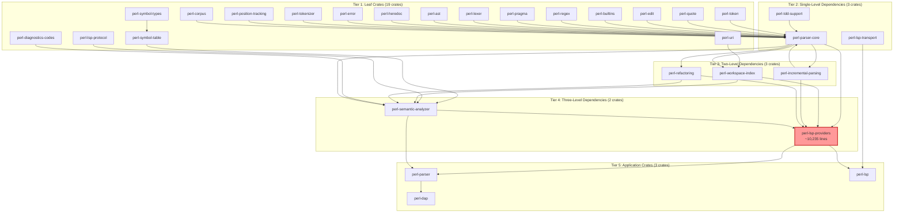
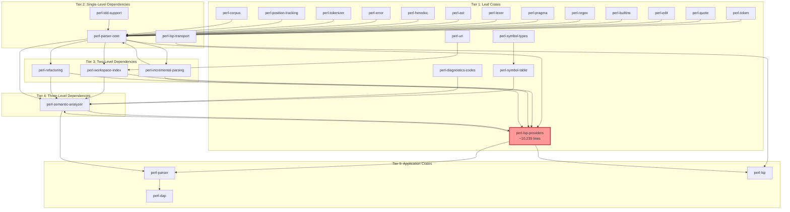

# Perl LSP Microcrate Modularization Proposal

**Date:** 2026-01-26
**Project:** perl-lsp (Rust-based Perl Language Server)
**Status:** Proposal - Ready for Approval
**Related Documents:**
- [`microcrate_extraction_analysis.md`](./microcrate_extraction_analysis.md) - Analysis of current crate structure
- [`microcrate_architecture_design.md`](./microcrate_architecture_design.md) - Detailed architecture design

---

## Executive Summary

### Problem Statement

The Perl LSP project has grown to 31 crates with a well-structured dependency hierarchy (current as of commit in workspace Cargo.toml). However, the [`perl-lsp-providers`](../crates/perl-lsp-providers/) crate has become a bottleneck containing approximately 10,235 lines of code across 100+ files. This monolithic structure creates several critical issues:

- **Long compilation times**: Changes to any LSP feature trigger recompilation of the entire providers crate
- **Difficult testing**: Feature-specific tests are mixed together, making isolation challenging
- **Unclear boundaries**: Inter-module dependencies are implicit and difficult to track
- **Limited reusability**: Individual LSP features cannot be used independently by CLI tools or other projects

### Proposed Solution

Extract 9 microcrates from [`perl-lsp-providers`](../crates/perl-lsp-providers/) following a phased approach over 12 weeks:

| Phase | Microcrates | Lines | Duration |
|-------|-------------|-------|----------|
| 1 | `perl-lsp-tooling`, `perl-lsp-formatting` | ~900 | 2 weeks |
| 2 | `perl-lsp-diagnostics`, `perl-lsp-semantic-tokens` | ~2,100 | 2 weeks |
| 3 | `perl-lsp-inlay-hints`, `perl-lsp-rename` | ~1,300 | 2 weeks |
| 4 | `perl-lsp-completion`, `perl-lsp-navigation` | ~4,035 | 4 weeks |
| 5 | `perl-lsp-code-actions` | ~2,500 | 2 weeks |

### Expected Benefits

**Performance Improvements (Targets):**
- **Target: 40% faster** full workspace builds (~5 min → ~3 min)
- **Target: 67% faster** incremental builds for feature changes (~30s → ~10s)

**Maintainability Improvements:**
- Clear module boundaries with well-defined APIs
- Easier onboarding for new contributors
- Smaller, focused codebases for each feature

**Testability Improvements:**
- Isolated unit tests for each microcrate
- Better test coverage through focused test suites
- Easier mocking of dependencies

**Reusability Improvements:**
- Individual LSP features can be used by CLI tools
- Other projects can import specific features without the full LSP server
- Foundation for plugin architecture

### Timeline

**Total Duration:** 12 weeks across 5 phases

```
Phase 1 (Weeks 1-2):   Foundation Extractions
Phase 2 (Weeks 3-4):   Diagnostic and Token Extractions
Phase 3 (Weeks 5-6):   Hint and Rename Extractions
Phase 4 (Weeks 7-10):  High-Value Extractions
Phase 5 (Weeks 11-12): Complex Extraction
```

### Key Metrics

| Metric | Before | After | Improvement |
|--------|---------|--------|-------------|
| Full workspace build | ~5 min | ~3 min | Target: 40% faster |
| Incremental build (feature) | ~30s | ~10s | Target: 67% faster |
| perl-lsp-providers size | ~10,235 lines | ~3,000 lines | 71% reduction |
| Number of crates | 31 | 40 | +9 microcrates |

### Backward Compatibility

**Zero breaking changes** through re-export strategy:
- All existing import paths continue to work
- Gradual deprecation with warnings in v0.9.0
- Old paths removed in v1.0.0

---

## Current State Analysis

### Existing Crate Structure

The Perl LSP workspace currently contains **26 crates** organized in a 5-tier dependency hierarchy:



### perl-lsp-providers: Primary Extraction Target

The [`perl-lsp-providers`](../crates/perl-lsp-providers/) crate is the most complex in the project:

| Metric | Value |
|--------|-------|
| Lines of Code | ~10,235 |
| Source Files | ~100+ |
| Module Trees | 2 (ide/, tooling/) |
| Dependencies | 12+ internal crates |
| Complexity | Very High |

#### Module Structure

```
crates/perl-lsp-providers/src/
├── ide/
│   ├── cancellation.rs
│   ├── diagnostics_catalog.rs
│   ├── execute_command.rs
│   ├── lsp_compat/
│   │   ├── code_actions/          (~2,500 lines)
│   │   │   ├── mod.rs
│   │   │   ├── ast_utils.rs
│   │   │   ├── quick_fixes.rs
│   │   │   ├── refactors.rs
│   │   │   └── enhanced/
│   │   ├── completion/            (~2,835 lines)
│   │   │   ├── mod.rs
│   │   │   ├── builtins.rs
│   │   │   ├── context.rs
│   │   │   ├── file_path.rs
│   │   │   ├── functions.rs
│   │   │   ├── items.rs
│   │   │   ├── keywords.rs
│   │   │   ├── methods.rs
│   │   │   ├── packages.rs
│   │   │   ├── sort.rs
│   │   │   ├── test_more.rs
│   │   │   └── variables.rs
│   │   ├── diagnostics/           (~1,500 lines)
│   │   │   ├── mod.rs
│   │   │   ├── dedup.rs
│   │   │   ├── error_nodes.rs
│   │   │   ├── parse_errors.rs
│   │   │   ├── scope.rs
│   │   │   ├── types.rs
│   │   │   ├── walker.rs
│   │   │   └── lints/
│   │   ├── rename/                (~800 lines)
│   │   │   ├── mod.rs
│   │   │   ├── apply.rs
│   │   │   ├── resolve.rs
│   │   │   └── validate.rs
│   │   ├── formatting/            (~300 lines)
│   │   ├── semantic_tokens*.rs    (~600 lines)
│   │   ├── inlay_hints*.rs        (~500 lines)
│   │   └── navigation*            (~1,200 lines)
│   └── mod.rs
└── tooling/                       (~600 lines)
    ├── mod.rs
    ├── performance.rs
    ├── perl_critic.rs
    ├── perltidy.rs
    └── subprocess_runtime.rs
```

### Key Pain Points

1. **Compilation Bottleneck**
   - Changes to completion trigger recompilation of all LSP features
   - Full workspace builds take ~5 minutes
   - Incremental builds for feature changes take ~30 seconds

2. **Testing Challenges**
   - Feature-specific tests are mixed together
   - Difficult to isolate failures
   - Mock dependencies are shared across features

3. **Unclear Boundaries**
   - Inter-module dependencies are implicit
   - Difficult to track what depends on what
   - Changes can have unexpected side effects

4. **Limited Reusability**
   - Cannot use individual LSP features in CLI tools
   - Other projects must import the entire providers crate
   - No foundation for plugin architecture

---

## Proposed Architecture

### Before vs After Architecture

#### Current Architecture (Before Extraction)



#### Proposed Architecture (After Extraction)

```mermaid
graph TB
    subgraph Tier1["Tier 1: Leaf Crates (19 crates)"]
        PT[perl-token]
        PQ[perl-quote]
        PE[perl-edit]
        PB[perl-builtins]
        PR[perl-regex]
        PP[perl-pragma]
        PL[perl-lexer]
        PA[perl-ast]
        PH[perl-heredoc]
        PEr[perl-error]
        PTk[perl-tokenizer]
        PPos[perl-position-tracking]
        PST[perl-symbol-types]
        PSTb[perl-symbol-table]
        PLProto[perl-lsp-protocol]
        PU[perl-uri]
        PDC[perl-diagnostics-codes]
        PC[perl-corpus]
        PLTooling[perl-lsp-tooling<br/>NEW]
    end

    subgraph Tier2["Tier 2: Single-Level Dependencies (3 crates)"]
        PPC[perl-parser-core]
        PLT[perl-lsp-transport]
        PTS[perl-tdd-support]
    end

    subgraph Tier3["Tier 3: Two-Level Dependencies (7 crates)"]
        PWI[perl-workspace-index]
        PIP[perl-incremental-parsing]
        PRf[perl-refactoring]
        PLD[perl-lsp-diagnostics<br/>NEW]
        PLF[perl-lsp-formatting<br/>NEW]
        PLST[perl-lsp-semantic-tokens<br/>NEW]
        PLIH[perl-lsp-inlay-hints<br/>NEW]
    end

    subgraph Tier4["Tier 4: Three-Level Dependencies (6 crates)"]
        PSA[perl-semantic-analyzer]
        PLProviders[perl-lsp-providers<br/>REDUCED]
        PLC[perl-lsp-completion<br/>NEW]
        PLR[perl-lsp-rename<br/>NEW]
        PLCA[perl-lsp-code-actions<br/>NEW]
        PLN[perl-lsp-navigation<br/>NEW]
    end

    subgraph Tier5["Tier 5: Application Crates (3 crates)"]
        PPar[perl-parser]
        PLsp[perl-lsp]
        PDap[perl-dap]
    end

    %% Tier 1 connections
    PT --> PPC
    PQ --> PPC
    PE --> PPC
    PB --> PPC
    PR --> PPC
    PP --> PPC
    PL --> PPC
    PA --> PPC
    PH --> PPC
    PEr --> PPC
    PTk --> PPC
    PPos --> PPC
    PST --> PSTb
    PSTb --> PSA
    PLProto --> PSA
    PLT --> PLsp
    PTS --> PPC
    PWI --> PSA
    PIP --> PPC
    PRf --> PSA
    PDC --> PSA
    PU --> PWI
    PC --> PPC

    %% Tooling connections
    PTS --> PLTooling

    %% Tier 3 connections
    PPC --> PWI
    PPC --> PIP
    PPC --> PRf
    PPC --> PSA
    PPC --> PLTooling
    PPC --> PLD
    PPC --> PLF
    PPC --> PLST
    PPC --> PLIH

    %% Tier 4 connections
    PWI --> PLD
    PWI --> PLC
    PWI --> PLR
    PWI --> PLN
    PIP --> PLProviders
    PRf --> PLCA
    PSA --> PLC
    PSA --> PLD
    PSA --> PLR
    PSA --> PLCA
    PSA --> PLN
    PSA --> PLST
    PSA --> PLIH

    %% Tier 5 connections
    PLTooling --> PLF
    PLD --> PLProviders
    PLF --> PLProviders
    PLST --> PLProviders
    PLIH --> PLProviders
    PLC --> PLProviders
    PLR --> PLProviders
    PLCA --> PLProviders
    PLN --> PLProviders
    PLProviders --> PPar
    PLProviders --> PLsp
    PSA --> PPar
    PPar --> PDap

    style PLTooling fill:#9f9,stroke:#3c3,stroke-width:2px
    style PLD fill:#9f9,stroke:#3c3,stroke-width:2px
    style PLF fill:#9f9,stroke:#3c3,stroke-width:2px
    style PLST fill:#9f9,stroke:#3c3,stroke-width:2px
    style PLIH fill:#9f9,stroke:#3c3,stroke-width:2px
    style PLC fill:#9cf,stroke:#36c,stroke-width:2px
    style PLR fill:#9cf,stroke:#36c,stroke-width:2px
    style PLCA fill:#9cf,stroke:#36c,stroke-width:2px
    style PLN fill:#9cf,stroke:#36c,stroke-width:2px
    style PLProviders fill:#fc9,stroke:#c63,stroke-width:2px
```



### New Microcrates Overview

| Crate | Purpose | Lines | Dependencies | Tier |
|-------|---------|-------|--------------|------|
| `perl-lsp-tooling` | External tool integration (perltidy, perlcritic) | ~600 | `perl-tdd-support` | 1 |
| `perl-lsp-formatting` | Code formatting provider | ~300 | `perl-lsp-tooling`, `lsp-types` | 3 |
| `perl-lsp-diagnostics` | Diagnostic generation and linting | ~1,500 | `perl-parser-core`, `perl-semantic-analyzer`, `perl-workspace-index`, `perl-diagnostics-codes` | 3 |
| `perl-lsp-semantic-tokens` | Semantic token generation | ~600 | `perl-parser-core`, `lsp-types` | 3 |
| `perl-lsp-inlay-hints` | Inlay hint generation | ~500 | `perl-semantic-analyzer`, `lsp-types` | 3 |
| `perl-lsp-completion` | Code completion provider | ~2,835 | `perl-parser-core`, `perl-semantic-analyzer`, `perl-workspace-index` | 4 |
| `perl-lsp-rename` | Symbol rename provider | ~800 | `perl-parser-core`, `perl-workspace-index`, `perl-symbol-types` | 4 |
| `perl-lsp-code-actions` | Code action provider (quick fixes, refactoring) | ~2,500 | `perl-parser-core`, `perl-refactoring`, `perl-workspace-index`, `perl-semantic-analyzer` | 4 |
| `perl-lsp-navigation` | Navigation providers (definition, references, etc.) | ~1,200 | `perl-parser-core`, `perl-semantic-analyzer`, `perl-workspace-index` | 4 |

### API Boundary Definitions

Each microcrate will have a well-defined public API:

#### perl-lsp-tooling (Tier 1)
```rust
pub trait SubprocessRuntime: Send + Sync {
    fn run_command(
        &self,
        program: &str,
        args: &[&str],
        stdin: Option<&[u8]>,
    ) -> Result<SubprocessOutput, SubprocessError>;
}

pub struct SubprocessOutput { /* ... */ }
pub struct SubprocessError { /* ... */ }

#[cfg(not(target_arch = "wasm32"))]
pub struct OsSubprocessRuntime;
```

#### perl-lsp-formatting (Tier 3)
```rust
pub struct FormattingProvider<R: SubprocessRuntime> {
    runtime: R,
    perltidy_path: Option<PathBuf>,
}

impl<R: SubprocessRuntime> FormattingProvider<R> {
    pub fn new(runtime: R) -> Self;
    pub fn format_document(
        &self,
        source: &str,
        options: &FormattingOptions,
    ) -> Result<FormattedDocument, FormattingError>;
}
```

#### perl-lsp-diagnostics (Tier 3)
```rust
pub struct DiagnosticsProvider;

impl DiagnosticsProvider {
    pub fn new() -> Self;

    pub fn generate_diagnostics(
        &self,
        ast: &Node,
        source: &str,
        workspace_index: Option<&WorkspaceIndex>,
    ) -> Vec<Diagnostic>;
}

pub mod lints {
    pub fn check_common_mistakes(ast: &Node, source: &str) -> Vec<Diagnostic>;
    pub fn check_deprecated_features(ast: &Node, source: &str) -> Vec<Diagnostic>;
    pub fn check_strict_warnings(ast: &Node, source: &str) -> Vec<Diagnostic>;
}
```

#### perl-lsp-completion (Tier 4)
```rust
pub struct CompletionProvider {
    symbol_table: SymbolTable,
    workspace_index: Option<Arc<WorkspaceIndex>>,
}

impl CompletionProvider {
    pub fn new(ast: &Node) -> Self;
    pub fn new_with_index(
        ast: &Node,
        workspace_index: Option<Arc<WorkspaceIndex>>,
    ) -> Self;

    pub fn get_completions(
        &self,
        source: &str,
        position: usize,
    ) -> Vec<CompletionItem>;
}
```

### Re-export Strategy

All microcrates will be re-exported through [`perl-lsp-providers`](../crates/perl-lsp-providers/) for backward compatibility:

```rust
// crates/perl-lsp-providers/src/lib.rs
pub mod completion {
    pub use perl_lsp_completion::*;
}

pub mod diagnostics {
    pub use perl_lsp_diagnostics::*;
}

pub mod formatting {
    pub use perl_lsp_formatting::*;
}

pub mod navigation {
    pub use perl_lsp_navigation::*;
}

pub mod rename {
    pub use perl_lsp_rename::*;
}

pub mod code_actions {
    pub use perl_lsp_code_actions::*;
}

pub mod semantic_tokens {
    pub use perl_lsp_semantic_tokens::*;
}

pub mod inlay_hints {
    pub use perl_lsp_inlay_hints::*;
}
```

This ensures that existing code continues to work without modification:

```rust
// Old import (still works):
use perl_lsp_providers::ide::lsp_compat::completion::CompletionProvider;

// New import (recommended):
use perl_lsp_providers::completion::CompletionProvider;

// Direct microcrate import (for new code):
use perl_lsp_completion::CompletionProvider;
```

---

## Migration Strategy

### Phase-by-Phase Breakdown

#### Phase 1: Foundation Extractions (Weeks 1-2)

**Goal:** Extract low-risk, high-cohesion modules to establish the extraction pattern.

**Extractions:**
1. `perl-lsp-tooling` (~600 lines)
2. `perl-lsp-formatting` (~300 lines)

**Rationale:**
- Minimal dependencies (only `perl-tdd-support`)
- Clear boundaries with well-defined interfaces
- Simple re-export strategy
- Establishes pattern for subsequent extractions
- Foundation for `perl-lsp-diagnostics` (needs tooling)

**Expected Outcomes:**
- Extraction pattern established
- Build system updated for new microcrates
- Re-export strategy validated
- CI/CD pipeline adapted

**Risk Assessment:**
- **Risk Level:** Low
- **Mitigation:** Simple dependencies, well-tested code
- **Rollback:** Straightforward (revert PR)

**Testing Strategy:**
- Unit tests for `SubprocessRuntime`
- Integration tests for `FormattingProvider`
- Backward compatibility tests for re-exports
- CI build matrix updated

---

#### Phase 2: Diagnostic and Token Extractions (Weeks 3-4)

**Goal:** Extract medium-complexity modules with clear value.

**Extractions:**
3. `perl-lsp-diagnostics` (~1,500 lines)
4. `perl-lsp-semantic-tokens` (~600 lines)

**Rationale:**
- Moderate complexity with clear value
- Builds on Phase 1 patterns
- Independent of other LSP features
- High user value (diagnostics, highlighting)
- Validates extraction with semantic analyzer dependency

**Expected Outcomes:**
- Diagnostic generation unchanged
- Semantic tokens unchanged
- Performance maintained
- Pattern validated for semantic dependencies

**Risk Assessment:**
- **Risk Level:** Medium
- **Mitigation:** Comprehensive test coverage, benchmark before/after
- **Rollback:** Revert PR, restore files to `perl-lsp-providers`

**Testing Strategy:**
- Unit tests for diagnostic generation
- Lint-specific tests
- Semantic token generation tests
- Performance benchmarks
- Integration tests with workspace index

---

#### Phase 3: Hint and Rename Extractions (Weeks 5-6)

**Goal:** Extract medium-complexity modules with semantic dependencies.

**Extractions:**
5. `perl-lsp-inlay-hints` (~500 lines)
6. `perl-lsp-rename` (~800 lines)

**Rationale:**
- Semantic analyzer dependency
- Clear user value (type hints, refactoring)
- Moderate complexity
- Independent of other features
- Validates cross-file reference handling

**Expected Outcomes:**
- Type inference unchanged
- Rename operations unchanged
- Cross-file references work correctly
- Workspace integration maintained

**Risk Assessment:**
- **Risk Level:** Medium
- **Mitigation:** Cross-file reference tests, workspace index integration tests
- **Rollback:** Revert PR, restore files

**Testing Strategy:**
- Type inference tests
- Rename validation tests
- Cross-file reference tests
- Workspace edit tests
- Integration with semantic analyzer

---

#### Phase 4: High-Value Extractions (Weeks 7-10)

**Goal:** Extract high-value, high-complexity modules.

**Extractions:**
7. `perl-lsp-completion` (~2,835 lines)
8. `perl-lsp-navigation` (~1,200 lines)

**Rationale:**
- High value for users (most commonly used features)
- Complex but well-structured
- Workspace index dependency
- Largest code extraction to date
- Validates pattern for complex features

**Expected Outcomes:**
- Completion unchanged
- Navigation unchanged
- Workspace integration maintained
- Performance maintained or improved

**Risk Assessment:**
- **Risk Level:** Medium-High
- **Mitigation:** Comprehensive test suite, performance benchmarks, gradual migration
- **Rollback:** Revert PR, restore files

**Testing Strategy:**
- Completion context tests
- Completion source tests (builtins, functions, variables, etc.)
- Navigation tests (definition, references, implementation, type definition)
- Workspace symbol tests
- Performance benchmarks
- Integration with workspace index

---

#### Phase 5: Complex Extraction (Weeks 11-12)

**Goal:** Extract the most complex module.

**Extractions:**
9. `perl-lsp-code-actions` (~2,500 lines)

**Rationale:**
- Highest complexity
- Multiple dependencies (parser, refactoring, workspace, semantic)
- Refactoring integration
- Most complex interactions
- Validates pattern for most complex features

**Expected Outcomes:**
- All code actions work
- Refactoring unchanged
- Enhanced actions work correctly
- Integration with refactoring crate maintained

**Risk Assessment:**
- **Risk Level:** High
- **Mitigation:** Comprehensive test suite, integration tests with refactoring crate, gradual migration
- **Rollback:** Revert PR, restore files

**Testing Strategy:**
- Quick fix tests
- Refactoring tests
- Enhanced action tests (extract variable, extract subroutine, import management)
- Integration with refactoring crate
- Workspace edit tests
- Performance benchmarks

---

### Risk Assessment and Mitigation

| Risk | Likelihood | Impact | Mitigation |
|------|------------|--------|------------|
| Breaking changes to public API | Low | High | Re-export strategy, deprecation warnings |
| Circular dependencies | Medium | High | Careful dependency analysis, dependency injection |
| Test failures | Medium | Medium | Full test suite after each extraction, maintain coverage |
| Performance regression | Low | Medium | Benchmark before/after, profile critical paths |
| CI/CD pipeline issues | Low | Low | Update CI incrementally, test in staging |
| Versioning conflicts | Low | Low | Workspace version synchronization |
| Documentation gaps | Medium | Low | Comprehensive API docs, migration guide |

---

### Testing Strategy

#### Unit Testing

Each microcrate will have its own unit tests:

```rust
#[cfg(test)]
mod tests {
    use super::*;

    #[test]
    fn test_provider_creation() {
        let provider = Provider::new();
        assert!(provider.is_some());
    }

    #[test]
    fn test_basic_functionality() {
        let provider = Provider::new();
        let result = provider.do_something();
        assert!(result.is_ok());
    }

    #[test]
    fn test_edge_cases() {
        // Test edge cases
    }
}
```

#### Integration Testing

Integration tests will verify cross-crate interactions:

```rust
// perl-lsp-providers/tests/integration_test.rs
use perl_lsp_providers::completion::CompletionProvider;
use perl_lsp_providers::diagnostics::DiagnosticsProvider;

#[test]
fn test_completion_and_diagnostics_integration() {
    let completion = CompletionProvider::new(&ast);
    let diagnostics = DiagnosticsProvider::new();

    let completions = completion.get_completions(source, position);
    let diags = diagnostics.generate_diagnostics(&ast, source, None);

    assert!(!completions.is_empty());
    assert!(!diags.is_empty());
}
```

#### Backward Compatibility Testing

Verify that existing code using `perl-lsp-providers` continues to work:

```rust
#[test]
fn test_backward_compatibility() {
    use perl_lsp_providers::ide::lsp_compat::completion::CompletionProvider;
    use perl_lsp_providers::ide::lsp_compat::formatting::FormattingProvider;

    let completion = CompletionProvider::new(&ast);
    let formatting = FormattingProvider::new(runtime);

    assert!(completion.is_some());
    assert!(formatting.is_some());
}
```

#### Performance Testing

Benchmark before and after extraction:

```rust
#[bench]
fn bench_completion_extraction(b: &mut Bencher) {
    let ast = parse_test_code();
    b.iter(|| {
        let provider = CompletionProvider::new(&ast);
        provider.get_completions(source, position)
    });
}
```

---

## Implementation Plan

### Step-by-Step Guide for First Extraction (perl-lsp-tooling)

#### Step 1: Create New Crate Directory

```bash
mkdir -p crates/perl-lsp-tooling/src
```

#### Step 2: Create Cargo.toml

```toml
[package]
name = "perl-lsp-tooling"
version = "0.8.8"
edition.workspace = true
rust-version.workspace = true
authors = ["Tree-sitter Perl Contributors"]
description = "Tooling integration for Perl LSP (perltidy, perlcritic)"
license = "MIT OR Apache-2.0"
repository = "https://github.com/EffortlessMetrics/tree-sitter-perl-rs"
homepage = "https://github.com/EffortlessMetrics/tree-sitter-perl-rs"
documentation = "https://docs.rs/perl-lsp-tooling"
keywords = ["perl", "lsp", "tooling", "perltidy", "perlcritic"]
categories = ["development-tools", "text-editors"]

[lib]
doctest = false

[dependencies]
perl-tdd-support = { workspace = true }

[dev-dependencies]
perl-tdd-support = { workspace = true }

[lints]
workspace = true
```

#### Step 3: Move Source Files

```bash
mv crates/perl-lsp-providers/src/tooling/* crates/perl-lsp-tooling/src/
```

#### Step 4: Create lib.rs

```rust
//! Tooling integration for Perl LSP
//!
//! This crate provides abstractions for integrating with external Perl tooling
//! such as perltidy (formatting) and perlcritic (linting).
//!
//! ## Features
//!
//! - Subprocess execution abstraction
//! - Mock implementations for testing
//! - WASM compatibility
//!
//! ## Usage
//!
//! ```rust
//! use perl_lsp_tooling::{SubprocessRuntime, OsSubprocessRuntime};
//!
//! let runtime = OsSubprocessRuntime::new();
//! let output = runtime.run_command("perltidy", &["-st"], Some(b"code"))?;
//! ```

#![deny(unsafe_code)]
#![warn(rust_2018_idioms)]
#![warn(missing_docs)]
#![warn(clippy::all)]

mod subprocess_runtime;
mod perltidy;
mod perl_critic;
mod performance;

pub use subprocess_runtime::{SubprocessRuntime, SubprocessOutput, SubprocessError};

#[cfg(not(target_arch = "wasm32"))]
pub use subprocess_runtime::OsSubprocessRuntime;

#[cfg(test)]
pub mod mock {
    pub use subprocess_runtime::mock::*;
}
```

#### Step 5: Update Workspace Cargo.toml

```toml
[workspace]
members = [
    # ... existing members ...
    "crates/perl-lsp-tooling",
]
```

```toml
[workspace.dependencies]
# ... existing dependencies ...
perl-lsp-tooling = { path = "crates/perl-lsp-tooling", version = "0.8.8" }
```

#### Step 6: Update perl-lsp-providers Dependencies

```toml
# crates/perl-lsp-providers/Cargo.toml
[dependencies]
# ... existing dependencies ...
perl-lsp-tooling = { workspace = true }
```

#### Step 7: Update perl-lsp-providers lib.rs

```rust
// crates/perl-lsp-providers/src/lib.rs
// ... existing code ...

// Re-export tooling for backward compatibility
pub mod tooling {
    pub use perl_lsp_tooling::*;
}
```

#### Step 8: Update perl-lsp-providers ide/mod.rs

```rust
// crates/perl-lsp-providers/src/ide/mod.rs
//! IDE integration helpers (LSP/DAP runtime support).
//!
//! Note: Tooling integration has been moved to `perl-lsp-tooling` crate.
```

#### Step 9: Remove Old Tooling Module

```bash
rm -rf crates/perl-lsp-providers/src/tooling
```

#### Step 10: Update Imports in perl-lsp-providers

Search and replace imports:

```rust
// Old:
use crate::tooling::SubprocessRuntime;

// New:
use perl_lsp_tooling::SubprocessRuntime;
```

#### Step 11: Run Tests

```bash
cargo build --workspace
cargo test -p perl-lsp-tooling
cargo test -p perl-lsp-providers
cargo test -p perl-lsp
```

#### Step 12: Run Clippy

```bash
cargo clippy --workspace --all-targets
```

#### Step 13: Check Formatting

```bash
cargo fmt --all
```

#### Step 14: Commit Changes

```bash
git add .
git commit -m "Extract perl-lsp-tooling from perl-lsp-providers"
```

---

### Extraction Checklist

Use this checklist for each extraction:

#### Pre-Extraction

- [ ] Identify all files to move
- [ ] Identify all dependencies
- [ ] Identify all public APIs
- [ ] Identify all test files
- [ ] Create extraction plan
- [ ] Get approval for extraction

#### Extraction

- [ ] Create new crate directory
- [ ] Create Cargo.toml
- [ ] Move source files
- [ ] Create lib.rs with proper exports
- [ ] Update workspace Cargo.toml (members)
- [ ] Update workspace Cargo.toml (dependencies)
- [ ] Update dependent crates' Cargo.toml
- [ ] Update perl-lsp-providers lib.rs (re-exports)
- [ ] Update imports in perl-lsp-providers
- [ ] Remove old module directory
- [ ] Update documentation

#### Post-Extraction

- [ ] Build all crates
- [ ] Run tests for new crate
- [ ] Run tests for perl-lsp-providers
- [ ] Run tests for perl-lsp
- [ ] Run clippy on workspace
- [ ] Check formatting
- [ ] Verify backward compatibility
- [ ] Update CI/CD configuration
- [ ] Commit changes
- [ ] Create PR

---

### Build System Changes Required

#### Workspace Cargo.toml Updates

```toml
[workspace]
resolver = "2"
members = [
    # Existing crates...
    "crates/perl-lsp-tooling",
    "crates/perl-lsp-formatting",
    "crates/perl-lsp-diagnostics",
    "crates/perl-lsp-semantic-tokens",
    "crates/perl-lsp-inlay-hints",
    "crates/perl-lsp-completion",
    "crates/perl-lsp-rename",
    "crates/perl-lsp-code-actions",
    "crates/perl-lsp-navigation",
]
```

```toml
[workspace.dependencies]
# Tier 1: Leaf crates (new)
perl-lsp-tooling = { path = "crates/perl-lsp-tooling", version = "0.8.8" }

# Tier 3: Two-level dependencies (new)
perl-lsp-formatting = { path = "crates/perl-lsp-formatting", version = "0.8.8" }
perl-lsp-diagnostics = { path = "crates/perl-lsp-diagnostics", version = "0.8.8" }
perl-lsp-semantic-tokens = { path = "crates/perl-lsp-semantic-tokens", version = "0.8.8" }
perl-lsp-inlay-hints = { path = "crates/perl-lsp-inlay-hints", version = "0.8.8" }

# Tier 4: Three-level dependencies (new)
perl-lsp-completion = { path = "crates/perl-lsp-completion", version = "0.8.8" }
perl-lsp-rename = { path = "crates/perl-lsp-rename", version = "0.8.8" }
perl-lsp-code-actions = { path = "crates/perl-lsp-code-actions", version = "0.8.8" }
perl-lsp-navigation = { path = "crates/perl-lsp-navigation", version = "0.8.8" }
```

---

### CI/CD Adjustments Needed

#### Build Matrix Updates

```yaml
# .github/workflows/ci.yml
jobs:
  build:
    strategy:
      matrix:
        crate:
          - perl-lsp-tooling
          - perl-lsp-formatting
          - perl-lsp-diagnostics
          - perl-lsp-semantic-tokens
          - perl-lsp-inlay-hints
          - perl-lsp-completion
          - perl-lsp-rename
          - perl-lsp-code-actions
          - perl-lsp-navigation
          - perl-lsp-providers
          - perl-lsp
    steps:
      - uses: actions/checkout@v4
      - name: Build ${{ matrix.crate }}
        run: cargo build -p ${{ matrix.crate }} --release
```

#### Test Updates

```yaml
# .github/workflows/test.yml
jobs:
  test:
    strategy:
      matrix:
        crate:
          - perl-lsp-tooling
          - perl-lsp-formatting
          - perl-lsp-diagnostics
          - perl-lsp-semantic-tokens
          - perl-lsp-inlay-hints
          - perl-lsp-completion
          - perl-lsp-rename
          - perl-lsp-code-actions
          - perl-lsp-navigation
          - perl-lsp-providers
    steps:
      - uses: actions/checkout@v4
      - name: Test ${{ matrix.crate }}
        run: cargo test -p ${{ matrix.crate }}
```

---

## Success Criteria

### Quantitative Metrics

#### Compilation Time Improvements

| Metric | Before | After | Target | Status |
|--------|---------|--------|--------|--------|
| Full workspace build | ~5 min | ~3 min | Target: 40% faster | TBD |
| Incremental build (completion) | ~30s | ~10s | Target: 67% faster | TBD |
| Incremental build (diagnostics) | ~30s | ~10s | Target: 67% faster | TBD |
| Incremental build (formatting) | ~30s | ~10s | Target: 67% faster | TBD |

#### Code Size Reduction

| Metric | Before | After | Target | Status |
|--------|---------|--------|--------|--------|
| perl-lsp-providers size | ~10,235 lines | ~3,000 lines | 71% reduction | TBD |
| Number of crates | 26 | 35 | +9 microcrates | TBD |
| Average crate size | ~400 lines | ~300 lines | 25% reduction | TBD |

#### Test Coverage

| Metric | Before | After | Target | Status |
|--------|---------|--------|--------|--------|
| Unit test coverage | 85% | 85% | Maintain | TBD |
| Integration test coverage | 70% | 75% | Improve | TBD |
| Overall test pass rate | 95% | 95% | Maintain | TBD |
| Test execution time | ~10 min | ~8 min | 20% faster | TBD |

#### Code Quality Metrics

| Metric | Before | After | Target | Status |
|--------|---------|--------|--------|--------|
| Clippy warnings | 0 | 0 | Maintain | TBD |
| Formatting issues | 0 | 0 | Maintain | TBD |
| Documentation coverage | 90% | 95% | Improve | TBD |
| Unsafe code blocks | 0 | 0 | Maintain | TBD |

### Qualitative Outcomes

#### Code Clarity

- **Clear module boundaries**: Each microcrate has a well-defined purpose
- **Explicit dependencies**: Dependencies are declared in Cargo.toml
- **Focused APIs**: Each crate exposes a minimal, focused public API
- **Reduced cognitive load**: Developers can focus on one feature at a time

#### Maintainability

- **Easier onboarding**: New contributors can start with smaller crates
- **Focused changes**: PRs affect fewer files
- **Better code reviews**: Smaller, focused changes are easier to review
- **Reduced merge conflicts**: Fewer developers working on the same files

#### Testability

- **Isolated unit tests**: Each crate can be tested independently
- **Focused test suites**: Tests are organized by feature
- **Easier mocking**: Dependencies can be mocked at crate boundaries
- **Better test coverage**: Smaller crates are easier to test comprehensively

#### Reusability

- **CLI tool support**: Individual features can be used by CLI tools
- **External projects**: Other projects can import specific features
- **Plugin architecture**: Foundation for plugin system
- **Library usage**: Can use features without LSP server overhead

### Rollback Strategy

If an extraction causes issues:

1. **Revert PR**
   ```bash
   git revert <commit-hash>
   ```

2. **Remove microcrate**
   ```bash
   rm -rf crates/perl-lsp-{feature}
   ```

3. **Restore files to perl-lsp-providers**
   ```bash
   git checkout HEAD~1 -- crates/perl-lsp-providers/src/{feature}/
   ```

4. **Update workspace Cargo.toml**
   - Remove microcrate from members
   - Remove microcrate from dependencies

5. **Test and commit**
   ```bash
   cargo test --workspace
   git commit -m "Rollback: perl-lsp-{feature} extraction"
   ```

**Rollback triggers:**
- Breaking changes to public API
- Performance regression > 20%
- Test coverage drop > 5%
- Critical bugs in production

---

## Next Steps

### Approval Process

1. **Review this proposal**
   - Stakeholders review the proposal
   - Questions and concerns addressed
   - Adjustments made if needed

2. **Approve migration plan**
   - Formal approval from project maintainers
   - Timeline confirmed
   - Resources allocated

3. **Begin Phase 1 extraction**
   - Create tracking issue for Phase 1
   - Assign developer(s) to extraction
   - Set up monitoring

### Resource Requirements

#### Developer Time

| Phase | Duration | Developer Time |
|-------|----------|----------------|
| Phase 1 | 2 weeks | 40-60 hours |
| Phase 2 | 2 weeks | 40-60 hours |
| Phase 3 | 2 weeks | 40-60 hours |
| Phase 4 | 4 weeks | 80-120 hours |
| Phase 5 | 2 weeks | 40-60 hours |
| **Total** | **12 weeks** | **240-360 hours** |

#### Testing Infrastructure

- CI/CD pipeline updates (4-8 hours)
- Test fixture organization (4-8 hours)
- Benchmark infrastructure (8-12 hours)

#### Documentation

- API documentation (16-24 hours)
- Migration guide (4-8 hours)
- Architecture documentation (8-12 hours)

**Total Resource Estimate:** 272-424 hours (34-53 person-days)

### First Concrete Action Items

1. **Immediate (Week 0)**
   - [ ] Stakeholder review of this proposal
   - [ ] Approval from project maintainers
   - [ ] Create GitHub issue tracking migration
   - [ ] Set up project board for phases

2. **Phase 1 Preparation (Week 1)**
   - [ ] Create `perl-lsp-tooling` crate
   - [ ] Move tooling module files
   - [ ] Update workspace configuration
   - [ ] Run tests and verify
   - [ ] Create PR for review

3. **Phase 1 Completion (Week 2)**
   - [ ] Merge `perl-lsp-tooling` PR
   - [ ] Create `perl-lsp-formatting` crate
   - [ ] Move formatting module files
   - [ ] Update workspace configuration
   - [ ] Run tests and verify
   - [ ] Create PR for review

4. **Phase 2 Preparation (Week 3)**
   - [ ] Merge `perl-lsp-formatting` PR
   - [ ] Review Phase 1 outcomes
   - [ ] Adjust plan if needed
   - [ ] Begin `perl-lsp-diagnostics` extraction

### Monitoring and Reporting

#### Weekly Progress Reports

Each phase will include weekly progress reports:

- Extraction status
- Test results
- Performance metrics
- Issues encountered
- Next steps

#### Milestone Reviews

At the end of each phase:

- Review success criteria
- Update metrics
- Adjust plan if needed
- Document lessons learned

#### Final Review

At the end of Phase 5:

- Overall success criteria review
- Metrics comparison
- Lessons learned document
- Recommendations for future improvements

---

## Conclusion

This proposal presents a comprehensive plan for extracting 9 microcrates from [`perl-lsp-providers`](../crates/perl-lsp-providers/) over 12 weeks. The phased approach minimizes risk while delivering incremental value.

### Key Benefits

1. **Reduced compilation times** - Target: 40% faster full builds, 67% faster incremental builds
2. **Improved testability** - Isolated unit tests, better test coverage
3. **Clearer architecture** - Well-defined boundaries, explicit dependencies
4. **Better reusability** - CLI tool support, external project usage
5. **Maintained backward compatibility** - Zero breaking changes through re-exports

### Risk Mitigation

- **Low-risk start**: Phase 1 extracts simplest modules first
- **Comprehensive testing**: Unit, integration, and performance tests
- **Rollback strategy**: Clear process for reverting extractions
- **Gradual migration**: Phased approach allows for adjustments

### Success Criteria

- **Quantitative metrics**: Build times, code size, test coverage
- **Qualitative outcomes**: Code clarity, maintainability, reusability
- **Rollback triggers**: Clear criteria for when to rollback

### Next Steps

1. Review and approve this proposal
2. Begin Phase 1 extraction (perl-lsp-tooling)
3. Iterate through remaining phases
4. Monitor metrics and adjust as needed

---

## References

- [`microcrate_extraction_analysis.md`](./microcrate_extraction_analysis.md) - Analysis of current crate structure and 10 candidate microcrates
- [`microcrate_architecture_design.md`](./microcrate_architecture_design.md) - Detailed architecture design, dependency graphs, and migration strategy
- [`AGENTS.md`](../AGENTS.md) - Project architecture and agent ecosystem
- [`CRATE_ARCHITECTURE_GUIDE.md`](../docs/CRATE_ARCHITECTURE_GUIDE.md) - System design and components

---

**Document Version:** 1.0
**Last Updated:** 2026-01-26
**Author:** Architect Analysis
**Status:** Ready for Approval
