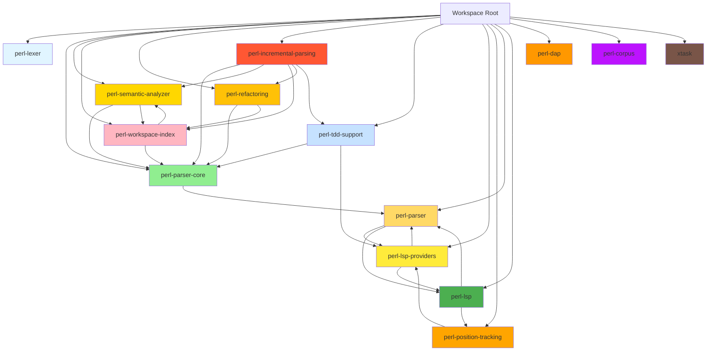
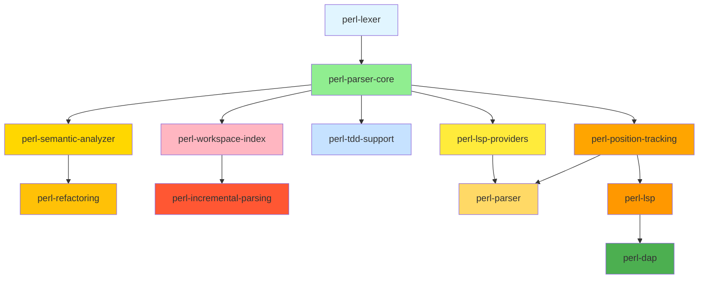

# Post-Engine/Adapter Migration Modularization Analysis

**Analysis Date**: 2026-01-16
**Status**: Engine/Adapter Migration 100% Complete

## Executive Summary

The engine/adapter migration has successfully separated LSP protocol code from [`perl-parser`](../crates/perl-parser) into [`perl-lsp`](../crates/perl-lsp) and introduced [`perl-lsp-providers`](../crates/perl-lsp-providers) as an intermediate crate. The repository now contains 15 crates with a well-organized dependency structure. This analysis identifies additional modularization opportunities beyond the completed migration.

---

## 1. Current Crate Map

### Workspace Structure

### Crate Dependency Matrix

| Crate | Type | Dependencies (Internal) | Dependencies (External) | wasm32 Compatible | Purpose |
|--------|------|------------------------|----------------------|----------------|---------|
| [`perl-lexer`](../crates/perl-lexer) | Foundation | - | unicode-ident, memchr, thiserror | ✅ Yes | Tokenization |
| [`perl-parser-core`](../crates/perl-parser-core) | Foundation | perl-lexer | ropey, serde, serde_json, phf, thiserror | ✅ Yes | Core AST types |
| [`perl-semantic-analyzer`](../crates/perl-semantic-analyzer) | Analysis | perl-parser-core, perl-workspace-index | regex, rustc-hash, serde | ✅ Yes | Symbol resolution |
| [`perl-workspace-index`](../crates/perl-workspace-index) | Analysis | perl-parser-core, perl-position-tracking | parking_lot, regex, serde, url, lsp-types (opt) | ✅ Yes | Workspace indexing |
| [`perl-refactoring`](../crates/perl-refactoring) | Analysis | perl-parser-core, perl-workspace-index | regex, serde | ✅ Yes | Code transformations |
| [`perl-incremental-parsing`](../crates/perl-incremental-parsing) | Analysis | perl-parser-core, perl-lexer | anyhow, lsp-types, ropey, serde_json, tracing | ❌ No | Incremental parsing |
| [`perl-tdd-support`](../crates/perl-tdd-support) | Testing | perl-parser-core | serde, serde_json, lsp-types (opt), url (opt) | ✅ Yes | Test generation |
| [`perl-lsp-providers`](../crates/perl-lsp-providers) | Bridge | perl-parser-core, perl-semantic-analyzer, perl-workspace-index, perl-refactoring, perl-incremental-parsing, perl-lexer, perl-position-tracking | rustc-hash, serde, serde_json, regex, lsp-types (opt), url, md5, walkdir | ❌ No | LSP provider glue |
| [`perl-position-tracking`](../crates/perl-position-tracking) | Utility | - | ropey, thiserror, serde, lsp-types (opt) | ✅ Yes | Position conversion |
| [`perl-parser`](../crates/perl-parser) | Main | All analysis crates + perl-lsp-providers + perl-dap | walkdir, nix, thiserror, serde, serde_json, regex, lazy_static, lsp-types (opt), tracing, url, rustc-hash, md5, phf, parking_lot, ropey | ❌ No | Aggregator crate |
| [`perl-lsp`](../crates/perl-lsp) | Binary | perl-parser, perl-lsp-providers, perl-lexer, perl-position-tracking | lsp-types, serde, serde_json, url, rustc-hash, anyhow, thiserror, regex, lazy_static, md5, phf, nix, parking_lot, walkdir, ropey | ❌ No | LSP server |
| [`perl-dap`](../crates/perl-dap) | Binary | - | lsp-types, serde, serde_json, anyhow, thiserror, regex, tokio, tracing, tracing-subscriber, ropey, nix (unix), winapi (windows) | ❌ No | DAP server |
| [`perl-corpus`](../crates/perl-corpus) | Testing | - | anyhow, thiserror, serde, serde_json, regex, glob, bstr, clap, once_cell, chrono, proptest, rand | ✅ Yes | Test corpus |
| [`xtask`](../xtask/) | Tooling | - | clap, serde, serde_json, regex | ✅ Yes | Build utilities |

### Excluded Crates (Not in workspace)

- [`tree-sitter-perl`](../tree-sitter-perl/) - Legacy tree-sitter grammar
- [`tree-sitter-perl-c`](../crates/tree-sitter-perl-c/) - Legacy C parser wrapper
- [`tree-sitter-perl-rs`](../crates/tree-sitter-perl-rs/) - Legacy Rust bindings
- [`perl-parser-pest`](../crates/perl-parser-pest/) - Legacy Pest parser
- [`archive`](../archive/) - Archived components
- [`fuzz`](../fuzz/) - Fuzz testing (specialized build)

---

## 2. Extraction Candidates

### P1-CRITICAL: Protocol Abstraction Layer

| Current Location | Proposed Crate | Rationale | Complexity | Dependencies |
|----------------|----------------|----------|------------|--------------|
| [`perl-lsp/src/protocol/`](../crates/perl-lsp/src/protocol/) | `perl-lsp-protocol` | Extract LSP protocol handling into standalone crate for potential reuse by DAP and other protocol implementations | Medium | lsp-types, serde, serde_json |
| [`perl-lsp/src/transport/`](../crates/perl-lsp/src/transport/) | `perl-lsp-transport` | Extract JSON-RPC transport layer for protocol-agnostic communication | Low | serde, serde_json |

**Benefits**:
- Protocol code could be reused by DAP and future protocols
- Clearer separation of concerns
- Enables testing protocol layer independently

### P1-CRITICAL: Runtime Infrastructure

| Current Location | Proposed Crate | Rationale | Complexity | Dependencies |
|----------------|----------------|----------|------------|--------------|
| [`perl-lsp/src/runtime/`](../crates/perl-lsp/src/runtime/) | `perl-lsp-runtime` | Extract server runtime infrastructure (lifecycle, dispatch, routing, text sync, workspace) | Medium | parking_lot, tokio (optional) |

**Benefits**:
- Runtime infrastructure could be shared between LSP and DAP servers
- Enables standalone testing of server lifecycle
- Clearer separation of protocol vs. server concerns

### P1-HIGH: Feature Provider Abstraction

| Current Location | Proposed Crate | Rationale | Complexity | Dependencies |
|----------------|----------------|----------|------------|--------------|
| [`perl-lsp/src/features/`](../crates/perl-lsp/src/features/) (20+ files) | `perl-lsp-features` | Extract feature provider implementations into dedicated crate with trait-based architecture | High | lsp-types, ropey, regex |

**Benefits**:
- Enables pluggable feature architecture
- Clearer feature boundaries
- Easier to add/remove features independently

### P2-HIGH: Tooling Integration Layer

| Current Location | Proposed Crate | Rationale | Complexity | Dependencies |
|----------------|----------------|----------|------------|--------------|
| [`perl-lsp/src/util/`](../crates/perl-lsp/src/util/) + [`perl-lsp-providers/src/tooling/`](../crates/perl-lsp-providers/src/tooling/) | `perl-lsp-tooling` | Consolidate tooling utilities (perlcritic, perltidy, performance) | Medium | which, regex, tempfile |

**Benefits**:
- Single source of truth for tooling
- Easier to add new tool integrations
- Consistent error handling across tools

### P2-MEDIUM: State Management

| Current Location | Proposed Crate | Rationale | Complexity | Dependencies |
|----------------|----------------|----------|------------|--------------|
| [`perl-lsp/src/state/`](../crates/perl-lsp/src/state/) | `perl-lsp-state` | Extract server state management (config, document, limits) | Medium | serde, parking_lot |

**Benefits**:
- Clearer state machine boundaries
- Easier to test state transitions
- Potential reuse for other server implementations

### P2-MEDIUM: Diagnostics Infrastructure

| Current Location | Proposed Crate | Rationale | Complexity | Dependencies |
|----------------|----------------|----------|------------|--------------|
| [`perl-lsp/src/features/diagnostics/`](../crates/perl-lsp/src/features/diagnostics/) | `perl-lsp-diagnostics` | Extract diagnostics catalog and pull mechanisms | Medium | lsp-types, serde |

**Benefits**:
- Diagnostics could be used by DAP
- Clearer separation of diagnostic concerns
- Easier to test diagnostic workflows

### P3-MEDIUM: Format Integration

| Current Location | Proposed Crate | Rationale | Complexity | Dependencies |
|----------------|----------------|----------|------------|--------------|
| [`perl-lsp/src/features/formatting/`](../crates/perl-lsp/src/features/formatting/) + [`perl-lsp-providers/src/ide/lsp_compat/formatting/`](../crates/perl-lsp-providers/src/ide/lsp_compat/formatting/) | `perl-lsp-formatting` | Consolidate formatting logic (on-type formatting, selection ranges) | Medium | lsp-types, ropey |

**Benefits**:
- Single formatting implementation
- Consistent behavior across LSP and DAP
- Easier to maintain formatting features

### P3-LOW: Handler Abstraction

| Current Location | Proposed Crate | Rationale | Complexity | Dependencies |
|----------------|----------------|----------|------------|--------------|
| [`perl-lsp/src/handlers/`](../crates/perl-lsp/src/handlers/) | `perl-lsp-handlers` | Extract request handler abstractions | Low | serde |

**Benefits**:
- Cleaner request routing
- Easier to add new handlers
- Better testability of handler logic

### P3-LOW: Convert Module

| Current Location | Proposed Crate | Rationale | Complexity | Dependencies |
|----------------|----------------|----------|------------|--------------|
| [`perl-lsp/src/convert/`](../crates/perl-lsp/src/convert/) + [`perl-lsp-providers/src/convert/`](../crates/perl-lsp-providers/src/convert/) | `perl-lsp-convert` | Consolidate type conversion utilities | Low | serde |

**Benefits**:
- Single source for conversions
- Reduces code duplication
- Consistent conversion logic

---

## 3. wasm32 Compatibility Status

### Currently Gated (Properly Implemented)

| Crate | Gated Modules | Status |
|--------|---------------|--------|
| [`perl-parser`](../crates/perl-parser) | `execute_command`, `analysis`, `workspace`, `lsp-compat`, `tooling` | ✅ Properly gated |
| [`perl-lsp-providers`](../crates/perl-lsp-providers) | `lsp-compat` | ✅ Properly gated |
| [`perl-tdd-support`](../crates/perl-tdd-support) | `lsp-compat` | ✅ Properly gated |
| [`perl-workspace-index`](../crates/perl-workspace-index) | `lsp-compat` | ✅ Properly gated |
| [`perl-position-tracking`](../crates/perl-position-tracking) | `lsp-compat` | ✅ Properly gated |

### NOT Gated (Needs Attention)

| Crate | Ungated Modules | Issue | Recommended Action |
|--------|----------------|-------|------------------|
| [`perl-incremental-parsing`](../crates/perl-incremental-parsing) | Entire crate | P1 - Gate entire crate or move LSP-specific code to separate module |
| [`perl-lsp`](../crates/perl-lsp) | `walkdir`, `nix` | P2 - Already binary-only, but verify no wasm32 compilation targets |
| [`perl-dap`](../crates/perl-dap) | `tokio`, `nix`, `winapi` | P2 - Binary-only, verify no wasm32 targets |

### Could Be Made wasm32-Compatible with Refactoring

| Crate | Current Barrier | Refactoring Approach | Complexity |
|--------|----------------|-------------------|------------|
| [`perl-incremental-parsing`](../crates/perl-incremental-parsing) | Direct `lsp-types` dependency | Extract LSP-specific code to `perl-lsp-providers` | Medium |
| [`perl-workspace-index`](../crates/perl-workspace-index) | Filesystem operations via `walkdir` | Use trait-based filesystem abstraction | High |

---

## 4. Architectural Boundary Issues

### Issue 1: Dual Implementation Pattern

**Location**: [`perl-lsp`](../crates/perl-lsp) and [`perl-lsp-providers`](../crates/perl-lsp-providers)

**Description**: Feature providers have dual implementations - one in [`perl-lsp`](../crates/perl-lsp) (protocol-specific) and one in [`perl-lsp-providers`](../crates/perl-lsp-providers) (protocol-agnostic via `lsp_compat` feature).

**Impact**:
- Code duplication between `ide/` and `ide/lsp_compat/` directories
- Maintenance burden - changes must be made in two places
- Inconsistent feature availability

**Recommendation**: Consolidate to single implementation per feature, using `lsp-compat` feature only for type conversions.

### Issue 2: Unclear Module Ownership

**Location**: [`perl-lsp`](../crates/perl-lsp) vs [`perl-lsp-providers`](../crates/perl-lsp-providers)

**Description**: Some modules exist in both crates with unclear ownership:
- `cancellation.rs` exists in both
- `diagnostics_catalog.rs` exists in both
- `execute_command.rs` exists in both
- `textdoc.rs` exists in both

**Impact**:
- Confusion about which version to modify
- Potential for drift between implementations
- Unclear responsibility for testing

**Recommendation**: Establish clear ownership - protocol-specific code in `perl-lsp`, protocol-agnostic code in `perl-lsp-providers`.

### Issue 3: Mixed Concerns in [`perl-lsp-providers`](../crates/perl-lsp-providers)

**Description**: The `perl-lsp-providers` crate mixes:
- Protocol-agnostic IDE abstractions (`ide/`)
- LSP-specific implementations (`ide/lsp_compat/`)
- Tooling utilities (`tooling/`)

**Impact**:
- Violates single responsibility principle
- Makes crate harder to use without LSP
- Unclear purpose of the crate

**Recommendation**: Split into separate crates:
- `perl-ide-providers` - Protocol-agnostic abstractions
- `perl-lsp-provider-impls` - LSP-specific implementations (merge with `perl-lsp`)

### Issue 4: Binary Crate Contains Logic

**Location**: [`perl-lsp`](../crates/perl-lsp)

**Description**: The `perl-lsp` binary crate contains significant non-binary logic:
- Feature implementations in [`features/`](../crates/perl-lsp/src/features/)
- Runtime infrastructure in [`runtime/`](../crates/perl-lsp/src/runtime/)
- State management in [`state/`](../crates/perl-lsp/src/state/)

**Impact**:
- Binary crate cannot be used as library
- Harder to test components independently
- Violates binary crate convention

**Recommendation**: Move non-binary code to library crates, keep only `main.rs` and minimal server bootstrap in binary.

### Issue 5: [`perl-parser`](../crates/perl-parser) as Aggregator

**Description**: The `perl-parser` crate serves as an aggregator for all other crates, making it difficult to use independently.

**Impact**:
- Large dependency tree
- Long compilation times
- Unclear what functionality is "core parser"

**Recommendation**: Define clear API boundaries and document which components are optional vs. required.

### Issue 6: Inconsistent Feature Gating

**Description**: Feature gating is inconsistent across crates:
- Some use `lsp-compat` feature
- Some gate individual modules
- Some have no gating at all

**Impact**:
- Confusing for consumers
- Difficult to understand what features are available
- Potential for accidental feature leakage

**Recommendation**: Establish consistent feature gating strategy with clear documentation.

---

## 5. Additional Modularization Opportunities

### Common Utilities

| Current Location | Proposed Crate | Rationale | Complexity |
|----------------|----------------|----------|------------|
| Scattered utility modules | `perl-common` | Consolidate common utilities (URI handling, logging, error types) | Low |

### Test Infrastructure

| Current Location | Proposed Crate | Rationale | Complexity |
|----------------|----------------|----------|------------|
| Test helpers in individual crates | `perl-test-harness` | Extract common test infrastructure (fixtures, helpers) | Medium |

### Documentation Tools

| Current Location | Proposed Crate | Rationale | Complexity |
|----------------|----------------|----------|------------|
| Scattered documentation generation | `perl-doc-tools` | Consolidate documentation generation and validation tools | Low |

### Legacy Code

| Current Location | Proposed Action | Rationale | Complexity |
|----------------|---------------------------|------------|
| [`crates/perl-parser-pest/`](../crates/perl-parser-pest/) | Archive or remove | Marked as legacy, no longer maintained | Low |
| [`tree-sitter-perl`](../tree-sitter-perl/) | Archive or remove | Legacy tree-sitter implementation | Low |
| [`crates/tree-sitter-perl-c/`](../crates/tree-sitter-perl-c/) | Archive or remove | Legacy C parser wrapper | Low |
| [`crates/tree-sitter-perl-rs/`](../crates/tree-sitter-perl-rs/) | Archive or remove | Legacy Rust bindings | Low |

---

## 6. Prioritized Recommendations

### P0-CRITICAL (Immediate Action Required)

1. **Resolve Dual Implementation Pattern** in [`perl-lsp-providers`](../crates/perl-lsp-providers)
   - Consolidate `ide/` and `ide/lsp_compat/` implementations
   - Establish single source of truth per feature
   - Remove code duplication

2. **Establish Clear Module Ownership** between [`perl-lsp`](../crates/perl-lsp) and [`perl-lsp-providers`](../crates/perl-lsp-providers)
   - Define which crate owns each module
   - Remove duplicate implementations
   - Document ownership in architecture docs

3. **Extract Protocol Layer** to `perl-lsp-protocol` crate
   - Move [`perl-lsp/src/protocol/`](../crates/perl-lsp/src/protocol/) to new crate
   - Enable reuse by DAP and future protocols
   - Add protocol-agnostic tests

### P1-HIGH (High Priority)

4. **Extract Runtime Infrastructure** to `perl-lsp-runtime` crate
   - Move [`perl-lsp/src/runtime/`](../crates/perl-lsp/src/runtime/) to new crate
   - Enable sharing with DAP server
   - Add runtime lifecycle tests

5. **Extract Feature Providers** to `perl-lsp-features` crate
   - Move [`perl-lsp/src/features/`](../crates/perl-lsp/src/features/) to new crate
   - Implement trait-based architecture
   - Enable pluggable feature system

6. **Extract Tooling Integration** to `perl-lsp-tooling` crate
   - Consolidate tooling utilities
   - Add perlcritic/perltidy abstractions
   - Enable consistent tool integration

7. **Address wasm32 Compatibility** in [`perl-incremental-parsing`](../crates/perl-incremental-parsing)
   - Gate LSP-specific code
   - Or extract to separate module
   - Add wasm32 compilation targets

### P2-MEDIUM (Medium Priority)

8. **Extract State Management** to `perl-lsp-state` crate
   - Move [`perl-lsp/src/state/`](../crates/perl-lsp/src/state/) to new crate
   - Define clear state machine
   - Add state transition tests

9. **Extract Diagnostics Infrastructure** to `perl-lsp-diagnostics` crate
   - Move diagnostics code to new crate
   - Enable DAP diagnostic reuse
   - Add diagnostic workflow tests

10. **Extract Format Integration** to `perl-lsp-formatting` crate
   - Consolidate formatting logic
   - Ensure consistent behavior
   - Add formatting tests

11. **Consolidate Common Utilities** to `perl-common` crate
   - Extract shared utilities
   - Reduce code duplication
   - Add utility tests

### P3-LOW (Low Priority)

12. **Extract Handler Abstraction** to `perl-lsp-handlers` crate
   - Move handler logic to new crate
   - Simplify request routing
   - Add handler tests

13. **Extract Convert Module** to `perl-lsp-convert` crate
   - Consolidate type conversions
   - Reduce duplication
   - Add conversion tests

14. **Archive Legacy Code**
   - Move [`crates/perl-parser-pest/`](../crates/perl-parser-pest/) to archive
   - Move tree-sitter crates to archive
   - Update documentation

15. **Extract Test Infrastructure** to `perl-test-harness` crate
   - Consolidate test helpers
   - Add common fixtures
   - Improve test ergonomics

---

## 7. Implementation Strategy

### Phase 1: Foundation (P0 Items)

1. Resolve dual implementation pattern
2. Establish clear module ownership
3. Extract protocol layer
4. Extract runtime infrastructure

### Phase 2: Feature Organization (P1 Items)

5. Extract feature providers
6. Extract tooling integration
7. Address wasm32 compatibility

### Phase 3: Supporting Infrastructure (P2 Items)

8. Extract state management
9. Extract diagnostics infrastructure
10. Extract format integration

### Phase 4: Cleanup (P3 Items)

11. Consolidate common utilities
12. Extract handler abstraction
13. Extract convert module
14. Archive legacy code
15. Extract test infrastructure

---

## 8. Risk Assessment

### High Risk Items

- **Dual implementation consolidation**: Breaking changes to [`perl-lsp-providers`](../crates/perl-lsp-providers) may affect downstream consumers
- **Module ownership changes**: Need careful coordination to avoid breaking changes
- **Protocol layer extraction**: Requires careful API design to avoid tight coupling

### Medium Risk Items

- **Feature provider extraction**: Trait-based architecture may require significant refactoring
- **Runtime infrastructure extraction**: Need to ensure DAP compatibility
- **wasm32 gating changes**: May affect current wasm32 users

### Low Risk Items

- **Common utilities consolidation**: Low impact, mostly additive
- **Legacy code archival**: Safe operation, no breaking changes
- **Test infrastructure extraction**: Can be done incrementally

---

## 9. Success Criteria

### Completion Metrics

- All P0 items implemented and tested
- All P1 items implemented and tested
- 80% of P2 items implemented
- Documentation updated to reflect new structure
- All tests passing

### Quality Gates

- Zero clippy warnings
- Consistent formatting
- All new crates have `#![warn(missing_docs)]`
- wasm32 compilation targets verified
- No circular dependencies

---

## Appendix A: Dependency Graph

---

## Appendix B: Feature Flag Matrix

| Feature | perl-parser | perl-lsp | perl-lsp-providers | perl-workspace-index | perl-tdd-support |
|---------|-------------|-----------|---------------------|---------------------|-------------------|
| lsp-compat | ✅ | N/A | ✅ | ✅ | ✅ |
| workspace | ✅ | ✅ | N/A | ✅ | N/A |
| incremental | ✅ | ✅ | N/A | N/A | N/A |
| modernize | ✅ | N/A | N/A | N/A | N/A |
| workspace_refactor | ✅ | N/A | N/A | N/A | N/A |

---

**Analysis Completed**: 2026-01-16
**Next Review Date**: TBD
