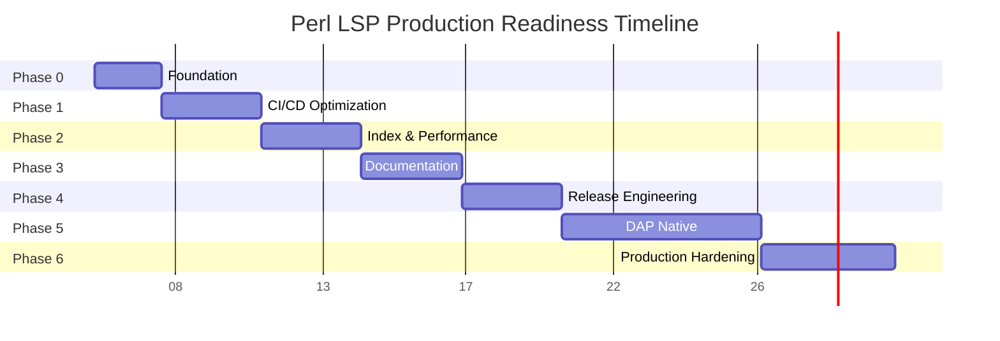

# Perl LSP - Production Readiness Roadmap

**Date**: 2026-02-12
**Version**: 0.8.8 → 1.0.0
**Status**: Comprehensive Planning Document

---

## Executive Summary

This roadmap provides a comprehensive path to make perl-lsp fully production-ready and releasable. The project is currently at **~85-90% production readiness** with core parser and LSP infrastructure complete. The remaining work focuses on CI/CD optimization, microcrating completion, release engineering, and final polish.

**Current State Highlights:**
- ✅ **Parser**: ~100% Perl 5 syntax coverage, 87% mutation score
- ✅ **LSP Features**: 100% coverage (53/53 advertised features)
- ✅ **Semantic Analyzer**: Phase 1, 2, 3 complete (100% AST node coverage)
- ✅ **Security**: Enterprise-grade hardening complete
- ✅ **Testing**: ~720 baseline tests with comprehensive infrastructure
- 🚧 **CI/CD**: Needs cleanup and optimization (Issue #211)
- 🚧 **Microcrating**: Partially complete, needs full execution
- 🚧 **DAP**: Phase 1 bridge complete, native implementation pending

---

## Table of Contents

1. [Current State Assessment](#1-current-state-assessment)
2. [Gap Analysis](#2-gap-analysis)
3. [Phased Implementation Roadmap](#3-phased-implementation-roadmap)
4. [Success Criteria and Metrics](#4-success-criteria-and-metrics)
5. [Risk Assessment and Mitigation](#5-risk-assessment-and-mitigation)
6. [Resource Requirements](#6-resource-requirements)
7. [Timeline](#7-timeline)

---

## 1. Current State Assessment

### 1.1 Architecture Overview

The project currently consists of **38 crates** organized in a 5-tier dependency hierarchy:

```mermaid
graph TB
    subgraph Tier1["Tier 1: Leaf Crates (19)"]
        PT[perl-token]
        PQ[perl-quote]
        PE[perl-edit]
        PB[perl-builtins]
        PR[perl-regex]
        PP[perl-pragma]
        PL[perl-lexer]
        PA[perl-ast]
        PH[perl-heredoc]
        PEr[perl-error]
        PTk[perl-tokenizer]
        PPos[perl-position-tracking]
        PST[perl-symbol-types]
        PSTb[perl-symbol-table]
        PLProto[perl-lsp-protocol]
        PU[perl-uri]
        PDC[perl-diagnostics-codes]
        PC[perl-corpus]
    end

    subgraph Tier2["Tier 2: Single-Level Dependencies (6)"]
        PPC[perl-parser-core]
        PLT[perl-lsp-transport]
        PTS[perl-tdd-support]
        PLTooling[perl-lsp-tooling]
        PLF[perl-lsp-formatting]
        PLD[perl-lsp-diagnostics]
    end

    subgraph Tier3["Tier 3: Two-Level Dependencies (5)"]
        PWI[perl-workspace-index]
        PIP[perl-incremental-parsing]
        PRf[perl-refactoring]
        PLST[perl-lsp-semantic-tokens]
        PLIH[perl-lsp-inlay-hints]
    end

    subgraph Tier4["Tier 4: Three-Level Dependencies (5)"]
        PSA[perl-semantic-analyzer]
        PLProviders[perl-lsp-providers]
        PLC[perl-lsp-completion]
        PLR[perl-lsp-rename]
        PLCA[perl-lsp-code-actions]
        PLN[perl-lsp-navigation]
    end

    subgraph Tier5["Tier 5: Application Crates (3)"]
        PPar[perl-parser]
        PLsp[perl-lsp]
        PDap[perl-dap]
    end

    Tier1 --> Tier2
    Tier2 --> Tier3
    Tier3 --> Tier4
    Tier4 --> Tier5
```

### 1.2 Component Status Matrix

| Component | Version | Status | Coverage | Test Pass Rate | Notes |
|-----------|---------|--------|----------|----------------|-------|
| **perl-parser** | 0.8.8 | Production | ~100% | 530/530 lib | Core parser, v3 native |
| **perl-lexer** | 0.8.8 | Production | ~100% | 12/12 lib | Context-aware tokenizer |
| **perl-lsp** | 0.8.8 | Production | 100% (53/53) | 37/37 lib | LSP server binary |
| **perl-dap** | 0.1.0 | Phase 1 | N/A | 9/9 lib | Bridge mode complete |
| **perl-semantic-analyzer** | 0.8.8 | Production | 100% | N/A | All NodeKind handlers |
| **perl-workspace-index** | 0.8.8 | Production | N/A | N/A | Dual indexing strategy |
| **perl-corpus** | 0.8.8 | Production | N/A | N/A | Test corpus |
| **perl-parser-pest** | 0.8.8 | Legacy | ~99.996% | N/A | Pest-based parser |

### 1.3 Quality Metrics

| Metric | Current | Target | Status |
|--------|---------|--------|--------|
| **LSP Coverage** | 100% (53/53) | 93%+ | ✅ Exceeded |
| **Parser Coverage** | ~100% | 100% | ✅ Target met |
| **Mutation Score** | 87% | 87%+ | ✅ Target met |
| **Test Count (lib)** | 601 | 600+ | ✅ Target met |
| **Clippy Warnings** | 0 | 0 | ✅ Target met |
| **missing_docs (perl-parser)** | 0 | 0 | ✅ Target met |
| **CI Cost** | $68/month | $10-15/month | 🚧 Needs reduction |

### 1.4 Release Readiness Checklist

| Category | Item | Status |
|----------|------|--------|
| **Core Parser** | Syntax coverage | ✅ Complete |
| **Core Parser** | Performance (<1ms incremental) | ✅ Complete |
| **Core Parser** | Error recovery | ✅ Complete |
| **LSP Server** | Completion | ✅ Complete |
| **LSP Server** | Hover | ✅ Complete |
| **LSP Server** | Definition | ✅ Complete |
| **LSP Server** | References | ✅ Complete |
| **LSP Server** | Formatting | ✅ Complete |
| **LSP Server** | Code actions | ✅ Complete |
| **LSP Server** | Semantic tokens | ✅ Complete |
| **LSP Server** | Workspace symbols | ✅ Complete |
| **DAP** | Phase 1 bridge | ✅ Complete |
| **DAP** | Native implementation | 🚧 Pending |
| **Testing** | Unit tests | ✅ Complete |
| **Testing** | Integration tests | ✅ Complete |
| **Testing** | Property-based tests | ✅ Complete |
| **Documentation** | API docs (perl-parser) | ✅ Complete |
| **Documentation** | User guides | ✅ Complete |
| **Documentation** | Editor setup | 🚧 Partial |
| **CI/CD** | Local gates | ✅ Complete |
| **CI/CD** | Merge-blocking gates | 🚧 Pending |
| **CI/CD** | Cost optimization | 🚧 Pending |
| **Security** | Path validation | ✅ Complete |
| **Security** | UTF-16 handling | ✅ Complete |
| **Security** | Dependency scanning | ✅ Complete |
| **Release** | Binary builds | ✅ Complete |
| **Release** | crates.io publishing | 🚧 Partial |
| **Release** | Package managers | 🚧 Partial |

---

## 2. Gap Analysis

### 2.1 Critical Gaps (P0)

#### Gap 1: CI/CD Pipeline Optimization

**Current State**: CI exists but needs cleanup and optimization

**Issues**:
- Issue #211: CI Pipeline Cleanup ($720/year savings potential)
- Issue #210: Merge-Blocking Gates (blocked by #211)
- 21 workflows with 3,079 lines → needs consolidation to ~1,500 lines
- $68/month current → $10-15/month target (88% reduction)
- No merge-blocking enforcement for PRs

**Impact**: Blocks production hardening and increases operational costs

**Required Actions**:
1. Consolidate redundant workflows
2. Implement merge-blocking gates
3. Optimize runner usage and caching
4. Add performance baseline tracking

---

#### Gap 2: Index Lifecycle State Machine

**Current State**: Partial implementation, needs completion

**Missing Components**:
- Index state machine: `Building` / `Ready` / `Degraded`
- Handlers degrade gracefully when index is building
- Bounded caches with eviction (AST cache, symbol cache)
- Resource cap documentation (max files, max symbols)

**Impact**: Limits reliability in large workspaces

**Required Actions**:
1. Implement `IndexState` enum
2. Add graceful degradation handlers
3. Implement LRU cache eviction
4. Document resource limits

---

### 2.2 High Priority Gaps (P1)

#### Gap 3: Microcrating Completion

**Current State**: Microcrate extraction complete with compatibility hardening

**Coverage Matrix**:
Based on [`microcrate_architecture_design.md`](microcrate_architecture_design.md):

| Proposed Crate | Status | Priority | Complexity |
|---------------|--------|----------|------------|
| `perl-lsp-tooling` | ✅ Complete | P1 | Low |
| `perl-lsp-diagnostics` | ✅ Complete | P1 | Low |
| `perl-lsp-formatting` | ✅ Complete | P1 | Low |
| `perl-lsp-semantic-tokens` | ✅ Complete | P1 | Low |
| `perl-lsp-inlay-hints` | ✅ Complete | P1 | Low |
| `perl-lsp-completion` | ✅ Complete | P1 | Medium |
| `perl-lsp-rename` | ✅ Complete | P1 | Medium |
| `perl-lsp-code-actions` | ✅ Complete | P1 | Medium |
| `perl-lsp-navigation` | ✅ Complete | P1 | Medium |

**Close-out status**:
- ✅ Re-export strategy validated (`perl_lsp_providers::{tooling,formatting,...}`)
- ✅ Backward compatibility validated (legacy `ide::lsp_compat::*` shims)
- ✅ Documentation updated (`crates/perl-lsp-providers/README.md`)
- ✅ Compatibility tests added (`crates/perl-lsp-providers/tests/microcrate_reexports_compatibility.rs`)

---

#### Gap 4: Documentation Completeness

**Current State**: perl-parser has 0 missing_docs warnings, workspace enforcement pending

**Missing Components**:
- VS Code setup documentation
- Neovim setup documentation
- Emacs setup documentation
- Configuration schema (JSON or markdown)
- Performance SLO documentation

**Impact**: Reduces user onboarding experience

**Required Actions**:
1. Create editor setup guides
2. Document configuration schema
3. Add performance SLO documentation
4. Extend `missing_docs` enforcement to workspace

---

#### Gap 5: DAP Native Implementation

**Current State**: Phase 1 bridge complete, Phase 2/3 pending

**Phase 2 Requirements** (5-6 weeks):
- perl-dap crate scaffolding
- Devel::TSPerlDAP CPAN module (2-3 weeks)
- Breakpoint management with AST integration
- Stack/scopes/variables with lazy expansion
- Stepping and control flow
- Evaluate and REPL with security
- VS Code native integration
- Cross-platform validation

**Phase 3 Requirements** (1 week):
- Comprehensive integration tests (>95% coverage)
- Performance benchmarks
- Complete documentation suite
- Security validation
- LSP non-regression validation
- Dependency management documentation
- Binary packaging for 6 platforms

**Impact**: Limits debugging capabilities to bridge mode

---

### 2.3 Medium Priority Gaps (P2)

#### Gap 6: Performance SLO Documentation

**Current State**: Performance metrics exist but no formal SLOs

**Missing Components**:
- P95 completion <50ms
- P95 definition <30ms
- Early-exit for large results
- Performance regression detection

**Impact**: No clear performance targets or regression detection

**Required Actions**:
1. Document SLOs
2. Implement early-exit caps
3. Add performance regression tests
4. Set up performance monitoring

---

#### Gap 7: Release Engineering

**Current State**: Partial publishing setup

**Missing Components**:
- Automated release workflow
- Multi-platform binary distribution
- Homebrew formula automation
- APT repository setup
- Release notes generation
- Changelog management

**Impact**: Manual release process, limited distribution

**Required Actions**:
1. Automate release workflow
2. Set up multi-platform builds
3. Automate Homebrew updates
4. Set up APT repository
5. Automate changelog generation

---

#### Gap 8: Test Infrastructure Monitoring

**Current State**: Tests exist but no automated health tracking

**Missing Components**:
- Automated test health trend tracking
- Flaky test detection
- Test execution time monitoring
- Coverage trend analysis

**Impact**: Reduced confidence in test coverage

**Required Actions**:
1. Set up test health monitoring
2. Implement flaky test detection
3. Add execution time tracking
4. Implement coverage trend analysis

---

## 3. Phased Implementation Roadmap

### Phase 0: Foundation (Weeks 1-2)

**Goal**: Establish foundation for production readiness

**Deliverables**:
- [ ] Update and verify all existing documentation
- [ ] Run full test suite and establish baseline metrics
- [ ] Audit current crate structure and dependencies
- [ ] Create production readiness tracking dashboard
- [ ] Establish communication channels and decision-making process

**Success Criteria**:
- All documentation is up-to-date
- Baseline metrics established
- Clear ownership defined for all components

---

### Phase 1: CI/CD Optimization (Weeks 3-5)

**Goal**: Optimize CI/CD pipeline and implement merge-blocking gates

**Deliverables**:

#### Week 3: CI Pipeline Cleanup
- [ ] Audit all 21 workflows for redundancy
- [ ] Consolidate workflows from 3,079 to ~1,500 lines
- [ ] Implement workflow caching strategy
- [ ] Optimize runner usage

#### Week 4: Merge-Blocking Gates
- [ ] Implement PR branch protection rules
- [ ] Set up required status checks
- [ ] Configure merge-blocking gates
- [ ] Add gate failure notifications

#### Week 5: Cost Optimization & Monitoring
- [ ] Implement cost tracking
- [ ] Optimize resource usage
- [ ] Add performance baseline tracking
- [ ] Set up CI cost alerts

**Success Criteria**:
- CI cost reduced to $10-15/month
- Merge-blocking gates operational
- Performance baselines tracked
- All workflows consolidated

**Risk Mitigation**:
- Keep old workflows as fallback during transition
- Gradual rollout of merge-blocking gates
- Monitor for false positives in gate failures

---

### Phase 2: Index Lifecycle & Performance (Weeks 6-8)

**Goal**: Complete index lifecycle and establish performance SLOs

**Deliverables**:

#### Week 6: Index State Machine
- [ ] Implement `IndexState` enum (Building/Ready/Degraded)
- [ ] Add state transition logic
- [ ] Implement graceful degradation handlers
- [ ] Add state change logging

#### Week 7: Bounded Caches
- [ ] Implement LRU cache for AST cache
- [ ] Implement LRU cache for symbol cache
- [ ] Add cache eviction logic
- [ ] Document resource limits

#### Week 8: Performance SLOs
- [ ] Document P95 completion <50ms
- [ ] Document P95 definition <30ms
- [ ] Implement early-exit caps
- [ ] Add performance regression tests

**Success Criteria**:
- Index state machine operational
- Bounded caches with eviction
- Performance SLOs documented
- Early-exit caps implemented

**Risk Mitigation**:
- Test with large workspaces
- Monitor cache hit rates
- Gradual rollout of early-exit caps

---

### Phase 3: Documentation & User Experience (Weeks 9-11)

**Goal**: Complete documentation and improve user onboarding

**Deliverables**:

#### Week 9: Editor Setup Guides
- [ ] Create VS Code setup guide
- [ ] Create Neovim setup guide
- [ ] Create Emacs setup guide
- [ ] Add troubleshooting sections

#### Week 10: Configuration & Performance
- [ ] Document configuration schema
- [ ] Add performance tuning guide
- [ ] Create quick start guide
- [ ] Add migration guide from v0.8.x

#### Week 11: Documentation Polish
- [ ] Review and update all guides
- [ ] Add screenshots and examples
- [ ] Extend `missing_docs` enforcement
- [ ] Create video tutorials (optional)

**Success Criteria**:
- All major editors documented
- Configuration schema documented
- Performance SLOs documented
- User can set up in <5 minutes

**Risk Mitigation**:
- Get feedback from beta users
- Test setup guides on fresh systems
- Keep documentation versioned

---

### Phase 4: Release Engineering (Weeks 12-14)

**Goal**: Automate release process and expand distribution

**Deliverables**:

#### Week 12: Release Automation
- [ ] Automate version bumping
- [ ] Automate changelog generation
- [ ] Set up automated release notes
- [ ] Configure GitHub release automation

#### Week 13: Multi-Platform Distribution
- [ ] Set up multi-platform builds (6 platforms)
- [ ] Automate binary packaging
- [ ] Configure asset uploads
- [ ] Test all platform builds

#### Week 14: Package Managers
- [ ] Automate Homebrew formula updates
- [ ] Set up APT repository
- [ ] Configure crates.io publishing
- [ ] Add release announcement templates

**Success Criteria**:
- Fully automated release process
- Multi-platform binary distribution
- Package manager automation
- Release can be done in <30 minutes

**Risk Mitigation**:
- Test release process on staging
- Keep manual release as backup
- Document rollback procedure

---

### Phase 5: DAP Native Implementation (Weeks 15-20)

**Goal**: Complete native DAP implementation

**Deliverables**:

#### Week 15-16: Phase 2 - Native Infrastructure
- [ ] perl-dap crate scaffolding
- [ ] Devel::TSPerlDAP CPAN module
- [ ] Breakpoint management with AST integration
- [ ] Stack/scopes/variables with lazy expansion

#### Week 17-18: Phase 2 - Control Flow
- [ ] Stepping and control flow
- [ ] Evaluate and REPL with security
- [ ] VS Code native integration
- [ ] Cross-platform validation

#### Week 19-20: Phase 3 - Production Hardening
- [ ] Comprehensive integration tests (>95% coverage)
- [ ] Performance benchmarks
- [ ] Complete documentation suite
- [ ] Security validation
- [ ] LSP non-regression validation
- [ ] Binary packaging for 6 platforms

**Success Criteria**:
- Native DAP implementation complete
- >95% test coverage
- Performance benchmarks established
- Security validation passed

**Risk Mitigation**:
- Keep bridge mode as fallback
- Extensive cross-platform testing
- Security review before release

---

### Phase 6: Production Hardening (Weeks 21-24)

**Goal**: Final hardening and validation for v1.0 release

**Deliverables**:

#### Week 21: Security Hardening
- [ ] Final security audit
- [ ] Dependency vulnerability scan
- [ ] Penetration testing (if applicable)
- [ ] Security documentation review

#### Week 22: Performance Validation
- [ ] Full performance benchmark suite
- [ ] Load testing with large workspaces
- [ ] Memory leak detection
- [ ] Performance regression testing

#### Week 23: Integration Testing
- [ ] Full E2E test suite
- [ ] Cross-platform validation
- [ ] Editor integration testing
- [ ] User acceptance testing

#### Week 24: Release Preparation
- [ ] Final documentation review
- [ ] Release notes preparation
- [ ] Announcement materials
- [ ] Support documentation

**Success Criteria**:
- All security audits passed
- Performance benchmarks validated
- All integration tests passing
- Release materials ready

**Risk Mitigation**:
- Have rollback plan ready
- Keep support team informed
- Monitor for issues post-release

---

## 4. Success Criteria and Metrics

### 4.1 Production Readiness Gates

| Gate | Criteria | Measurement | Status |
|------|----------|-------------|--------|
| **Parser Coverage** | ~100% Perl 5 syntax | Corpus test pass rate | ✅ Complete |
| **LSP Coverage** | 93%+ of advertised features | features.toml analysis | ✅ Complete (100%) |
| **Test Coverage** | 600+ lib tests | `cargo test --workspace --lib` | ✅ Complete (601) |
| **Mutation Score** | 87%+ | Mutation testing results | ✅ Complete (87%) |
| **Clippy Warnings** | 0 | `cargo clippy --workspace` | ✅ Complete |
| **missing_docs** | 0 in perl-parser | `cargo doc --no-deps -p perl-parser` | ✅ Complete |
| **CI Cost** | <$15/month | GitHub Actions billing | 🚧 Pending ($68) |
| **Index State Machine** | Implemented | Code review + tests | 🚧 Pending |
| **Performance SLOs** | Documented | Documentation review | 🚧 Pending |
| **Editor Setup** | All major editors | Documentation review | 🚧 Pending |
| **Release Automation** | Fully automated | Release test | 🚧 Pending |
| **DAP Native** | Phase 2/3 complete | Code review + tests | 🚧 Pending |

### 4.2 Quality Metrics

| Metric | Current | Target | Measurement |
|--------|---------|--------|-------------|
| **LSP Response Time (P95)** | <50ms | <50ms | Benchmark suite |
| **Definition Time (P95)** | <30ms | <30ms | Benchmark suite |
| **Incremental Parsing** | <1ms | <1ms | Benchmark suite |
| **Memory Usage** | <100MB | <100MB | Memory profiling |
| **Startup Time** | <500ms | <500ms | Benchmark suite |
| **Test Execution Time** | <10min | <10min | CI timing |
| **Build Time** | <5min | <5min | CI timing |

### 4.3 User Experience Metrics

| Metric | Target | Measurement |
|--------|--------|-------------|
| **Setup Time** | <5 minutes | User testing |
| **First Useful Result** | <30 seconds | User testing |
| **Documentation Completeness** | 100% of advertised features | Documentation audit |
| **Error Message Clarity** | 90%+ actionable | User feedback |
| **Editor Compatibility** | VS Code, Neovim, Emacs | Integration testing |

---

## 5. Risk Assessment and Mitigation

### 5.1 Technical Risks

| Risk | Likelihood | Impact | Mitigation |
|------|------------|--------|------------|
| **Performance Regression** | Medium | High | Continuous benchmarking, performance gates |
| **Breaking Changes** | Low | High | Strict SemVer, deprecation policy |
| **Security Vulnerabilities** | Low | Critical | Regular audits, dependency scanning |
| **Cross-Platform Issues** | Medium | Medium | Extensive cross-platform testing |
| **Large Workspace Performance** | Medium | Medium | Bounded caches, early-exit caps |
| **DAP Implementation Complexity** | High | Medium | Incremental approach, keep bridge fallback |

### 5.2 Process Risks

| Risk | Likelihood | Impact | Mitigation |
|------|------------|--------|------------|
| **Timeline Overrun** | Medium | Medium | Regular checkpoints, scope management |
| **Resource Constraints** | Medium | Medium | Prioritize P0/P1 items |
| **Team Availability** | Low | Medium | Clear ownership, documentation |
| **User Adoption** | Low | Medium | Early feedback, documentation |
| **Maintenance Burden** | Medium | Low | Automated testing, clear architecture |

### 5.3 External Risks

| Risk | Likelihood | Impact | Mitigation |
|------|------------|--------|------------|
| **Dependency Changes** | Medium | Medium | Pin versions, regular updates |
| **Platform Changes** | Low | Medium | Monitor platform updates |
| **Competitive Pressure** | Low | Low | Focus on differentiation |
| **Community Feedback** | Medium | Low | Early engagement, responsiveness |

---

## 6. Resource Requirements

### 6.1 Personnel

| Role | Allocation | Duration | Notes |
|------|------------|----------|-------|
| **Core Developer** | 50% | 24 weeks | CI/CD, microcrating, release engineering |
| **DAP Developer** | 75% | 6 weeks | Native DAP implementation |
| **Documentation Writer** | 25% | 12 weeks | Editor guides, configuration docs |
| **QA Engineer** | 25% | 24 weeks | Testing, validation |
| **Security Reviewer** | 10% | 4 weeks | Security audits, validation |
| **DevOps Engineer** | 25% | 8 weeks | CI/CD, release automation |

### 6.2 Infrastructure

| Resource | Quantity | Duration | Cost |
|----------|-----------|----------|------|
| **GitHub Actions** | Optimized | Ongoing | $10-15/month |
| **Test Runners** | Standard | Ongoing | Included in Actions |
| **Artifact Storage** | 10GB | Ongoing | Minimal |
| **Package Repositories** | crates.io, Homebrew | Ongoing | Free |
| **Monitoring** | Basic | Ongoing | Free tier |

### 6.3 Tools and Services

| Tool | Purpose | Cost |
|------|---------|------|
| **cargo-release** | Release automation | Free |
| **nextest** | Test runner | Free |
| **criterion** | Benchmarking | Free |
| **cargo-semver-checks** | SemVer validation | Free |
| **dependabot** | Dependency updates | Free |
| **codecov** | Coverage tracking | Free tier |

---

## 7. Timeline

### 7.1 Gantt Chart

### 7.2 Milestones

| Milestone | Date | Deliverables | Success Criteria |
|-----------|------|-------------|-----------------|
| **M0: Foundation** | Week 2 | Baseline established | All metrics documented |
| **M1: CI/CD** | Week 5 | Optimized pipeline | Cost <$15/month, merge-blocking gates |
| **M2: Index & Performance** | Week 8 | State machine, SLOs | Index lifecycle complete, SLOs documented |
| **M3: Documentation** | Week 11 | Complete docs | All editors documented, setup <5min |
| **M4: Release Automation** | Week 14 | Automated releases | Release <30min, multi-platform |
| **M5: DAP Native** | Week 20 | Native DAP | Phase 2/3 complete, >95% coverage |
| **M6: Production Ready** | Week 24 | v1.0 release | All gates passed, validated |

### 7.3 Critical Path

The critical path for production readiness is:

1. **CI/CD Optimization** (Weeks 3-5) - Blocks merge-blocking gates
2. **Index Lifecycle** (Weeks 6-8) - Required for large workspaces
3. **Documentation** (Weeks 9-11) - Required for user onboarding
4. **Release Automation** (Weeks 12-14) - Required for v1.0 release
5. **Production Hardening** (Weeks 21-24) - Required for v1.0 validation

**Note**: DAP Native Implementation (Weeks 15-20) can proceed in parallel and is not on the critical path for v1.0 release.

---

## 8. Appendices

### 8.1 Related Documents

- [`microcrate_architecture_design.md`](microcrate_architecture_design.md) - Microcrating design
- [`implementation-gap-analysis.md`](implementation-gap-analysis.md) - Gap analysis
- [`PRODUCTION_READINESS_REPORT.md`](../docs/PRODUCTION_READINESS_REPORT.md) - Parser readiness
- [`RELEASE_READY_CHECKLIST.md`](../docs/RELEASE_READY_CHECKLIST.md) - Release checklist
- [`STABILITY.md`](../docs/STABILITY.md) - API stability policy
- [`ROADMAP.md`](../docs/ROADMAP.md) - Project roadmap

### 8.2 Issue References

- **Issue #211**: CI Pipeline Cleanup - P0-CRITICAL
- **Issue #210**: Merge-Blocking Gates - P0-CRITICAL (blocked by #211)
- **Issue #197**: Add Missing Documentation - P1-HIGH
- **Issue #188**: Semantic Analyzer - P1-HIGH (Phase 1 complete)
- **Issue #207**: DAP Support - P2-MEDIUM (Phase 1 complete)
- **Issue #198**: Test Infrastructure Stabilization - P2-MEDIUM

### 8.3 Glossary

- **GA-lock**: General Availability lock - formal stability guarantees for v1.0+
- **Microcrating**: Breaking down monolithic crates into focused, single-purpose crates
- **LSP**: Language Server Protocol
- **DAP**: Debug Adapter Protocol
- **SemVer**: Semantic Versioning
- **MSRV**: Minimum Supported Rust Version
- **SLO**: Service Level Objective

---

## Conclusion

This roadmap provides a comprehensive path to make perl-lsp fully production-ready and releasable. The project is currently at **~85-90% production readiness** with core functionality complete. The remaining 10-15% focuses on:

1. **CI/CD optimization** (3 weeks) - Critical for production hardening
2. **Index lifecycle completion** (3 weeks) - Required for large workspaces
3. **Documentation polish** (3 weeks) - Required for user onboarding
4. **Release automation** (3 weeks) - Required for v1.0 release
5. **Production hardening** (4 weeks) - Final validation

The **critical path** to v1.0 is 16 weeks (4 months), with DAP native implementation adding an additional 6 weeks that can proceed in parallel.

**Key Success Factors**:
- Prioritize P0-CRITICAL items first
- Maintain backward compatibility
- Keep user feedback loop active
- Document all decisions
- Monitor metrics continuously

**Next Steps**:
1. Review and approve this roadmap
2. Assign ownership for each phase
3. Set up tracking and reporting
4. Begin Phase 0: Foundation

---

*Last Updated: 2026-02-12*
*Version: 1.0*
