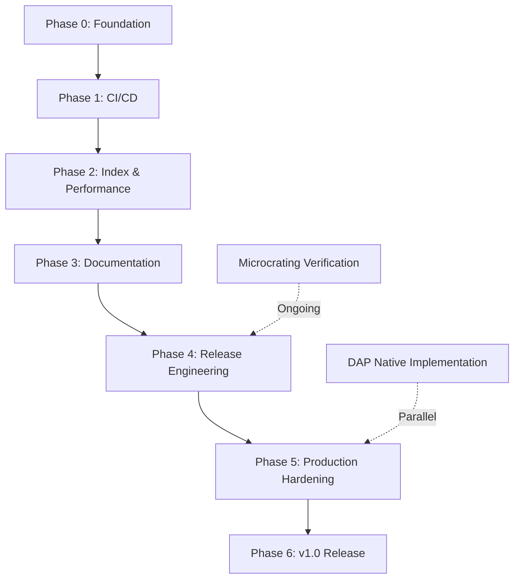
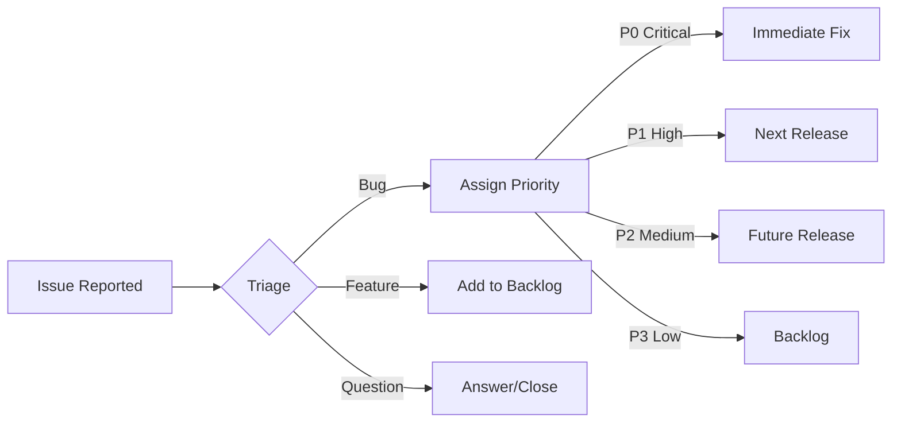
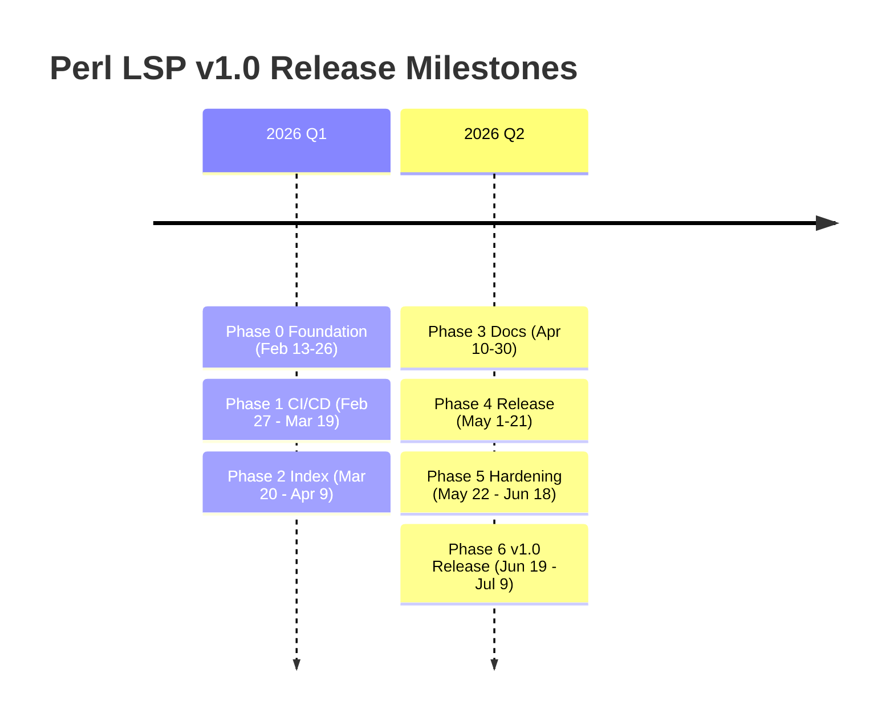
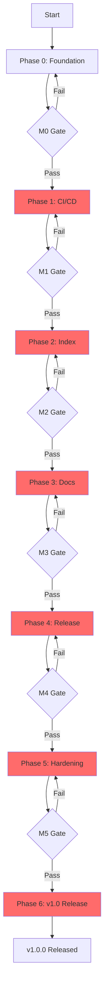

# Perl LSP v1.0 Release Roadmap

**Document Version**: 1.0
**Created**: 2026-02-13
**Target Release**: v1.0.0
**Current Version**: v0.9.0
**Status**: Planning Phase

---

## Executive Summary

This roadmap provides a comprehensive, actionable plan for releasing Perl LSP v1.0.0, building on the existing production readiness gap analysis and current project state at ~85-90% completion.

### Current State Highlights

| Component | Status | Coverage | Test Pass Rate |
|-----------|--------|----------|----------------|
| **perl-parser** | Production | ~100% | 530/530 lib |
| **perl-lsp** | Production | 100% (53/53) | 37/37 lib |
| **perl-dap** | Phase 1 | N/A | 9/9 lib |
| **Semantic Analyzer** | Production | 100% | N/A |
| **Mutation Score** | Production | 87% | N/A |

### Key Milestones

| Milestone | Target Date | Description |
|-----------|-------------|-------------|
| **M0: Foundation** | 2026-02-26 | Baseline metrics, ownership defined |
| **M1: CI/CD Optimization** | 2026-03-19 | Cost reduction, merge-blocking gates |
| **M2: Index & Performance** | 2026-04-09 | State machine, SLOs documented |
| **M3: Documentation** | 2026-04-30 | Complete docs, setup guides |
| **M4: Release Automation** | 2026-05-21 | Automated releases, multi-platform |
| **M5: Production Hardening** | 2026-06-18 | Security, performance validation |
| **M6: v1.0 Release** | 2026-07-09 | Full release, announcement |

### Critical Path

The critical path to v1.0 spans **21 weeks** with the following sequence:

1. **CI/CD Optimization** (3 weeks) - Blocks merge-blocking gates
2. **Index Lifecycle** (3 weeks) - Required for large workspaces
3. **Documentation** (3 weeks) - Required for user onboarding
4. **Release Automation** (3 weeks) - Required for v1.0 release
5. **Production Hardening** (4 weeks) - Final validation

**Parallel Work Streams:**
- DAP Native Implementation (6 weeks) - Can proceed independently
- Microcrating verification - Ongoing background task

### Success Metrics

| Metric | Current | Target | Status |
|--------|---------|--------|--------|
| CI Cost | $68/month | <$15/month | 🚧 Needs work |
| LSP Coverage | 100% | 93%+ | ✅ Complete |
| Test Count | 601 | 600+ | ✅ Complete |
| Clippy Warnings | 0 | 0 | ✅ Complete |
| missing_docs | 0 | 0 | ✅ Complete |

---

## Table of Contents

1. [Executive Summary](#executive-summary)
2. [Phase Breakdown](#phase-breakdown)
3. [Resource Requirements](#resource-requirements)
4. [Dependencies](#dependencies)
5. [Risk Mitigation](#risk-mitigation)
6. [Success Criteria & Quality Gates](#success-criteria--quality-gates)
7. [Communication Plan](#communication-plan)
8. [Post-Release Maintenance](#post-release-maintenance)
9. [Timeline Visualization](#timeline-visualization)
10. [Checkpoints & Decision Gates](#checkpoints--decision-gates)

---

## Phase Breakdown

### Phase 0: Foundation (Weeks 1-2)
**Dates**: 2026-02-13 to 2026-02-26
**Owner**: Project Lead
**Status**: Ready to Start

#### Objectives
- Establish baseline metrics and tracking
- Define ownership and responsibilities
- Set up communication channels
- Verify current state

#### Deliverables

| Deliverable | Due Date | Owner | Acceptance Criteria |
|-------------|----------|-------|---------------------|
| Baseline metrics report | 2026-02-17 | QA Engineer | All current metrics documented |
| Ownership matrix | 2026-02-17 | Project Lead | All components assigned |
| Communication channels setup | 2026-02-19 | Project Lead | Slack/Discord/Email configured |
| Current state verification | 2026-02-21 | Core Developer | `just ci-gate` passing |
| Tracking dashboard | 2026-02-24 | DevOps Engineer | Dashboard operational |

#### Action Items

**Week 1: Assessment**
- [ ] Run full test suite and document baseline metrics
- [ ] Audit current crate structure and dependencies
- [ ] Create ownership matrix for all components
- [ ] Set up project tracking dashboard

**Week 2: Setup**
- [ ] Establish communication channels (Slack/Discord)
- [ ] Configure notification systems
- [ ] Create decision-making process document
- [ ] Verify all documentation is up-to-date

#### Success Criteria
- ✅ All baseline metrics documented and verified
- ✅ Clear ownership defined for all components
- ✅ Communication channels operational
- ✅ Tracking dashboard functional

---

### Phase 1: CI/CD Optimization (Weeks 3-5)
**Dates**: 2026-02-27 to 2026-03-19
**Owner**: DevOps Engineer
**Dependencies**: Phase 0 complete
**Status**: Blocked by Phase 0

#### Objectives
- Reduce CI costs from $68/month to <$15/month
- Implement merge-blocking gates
- Consolidate workflows from 3,079 to ~1,500 lines
- Establish performance baseline tracking

#### Deliverables

| Deliverable | Due Date | Owner | Acceptance Criteria |
|-------------|----------|-------|---------------------|
| Workflow audit report | 2026-03-03 | DevOps Engineer | All 21 workflows analyzed |
| Consolidated workflows | 2026-03-07 | DevOps Engineer | Reduced to ~1,500 lines |
| Merge-blocking gates | 2026-03-12 | DevOps Engineer | Gates operational |
| Cost optimization | 2026-03-17 | DevOps Engineer | Cost <$15/month |
| Performance tracking | 2026-03-19 | Core Developer | Baselines tracked |

#### Action Items

**Week 3: Cleanup**
- [ ] Audit all 21 workflows for redundancy
- [ ] Identify consolidation opportunities
- [ ] Design caching strategy
- [ ] Plan runner optimization

**Week 4: Gates**
- [ ] Implement PR branch protection rules
- [ ] Set up required status checks
- [ ] Configure merge-blocking gates
- [ ] Add gate failure notifications

**Week 5: Optimization**
- [ ] Implement cost tracking
- [ ] Optimize resource usage
- [ ] Add performance baseline tracking
- [ ] Set up CI cost alerts

#### Success Criteria
- ✅ CI cost reduced to $10-15/month (88% reduction)
- ✅ Merge-blocking gates operational
- ✅ Workflows consolidated to ~1,500 lines
- ✅ Performance baselines tracked

#### Risk Mitigation
- Keep old workflows as fallback during transition
- Gradual rollout of merge-blocking gates
- Monitor for false positives in gate failures

---

### Phase 2: Index Lifecycle & Performance (Weeks 6-8)
**Dates**: 2026-03-20 to 2026-04-09
**Owner**: Core Developer
**Dependencies**: Phase 1 complete
**Status**: Blocked by Phase 1

#### Objectives
- Implement index state machine (Building/Ready/Degraded)
- Add bounded caches with LRU eviction
- Document performance SLOs
- Implement early-exit caps

#### Deliverables

| Deliverable | Due Date | Owner | Acceptance Criteria |
|-------------|----------|-------|---------------------|
| IndexState enum | 2026-03-24 | Core Developer | Implemented and tested |
| State transition logic | 2026-03-26 | Core Developer | All transitions covered |
| Graceful degradation | 2026-03-28 | Core Developer | Handlers degrade properly |
| LRU cache implementation | 2026-04-02 | Core Developer | AST and symbol caches |
| Performance SLOs | 2026-04-07 | Core Developer | Documented |
| Early-exit caps | 2026-04-09 | Core Developer | Implemented |

#### Action Items

**Week 6: State Machine**
- [ ] Implement `IndexState` enum
- [ ] Add state transition logic
- [ ] Implement graceful degradation handlers
- [ ] Add state change logging

**Week 7: Bounded Caches**
- [ ] Implement LRU cache for AST cache
- [ ] Implement LRU cache for symbol cache
- [ ] Add cache eviction logic
- [ ] Document resource limits

**Week 8: Performance SLOs**
- [ ] Document P95 completion <50ms
- [ ] Document P95 definition <30ms
- [ ] Implement early-exit caps
- [ ] Add performance regression tests

#### Success Criteria
- ✅ Index state machine operational
- ✅ Bounded caches with eviction
- ✅ Performance SLOs documented
- ✅ Early-exit caps implemented

#### Risk Mitigation
- Test with large workspaces
- Monitor cache hit rates
- Gradual rollout of early-exit caps

---

### Phase 3: Documentation & User Experience (Weeks 9-11)
**Dates**: 2026-04-10 to 2026-04-30
**Owner**: Documentation Writer
**Dependencies**: Phase 2 complete
**Status**: Blocked by Phase 2

#### Objectives
- Create editor setup guides (VS Code, Neovim, Emacs)
- Document configuration schema
- Complete performance SLO documentation
- Extend `missing_docs` enforcement to workspace

#### Deliverables

| Deliverable | Due Date | Owner | Acceptance Criteria |
|-------------|----------|-------|---------------------|
| VS Code setup guide | 2026-04-14 | Doc Writer | Tested and verified |
| Neovim setup guide | 2026-04-16 | Doc Writer | Tested and verified |
| Emacs setup guide | 2026-04-18 | Doc Writer | Tested and verified |
| Configuration schema | 2026-04-21 | Doc Writer | JSON schema documented |
| Performance tuning guide | 2026-04-23 | Core Developer | Complete guide |
| Quick start guide | 2026-04-25 | Doc Writer | <5 minute setup |
| Migration guide v0.8.x | 2026-04-28 | Doc Writer | Complete migration path |
| Documentation polish | 2026-04-30 | Doc Writer | All guides reviewed |

#### Action Items

**Week 9: Editor Guides**
- [ ] Create VS Code setup guide
- [ ] Create Neovim setup guide
- [ ] Create Emacs setup guide
- [ ] Add troubleshooting sections

**Week 10: Configuration**
- [ ] Document configuration schema
- [ ] Add performance tuning guide
- [ ] Create quick start guide
- [ ] Add migration guide from v0.8.x

**Week 11: Polish**
- [ ] Review and update all guides
- [ ] Add screenshots and examples
- [ ] Extend `missing_docs` enforcement
- [ ] Create video tutorials (optional)

#### Success Criteria
- ✅ All major editors documented
- ✅ Configuration schema documented
- ✅ Performance SLOs documented
- ✅ User can set up in <5 minutes

#### Risk Mitigation
- Get feedback from beta users
- Test setup guides on fresh systems
- Keep documentation versioned

---

### Phase 4: Release Engineering (Weeks 12-14)
**Dates**: 2026-05-01 to 2026-05-21
**Owner**: DevOps Engineer
**Dependencies**: Phase 3 complete
**Status**: Blocked by Phase 3

#### Objectives
- Automate release process
- Set up multi-platform binary distribution
- Automate package manager updates
- Enable release in <30 minutes

#### Deliverables

| Deliverable | Due Date | Owner | Acceptance Criteria |
|-------------|----------|-------|---------------------|
| Version bump automation | 2026-05-05 | DevOps Engineer | Automated via cargo-release |
| Changelog generation | 2026-05-07 | DevOps Engineer | Auto-generated |
| Release notes automation | 2026-05-09 | DevOps Engineer | GitHub release configured |
| Multi-platform builds | 2026-05-14 | DevOps Engineer | 6 platforms supported |
| Binary packaging | 2026-05-16 | DevOps Engineer | Automated packaging |
| Homebrew automation | 2026-05-18 | DevOps Engineer | Formula updates automated |
| APT repository | 2026-05-20 | DevOps Engineer | Repository configured |
| Release test | 2026-05-21 | QA Engineer | Full release tested |

#### Action Items

**Week 12: Automation**
- [ ] Automate version bumping
- [ ] Automate changelog generation
- [ ] Set up automated release notes
- [ ] Configure GitHub release automation

**Week 13: Distribution**
- [ ] Set up multi-platform builds (6 platforms)
- [ ] Automate binary packaging
- [ ] Configure asset uploads
- [ ] Test all platform builds

**Week 14: Package Managers**
- [ ] Automate Homebrew formula updates
- [ ] Set up APT repository
- [ ] Configure crates.io publishing
- [ ] Add release announcement templates

#### Success Criteria
- ✅ Fully automated release process
- ✅ Multi-platform binary distribution
- ✅ Package manager automation
- ✅ Release can be done in <30 minutes

#### Risk Mitigation
- Test release process on staging
- Keep manual release as backup
- Document rollback procedure

---

### Phase 5: Production Hardening (Weeks 15-18)
**Dates**: 2026-05-22 to 2026-06-18
**Owner**: QA Engineer + Security Reviewer
**Dependencies**: Phase 4 complete
**Status**: Blocked by Phase 4

#### Objectives
- Final security audit and validation
- Full performance benchmark suite
- Comprehensive integration testing
- User acceptance testing

#### Deliverables

| Deliverable | Due Date | Owner | Acceptance Criteria |
|-------------|----------|-------|---------------------|
| Security audit | 2026-05-26 | Security Reviewer | No critical findings |
| Dependency vulnerability scan | 2026-05-28 | Security Reviewer | Zero vulnerabilities |
| Performance benchmark suite | 2026-06-02 | Core Developer | All benchmarks passing |
| Load testing | 2026-06-04 | QA Engineer | Large workspaces tested |
| Memory leak detection | 2026-06-06 | QA Engineer | No leaks detected |
| E2E test suite | 2026-06-09 | QA Engineer | All tests passing |
| Cross-platform validation | 2026-06-11 | QA Engineer | All platforms validated |
| Editor integration testing | 2026-06-13 | QA Engineer | VS Code, Neovim, Emacs |
| User acceptance testing | 2026-06-16 | QA Engineer | Beta users satisfied |
| Release materials | 2026-06-18 | Doc Writer | All materials ready |

#### Action Items

**Week 15: Security**
- [ ] Final security audit
- [ ] Dependency vulnerability scan
- [ ] Penetration testing (if applicable)
- [ ] Security documentation review

**Week 16: Performance**
- [ ] Full performance benchmark suite
- [ ] Load testing with large workspaces
- [ ] Memory leak detection
- [ ] Performance regression testing

**Week 17: Integration**
- [ ] Full E2E test suite
- [ ] Cross-platform validation
- [ ] Editor integration testing
- [ ] User acceptance testing

**Week 18: Preparation**
- [ ] Final documentation review
- [ ] Release notes preparation
- [ ] Announcement materials
- [ ] Support documentation

#### Success Criteria
- ✅ All security audits passed
- ✅ Performance benchmarks validated
- ✅ All integration tests passing
- ✅ Release materials ready

#### Risk Mitigation
- Have rollback plan ready
- Keep support team informed
- Monitor for issues post-release

---

### Phase 6: v1.0 Release (Week 19)
**Dates**: 2026-06-19 to 2026-07-09
**Owner**: Project Lead
**Dependencies**: Phase 5 complete
**Status**: Blocked by Phase 5

#### Objectives
- Execute v1.0.0 release
- Publish to all distribution channels
- Announce release to community
- Monitor initial adoption

#### Deliverables

| Deliverable | Due Date | Owner | Acceptance Criteria |
|-------------|----------|-------|---------------------|
| Release execution | 2026-06-23 | Project Lead | v1.0.0 tagged and published |
| crates.io publish | 2026-06-25 | DevOps Engineer | All crates published |
| Binary distribution | 2026-06-27 | DevOps Engineer | All platforms available |
| Homebrew formula | 2026-06-28 | DevOps Engineer | Formula updated |
| APT repository | 2026-06-29 | DevOps Engineer | Packages available |
| Release announcement | 2026-07-02 | Doc Writer | Announcement published |
| Community outreach | 2026-07-05 | Project Lead | Social media, forums |
| Support documentation | 2026-07-07 | Doc Writer | Support docs published |
| Post-release monitoring | 2026-07-09 | QA Engineer | No critical issues |

#### Action Items

**Week 19: Release**
- [ ] Execute automated release process
- [ ] Verify all artifacts published
- [ ] Publish release announcement
- [ ] Community outreach
- [ ] Monitor initial feedback
- [ ] Address any critical issues

#### Success Criteria
- ✅ v1.0.0 successfully released
- ✅ All distribution channels updated
- ✅ Community announcement published
- ✅ No critical issues in first week

#### Risk Mitigation
- Have hotfix process ready
- Monitor for issues continuously
- Quick response to critical bugs

---

## Resource Requirements

### Personnel Allocation

| Role | Allocation | Duration | Key Responsibilities |
|------|------------|----------|---------------------|
| **Project Lead** | 25% | 19 weeks | Overall coordination, decision making, release execution |
| **Core Developer** | 50% | 15 weeks | CI/CD, index lifecycle, performance, release engineering |
| **DevOps Engineer** | 75% | 12 weeks | CI/CD optimization, release automation, distribution |
| **Documentation Writer** | 50% | 8 weeks | Editor guides, configuration docs, release materials |
| **QA Engineer** | 50% | 10 weeks | Testing, validation, user acceptance |
| **Security Reviewer** | 25% | 4 weeks | Security audits, vulnerability scanning |

### Infrastructure Requirements

| Resource | Quantity | Duration | Monthly Cost |
|----------|-----------|----------|--------------|
| **GitHub Actions** | Optimized | Ongoing | $10-15 |
| **Test Runners** | Standard | Ongoing | Included |
| **Artifact Storage** | 10GB | Ongoing | $0.25 |
| **Package Repositories** | crates.io, Homebrew, APT | Ongoing | Free |
| **Monitoring** | Basic | Ongoing | Free tier |

### Tools and Services

| Tool | Purpose | Cost | Notes |
|------|---------|------|-------|
| **cargo-release** | Release automation | Free | Required for automated releases |
| **nextest** | Test runner | Free | Faster test execution |
| **criterion** | Benchmarking | Free | Performance measurement |
| **cargo-semver-checks** | SemVer validation | Free | API stability |
| **dependabot** | Dependency updates | Free | Security updates |
| **codecov** | Coverage tracking | Free tier | Test coverage |

---

## Dependencies

### Internal Dependencies



### External Dependencies

| Dependency | Type | Impact | Mitigation |
|------------|------|--------|------------|
| **GitHub Actions** | Infrastructure | Critical | Optimize workflows, reduce cost |
| **crates.io** | Distribution | High | Maintain API tokens |
| **Homebrew** | Distribution | Medium | Automate formula updates |
| **APT Repository** | Distribution | Medium | Set up repository |
| **Perl::LanguageServer** | DAP Bridge | Low | Keep as fallback |
| **CPAN** | DAP Module | Medium | Devel::TSPerlDAP required |

### Blocker Resolution

| Blocker | Issue | Resolution Plan | Target Date |
|---------|-------|----------------|-------------|
| **CI Pipeline** | #211 | Consolidate workflows, optimize | 2026-03-19 |
| **Merge Gates** | #210 | Implement after CI cleanup | 2026-03-19 |
| **Index State Machine** | N/A | Implement in Phase 2 | 2026-04-09 |
| **Documentation** | #197 | Complete in Phase 3 | 2026-04-30 |

---

## Risk Mitigation

### Technical Risks

| Risk | Likelihood | Impact | Mitigation Strategy | Owner |
|------|------------|--------|-------------------|-------|
| **Performance Regression** | Medium | High | Continuous benchmarking, performance gates | Core Developer |
| **Breaking Changes** | Low | High | Strict SemVer, deprecation policy | Project Lead |
| **Security Vulnerabilities** | Low | Critical | Regular audits, dependency scanning | Security Reviewer |
| **Cross-Platform Issues** | Medium | Medium | Extensive cross-platform testing | QA Engineer |
| **Large Workspace Performance** | Medium | Medium | Bounded caches, early-exit caps | Core Developer |
| **CI/CD Failures** | Medium | High | Gradual rollout, fallback workflows | DevOps Engineer |

### Process Risks

| Risk | Likelihood | Impact | Mitigation Strategy | Owner |
|------|------------|--------|-------------------|-------|
| **Timeline Overrun** | Medium | Medium | Regular checkpoints, scope management | Project Lead |
| **Resource Constraints** | Medium | Medium | Prioritize P0/P1 items | Project Lead |
| **Team Availability** | Low | Medium | Clear ownership, documentation | Project Lead |
| **User Adoption** | Low | Medium | Early feedback, documentation | Doc Writer |
| **Maintenance Burden** | Medium | Low | Automated testing, clear architecture | Core Developer |

### External Risks

| Risk | Likelihood | Impact | Mitigation Strategy | Owner |
|------|------------|--------|-------------------|-------|
| **Dependency Changes** | Medium | Medium | Pin versions, regular updates | DevOps Engineer |
| **Platform Changes** | Low | Medium | Monitor platform updates | DevOps Engineer |
| **Competitive Pressure** | Low | Low | Focus on differentiation | Project Lead |
| **Community Feedback** | Medium | Low | Early engagement, responsiveness | Project Lead |

### Contingency Plans

| Scenario | Trigger | Response Plan | Timeline |
|----------|---------|--------------|----------|
| **CI Cost Overrun** | Cost >$20/month for 2 weeks | Further workflow optimization | 1 week |
| **Critical Bug Found** | Bug in production code | Hotfix process, rollback if needed | 24 hours |
| **Team Member Unavailable** | Unplanned absence | Reassign tasks, adjust timeline | Immediate |
| **Performance Regression** | >10% degradation | Rollback, investigate, fix | 48 hours |
| **Security Vulnerability** | CVE reported | Immediate patch, security advisory | 24 hours |

---

## Success Criteria & Quality Gates

### Production Readiness Gates

| Gate | Criteria | Measurement | Target | Current | Status |
|------|----------|-------------|--------|---------|--------|
| **Parser Coverage** | Perl 5 syntax coverage | Corpus test pass rate | ~100% | ~100% | ✅ |
| **LSP Coverage** | Advertised features | features.toml analysis | 93%+ | 100% | ✅ |
| **Test Coverage** | Library tests | `cargo test --workspace --lib` | 600+ | 601 | ✅ |
| **Mutation Score** | Code quality | Mutation testing | 87%+ | 87% | ✅ |
| **Clippy Warnings** | Code quality | `cargo clippy --workspace` | 0 | 0 | ✅ |
| **missing_docs** | Documentation | `cargo doc --no-deps -p perl-parser` | 0 | 0 | ✅ |
| **CI Cost** | Operational cost | GitHub Actions billing | <$15 | $68 | 🚧 |
| **Index State Machine** | Index lifecycle | Code review + tests | Complete | Pending | 🚧 |
| **Performance SLOs** | Performance targets | Documentation review | Documented | Pending | 🚧 |
| **Editor Setup** | User onboarding | Documentation review | Complete | Pending | 🚧 |
| **Release Automation** | Release process | Release test | Automated | Partial | 🚧 |
| **Security Audit** | Security | Security review | Passed | Pending | 🚧 |

### Quality Metrics

| Metric | Target | Measurement Method | Frequency |
|--------|--------|-------------------|-----------|
| **LSP Response Time (P95)** | <50ms | Benchmark suite | Weekly |
| **Definition Time (P95)** | <30ms | Benchmark suite | Weekly |
| **Incremental Parsing** | <1ms | Benchmark suite | Weekly |
| **Memory Usage** | <100MB | Memory profiling | Weekly |
| **Startup Time** | <500ms | Benchmark suite | Weekly |
| **Test Execution Time** | <10min | CI timing | Per commit |
| **Build Time** | <5min | CI timing | Per commit |
| **Code Coverage** | 80%+ | codecov | Weekly |

### User Experience Metrics

| Metric | Target | Measurement Method |
|--------|--------|-------------------|
| **Setup Time** | <5 minutes | User testing |
| **First Useful Result** | <30 seconds | User testing |
| **Documentation Completeness** | 100% of advertised features | Documentation audit |
| **Error Message Clarity** | 90%+ actionable | User feedback |
| **Editor Compatibility** | VS Code, Neovim, Emacs | Integration testing |

### Quality Gates by Phase

| Phase | Gate | Criteria | Exit Condition |
|-------|------|----------|----------------|
| **Phase 0** | Foundation Complete | All deliverables met | All checklist items complete |
| **Phase 1** | CI/CD Optimized | Cost <$15, gates operational | Cost verified, gates tested |
| **Phase 2** | Index Complete | State machine, SLOs | All tests passing |
| **Phase 3** | Docs Complete | All editors documented | User testing successful |
| **Phase 4** | Release Ready | Automated releases | Full release test passed |
| **Phase 5** | Production Ready | All audits passed | No critical issues |
| **Phase 6** | v1.0 Released | All channels updated | Announcement published |

---

## Communication Plan

### Stakeholder Analysis

| Stakeholder | Interest | Influence | Communication Needs |
|-------------|----------|------------|---------------------|
| **Core Team** | High | High | Daily updates, technical details |
| **Beta Users** | High | Medium | Weekly updates, feature previews |
| **Community** | Medium | Medium | Bi-weekly updates, progress reports |
| **Contributors** | High | Medium | Weekly updates, task assignments |
| **Management** | Medium | High | Monthly reports, milestone reviews |

### Communication Channels

| Channel | Purpose | Frequency | Audience | Owner |
|---------|---------|-----------|----------|-------|
| **Slack/Discord** | Daily coordination | Daily | Core team | Project Lead |
| **GitHub Issues** | Task tracking | Ongoing | Contributors | Core Developer |
| **GitHub Discussions** | Community engagement | Weekly | Community | Project Lead |
| **Weekly Status Email** | Progress report | Weekly | All stakeholders | Project Lead |
| **Monthly Newsletter** | Milestone updates | Monthly | Community | Doc Writer |
| **Release Announcement** | v1.0 launch | One-time | Public | Doc Writer |

### Communication Schedule

| Date | Milestone | Communication | Audience |
|------|-----------|---------------|----------|
| 2026-02-13 | Phase 0 Start | Kickoff announcement | Core team |
| 2026-02-26 | M0 Complete | Foundation complete | All stakeholders |
| 2026-03-19 | M1 Complete | CI/CD optimized | All stakeholders |
| 2026-04-09 | M2 Complete | Index & performance | All stakeholders |
| 2026-04-30 | M3 Complete | Documentation complete | All stakeholders |
| 2026-05-21 | M4 Complete | Release automation | All stakeholders |
| 2026-06-18 | M5 Complete | Production ready | All stakeholders |
| 2026-07-09 | v1.0 Release | Release announcement | Public |

### Announcement Templates

#### Phase Completion Announcement

```markdown
## Phase X Complete: [Phase Name]

**Status**: ✅ Complete
**Date**: [Date]
**Duration**: [X] weeks

### Summary
[Brief summary of what was accomplished]

### Key Deliverables
- [Deliverable 1]
- [Deliverable 2]
- [Deliverable 3]

### Metrics
- [Metric 1]: [Value]
- [Metric 2]: [Value]

### Next Steps
[Brief description of next phase]

### Links
- [Detailed report](link)
- [Tracking dashboard](link)
```

#### v1.0 Release Announcement

```markdown
## 🎉 Perl LSP v1.0.0 Released

We are excited to announce the release of Perl LSP v1.0.0!

### What's New
- [Feature 1]
- [Feature 2]
- [Feature 3]

### Installation
```bash
cargo install perl-lsp
```

### Documentation
- [Quick Start Guide](link)
- [Editor Setup](link)
- [API Documentation](link)

### Upgrade from v0.8.x
See [Migration Guide](link) for upgrade instructions.

### Thank You
Special thanks to all contributors who made this release possible!

### Links
- [Release Notes](link)
- [GitHub](link)
- [Documentation](link)
```

### Feedback Collection

| Method | Purpose | Frequency | Owner |
|--------|---------|-----------|-------|
| **Beta User Surveys** | User experience | Monthly | QA Engineer |
| **GitHub Issues** | Bug reports | Ongoing | Community |
| **GitHub Discussions** | Feature requests | Ongoing | Community |
| **User Interviews** | Deep feedback | Quarterly | Project Lead |

---

## Post-Release Maintenance

### Maintenance Strategy

#### Release Cadence

| Release Type | Frequency | Purpose | Examples |
|--------------|-----------|---------|----------|
| **Major** | 12-18 months | Breaking changes, major features | v2.0.0 |
| **Minor** | 3-6 months | New features, enhancements | v1.1.0, v1.2.0 |
| **Patch** | As needed | Bug fixes, security updates | v1.0.1, v1.0.2 |

#### Support Policy

| Version | Support Status | End of Life | Security Updates |
|---------|----------------|-------------|------------------|
| **v1.x** | Active | TBA | Yes |
| **v0.9.x** | Maintenance | 2026-09-01 | Critical only |
| **v0.8.x** | Deprecated | 2026-03-01 | No |

### Maintenance Activities

#### Weekly Tasks

- [ ] Monitor GitHub issues and PRs
- [ ] Review and merge PRs (after gates pass)
- [ ] Check CI/CD health
- [ ] Review security alerts
- [ ] Update tracking dashboard

#### Monthly Tasks

- [ ] Review and update documentation
- [ ] Performance benchmark review
- [ ] Dependency updates (via dependabot)
- [ ] Community feedback review
- [ ] Monthly status report

#### Quarterly Tasks

- [ ] Security audit
- [ ] Performance regression review
- [ ] User satisfaction survey
- [ ] Roadmap review and update
- [ ] Contributor recognition

### Issue Triage Process



#### Priority Definitions

| Priority | Response Time | Fix Target | Examples |
|----------|----------------|------------|----------|
| **P0 Critical** | 24 hours | 48 hours | Security vulnerability, data loss |
| **P1 High** | 1 week | 2 weeks | Crash, major feature broken |
| **P2 Medium** | 2 weeks | 1 month | Minor bugs, usability issues |
| **P3 Low** | 1 month | Future | Enhancements, nice-to-have |

### Hotfix Process

| Step | Action | Owner | Timeline |
|------|--------|-------|----------|
| 1 | Identify critical issue | QA Engineer | Immediate |
| 2 | Create hotfix branch | Core Developer | 1 hour |
| 3 | Implement fix | Core Developer | 4-8 hours |
| 4 | Test fix | QA Engineer | 2-4 hours |
| 5 | Security review (if needed) | Security Reviewer | 2 hours |
| 6 | Release hotfix | DevOps Engineer | 1 hour |
| 7 | Announce hotfix | Doc Writer | 1 hour |

### Monitoring and Alerting

| Metric | Alert Threshold | Notification | Escalation |
|--------|----------------|--------------|------------|
| **CI Failure Rate** | >10% | Slack | 1 hour |
| **Test Failure** | Any | Slack | Immediate |
| **Security Vulnerability** | Critical | Email/Slack | Immediate |
| **Performance Regression** | >10% | Slack | 1 hour |
| **Critical Bug Report** | P0 | Email/Slack | Immediate |

### Documentation Maintenance

| Document | Update Frequency | Owner |
|----------|------------------|-------|
| **README.md** | Per release | Doc Writer |
| **CHANGELOG.md** | Per release | DevOps Engineer |
| **API Documentation** | Per release | Core Developer |
| **User Guides** | Quarterly | Doc Writer |
| **Release Notes** | Per release | Doc Writer |

### Dependency Management

| Task | Frequency | Tool | Owner |
|------|-----------|------|-------|
| **Dependency Updates** | Weekly | dependabot | DevOps Engineer |
| **Security Scanning** | Weekly | cargo-audit | Security Reviewer |
| **License Compliance** | Monthly | cargo-deny | DevOps Engineer |
| **Version Pinning** | Per release | Cargo.toml | Core Developer |

### Community Engagement

| Activity | Frequency | Owner |
|----------|-----------|-------|
| **GitHub Issues Response** | Daily | Core team |
| **Discussions Engagement** | Weekly | Project Lead |
| **Blog Posts** | Monthly | Doc Writer |
| **Conference Talks** | Quarterly | Project Lead |
| **Contributor Recognition** | Monthly | Project Lead |

### Long-term Roadmap Considerations

#### Post v1.0 Features (Future)

| Feature | Priority | Estimated Effort | Timeline |
|---------|----------|------------------|----------|
| **Native DAP Phase 2/3** | P1 | 6 weeks | Q4 2026 |
| **Full LSP 3.18 Compliance** | P2 | 4 weeks | Q1 2027 |
| **Advanced Refactoring** | P2 | 8 weeks | Q2 2027 |
| **Workspace-wide Analysis** | P2 | 6 weeks | Q2 2027 |
| **Performance Optimizations** | P1 | Ongoing | Continuous |

#### Technical Debt Tracking

| Debt Item | Priority | Impact | Planned Resolution |
|-----------|----------|--------|-------------------|
| **Legacy Parser (v2)** | P3 | Low | Keep for compatibility |
| **Ignored Tests** | P2 | Medium | Address in v1.1 |
| **Documentation Gaps** | P1 | High | Address in v1.0 |
| **CI Optimization** | P0 | High | Address in v1.0 |

---

## Timeline Visualization

### Gantt Chart

```mermaid
gantt
    title Perl LSP v1.0 Release Timeline
    dateFormat YYYY-MM-DD
    axisFormat %b %d

    section Phase 0
    Foundation           :p0, 2026-02-13, 2w

    section Phase 1
    CI/CD Optimization   :p1, 2026-02-27, 3w
    :p1crit, 2026-03-19, 0d

    section Phase 2
    Index & Performance  :p2, 2026-03-20, 3w
    :p2crit, 2026-04-09, 0d

    section Phase 3
    Documentation        :p3, 2026-04-10, 3w
    :p3crit, 2026-04-30, 0d

    section Phase 4
    Release Engineering  :p4, 2026-05-01, 3w
    :p4crit, 2026-05-21, 0d

    section Phase 5
    Production Hardening :p5, 2026-05-22, 4w
    :p5crit, 2026-06-18, 0d

    section Phase 6
    v1.0 Release         :p6, 2026-06-19, 3w
    :p6crit, 2026-07-09, 0d
```

### Milestone Timeline



### Critical Path Visualization



---

## Checkpoints & Decision Gates

### Weekly Checkpoints

| Week | Date | Review Items | Decision | Owner |
|------|------|--------------|----------|-------|
| 1 | 2026-02-20 | Foundation progress | Continue/Pivot | Project Lead |
| 2 | 2026-02-27 | M0 Gate | Go/No-Go | Project Lead |
| 3 | 2026-03-06 | CI audit progress | Continue/Pivot | DevOps Engineer |
| 4 | 2026-03-13 | Gates implementation | Continue/Pivot | DevOps Engineer |
| 5 | 2026-03-20 | M1 Gate | Go/No-Go | Project Lead |
| 6 | 2026-03-27 | Index state machine | Continue/Pivot | Core Developer |
| 7 | 2026-04-03 | Caches implementation | Continue/Pivot | Core Developer |
| 8 | 2026-04-10 | M2 Gate | Go/No-Go | Project Lead |
| 9 | 2026-04-17 | Editor guides | Continue/Pivot | Doc Writer |
| 10 | 2026-04-24 | Configuration docs | Continue/Pivot | Doc Writer |
| 11 | 2026-05-01 | M3 Gate | Go/No-Go | Project Lead |
| 12 | 2026-05-08 | Release automation | Continue/Pivot | DevOps Engineer |
| 13 | 2026-05-15 | Multi-platform builds | Continue/Pivot | DevOps Engineer |
| 14 | 2026-05-22 | M4 Gate | Go/No-Go | Project Lead |
| 15 | 2026-05-29 | Security audit | Continue/Pivot | Security Reviewer |
| 16 | 2026-06-05 | Performance validation | Continue/Pivot | QA Engineer |
| 17 | 2026-06-12 | Integration testing | Continue/Pivot | QA Engineer |
| 18 | 2026-06-19 | M5 Gate | Go/No-Go | Project Lead |
| 19 | 2026-06-26 | Release execution | Continue/Pivot | Project Lead |
| 20 | 2026-07-03 | Post-release monitoring | Continue/Pivot | QA Engineer |
| 21 | 2026-07-10 | v1.0 Complete | Success | Project Lead |

### Milestone Gates

#### M0: Foundation Gate (2026-02-26)

**Go Criteria:**
- [ ] Baseline metrics documented
- [ ] Ownership matrix complete
- [ ] Communication channels operational
- [ ] Tracking dashboard functional

**No-Go Triggers:**
- Critical dependencies missing
- Team availability issues
- Resource constraints

**Decision Maker:** Project Lead

---

#### M1: CI/CD Gate (2026-03-19)

**Go Criteria:**
- [ ] CI cost <$15/month
- [ ] Merge-blocking gates operational
- [ ] Workflows consolidated
- [ ] Performance baselines tracked

**No-Go Triggers:**
- CI cost >$20/month
- Gates causing false positives
- Workflow consolidation incomplete

**Decision Maker:** Project Lead + DevOps Engineer

---

#### M2: Index & Performance Gate (2026-04-09)

**Go Criteria:**
- [ ] Index state machine operational
- [ ] Bounded caches with eviction
- [ ] Performance SLOs documented
- [ ] Early-exit caps implemented

**No-Go Triggers:**
- State machine incomplete
- Cache performance issues
- SLOs not met

**Decision Maker:** Project Lead + Core Developer

---

#### M3: Documentation Gate (2026-04-30)

**Go Criteria:**
- [ ] All major editors documented
- [ ] Configuration schema documented
- [ ] Performance SLOs documented
- [ ] User can set up in <5 minutes

**No-Go Triggers:**
- Missing editor guides
- Setup time >10 minutes
- Documentation incomplete

**Decision Maker:** Project Lead + Documentation Writer

---

#### M4: Release Automation Gate (2026-05-21)

**Go Criteria:**
- [ ] Fully automated release process
- [ ] Multi-platform binary distribution
- [ ] Package manager automation
- [ ] Release test passed

**No-Go Triggers:**
- Manual steps required
- Platform build failures
- Package manager issues

**Decision Maker:** Project Lead + DevOps Engineer

---

#### M5: Production Hardening Gate (2026-06-18)

**Go Criteria:**
- [ ] All security audits passed
- [ ] Performance benchmarks validated
- [ ] All integration tests passing
- [ ] Release materials ready

**No-Go Triggers:**
- Critical security findings
- Performance regression
- Test failures

**Decision Maker:** Project Lead + QA Engineer + Security Reviewer

---

#### M6: v1.0 Release Gate (2026-07-09)

**Go Criteria:**
- [ ] v1.0.0 successfully released
- [ ] All distribution channels updated
- [ ] Community announcement published
- [ ] No critical issues in first week

**No-Go Triggers:**
- Critical bugs found
- Distribution failures
- Major issues reported

**Decision Maker:** Project Lead

---

## Appendices

### A. Related Documents

| Document | Location | Purpose |
|----------|----------|---------|
| Production Readiness Roadmap | [`production_readiness_roadmap.md`](production_readiness_roadmap.md) | Detailed gap analysis |
| Current Status | [`docs/CURRENT_STATUS.md`](../docs/CURRENT_STATUS.md) | Live metrics |
| Project Roadmap | [`docs/ROADMAP.md`](../docs/ROADMAP.md) | High-level roadmap |
| Release Checklist | [`docs/RELEASE_READY_CHECKLIST.md`](../docs/RELEASE_READY_CHECKLIST.md) | Release verification |
| Stability Policy | [`docs/STABILITY.md`](../docs/STABILITY.md) | API stability |
| CI Audit | [`docs/CI_AUDIT.md`](../docs/CI_AUDIT.md) | CI analysis |

### B. Issue References

| Issue | Title | Priority | Phase |
|-------|-------|----------|-------|
| #211 | CI Pipeline Cleanup | P0-CRITICAL | Phase 1 |
| #210 | Merge-Blocking Gates | P0-CRITICAL | Phase 1 |
| #197 | Add Missing Documentation | P1-HIGH | Phase 3 |
| #207 | DAP Support | P2-MEDIUM | Parallel |
| #198 | Test Infrastructure Stabilization | P2-MEDIUM | Phase 5 |

### C. Glossary

| Term | Definition |
|------|------------|
| **GA-lock** | General Availability lock - formal stability guarantees for v1.0+ |
| **LSP** | Language Server Protocol |
| **DAP** | Debug Adapter Protocol |
| **SemVer** | Semantic Versioning |
| **MSRV** | Minimum Supported Rust Version |
| **SLO** | Service Level Objective |
| **P0/P1/P2/P3** | Priority levels (Critical/High/Medium/Low) |
| **CI/CD** | Continuous Integration/Continuous Deployment |
| **LRU** | Least Recently Used (cache eviction policy) |

### D. Contact Information

| Role | Name | Email | Slack |
|------|------|-------|-------|
| Project Lead | TBD | TBD | TBD |
| Core Developer | TBD | TBD | TBD |
| DevOps Engineer | TBD | TBD | TBD |
| Documentation Writer | TBD | TBD | TBD |
| QA Engineer | TBD | TBD | TBD |
| Security Reviewer | TBD | TBD | TBD |

### E. Change Log

| Version | Date | Changes |
|---------|------|---------|
| 1.0 | 2026-02-13 | Initial release roadmap |

---

## Conclusion

This roadmap provides a comprehensive, actionable plan for releasing Perl LSP v1.0.0. The project is currently at **~85-90% production readiness** with core functionality complete. The remaining 10-15% focuses on:

1. **CI/CD optimization** (3 weeks) - Critical for production hardening
2. **Index lifecycle completion** (3 weeks) - Required for large workspaces
3. **Documentation polish** (3 weeks) - Required for user onboarding
4. **Release automation** (3 weeks) - Required for v1.0 release
5. **Production hardening** (4 weeks) - Final validation

The **critical path** to v1.0 is **19 weeks**, with DAP native implementation proceeding in parallel.

### Key Success Factors

- Prioritize P0-CRITICAL items first
- Maintain backward compatibility
- Keep user feedback loop active
- Document all decisions
- Monitor metrics continuously

### Next Steps

1. ✅ Review and approve this roadmap
2. ⏳ Assign ownership for each phase
3. ⏳ Set up tracking and reporting
4. ⏳ Begin Phase 0: Foundation (2026-02-13)

---

*Document Version: 1.0*
*Created: 2026-02-13*
*Last Updated: 2026-02-13*
*Owner: Project Lead*
*Status: Planning Phase - Awaiting Approval*
