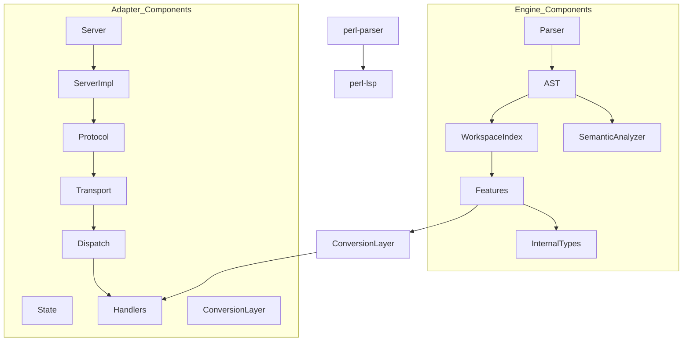

# Engine/Adapter Separation Migration Plan

## Executive Summary

This document outlines a comprehensive migration plan to separate the Perl Language Server implementation into two distinct components:

- **Engine (perl-parser)**: Core parsing and analysis capabilities, returning internal types
- **Adapter (perl-lsp)**: Protocol handling, message loop, capability negotiation, and process/FS-dependent behaviors

The primary goals of this refactoring are:
1. Enable wasm32 compilation of perl-parser for broader platform support
2. Establish clear architectural boundaries between engine and adapter responsibilities
3. Maintain backward compatibility during the migration process
4. Enable future use of the engine in non-LSP contexts (e.g., web-based tools)

## Current Architecture Analysis

### perl-parser Crate (Current State)

The `perl-parser` crate currently contains **58 files** under `src/lsp/` with all LSP logic:

```
crates/perl-parser/src/lsp/
├── dispatch.rs
├── fallback/
│   ├── mod.rs
│   └── text.rs
├── features/
│   ├── code_actions_enhanced.rs
│   ├── code_actions_pragmas.rs
│   ├── code_actions_provider.rs
│   ├── code_actions.rs
│   ├── code_lens_provider.rs
│   ├── completion.rs
│   ├── document_highlight.rs
│   ├── document_links.rs
│   ├── folding.rs
│   ├── formatting.rs
│   ├── implementation_provider.rs
│   ├── inlay_hints_provider.rs
│   ├── inlay_hints.rs
│   ├── inline_completions.rs
│   ├── linked_editing.rs
│   ├── lsp_document_link.rs
│   ├── lsp_on_type_formatting.rs
│   ├── references.rs
│   ├── rename.rs
│   ├── selection_range.rs
│   ├── semantic_tokens_provider.rs
│   ├── semantic_tokens.rs
│   ├── signature_help.rs
│   ├── type_hierarchy.rs
│   └── workspace_symbols.rs
├── handlers/
│   └── mod.rs
├── protocol/
│   ├── capabilities.rs
│   ├── errors.rs
│   └── jsonrpc.rs
├── server.rs
├── server_impl/
│   ├── diagnostics.rs
│   ├── dispatch.rs
│   ├── language/
│   │   ├── code_actions.rs
│   │   ├── colors.rs
│   │   ├── completion.rs
│   │   ├── formatting.rs
│   │   ├── hierarchy.rs
│   │   ├── hover.rs
│   │   ├── misc.rs
│   │   ├── navigation.rs
│   │   ├── references.rs
│   │   ├── rename.rs
│   │   ├── semantic_tokens.rs
│   │   └── virtual_content.rs
│   ├── lifecycle.rs
│   ├── mod.rs
│   ├── notebook.rs
│   ├── refresh.rs
│   ├── routing.rs
│   ├── text_sync.rs
│   ├── window.rs
│   └── workspace.rs
├── state/
│   ├── config.rs
│   ├── document.rs
│   ├── limits.rs
│   └── mod.rs
├── transport/
│   ├── framing.rs
│   └── mod.rs
└── utils/
    ├── mod.rs
    └── uri.rs
```

**Key observations:**
- **Already wasm32-gated modules**: `server.rs`, `server_impl/`, `transport/`, `lsp_document_link.rs` (4 modules)
- **Modules needing wasm32 gating**: `formatting.rs`, `completion.rs`, `state/config.rs`, `server_impl/lifecycle.rs`, `server_impl/workspace.rs`, `server_impl/language/virtual_content.rs` (6 modules)
- **Total LSP-related files**: 58 files

### perl-lsp Crate (Current State)

The `perl-lsp` crate is currently a **minimal binary wrapper** (~120 lines) that only:
- Parses CLI arguments
- Instantiates `LspServer` from perl-parser
- Calls `server.run()` method

```rust
// Current perl-lsp/src/main.rs (simplified)
use perl_parser::LspServer;
use std::env;
use std::process;

fn main() {
    let args: Vec<String> = env::args().collect();
    
    // Parse CLI arguments
    let mut use_stdio = true;
    let mut port = 9257;
    let mut enable_logging = false;
    
    // ... (argument parsing)
    
    // Create and run LSP server
    let mut server = LspServer::new();
    
    if use_stdio {
        if let Err(e) = server.run() {
            eprintln!("LSP server error: {}", e);
            std::process::exit(1);
        }
    }
}
```

## Target Architecture

### Engine (perl-parser) - Post-Migration

The `perl-parser` crate should contain **only engine logic**:

**Responsibilities:**
- Perl parsing (AST, incremental parsing, error recovery)
- Workspace indexing (symbol extraction, cross-file analysis)
- Feature engines that return internal types (not LSP types)
- Semantic analysis (variable resolution, scope tracking)
- Type system (AST node kinds, internal type definitions)
- Position tracking (UTF-8/UTF-16 conversion)

**What stays in perl-parser:**
- `src/lsp/features/` - Feature provider implementations (completion, diagnostics, hover, etc.)
- `src/lsp/handlers/` - Handler implementations
- `src/lsp/protocol/` - JSON-RPC types and error definitions
- `src/lsp/utils/` - Utility functions (URI parsing, position conversion)
- `src/lsp/state/` - Document and server state management
- Core parser, lexer, semantic analyzer modules

**What moves to perl-lsp:**
- `src/lsp/server.rs` - Server struct and main loop
- `src/lsp/server_impl/` - All LSP runtime logic
- `src/lsp/transport/` - Message framing and I/O
- `src/lsp/dispatch.rs` - Request routing
- `src/lsp/fallback/` - Fallback implementations

### Adapter (perl-lsp) - Post-Migration

The `perl-lsp` crate should contain **all protocol adapter logic**:

**Responsibilities:**
- LSP message loop (reading/writing JSON-RPC messages)
- Capability negotiation with clients
- Document synchronization (didOpen, didChange, didSave, etc.)
- Request routing to engine providers
- Client capability detection and tracking
- Process/FS operations (file watching, workspace management)
- LSP protocol error handling
- LSP initialization and shutdown lifecycle
- Configuration management (workspace folders, settings)
- Virtual document content serving (perldoc://)
- Test execution and test runner integration
- CLI argument parsing and binary entry point

**What moves from perl-parser:**
- All `server_impl/` modules
- All `transport/` modules
- All `dispatch/` modules
- All `state/` modules (config, document management)
- `fallback/` modules

## Migration Phases

### Phase 1: wasm32 Gating (Immediate Priority)

**Goal:** Enable wasm32 compilation of perl-parser by gating modules that use process spawning, filesystem operations, or other platform-specific APIs.

**Modules to gate:**

| Priority | Module | Path | Rationale |
|----------|--------|---------|----------|
| High | `formatting.rs` | `src/lsp/features/formatting.rs` | Uses `std::process::Command` to spawn perltidy |
| High | `state/config.rs` | `src/lsp/state/config.rs` | Uses `std::process::Command` to fetch @INC |
| High | `server_impl/lifecycle.rs` | `src/lsp/server_impl/lifecycle.rs` | Uses `std::process::Command` for tool detection |
| High | `server_impl/language/virtual_content.rs` | `src/lsp/server_impl/language/virtual_content.rs` | Uses `std::process::Command` to spawn perldoc |
| Medium | `server_impl/workspace.rs` | `src/lsp/server_impl/workspace.rs` | Uses `std::fs` operations for file watching |
| Medium | `completion.rs` | `src/lsp/features/completion.rs` | Uses `std::process::Command` for tool detection |

**Implementation approach:**
1. Add `#[cfg(not(target_arch = "wasm32"))]` gate to each module
2. Provide wasm32-compatible stub implementations for gated functions
3. Ensure all public APIs have wasm32-compatible alternatives

**Example pattern:**
```rust
// Before (in perl-parser/src/lsp/features/formatting.rs)
pub fn format_document(&self, content: &str, options: &FormattingOptions) -> Result<Vec<FormatTextEdit>, FormatError> {
    // Implementation using perltidy
}

// After gating (in perl-parser/src/lsp/features/formatting.rs)
#[cfg(not(target_arch = "wasm32"))]
pub fn format_document(&self, content: &str, options: &FormattingOptions) -> Result<Vec<FormatTextEdit>, FormatError> {
    Ok(vec![]) // Empty edits on wasm32
}

#[cfg(target_arch = "wasm32")]
pub fn format_document(&self, content: &str, options: &FormattingOptions) -> Result<Vec<FormatTextEdit>, FormatError> {
    Err(FormatError::PerltidyNotFound("formatting not available on wasm32".to_string()))
}
```

**Pre-merge validation:**
- `cargo check -p perl-parser`
- `cargo check -p perl-parser --target wasm32-unknown-unknown`
- Ensure no compilation errors or warnings

### Phase 2: LSP Conversion Cleanup

**Goal:** Remove LSP-specific conversion methods from engine code to establish clean separation.

**Modules affected:**
- `src/lsp/features/` - Various `to_lsp_kind()`, `to_lsp_completion_kind()` methods
- `src/lsp/handlers/` - Handler implementations with embedded LSP type conversions
- `src/lsp/protocol/` - Protocol type definitions

**Implementation approach:**
1. Create adapter-specific conversion modules in perl-lsp
2. Move `to_lsp_kind()` and similar methods to perl-lsp
3. Update engine code to use internal types, adapter converts to LSP types
4. Remove LSP-specific conversion code from engine

**Example pattern:**
```rust
// In perl-lsp (adapter layer)
pub fn to_lsp_completion_kind(kind: CompletionItemKind) -> lsp_types::CompletionItemKind {
    match kind {
        CompletionItemKind::Function => lsp_types::CompletionItemKind::Function,
        CompletionItemKind::Variable => lsp_types::CompletionItemKind::Variable,
        // ... other mappings
    }
}

// In perl-parser (engine layer)
pub fn get_completion_kind(kind: CompletionItemKind) -> CompletionItemKind {
    // Return internal type directly
}
```

### Phase 3: Runtime Migration

**Goal:** Move server runtime logic from perl-parser to perl-lsp.

**Modules to move:**

| Module | From | To | Rationale |
|--------|------|-----|----------|
| `server.rs` | `src/lsp/server.rs` | `perl-lsp/src/server.rs` |
| `server_impl/mod.rs` | `src/lsp/server_impl/mod.rs` | `perl-lsp/src/server_impl/mod.rs` |
| `server_impl/lifecycle.rs` | `src/lsp/server_impl/lifecycle.rs` | `perl-lsp/src/server_impl/lifecycle.rs` |
| `server_impl/workspace.rs` | `src/lsp/server_impl/workspace.rs` | `perl-lsp/src/server_impl/workspace.rs` |
| `server_impl/text_sync.rs` | `src/lsp/server_impl/text_sync.rs` | `perl-lsp/src/server_impl/text_sync.rs` |
| `server_impl/window.rs` | `src/lsp/server_impl/window.rs` | `perl-lsp/src/server_impl/window.rs` |
| `server_impl/refresh.rs` | `src/lsp/server_impl/refresh.rs` | `perl-lsp/src/server_impl/refresh.rs` |
| `server_impl/notebook.rs` | `src/lsp/server_impl/notebook.rs` | `perl-lsp/src/server_impl/notebook.rs` |
| `server_impl/routing.rs` | `src/lsp/server_impl/routing.rs` | `perl-lsp/src/server_impl/routing.rs` |
| `server_impl/dispatch.rs` | `src/lsp/server_impl/dispatch.rs` | `perl-lsp/src/server_impl/dispatch.rs` |
| `transport/` | `src/lsp/transport/` | `perl-lsp/src/transport/` |
| `dispatch.rs` | `src/lsp/dispatch.rs` | `perl-lsp/src/dispatch.rs` |
| `state/` | `src/lsp/state/` | `perl-lsp/src/state/` |
| `fallback/` | `src/lsp/fallback/` | `perl-lsp/src/fallback/` |

**Implementation approach:**
1. Create directory structure in perl-lsp mirroring server_impl
2. Move files with minimal modifications (update imports)
3. Update perl-lsp Cargo.toml to depend on perl-parser with appropriate features
4. Update perl-parser mod.rs to re-export only wasm32-safe modules
5. Ensure all tests pass after migration

### Phase 4: Feature-by-Feature Split

**Goal:** Systematically categorize each feature module as either engine or adapter.

**Categorization matrix:**

| Feature Module | Category | Rationale |
|--------------|----------|----------|
| `completion.rs` | Engine | Core completion logic, returns internal types |
| `diagnostics/pull.rs` | Engine | Diagnostic extraction from AST |
| `document_highlight.rs` | Engine | Highlight provider based on AST |
| `document_links.rs` | Engine | Link extraction from AST |
| `folding.rs` | Engine | Folding range calculation from AST |
| `hover.rs` | Engine | Hover information from AST |
| `references.rs` | Engine | Reference finding from AST/index |
| `rename.rs` | Engine | Rename operations using AST/index |
| `selection_range.rs` | Engine | Selection range from AST |
| `semantic_tokens.rs` | Engine | Token generation from AST |
| `signature_help.rs` | Engine | Signature help from AST |
| `type_hierarchy.rs` | Engine | Type hierarchy from AST |
| `workspace_symbols.rs` | Engine | Workspace symbol extraction from AST/index |
| `code_actions.rs` | Adapter | LSP code action conversion |
| `code_actions_pragmas.rs` | Adapter | LSP code action conversion |
| `code_actions_provider.rs` | Adapter | LSP code action conversion |
| `code_lens_provider.rs` | Adapter | LSP code lens conversion |
| `implementation_provider.rs` | Adapter | LSP implementation conversion |
| `inlay_hints_provider.rs` | Adapter | LSP inlay hints conversion |
| `inlay_hints.rs` | Adapter | LSP inlay hints conversion |
| `inline_completions.rs` | Adapter | LSP inline completions conversion |
| `lsp_document_link.rs` | Adapter | LSP document link conversion |
| `lsp_on_type_formatting.rs` | Adapter | LSP on-type formatting conversion |
| `linked_editing.rs` | Adapter | LSP linked editing conversion |

**Implementation approach:**
1. Keep core feature logic in perl-parser (returns internal types)
2. Create adapter wrapper modules in perl-lsp that convert to LSP types
3. Update feature providers to use adapter wrappers
4. Maintain backward compatibility through re-exports

### Phase 5: Deprecation and Compatibility Strategy

**Goal:** Maintain backward compatibility during migration and provide clear deprecation warnings.

**Strategy:**
1. Use re-exports in perl-parser mod.rs to maintain old import paths
2. Add deprecation warnings for moved APIs
3. Document migration in CHANGELOG or migration guide
4. Provide compatibility shim period if needed

**Example:**
```rust
// In perl-parser/src/lsp/mod.rs (post-migration)
pub mod features;
pub mod handlers;
pub mod protocol;
pub mod server; // Re-export from perl-lsp
pub mod server_impl; // Keep for internal use, not re-exported
pub mod state;
pub mod transport;
pub mod utils;

// Re-export for backward compatibility
#[deprecated(since = "0.9.0", note = "Use perl-lsp::server instead")]
pub use server::LspServer; // Still available but deprecated
```

## wasm32 Gating Recommendations

### High Priority (Process Spawning)

These modules use `std::process::Command` and cannot compile for wasm32:

1. **`formatting.rs`** (`src/lsp/features/formatting.rs`)
   - Lines 54-60: `std::process::Command`, `std::process::Stdio`
   - Lines 184-211: `std::process::Command`, `std::path::Path`, `std::path::PathBuf`
   - Lines 254-296: `run_perltidy()`, `run_perltidy_with_config()`
   - Lines 330-396: `Command::new()`, `spawn()`, `output()`, `stderr()`

2. **`state/config.rs`** (`src/lsp/state/config.rs`)
   - Line 7: `#[cfg(not(target_arch = "wasm32"))]`
   - Lines 202-214: `std::process::Command`
   - Lines 203-219: `Command::new()`, `output()`

3. **`server_impl/lifecycle.rs`** (`src/lsp/server_impl/lifecycle.rs`)
   - Lines 186-203: `std::process::Command` (tool detection)
   - Lines 187-221: `std::process::Command` (Windows `where` command)

4. **`server_impl/language/virtual_content.rs`** (`src/lsp/server_impl/language/virtual_content.rs`)
   - Lines 54-59: `std::process::Command` (perldoc)
   - Lines 56:58: `Command::new()`, `spawn()`, `output()`

### Medium Priority (Filesystem Operations)

5. **`server_impl/workspace.rs`** (`src/lsp/server_impl/workspace.rs`)
   - Uses `std::fs` for file operations
   - Lines 312-344: `std::fs::metadata()`, `std::fs::read_to_string()`

6. **`completion.rs`** (`src/lsp/features/completion.rs`)
   - Lines 421-425: `std::process::Command` (tool detection)

### Already wasm32-Gated (No Action Needed)

These modules already have wasm32 gating in place:

1. **`server.rs`** - `#[cfg(not(target_arch = "wasm32"))]`
2. **`server_impl/`** - `#[cfg(not(target_arch = "wasm32"))]`
3. **`transport/`** - `#[cfg(not(target_arch = "wasm32"))]`
4. **`lsp_document_link.rs`** - `#[cfg(not(target_arch = "wasm32"))]`

## Pre-Merge Validation Checklist

Before merging any phase of this migration, run these validation commands:

```bash
# Phase 1: wasm32 Gating
cargo fmt
cargo check -p perl-parser
cargo check -p perl-parser --target wasm32-unknown-unknown
cargo test -p perl-parser

# Phase 2: LSP Conversion Cleanup
cargo fmt
cargo check -p perl-parser
cargo test -p perl-parser

# Phase 3: Runtime Migration
cargo fmt
cargo check -p perl-parser
cargo check -p perl-lsp
cargo test -p perl-parser
cargo test -p perl-lsp

# Phase 4: Feature-by-Feature Split
cargo fmt
cargo check -p perl-parser
cargo test -p perl-parser
cargo test -p perl-lsp

# Final validation
cargo fmt
cargo clippy --workspace
cargo test --workspace
```

## File-by-File Migration Matrix

| Current Path | Destination | Rationale |
|-------------|-----------|----------|
| `src/lsp/server.rs` | `perl-lsp/src/server.rs` | Server struct and main loop |
| `src/lsp/server_impl/mod.rs` | `perl-lsp/src/server_impl/mod.rs` | Server implementation module |
| `src/lsp/server_impl/lifecycle.rs` | `perl-lsp/src/server_impl/lifecycle.rs` | LSP initialization/shutdown |
| `src/lsp/server_impl/workspace.rs` | `perl-lsp/src/server_impl/workspace.rs` | Workspace operations |
| `src/lsp/server_impl/text_sync.rs` | `perl-lsp/src/server_impl/text_sync.rs` | Document synchronization |
| `src/lsp/server_impl/window.rs` | `perl-lsp/src/server_impl/window.rs` | Window notifications |
| `src/lsp/server_impl/refresh.rs` | `perl-lsp/src/server_impl/refresh.rs` | Refresh controller |
| `src/lsp/server_impl/notebook.rs` | `perl-lsp/src/server_impl/notebook.rs` | Notebook support |
| `src/lsp/server_impl/routing.rs` | `perl-lsp/src/server_impl/routing.rs` | Index routing |
| `src/lsp/server_impl/dispatch.rs` | `perl-lsp/src/server_impl/dispatch.rs` | Request dispatch |
| `src/lsp/transport/` | `perl-lsp/src/transport/` | Message framing and I/O |
| `src/lsp/dispatch.rs` | `perl-lsp/src/dispatch.rs` | Dispatch logic |
| `src/lsp/state/` | `perl-lsp/src/state/` | State management |
| `src/lsp/fallback/` | `perl-lsp/src/fallback/` | Fallback implementations |
| `src/lsp/protocol/` | `perl-lsp/src/protocol/` | Protocol types |
| `src/lsp/handlers/` | `perl-lsp/src/handlers/` | Handler implementations |
| `src/lsp/features/completion.rs` | `perl-lsp/src/features/completion.rs` | Adapter wrapper |
| `src/lsp/features/code_actions.rs` | `perl-lsp/src/features/code_actions.rs` | Adapter wrapper |
| `src/lsp/features/code_actions_pragmas.rs` | `perl-lsp/src/features/code_actions_pragmas.rs` | Adapter wrapper |
| `src/lsp/features/code_actions_provider.rs` | `perl-lsp/src/features/code_actions_provider.rs` | Adapter wrapper |
| `src/lsp/features/code_lens_provider.rs` | `perl-lsp/src/features/code_lens_provider.rs` | Adapter wrapper |
| `src/lsp/features/implementation_provider.rs` | `perl-lsp/src/features/implementation_provider.rs` | Adapter wrapper |
| `src/lsp/features/inlay_hints_provider.rs` | `perl-lsp/src/features/inlay_hints_provider.rs` | Adapter wrapper |
| `src/lsp/features/inlay_hints.rs` | `perl-lsp/src/features/inlay_hints.rs` | Adapter wrapper |
| `src/lsp/features/inline_completions.rs` | `perl-lsp/src/features/inline_completions.rs` | Adapter wrapper |
| `src/lsp/features/lsp_document_link.rs` | `perl-lsp/src/features/lsp_document_link.rs` | Adapter wrapper |
| `src/lsp/features/lsp_on_type_formatting.rs` | `perl-lsp/src/features/lsp_on_type_formatting.rs` | Adapter wrapper |
| `src/lsp/features/linked_editing.rs` | `perl-lsp/src/features/linked_editing.rs` | Adapter wrapper |
| `src/lsp/features/diagnostics/pull.rs` | `perl-lsp/src/features/diagnostics/pull.rs` | Adapter wrapper |
| `src/lsp/features/document_highlight.rs` | `perl-lsp/src/features/document_highlight.rs` | Adapter wrapper |
| `src/lsp/features/document_links.rs` | `perl-lsp/src/features/document_links.rs` | Adapter wrapper |
| `src/lsp/features/folding.rs` | `perl-lsp/src/features/folding.rs` | Adapter wrapper |
| `src/lsp/features/hover.rs` | `perl-lsp/src/features/hover.rs` | Adapter wrapper |
| `src/lsp/features/references.rs` | `perl-lsp/src/features/references.rs` | Adapter wrapper |
| `src/lsp/features/rename.rs` | `perl-lsp/src/features/rename.rs` | Adapter wrapper |
| `src/lsp/features/selection_range.rs` | `perl-lsp/src/features/selection_range.rs` | Adapter wrapper |
| `src/lsp/features/semantic_tokens.rs` | `perl-lsp/src/features/semantic_tokens.rs` | Adapter wrapper |
| `src/lsp/features/signature_help.rs` | `perl-lsp/src/features/signature_help.rs` | Adapter wrapper |
| `src/lsp/features/type_hierarchy.rs` | `perl-lsp/src/features/type_hierarchy.rs` | Adapter wrapper |
| `src/lsp/features/workspace_symbols.rs` | `perl-lsp/src/features/workspace_symbols.rs` | Adapter wrapper |
| `src/lsp/server_impl/language/` | `perl-lsp/src/server_impl/language/` | Adapter wrappers |
| `src/lsp/server_impl/language/code_actions.rs` | `perl-lsp/src/server_impl/language/code_actions.rs` | Adapter wrapper |
| `src/lsp/server_impl/language/colors.rs` | `perl-lsp/src/server_impl/language/colors.rs` | Adapter wrapper |
| `src/lsp/server_impl/language/completion.rs` | `perl-lsp/src/server_impl/language/completion.rs` | Adapter wrapper |
| `src/lsp/server_impl/language/formatting.rs` | `perl-lsp/src/server_impl/language/formatting.rs` | Adapter wrapper |
| `src/lsp/server_impl/language/hierarchy.rs` | `perl-lsp/src/server_impl/language/hierarchy.rs` | Adapter wrapper |
| `src/lsp/server_impl/language/hover.rs` | `perl-lsp/src/server_impl/language/hover.rs` | Adapter wrapper |
| `src/lsp/server_impl/language/misc.rs` | `perl-lsp/src/server_impl/language/misc.rs` | Adapter wrapper |
| `src/lsp/server_impl/language/navigation.rs` | `perl-lsp/src/server_impl/language/navigation.rs` | Adapter wrapper |
| `src/lsp/server_impl/language/references.rs` | `perl-lsp/src/server_impl/language/references.rs` | Adapter wrapper |
| `src/lsp/server_impl/language/rename.rs` | `perl-lsp/src/server_impl/language/rename.rs` | Adapter wrapper |
| `src/lsp/server_impl/language/semantic_tokens.rs` | `perl-lsp/src/server_impl/language/semantic_tokens.rs` | Adapter wrapper |
| `src/lsp/server_impl/language/virtual_content.rs` | `perl-lsp/src/server_impl/language/virtual_content.rs` | Adapter wrapper |
| `src/lsp/utils/` | `perl-lsp/src/utils/` | Utility functions |
| `src/lsp/state/config.rs` | `perl-lsp/src/state/config.rs` | Configuration management |
| `src/lsp/state/document.rs` | `perl-lsp/src/state/document.rs` | Document state |
| `src/lsp/state/limits.rs` | `perl-lsp/src/state/limits.rs` | Limits configuration |
| `src/lsp/server_impl/diagnostics.rs` | `perl-lsp/src/server_impl/diagnostics.rs` | Diagnostics handler |
| `src/lsp/fallback/text.rs` | `perl-lsp/src/fallback/text.rs` | Text-based fallbacks |

## Risk Assessment

### High Risks

1. **Breaking Changes**: Moving server implementation could break existing integrations
   - **Mitigation**: Maintain re-exports, provide deprecation warnings, use feature flags

2. **Test Failures**: Tests may fail after migration due to import path changes
   - **Mitigation**: Update all test imports, run full test suite

3. **Performance Regression**: Runtime layer migration may impact performance
   - **Mitigation**: Profile before/after, minimize allocations in hot paths

4. **Wasm32 Compilation**: Gating errors could prevent wasm32 builds
   - **Mitigation**: Test on wasm32 target early in CI

### Medium Risks

1. **API Surface Changes**: Changing internal types could break downstream users
   - **Mitigation**: Keep internal types stable, only add new conversion APIs

2. **Feature Flags**: New feature flags may be needed for migration phases
   - **Mitigation**: Document all feature flags clearly in Cargo.toml

### Low Risks

1. **Documentation Drift**: Documentation may become outdated during migration
   - **Mitigation**: Update documentation in parallel with code changes

2. **Deprecation Fatigue**: Too many deprecation warnings may be ignored
   - **Mitigation**: Use a single major version bump with comprehensive migration guide

## Testing Strategy

### Unit Testing

For each phase, run unit tests to ensure no regressions:

```bash
# Test engine-only modules (wasm32-safe)
cargo test -p perl-parser --lib

# Test adapter modules
cargo test -p perl-lsp --lib

# Test integration
cargo test -p perl-parser --lib
cargo test -p perl-lsp --lib
```

### Integration Testing

Test that the adapter correctly calls engine functions:

```bash
# LSP integration tests
cargo test -p perl-lsp --test lsp_comprehensive_e2e_test -- --test-threads=2
cargo test -p perl-lsp --test lsp_behavioral_tests
cargo test -p perl-lsp --test lsp_full_coverage_user_stories
```

### wasm32 Validation

Verify that perl-parser compiles for wasm32 target:

```bash
cargo check -p perl-parser --target wasm32-unknown-unknown
```

## Architecture Diagram



## Timeline Estimates

| Phase | Estimated Effort |
|--------|-------------------|
| Phase 1: wasm32 Gating | Low |
| Phase 2: LSP Conversion Cleanup | Medium |
| Phase 3: Runtime Migration | High |
| Phase 4: Feature-by-Feature Split | High |
| Phase 5: Deprecation and Compatibility | Low |

## Notes

1. **Incremental Migration**: This is a large refactoring that should be done incrementally to minimize risk
2. **Feature Flags**: Consider adding feature flags to control migration phases
3. **Documentation**: Keep this document updated as the migration progresses
4. **Testing**: Ensure comprehensive test coverage after each phase
5. **Rollback Plan**: Have a rollback strategy in case of critical issues

## Related Documentation

- [LSP Implementation Guide](docs/LSP_IMPLEMENTATION_GUIDE.md) - Current LSP architecture
- [Crate Architecture Guide](docs/CRATE_ARCHITECTURE_GUIDE.md) - Overall crate structure
- [API Documentation Standards](docs/API_DOCUMENTATION_STANDARDS.md) - Documentation requirements
