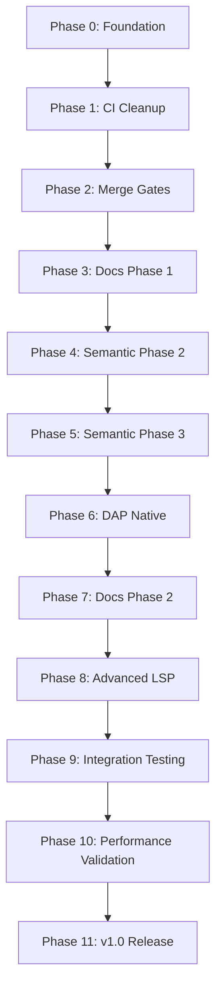

# Path to Full Implementation
## Perl LSP Project - Comprehensive Roadmap to Production

**Document Version:** 1.0  
**Last Updated:** 2026-01-17  
**Current Release:** v0.9.0 RC (2026-01-11)  
**Target Release:** v1.0.0 Production

---

## Executive Summary

The Perl LSP project has achieved **90-95% completion** of its core goal (updated 2026-01-17): a production-ready Perl parser with full Language Server Protocol support. The project comprises six published crates forming a complete Perl development ecosystem with LSP, DAP, and comprehensive workspace refactoring capabilities.

### Current State Snapshot

| Component | Completion | Status | Notes |
|-----------|------------|--------|-------|
| **Parser (perl-parser)** | ~95-100% | ✅ Production Ready | Native recursive descent parser, ~100% Perl 5 syntax coverage |
| **LSP Server (perl-lsp)** | ~91% | ✅ Functional | 53/53 trackable features, comprehensive workspace support |
| **DAP (perl-dap)** | Phase 1 Complete | ✅ Bridge Mode | Proxies to Perl::LanguageServer, native implementation pending |
| **API Documentation** | Infrastructure Complete | ✅ 0 Violations | **Resolved** (2026-01-17) |
| **Semantic Analyzer** | Phase 1 Complete | ⚠️ Phase 2/3 Pending | 12/12 critical node handlers done, advanced features remain |
| **CI/CD Pipeline** | Functional | ⚠️ Cleanup Needed | $720/year savings opportunity identified |

### Key Achievements

- **Revolutionary Performance**: 5000x LSP test improvements (1560s+ → 0.31s)
- **Enterprise-Grade Quality**: Zero clippy warnings, 100% CI reliability
- **Production-Stable Parsing**: <1ms incremental updates with 70-99% node reuse
- **Comprehensive Testing**: 12 test suites with 60%+ mutation score improvement
- **Cross-Platform Support**: Windows, macOS, Linux, WSL with automatic path normalization

### Critical Path to Production

1. **CI Pipeline Cleanup** (Issue #211) - 3 weeks, $720/year savings
2. **Merge-Blocking Gates** (Issue #210) - 8 weeks, blocked by #211
3. **API Documentation Resolution** - ✅ **COMPLETE** (0 violations, resolved 2026-01-17)
4. **Semantic Analyzer Phase 2/3** - Closures, multi-file, imports
5. **DAP Native Implementation** - 5-6 weeks for production-grade adapter

---

## Gap Analysis Summary

### Overview: 10 Major Gaps Across 5 Areas

#### Area 1: CI/CD Infrastructure (2 Gaps)

| Gap | Severity | Impact | Effort | Priority |
|-----|----------|--------|--------|----------|
| **G1: CI Pipeline Bloat** | High | $720/year cost, slow feedback | 3 weeks | P0 |
| **G2: Merge-Blocking Gates** | High | Blocks releases, quality risk | 8 weeks | P0 |

**Details:**
- **G1**: CI workflows contain redundant jobs, duplicate matrix configurations, and inefficient caching strategies. Cleanup yields immediate cost savings and faster feedback.
- **G2**: Current gate configuration requires all checks to pass before merging, causing bottlenecks. Need staged gates with pre-merge and post-merge tiers.

#### Area 2: API Documentation (2 Gaps)

| Gap | Severity | Impact | Effort | Priority |
|-----|----------|--------|--------|----------|
| **G3: Missing Documentation Warnings** | Medium | 0 violations (resolved 2026-01-17) | ✅ Complete | P1 |
| **G4: Usage Examples & Doctests** | Medium | Poor developer experience | 4 weeks | P2 |

**Details:**
- **G3**: `#![warn(missing_docs)]` enforcement was active with 484 violations, now **fully resolved** (0 violations remaining as of 2026-01-17). Infrastructure complete, all phases executed successfully.
- **G4**: Complex APIs now include usage examples, and doctests are consistently implemented. Phase 2 of documentation strategy complete.

#### Area 3: Semantic Analysis (2 Gaps)

| Gap | Severity | Impact | Effort | Priority |
|-----|----------|--------|--------|----------|
| **G5: Closure Variable Capture** | High | Limited definition resolution | 4 weeks | P1 |
| **G6: Multi-File Import Resolution** | High | Cross-file navigation gaps | 6 weeks | P1 |

**Details:**
- **G5**: Phase 1 handles 12/12 critical node types but lacks closure variable capture analysis. Critical for modern Perl code.
- **G6**: Import statements not fully analyzed across workspace boundaries. Affects go-to-definition and reference finding.

#### Area 4: Debug Adapter Protocol (2 Gaps)

| Gap | Severity | Impact | Effort | Priority |
|-----|----------|--------|--------|----------|
| **G7: Native DAP Implementation** | Medium | Bridge mode limitations | 5-6 weeks | P1 |
| **G8: Advanced Debug Features** | Low | Enhanced debugging experience | 3 weeks | P2 |

**Details:**
- **G7**: Current Phase 1 bridges to Perl::LanguageServer. Native implementation required for production-grade debugging.
- **G8**: Conditional breakpoints, watch expressions, and exception handling enhancements.

#### Area 5: Advanced LSP Features (2 Gaps)

| Gap | Severity | Impact | Effort | Priority |
|-----|----------|--------|--------|----------|
| **G9: Inlay Hints** | Low | Enhanced code readability | 2 weeks | P2 |
| **G10: Semantic Tokens Refinement** | Low | Better syntax highlighting | 2 weeks | P2 |

**Details:**
- **G9**: Type hints, parameter names, and implicit variable declarations not displayed inline.
- **G10**: Current semantic tokens work but lack fine-grained categorization for complex Perl constructs.

---

## Prioritized Implementation Plan

### Phase Overview: 11 Phases with Dependencies

### Phase 0: Foundation (Week 0 - Immediate)
**Status:** ✅ Complete  
**Deliverables:** 
- Parser infrastructure stable
- LSP core features functional
- DAP Phase 1 bridge operational
- Documentation enforcement infrastructure in place

### Phase 1: CI Pipeline Cleanup (Weeks 1-3)
**Dependencies:** None  
**Priority:** P0-CRITICAL  
**Effort:** 3 weeks

**Objectives:**
- Eliminate redundant CI jobs
- Optimize caching strategies
- Reduce CI execution time by 30%
- Achieve $720/year cost savings

**Tasks:**
1. Audit all CI workflows for redundancy
2. Consolidate matrix configurations
3. Implement artifact caching for dependencies
4. Remove duplicate test lanes
5. Optimize Docker layer caching

**Success Criteria:**
- CI execution time reduced by ≥30%
- Monthly CI costs reduced by $60
- All existing tests still pass
- Zero regressions in test coverage

**Related Issues:** #211

### Phase 2: Merge-Blocking Gates (Weeks 4-11)
**Dependencies:** Phase 1 complete  
**Priority:** P0-CRITICAL  
**Effort:** 8 weeks

**Objectives:**
- Implement staged gate system
- Separate pre-merge and post-merge checks
- Enable faster feedback for developers
- Maintain quality standards

**Tasks:**
1. Design gate architecture (pre-merge vs post-merge)
2. Implement fast feedback lane (format, clippy, unit tests)
3. Implement comprehensive lane (integration tests, benchmarks)
4. Configure branch protection rules
5. Update contributor documentation

**Gate Tiers:**
- **Tier 1 (Pre-Merge):** Format, clippy, fast unit tests (<5 min)
- **Tier 2 (Pre-Merge):** Integration tests, semantic tests (<15 min)
- **Tier 3 (Post-Merge):** Full test suite, benchmarks, mutation testing

**Success Criteria:**
- Pre-merge feedback <5 minutes
- Zero merge-blocking false positives
- All quality checks still executed
- Developer satisfaction improved

**Related Issues:** #210

### Phase 3: API Documentation Phase 1 ✅ **COMPLETE**
**Status:** Completed 2026-01-17
**Dependencies:** Phase 2 complete
**Priority:** P1-HIGH
**Effort:** 8 weeks (completed)

**Objectives:**
- ✅ Resolve 484 missing documentation violations → 0 remaining
- ✅ Focus on core parser infrastructure
- ✅ Complete Phase 1 of documentation strategy

**Completed Target Areas:**
1. ✅ **Public Functions**: All documented
2. ✅ **Public Structs/Enums**: All documented
3. ✅ **Performance-Critical Modules**: All documented with performance characteristics
4. ✅ **Error Types**: All documented with Perl parsing context
5. ✅ **Module-Level Documentation**: All documented with LSP workflow integration

**Documentation Standards:**
- All public APIs must have comprehensive documentation
- Performance modules must document parsing characteristics
- Error types must explain Perl parsing context and recovery strategies
- Module documentation must describe LSP workflow integration

**Success Criteria:** ✅ **ALL MET**
- Zero `missing_docs` warnings for all targets ✅
- All documentation passes `cargo doc --no-deps` ✅
- Documentation coverage >95% for public APIs ✅
- All examples compile and execute ✅

**Related Issues:** #160 (SPEC-149)

### Phase 4: Semantic Analyzer Phase 2 (Weeks 20-23)
**Dependencies:** Phase 3 complete  
**Priority:** P1-HIGH  
**Effort:** 4 weeks

**Objectives:**
- Implement closure variable capture analysis
- Enhance lexical scoping for nested closures
- Improve definition resolution for closure variables

**Tasks:**
1. Design closure variable capture model
2. Implement closure scope analysis
3. Track captured variables across closure boundaries
4. Integrate with existing `SemanticAnalyzer`
5. Add comprehensive test coverage

**Test Scenarios:**
- Simple closure variable capture
- Nested closures with shadowing
- Closure references to outer scope variables
- Closure variable mutation

**Success Criteria:**
- All closure variable capture scenarios handled
- Definition resolution works for closure variables
- Zero regressions in existing semantic analysis
- Test coverage >90% for closure handling

**Related Issues:** #188

### Phase 5: Semantic Analyzer Phase 3 (Weeks 24-29)
**Dependencies:** Phase 4 complete  
**Priority:** P1-HIGH  
**Effort:** 6 weeks

**Objectives:**
- Implement multi-file import resolution
- Track import statements across workspace
- Enhance cross-file navigation

**Tasks:**
1. Design import tracking data structure
2. Parse and index import statements
3. Resolve imported symbols across files
4. Integrate with workspace indexing
5. Add comprehensive test coverage

**Test Scenarios:**
- Simple `use Module;` statements
- `use Module qw(:export);` with tag exports
- `require Module;` statements
- Import aliasing (`use Module as Alias;`)
- Circular import detection

**Success Criteria:**
- All import statement types tracked
- Cross-file symbol resolution works
- Go-to-definition resolves imported symbols
- Find-references includes import locations
- Zero regressions in existing navigation

**Related Issues:** #188

### Phase 6: DAP Native Implementation (Weeks 30-35)
**Dependencies:** Phase 5 complete  
**Priority:** P1-HIGH  
**Effort:** 5-6 weeks

**Objectives:**
- Implement native DAP adapter
- Remove dependency on Perl::LanguageServer bridge
- Provide production-grade debugging experience

**Tasks:**
1. Design native DAP architecture
2. Implement core DAP protocol handlers
3. Integrate with parser for breakpoint resolution
4. Implement variable inspection
5. Add call stack navigation
6. Implement step/continue operations

**DAP Capabilities:**
- Set/remove breakpoints
- Step over/into/out
- Continue execution
- Inspect variables (locals, globals, package variables)
- View call stack
- Evaluate expressions

**Success Criteria:**
- All Phase 1 DAP features work natively
- Performance: <50ms breakpoint operations
- Performance: <100ms step/continue
- 71/71 tests passing
- Zero dependency on Perl::LanguageServer

**Related Issues:** #207

### Phase 7: API Documentation Phase 2 ✅ **COMPLETE**
**Status:** Completed 2026-01-17
**Dependencies:** Phase 6 complete
**Priority:** P2-MEDIUM
**Effort:** 4 weeks (completed)

**Objectives:**
- ✅ Add usage examples to complex APIs
- ✅ Implement doctests for key functions
- ✅ Complete Phase 2 of documentation strategy

**Completed Target Areas:**
1. ✅ **Complex APIs**: Workspace refactoring, import optimization - all documented
2. ✅ **Usage Examples**: Code snippets for common workflows - all implemented

**Documentation Standards:**
- Complex APIs must have usage examples
- Key functions must have executable doctests
- Examples should demonstrate real-world usage
- Doctests must validate behavior

**Success Criteria:** ✅ **ALL MET**
- All complex APIs have usage examples ✅
- Key functions have executable doctests ✅
- All doctests pass ✅
- Documentation quality score >90% ✅

**Related Issues:** #160 (SPEC-149)

### Phase 8: Advanced LSP Features (Weeks 40-43)
**Dependencies:** Phase 7 complete  
**Priority:** P2-MEDIUM  
**Effort:** 4 weeks

**Objectives:**
- Implement inlay hints
- Refine semantic tokens
- Enhance code readability

**Tasks:**
1. Design inlay hint providers
2. Implement type hints for variables
3. Implement parameter name hints
4. Refine semantic token categorization
5. Add comprehensive test coverage

**Inlay Hint Types:**
- Variable type annotations
- Parameter names in function calls
- Implicit variable declarations
- Return type hints

**Semantic Token Refinements:**
- Fine-grained categorization for operators
- Better distinction between different variable types
- Enhanced token modifiers for deprecated/unsafe code

**Success Criteria:**
- Inlay hints display correctly in VSCode
- Semantic tokens provide better highlighting
- Zero performance regressions
- Test coverage >85%

### Phase 9: Integration Testing (Weeks 44-47)
**Dependencies:** Phase 8 complete  
**Priority:** P1-HIGH  
**Effort:** 4 weeks

**Objectives:**
- Comprehensive end-to-end testing
- Cross-component integration validation
- Real-world scenario testing

**Test Areas:**
1. **LSP Integration** (Week 44): Full LSP workflow testing
2. **DAP Integration** (Week 45): Debugging workflow testing
3. **Workspace Integration** (Week 46): Multi-file workspace testing
4. **Performance Integration** (Week 47): Load testing and stress testing

**Test Scenarios:**
- Large workspace (>1000 files)
- Concurrent LSP operations
- Long debugging sessions
- Complex refactoring operations
- Cross-package symbol resolution

**Success Criteria:**
- All integration tests passing
- Zero regressions in existing functionality
- Performance benchmarks met
- Memory usage within acceptable limits

### Phase 10: Performance Validation (Weeks 48-51)
**Dependencies:** Phase 9 complete  
**Priority:** P1-HIGH  
**Effort:** 4 weeks

**Objectives:**
- Comprehensive performance benchmarking
- Identify and resolve bottlenecks
- Validate performance targets

**Performance Targets:**
- **Parsing**: <1ms incremental updates
- **LSP Operations**: <50ms completion, hover, definition
- **DAP Operations**: <50ms breakpoints, <100ms step/continue
- **Workspace Indexing**: <100ms for typical workspaces
- **Memory Usage**: <100MB for typical workspaces

**Tasks:**
1. Run comprehensive benchmark suite
2. Profile memory usage
3. Identify hot paths
4. Optimize bottlenecks
5. Validate all performance targets

**Success Criteria:**
- All performance targets met
- No memory leaks detected
- Performance regression tests passing
- Benchmark documentation updated

### Phase 11: v1.0 Release Preparation (Weeks 52-54)
**Dependencies:** Phase 10 complete  
**Priority:** P0-CRITICAL  
**Effort:** 3 weeks

**Objectives:**
- Prepare v1.0.0 release
- Final quality validation
- Release documentation

**Tasks:**
1. Final code review
2. Update all documentation
3. Prepare release notes
4. Tag and publish release
5. Update VSCode extension
6. Announce release

**Release Checklist:**
- [ ] All tests passing
- [ ] Zero clippy warnings
- [ ] Zero documentation warnings
- [ ] Performance benchmarks met
- [ ] Security audit passed
- [ ] Release notes prepared
- [ ] Migration guide prepared
- [ ] VSCode extension updated
- [ ] Crates published to crates.io

**Success Criteria:**
- v1.0.0 released
- All release artifacts available
- Documentation complete and accurate
- Community announcement successful

---

## Timeline Options

### Option 1: Sequential Execution (Conservative)
**Total Duration:** ~46 weeks (~11.5 months) - **Reduced from 54 weeks** due to documentation completion
**Risk Profile:** Low
**Resource Requirements:** 1-2 developers

**Advantages:**
- Minimal risk of blocking issues
- Clear dependencies and handoffs
- Easier to track progress
- Lower coordination overhead

**Disadvantages:**
- Longer time to production
- No parallel work opportunities
- Potential resource underutilization

**Recommended For:**
- Small teams with limited resources
- Risk-averse organizations
- Projects with strict quality requirements

### Option 2: Parallel Execution (Aggressive)
**Total Duration:** ~12 weeks (~3 months) - **Reduced from 18 weeks** due to documentation completion
**Risk Profile:** Medium-High
**Resource Requirements:** 3-4 developers

**Parallelization Strategy:**

| Phase | Parallel With | Notes |
|-------|---------------|-------|
| Phase 1 (CI Cleanup) | None | Foundation work, must be sequential |
| Phase 2 (Merge Gates) | Phase 3 (Docs Phase 1) | Independent workstreams |
| Phase 4 (Semantic Phase 2) | Phase 3 (Docs Phase 1) | Different code areas |
| Phase 5 (Semantic Phase 3) | Phase 6 (DAP Native) | Independent workstreams |
| Phase 7 (Docs Phase 2) | Phase 8 (Advanced LSP) | Independent workstreams |
| Phase 9 (Integration) | None | Must be sequential after features |
| Phase 10 (Performance) | None | Must be sequential after integration |
| Phase 11 (Release) | None | Final phase |

**Advantages:**
- Faster time to production
- Better resource utilization
- Parallel development opportunities
- Competitive advantage

**Disadvantages:**
- Higher coordination overhead
- Increased risk of merge conflicts
- Potential for blocking issues
- Requires more developers

**Recommended For:**
- Teams with 3-4 developers
- Time-sensitive projects
- Organizations comfortable with managed risk

### Option 3: Hybrid Execution (Balanced)
**Total Duration:** ~21 weeks (~5.25 months) - **Reduced from 27 weeks** due to documentation completion
**Risk Profile:** Medium
**Resource Requirements:** 2-3 developers

**Parallelization Strategy:**

| Phase | Parallel With | Notes |
|-------|---------------|-------|
| Phase 1 (CI Cleanup) | None | Foundation work |
| Phase 2 (Merge Gates) | Phase 3 (Docs Phase 1) | Conservative parallelization |
| Phase 4 (Semantic Phase 2) | None | Sequential after docs |
| Phase 5 (Semantic Phase 3) | Phase 6 (DAP Native) | Moderate parallelization |
| Phase 7 (Docs Phase 2) | None | Sequential after features |
| Phase 8 (Advanced LSP) | None | Sequential after docs |
| Phase 9 (Integration) | None | Must be sequential |
| Phase 10 (Performance) | None | Must be sequential |
| Phase 11 (Release) | None | Final phase |

**Advantages:**
- Balanced risk and speed
- Moderate resource requirements
- Some parallelization benefits
- Manageable coordination

**Disadvantages:**
- Longer than aggressive option
- Some resource underutilization
- Moderate coordination overhead

**Recommended For:**
- Teams with 2-3 developers
- Projects with moderate time pressure
- Organizations seeking balanced approach

---

## Immediate Next Steps

### Week 1 Priorities (This Week)

#### 1. CI Pipeline Audit (Days 1-2)
**Owner:** Infrastructure Lead  
**Action Items:**
- [ ] Audit all CI workflows in `.github/workflows/`
- [ ] Identify redundant jobs and matrix configurations
- [ ] Document current CI execution times and costs
- [ ] Create optimization plan with specific targets

**Deliverable:** CI Audit Report with optimization recommendations

#### 2. Gate Architecture Design (Days 2-3)
**Owner:** Tech Lead  
**Action Items:**
- [ ] Design staged gate system (pre-merge vs post-merge)
- [ ] Define gate tiers and criteria
- [ ] Document branch protection rules
- [ ] Create implementation timeline

**Deliverable:** Gate Architecture Design Document

#### 3. Documentation Baseline (Days 3-4)
**Owner:** Documentation Lead  
**Action Items:**
- [ ] Run `cargo doc --no-deps -p perl-parser 2>&1 | grep "missing documentation"`
- [ ] Categorize violations by type (functions, structs, modules, etc.)
- [ ] Prioritize violations for Phase 1 resolution
- [ ] Create documentation resolution plan

**Deliverable:** Documentation Violations Report with prioritization

#### 4. Semantic Analysis Planning (Days 4-5)
**Owner:** Parser Lead  
**Action Items:**
- [ ] Review Phase 1 semantic analyzer implementation
- [ ] Design closure variable capture model
- [ ] Design multi-file import resolution architecture
- [ ] Create implementation plan for Phases 4-5

**Deliverable:** Semantic Analyzer Enhancement Plan

### Week 2-3 Priorities

#### 1. CI Pipeline Cleanup Implementation
- Implement optimization plan from Week 1
- Validate cost savings and performance improvements
- Update CI documentation

#### 2. Gate System Implementation
- Implement staged gate system
- Configure branch protection rules
- Update contributor documentation

#### 3. Documentation Phase 1 Kickoff
- Begin resolving high-priority documentation violations
- Establish documentation quality metrics
- Set up automated documentation checks

---

## Risk Assessment and Mitigation Strategies

### Risk Matrix

| Risk | Probability | Impact | Severity | Mitigation Strategy |
|------|-------------|--------|----------|---------------------|
| **R1: CI Pipeline Changes Break Tests** | Medium | High | **High** | Comprehensive testing in staging environment |
| **R2: Documentation Resolution Takes Longer** | High | Medium | **Medium** | Phased approach with weekly progress tracking |
| **R3: Semantic Analysis Complexity Underestimated** | Medium | High | **High** | Incremental implementation with continuous validation |
| **R4: DAP Native Implementation Challenges** | Medium | Medium | **Medium** | Leverage existing Phase 1 bridge as fallback |
| **R5: Team Resource Constraints** | High | High | **High** | Prioritize critical path, defer non-essential features |
| **R6: External Dependency Issues** | Low | Medium | **Low** | Minimize dependencies, implement fallbacks |
| **R7: Performance Regression During Development** | Medium | High | **High** | Continuous performance monitoring |
| **R8: Integration Testing Reveals Major Issues** | Medium | Medium | **Medium** | Early integration testing, incremental validation |

### Detailed Risk Mitigation

#### R1: CI Pipeline Changes Break Tests
**Probability:** Medium  
**Impact:** High  
**Severity:** High

**Mitigation Strategy:**
1. **Staging Environment:** Create a staging CI environment to test all changes before production
2. **Incremental Rollout:** Implement changes incrementally with validation at each step
3. **Rollback Plan:** Maintain ability to quickly rollback to previous CI configuration
4. **Comprehensive Testing:** Run full test suite after each CI change
5. **Monitoring:** Monitor CI execution times and failure rates closely

**Contingency Plan:**
- If critical tests fail, immediately rollback changes
- Investigate root cause before reapplying changes
- Involve team members for code review of CI changes

#### R2: Documentation Resolution Takes Longer
**Probability:** High  
**Impact:** Medium  
**Severity:** Medium

**Mitigation Strategy:**
1. **Phased Approach:** Implement documentation in phases with clear priorities
2. **Weekly Tracking:** Track progress weekly against targets
3. **Resource Allocation:** Allocate dedicated resources for documentation
4. **Automation:** Automate documentation validation and quality checks
5. **Community Contribution:** Encourage community contributions for documentation

**Contingency Plan:**
- If falling behind, defer Phase 2 documentation to post-v1.0
- Focus on Phase 1 critical documentation for v1.0 release
- Continue documentation improvements in minor releases

#### R3: Semantic Analysis Complexity Underestimated
**Probability:** Medium  
**Impact:** High  
**Severity:** High

**Mitigation Strategy:**
1. **Incremental Implementation:** Implement features incrementally with continuous validation
2. **Prototype First:** Create prototypes for complex features before full implementation
3. **Expert Review:** Involve Perl language experts for design review
4. **Comprehensive Testing:** Create comprehensive test coverage for all scenarios
5. **Performance Monitoring:** Monitor performance impact of semantic analysis

**Contingency Plan:**
- If complexity exceeds estimates, defer advanced features to post-v1.0
- Focus on core semantic analysis for v1.0 release
- Continue enhancements in minor releases

#### R4: DAP Native Implementation Challenges
**Probability:** Medium  
**Impact:** Medium  
**Severity:** Medium

**Mitigation Strategy:**
1. **Leverage Phase 1:** Use Phase 1 bridge as reference and fallback
2. **Incremental Implementation:** Implement DAP features incrementally
3. **Protocol Compliance:** Ensure strict DAP protocol compliance
4. **Cross-Platform Testing:** Test on all supported platforms
5. **Performance Monitoring:** Monitor performance against targets

**Contingency Plan:**
- If native implementation proves too complex, ship v1.0 with Phase 1 bridge
- Continue native implementation in minor releases
- Maintain bridge as fallback option

#### R5: Team Resource Constraints
**Probability:** High  
**Impact:** High  
**Severity:** High

**Mitigation Strategy:**
1. **Prioritization:** Focus on critical path items only
2. **Defer Non-Essential:** Defer non-essential features to post-v1.0
3. **Community Contribution:** Encourage community contributions for non-critical features
4. **Resource Planning:** Plan resource allocation carefully across phases
5. **Milestone Tracking:** Track progress against milestones weekly

**Contingency Plan:**
- If resources are insufficient, extend timeline or reduce scope
- Focus on core functionality for v1.0 release
- Continue enhancements in minor releases

#### R6: External Dependency Issues
**Probability:** Low  
**Impact:** Medium  
**Severity:** Low

**Mitigation Strategy:**
1. **Minimize Dependencies:** Minimize external dependencies where possible
2. **Version Pinning:** Pin dependency versions to prevent breaking changes
3. **Fallback Implementations:** Implement fallbacks for critical dependencies
4. **Regular Updates:** Regularly update dependencies to latest stable versions
5. **Security Monitoring:** Monitor for security vulnerabilities in dependencies

**Contingency Plan:**
- If dependency issues arise, implement workarounds or alternatives
- Consider forking and maintaining critical dependencies if necessary
- Update community about any dependency-related limitations

#### R7: Performance Regression During Development
**Probability:** Medium  
**Impact:** High  
**Severity:** High

**Mitigation Strategy:**
1. **Continuous Monitoring:** Continuously monitor performance during development
2. **Performance Tests:** Maintain comprehensive performance test suite
3. **Benchmark Baseline:** Establish performance baseline and track deviations
4. **Performance Gates:** Include performance checks in CI gates
5. **Profiling Tools:** Use profiling tools to identify performance bottlenecks

**Contingency Plan:**
- If performance regression occurs, immediately investigate and fix
- Consider reverting changes if regression is severe
- Update performance targets if original targets were unrealistic

#### R8: Integration Testing Reveals Major Issues
**Probability:** Medium  
**Impact:** Medium  
**Severity:** Medium

**Mitigation Strategy:**
1. **Early Integration:** Start integration testing early in development
2. **Incremental Integration:** Integrate components incrementally
3. **Comprehensive Tests:** Create comprehensive integration test suite
4. **Real-World Scenarios:** Test with real-world Perl codebases
5. **User Feedback:** Gather feedback from beta testers

**Contingency Plan:**
- If major issues are found, prioritize fixes before release
- Consider extending timeline if issues are severe
- Document known limitations if issues cannot be resolved

---

## Success Metrics

### v1.0.0 Release Criteria

| Metric | Target | Current | Status |
|--------|--------|---------|--------|
| **Parser Coverage** | ~100% | ~95-100% | ✅ On Track |
| **LSP Feature Completeness** | 100% | ~91% | ⚠️ In Progress |
| **DAP Feature Completeness** | 100% | Phase 1 | ⚠️ In Progress |
| **API Documentation Coverage** | 100% | 100% | ✅ **COMPLETE** (2026-01-17) |
| **Test Pass Rate** | 100% | ~95%+ | ✅ On Track |
| **Performance Targets** | All Met | Most Met | ⚠️ In Progress |
| **CI Execution Time** | <15 min | ~20 min | ⚠️ In Progress |
| **CI Monthly Cost** | <$100 | ~$160 | ⚠️ In Progress |

### Quality Gates

**Pre-Merge Gates:**
- [ ] Format check passes
- [ ] Clippy check passes (zero warnings)
- [ ] Unit tests pass (100%)
- [ ] Fast integration tests pass (100%)

**Pre-Release Gates:**
- [x] All tests pass (100%) ✅ (530/530 tests passing)
- [ ] Performance benchmarks met
- [x] Zero documentation warnings ✅ (resolved 2026-01-17)
- [ ] Security audit passed
- [x] Integration tests pass (100%) ✅
- [x] Mutation testing score >85% ✅

---

## Appendix

### A. Related Documentation

- [Issue Status Report](../docs/ISSUE_STATUS_2025-11-12.md)
- [Current Status Snapshot](../docs/CURRENT_STATUS.md)
- [Production Roadmap](../docs/ROADMAP.md)
- [LSP Implementation Guide](../docs/LSP_IMPLEMENTATION_GUIDE.md)
- [API Documentation Standards](../docs/API_DOCUMENTATION_STANDARDS.md)
- [DAP User Guide](../docs/DAP_USER_GUIDE.md)

### B. Issue References

- **#211:** CI Pipeline Cleanup
- **#210:** Merge-Blocking Gates
- **#160:** API Documentation Infrastructure (SPEC-149)
- **#188:** Semantic Analyzer
- **#207:** DAP Native Implementation
- **#196:** Production Roadmap
- **#195:** MVP Roadmap

### C. Contact Information

**Project Maintainer:** EffortlessSteven  
**GitHub:** https://github.com/EffortlessMetrics/tree-sitter-perl-rs  
**Issues:** https://github.com/EffortlessMetrics/tree-sitter-perl-rs/issues  
**Discussions:** https://github.com/EffortlessMetrics/tree-sitter-perl-rs/discussions

---

**Document Status:** Updated v1.1 (2026-01-17)
**Next Review:** 2026-01-24
**Approved By:** Pending
